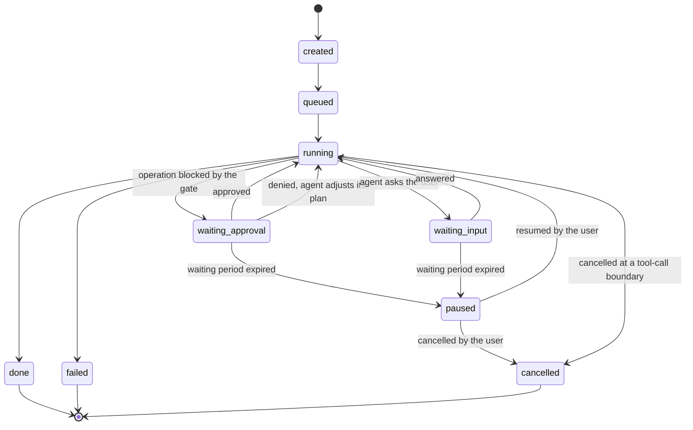

# Model: product baseline across `pet`, `uix`, `agent`, `job`, `connector`, `approval`, `ledger`, `undo`, `app`, `backend`, `platform`

This is the first model of the product, so it carries no delta headings. It is conceptual: no technology, no
schema types, no library names. Where a later change measures a value this model states as a bound, that change
supersedes the bound rather than this model being rewritten.

Replication of these entities to the account is out of scope here and is modelled by `req-022-account-sync` in
the `sync` capability; this model describes the working copy that exists on a device.

## Entities

| Entity | Meaning | Key Attributes | Relationships |
| --- | --- | --- | --- |
| Account | The identity that owns everything the user accumulates | external identity subject, email, status | owns Device, Session, and every entity below |
| Device | One machine signed in to an account | device identifier, machine name, last activity | belongs to Account |
| Session | One device's authenticated session with the backend | refresh secret digest, expiry, issuing device | belongs to Account and Device |
| InviteAllowlist entry | Permission to join the closed beta | address or code, expiry, status, activating account | optionally linked to Account |
| ProviderConfig | The user's chosen model provider and how it authenticates | provider identity, authentication method, credential reference | referenced by RoleAssignment; credential lives in SecureStore |
| RoleAssignment | Which model serves which role | role (pet, worker, elicitation, undo, risk judge), model identifier | references ProviderConfig |
| ConnectorManifest | The declaration that makes a platform usable | connector identity, name, icon, authorisation configuration, capability-to-scope profiles, tool declarations | generates Tool; referenced by ConnectorAccount |
| Tool | One callable operation a connector offers | name, direction (read or write), parameter schema, snapshot method, compensating formula or irreversible flag | declared by ConnectorManifest; invoked through ActionRecord |
| ConnectorAccount | One authorised connection to a platform | connector identity, selected workspace or root, default target, connection state, authorisation reference | belongs to Account; references ConnectorManifest and SecureStore |
| SecureStore entry | A credential held by the operating system's secure storage | namespaced key, opaque secret | referenced by ConnectorAccount and ProviderConfig |
| ApprovalConfig | The approval posture in force | mode (off, smart, on), waiting period, bulk-operation threshold | belongs to Account; owns ApprovalRule and AllowlistEntry |
| ApprovalRule | One user-declared constraint on operations | natural-language statement, compiled condition, advisory prompt fragment, state (draft or confirmed), last test outcome | belongs to ApprovalConfig; cited by ApprovalRequest |
| AllowlistEntry | A permanently permitted operation pattern | operation pattern, rule it exempts, created-at | belongs to ApprovalConfig |
| Blocklist entry | An operation refused in every mode | operation pattern, rationale | part of the system manifest, not user-editable |
| Conversation | The exchange between the user and the pet-agent | turns, language, timestamps | belongs to Account; turns may reference Job |
| Job | One unit of work handed over by the user | identifier, original request text, attachments, state, approval mode captured at creation, timestamps, compressed result, undo target | belongs to Account; owns ActionRecord, ApprovalRequest, Question; may reference another Job as its undo target |
| Attachment | An image supplied with a request | content reference, size, content type | belongs to Job; may be extracted into ActionRecord |
| ActionRecord | One immutable ledger entry | job, sequence number, type, tool, parameters, outcome, before snapshot, after snapshot, reversible flag, compensating action, correlation reference, connector, timestamp | belongs to Job; may reference a prior ActionRecord it corrects |
| ApprovalRequest | One blocked operation awaiting a decision | job, intended operation, target object, expected before and after values, triggering rule, decision, decision scope, decider, timestamps | belongs to Job; cites ApprovalRule; recorded as ActionRecord |
| Question | One open ask from an agent to the user | job, question text, options, free-text permission, answer, answer source, timestamps | belongs to Job; recorded as ActionRecord |
| UndoPlan | The proposed reverse sequence for a job | source job, items with classification (revertible, irreversible, conflict) and reason, confirmation state | derived from ActionRecord; produces a new Job |
| Card | One message presented on the dialog surface | type, job, priority class, blocking flag, created-at, collapse deadline | derived from Job, ApprovalRequest, Question and system conditions |
| UpdateManifest | The description of an available application version | version, artifact references, signature references | served by the backend; consumed by the device |

## Invariants

These are the truths that no interface exposes directly. Everything a user or a test can observe is written as
a requirement in the delta specs instead.

- **INV-LG-01** — Each tool call is represented by an intent record and, once the call resolves, exactly one
  result record carrying the same correlation reference. · Rationale: the ledger must be writable before the
  outcome is known while remaining append-only, and the pair is what makes that possible. · Source:
  `docs/spec/constitution.md` principle III; measured in `req-013-sqlite-ledger`.
- **INV-LG-02** — Sequence numbers within a job are dense and strictly increasing, so a gap means a lost record
  rather than a skipped step. · Rationale: recovery and undo both read the ledger positionally. · Source:
  `docs/raw-idea/prd-mvp.md#10-4-module-action-ledger-lg` FR-LG-01.
- **INV-LG-03** — A correction record references the record it corrects, and a corrected record is never itself
  a correction target more than once in a chain that loops. · Rationale: corrections must form a traversable
  chain, not a cycle. · Source: `docs/spec/constitution.md` principle III.
- **INV-JOB-01** — A job's undo target, followed transitively, never returns to the job itself. · Rationale: a
  cycle would make the undo-of-an-undo chain non-terminating. · Source:
  `docs/raw-idea/prd-mvp.md#12-1-du-lieu-phia-client-local-first`.
- **INV-JOB-02** — The approval mode stored on a job is fixed at creation and is never rewritten. · Rationale: a
  running job's guarantees must not change under it when the user changes posture. · Source: FR-AP-09.
- **INV-JOB-03** — At most one Question per job is unanswered at any moment. · Rationale: the user must never
  face an unordered pile of questions from one piece of work. · Source: FR-INT-07.
- **INV-AP-01** — Only rules in the confirmed state participate in hook evaluation. · Rationale: an elicited but
  unconfirmed rule represents the product's reading of the user's intent, not the user's decision. · Source:
  FR-AP-02.
- **INV-AP-02** — A job-scoped approval decision is keyed by the tuple of job, rule, tool and target scope, and
  never by tool name alone. · Rationale: widening it to a tool name turns one approval into a standing
  permission. · Source: `req-009-rule-ir-hardgate`.
- **INV-AP-03** — Blocklist evaluation precedes mode evaluation, so no mode can reach a blocked operation. ·
  Rationale: the blocklist is unconditional by definition. · Source: FR-AP-10.
- **INV-CF-01** — Every Tool reachable by a worker-agent originates in a loaded ConnectorManifest and is wrapped
  by the gate and the ledger obligation; no other path registers a tool. · Rationale: an unwrapped tool defeats
  principles II and III simultaneously. · Source: `docs/spec/constitution.md` principles II, III, VI.
- **INV-CF-02** — A write Tool carries either a compensating formula or the irreversible flag, never neither and
  never both. · Rationale: the undo planner reads exactly this field to classify the operation. · Source:
  `docs/spec/constitution.md` principle IV.
- **INV-UD-01** — An UndoPlan item is derived from exactly one ActionRecord of the source job, and every
  reversible record of that job appears in the plan exactly once. · Rationale: a silently omitted record would
  leave a change the user believes was undone. · Source: FR-UD-01.
- **INV-UX-01** — Every Card corresponds to a live source — a job state, an approval request, a question or a
  system condition — and is withdrawn when that source resolves. · Rationale: the queue is a projection of
  state, never a store of its own, which is what lets it be rebuilt after a crash. · Source: FR-INT-15.
- **INV-BE-01** — A backend request resolves to exactly one account, and no query path joins across accounts. ·
  Rationale: isolation is a structural property, not a filter applied at the edge. · Source:
  `docs/spec/constitution.md` principle VII.
- **INV-SEC-01** — A credential exists in exactly one place, the secure store, and every other entity holds a
  reference to it rather than a copy. · Rationale: copies are what leak. · Source: NFR-SEC-01.

## Lifecycle

The job lifecycle is the spine the other entities hang from.

`paused` is the safe stop the waiting period produces; it is a resting place inside the waiting states rather
than a new destination for the agent, and nothing executes while a job sits in it.

Two shorter lifecycles sit beside it. An ApprovalRule moves `draft → confirmed → superseded or deleted`, and
only the confirmed state binds. An ApprovalRequest moves `raised → decided (approved, denied) → recorded`, or
`raised → expired` when the waiting period passes, and an expired request is re-evaluated rather than executed
if the job resumes.

## Variability

| Variability Point | Level | Extensible By | Contract | Notes (reserved: phase + rationale) |
| --- | --- | --- | --- | --- |
| Connector set | open | connector authors, later third parties | `connector/contracts/connector-manifest`, frozen in `req-019-connector-framework` | the reach the product aims at is tens to hundreds of platforms |
| Tool set of a worker-agent | open | derived from connected connectors | same manifest contract | never extended by hand-written registration |
| Model provider and role assignment | open | the user, through configuration | `agent/contracts/provider-configuration` | the user brings and pays for their own provider |
| Approval rules | open | the user, through elicitation | `approval/contracts/rule-representation`, defined in `req-009-rule-ir-hardgate` | compiled, not interpreted at call time |
| Approval modes | closed | — | — | exactly three modes; a fourth would change the product's safety story |
| Hardline blocklist | closed | — | — | part of the system manifest, updated only by releasing the application |
| Card types | closed | — | — | exactly seven; an eighth type would reintroduce the unbounded notification surface the design exists to avoid |
| Ledger record types | closed | — | — | five types; a new type would make older records unreadable to the same reader |
| Job states | closed | — | — | the set is what recovery and the interface both switch on |
| Interface languages | open | translation resources | localisation resource contract | Vietnamese and English are present; the layer admits more |
| Scheduling of jobs | reserved | — | — | phase 2. Reserved because the locked decision requires schedules to be creatable both conversationally and by hand, which shapes the job record now; activated when the scheduler is built. Source: `docs/raw-idea/prd-mvp.md#6-cac-quyet-dinh-kien-truc-da-khoa` QĐ-4 |
| Unattended execution posture | reserved | — | — | phase 2, activated with the scheduler. Reserved because its rule — deny and pause, never self-approve — must exist before the first unattended trigger, not after. Source: FR-AP-13 |
| Third-party tool servers | reserved | — | — | phase 2. Reserved because connector tool interfaces are shaped now for external protocol compatibility; activated when third-party tool servers are accepted. Source: FR-CF-09 |

## Physical Resource & Artifact Topology

### 1. Physical Format & Storage

- **Storage Location & Path Layout**: the device holds one application data directory containing the job and
  ledger store, the agent session transcripts, the attachment store, and the configuration. Credentials are not
  in this directory: they are held by the operating system's secure storage under a namespaced key per
  connector and per provider. The directory is per operating-system user, and it is the working copy — the
  account's authoritative copy and its replication are modelled by `req-022-account-sync`.
- **Serialization & Codec Format**: the job and ledger store is a structured local store supporting atomic
  append and indexed reads; agent transcripts are append-only line-delimited records produced by the harness;
  attachments are stored in their original image encoding; snapshots inside ledger records are stored as the
  platform returned them, so that a compensating action can be rebuilt from them without re-interpretation.
- **Physical Resource Budget**: ledger growth is bounded by the retention period rather than by a size cap; at
  the working retention of 90 days the measured footprint is roughly 12 MB at 1,800 jobs and 31 MB at 4,500
  jobs — VERIFIED (`spikes/SP-12-sqlite-ledger/REPORT.md#0-ket-luan`), carried into
  `req-013-sqlite-ledger`. Attachments are bounded per command at 3 images of at most 10 MB each. Pet idle
  resource use is a monitoring target rather than a gate, on the source's own statement
  (`docs/raw-idea/prd-mvp.md#11-1-hieu-nang` NFR-PF-01) — UNVERIFIED. Recent-job queries are expected to
  resolve in under a millisecond with the descending timestamp index — VERIFIED
  (`spikes/SP-12-sqlite-ledger/REPORT.md#0-ket-luan`).
- **Lifecycle & Eviction**: ledger records are evicted only by the retention policy or by an explicit,
  warned user deletion, never by capacity pressure, because eviction under pressure would silently remove the
  evidence undo depends on. Attachments are released from working memory when their job reaches a terminal
  state, and the copy a ledger record references is removed when that record is removed. Agent transcripts
  follow the same retention period as the ledger. Secure-store entries are removed when the connector is
  disconnected, when the account is deleted, and when the application is uninstalled.

### 2. Physical Storage & Data Schema

The stores this baseline describes are held as files beside the contracts that own them, rather than
transcribed here. What this section keeps is what a schema file cannot say: who owns each store, what may never
enter it, and how its shape moves. The physical schema of the job and ledger store is not declared by this
change — it is `contracts/ledger-store.sql` in `req-013-sqlite-ledger`, which measured it.

| Store | Physical schema file | Owning contract | Retention / migration posture |
| --- | --- | --- | --- |
| Job and ledger store, on the device | declared by `req-013-sqlite-ledger` | `ledger/contracts/ledger-store` | Records leave only by retention expiry or by an explicit, warned user deletion, never under capacity pressure, because eviction under pressure would silently remove the evidence undo depends on |
| The content of one ledger record | declared by `req-013-sqlite-ledger` | `ledger/contracts/ledger-record` | Fixed at write time; a snapshot inside a record is stored as the platform returned it, so a compensating action can be rebuilt from it without re-interpretation |
| Model-provider configuration and role assignments | [`contracts/provider-configuration.schema.json`](contracts/provider-configuration.schema.json) | `agent/contracts/provider-configuration` | Displayed, exported for inspection and replicated to the account, which is why no member of it may hold a secret value — each carries a reference into the device's secure storage instead. A configuration written under an earlier minor version resolves unchanged, and a role added later resolves to its recommended default |
| Confirmed approval rules | [`contracts/rule-representation.schema.json`](contracts/rule-representation.schema.json) | `approval/contracts/rule-representation` | A stored rule carries the representation version it was compiled under. A rule compiled under an older major version is re-elicited with the user rather than migrated silently, because the migration would be the product guessing at intent it did not witness |
| Installed connector manifests | [`contracts/connector-manifest.schema.json`](contracts/connector-manifest.schema.json) | `connector/contracts/connector-manifest` | Read from the application's own registry at start, never from a location the user can write to arbitrarily: a manifest declares what is irreversible and is a security surface, not a preference file |
| Interface resource bundles | [`contracts/localisation-resources.schema.json`](contracts/localisation-resources.schema.json) | `uix/contracts/localisation-resources` | Shipped with the application and replaced wholesale by a release. A bundle from an older minor version resolves, with the keys added since falling back to English |
| Credentials the entries above refer to | — | `platform/contracts/secure-storage` | Never in the application data directory. They are held by the operating system's secure storage under a namespaced key per connector and per provider, and are removed when the connector is disconnected, when the account is deleted, and at uninstall |
| Attachments and agent transcripts | — | `agent`, `job` | Attachments are stored in their original image encoding and released when their job reaches a terminal state; transcripts follow the ledger's retention period. Neither is a substitute for a ledger record |

### 3. State-to-Artifact Mapping Matrix

| State / Event / Workflow | Physical Artifact / File / Slot | Identifier / Handler / Entry Point | Constraint Notes |
| --- | --- | --- | --- |
| Job created | job row in the local store | job identifier | carries the approval mode captured at creation |
| Tool call about to execute | intent ActionRecord | job identifier + sequence number + correlation reference | written before the call; failure to write prevents the call |
| Tool call resolved | result ActionRecord | same correlation reference | carries outcome, after snapshot, compensating action |
| Human decision | decision ActionRecord | job identifier + sequence number | approve, deny, cancel, confirm undo, and answers to questions |
| Operation blocked | ApprovalRequest row + APPROVAL Card | job identifier + request identifier | card is a projection; the request is the durable record |
| Agent asks | Question row + ASK Card | job identifier + question identifier | at most one unanswered per job |
| Attachment supplied | image file in the attachment store | attachment identifier referenced by the job | released from memory at terminal state |
| Agent conversation | harness session transcript | session identifier stored on the job | transcript is not a substitute for the ledger |
| Connector authorised | secure-store entry + ConnectorAccount row | namespaced credential key | the row holds a reference, never the secret |
| Provider configured | secure-store entry + ProviderConfig row | namespaced credential key | same rule |
| Undo requested | UndoPlan, then a new job | new job identifier with undo target set | the plan is confirmed before the job exists |
| Application start after a crash | unresolved intent records | correlation references with no result record | reconciled before the pet window is created |

## Manifest Schema

The connector manifest is the descriptor behind the product's widest open variability point. The full contract
is frozen by `req-019-connector-framework`; what follows is the conceptual shape this baseline requires of it.
The normative shape at this baseline is the file
[`contracts/connector-manifest.schema.json`](contracts/connector-manifest.schema.json), owned by
`connector/contracts/connector-manifest@0.1.0`; the tables below name the same fields for a reader and add what
discovery and a missing manifest mean, which a schema file cannot state.

### Required Fields

| Field | Type | Description |
| --- | --- | --- |
| `id` | identifier | stable connector identity, unique across connectors |
| `version` | version | manifest version, so a change in shape is detectable |
| `name` | text | display name shown in the connector catalogue |
| `icon` | resource reference | catalogue icon |
| `auth` | object | authorisation endpoints, exchange style, and whether a proof key is supported |
| `scope_profiles` | list of objects | one or more capability-to-scope mappings, selectable per release channel |
| `tools` | list of objects | every callable operation; each carries `name`, `direction`, parameter schema |
| `tools[].snapshot` | object or absent | for a write tool, how the prior state is read before the call |
| `tools[].compensation` | object or `irreversible` | the formula for building the compensating action, or the declaration that none exists |

### Optional Fields

| Field | Type | Description |
| --- | --- | --- |
| `byo_client` | object | the guidance and fields for the bring-your-own authorisation-client route |
| `rate_policy` | object | the platform's request pacing characteristics |
| `sanitization` | object | how fetched content is neutralised before it enters an agent's context |
| `revoke` | object | the platform's revocation endpoint when one exists |

### Discovery & Registry

Manifests are discovered from the application's own connector registry at start, and a connector becomes
available to an agent only after it holds an authorised ConnectorAccount. Discovery never reads a manifest from
a location the user can write to arbitrarily, because a manifest declares what is irreversible and is therefore
a security surface, not a preference file.

### Fallback on Missing Manifest

A manifest that is absent, malformed, or missing a required field causes its connector to be unavailable rather
than partially loaded: no tool from it is registered, the catalogue shows the connector as unavailable with the
reason, and any ConnectorAccount already authorised against it is left untouched so that authorisation survives
a bad release. A write tool lacking a compensation declaration invalidates the whole manifest rather than that
one tool, because a partially loaded connector would let the agent reach operations whose reversibility is
undeclared.

## Trust Boundary

Two classes of input are untrusted, as ratified in the constitution's External Content Is Data section.

The first is user input into the dialog surface: free text and pasted or dropped images. It expresses intent
and is never authority. A command may cause the product to attempt an operation; it may not relax an approval
decision, and an image's textual content carries no more authority than the text the user typed.

The second is connector-fetched content: platform page and database content, message bodies, and file content
read back into an agent's context. This is the sharper boundary, because it arrives inside what looks like the
agent's own working material. Content from these sources may inform what an agent proposes and may never by
itself authorise an action, alter the rules in force, or widen a granted scope. The structural consequence is
that the approval hook evaluates in the application layer after all content has been read and after any
question has been answered, so no fetched text and no answer can reach the decision.

Model output is likewise not trusted as a control signal: it proposes tool calls, and the gate disposes. A
model's assertion that an operation is safe is recorded as a judgement, never applied as a permission — which
is why an automatic approval is stored as a distinguishable decision rather than as the absence of one.

The backend is trusted for identity, brokering, replication and update manifests, and is not trusted with
business decisions: it never executes job logic, and the approval gate is never consulted across the network,
so a compromised or unreachable backend cannot approve an operation.

## Relations

This change is the first, so no other domain's contracts exist yet to depend on. The relations it establishes,
each to be expressed through the owning domain's published contract as those contracts are written:

- `agent` reaches `connector` only through the tool set generated from `connector/contracts/connector-manifest`.
- `agent` and `connector` reach `approval` only through the hook evaluation contract owned by `approval`, never
  by reading rules directly.
- Every tool call reaches `ledger` through the record-writing contract owned by `ledger`; no domain writes
  records in its own shape.
- `undo` reads the ledger through `ledger`'s published read contract and reads compensation declarations
  through the connector manifest contract; it holds no private copy of either.
- `uix` and `app` read job, approval and question state through the contracts owned by `job` and `approval`, and
  hold no state of their own beyond presentation.
- `backend` is reached only through its published service contract, and no client component depends on its
  internal shape.
- `platform` publishes the secure-storage contract that `connector` and `agent` use to hold credentials by
  reference.
- Everything above is a working copy on one device; `sync` — added by `req-022-account-sync` — owns the
  relation between these entities and the account's authoritative copy.
