# Model: connector

This change adds no capability. It is the first concrete platform expressed inside the shape
`req-019-connector-framework` established, and its purpose in the model is to say precisely where a platform's
own peculiarities are allowed to live: in a projection rule, in a manifest declaration, and in an adapter — never
in a component that does not name the platform.

Everything below therefore sits underneath `connector/contracts/connector-manifest@1.1.0` rather than beside it.
Where the measured platform demanded something the frozen shape could not express, the answer is one additive
field in that contract, argued in `design.md` D1; where it demanded something a rule could express, it is a rule
in `connector/contracts/notion-property-compensation@0.1.0`. Nothing here is read by the job manager, the
evaluator, the ledger or the tool generator, which is the property `req-019` measured and this change must not
spend.

The delta form is not used: the `connector` capability has no living `model.md` yet, and the entities below are
additions to the shape `req-019-connector-framework` publishes rather than modifications of it.

## Entities

| Entity | Meaning | Key Attributes | Relationships |
| --- | --- | --- | --- |
| **Property projection rule** | How one kind of platform property is read into a snapshot and turned back into a payload that restores it. The rule is the whole of what the connector knows about that property kind. | the property kind; whether it is writeable at all; what is kept from the platform's representation; how a restoring payload is built from what was kept; what the platform does when the kept value is empty | One per property kind. Published as `connector/contracts/notion-property-compensation@0.1.0`. Consumed by the snapshot projection and by the compensating payload. |
| **Property snapshot projection** | The prior state of one object, reduced to what can be sent back. It is not the object the platform returned. | the object reference; one entry per writeable property, in the form its rule kept; the instant of the read | Produced before a write, recorded as the `before` of an intent record through `ledger/contracts/ledger-record@0.1.0`. Never holds a computed value. |
| **Compensating payload** | The arguments of the action that restores a recorded projection, built entirely from that projection. | the tool that performs it; one entry per property to restore | Built from one projection. Recorded as the compensating action of a result record. Narrowed, never enlarged, when the platform refuses part of it. |
| **Choice option reference** | A value of a single-choice or status property, held as the platform's own identity for it together with the label a person reads. | option identity; label; whether the property kind accepts emptiness | Held inside a projection. Only the identity addresses a write; the label is display. |
| **Order property** | The numeric property a database uses to express manual order, where it has one. Its absence is a property of the database, not a failure. | the property name in that database; its kind; whether the database has one at all | Observed per database. Its absence makes free reordering an unsupported operation rather than an irreversible one. |
| **Unrecallable effect declaration** | A statement, per write tool, that performing it emits something outside the object being changed that no compensating action withdraws. | what is emitted; who receives it; the words shown to the user | Declared in the manifest under `connector/contracts/connector-manifest@1.1.0`. Read by the approval request and by the undo preview. |
| **Recoverability observation** | What the platform last said about whether an object can still be reached: present, present but removed, or not returned at all. | the observation; the instant it was made; the platform's own code | Made when prior state is read and again when a compensating step begins. Never stored as an attribute of the object. |
| **Pacing budget** | The right to issue requests under one authorisation, and the wait the platform has imposed on it. | the authorisation it belongs to; the permitted rate; the instant the current wait ends | Exactly one per authorisation, held by the connector gateway. Shared by every job using that authorisation. |
| **Schema residue** | Something a write added to a database's own settings that compensating the write does not remove. | what was added; which database; which write added it | Recorded with the write that created it, so compensation can name it without re-reading the database. |
| **Database schema observation** | What the connector learned about a database's properties in order to write to it correctly: kinds, choice options, and whether an order property exists. | the database reference; property kinds; option identities; the order property or its absence; the instant | Read before a write that depends on it. Held for the life of one job and never persisted. |

## Invariants

Externally observable truths are requirements in `specs/`. What follows is structural — true of the shape rather
than established by watching the product behave.

- **INV-NT-01** — Every property kind the connector may write has exactly one projection rule, and a property
  whose kind has no rule is neither snapshotted nor written. · Rationale: a property written without a rule is a
  write whose compensation nobody defined, which principle IV forbids at the moment of writing rather than at the
  moment of undoing. · Source: `spikes/SP-1-notion-compensation/evidence/compensation-matrix.md` §2.
- **INV-NT-02** — A snapshot is a projection, never the platform's object as returned. There is no path by which
  a raw platform object becomes recorded state. · Rationale: the raw object carries six values the platform
  refuses on write, and a recorded raw object is a compensating action that fails at the platform instead of at
  the device. · Source: `spikes/SP-1-notion-compensation/REPORT.md#1-tra-loi-tung-cau-hoi` Q6.
- **INV-NT-03** — Every entry of a compensating payload traces to an entry of one recorded projection. Nothing is
  computed at compensation time, and nothing is carried over from current platform state. · Rationale: this is
  what makes undo a replay of declared actions rather than a differential revert, per principle IV.
- **INV-NT-04** — A choice value is addressed by option identity. A label never addresses a write. · Rationale:
  labels are user-editable at the platform and are untrusted external content; addressing by label would let a
  rename silently redirect a restoration. · Source: `spikes/SP-1-notion-compensation/REPORT.md#1-tra-loi-tung-cau-hoi` Q8.
- **INV-NT-05** — Recoverability is an observation carrying its instant, never a stored attribute. · Rationale:
  an object's reachability changes without the product being told, and a stored reachability presented as current
  is how a user is told an object is gone when it is merely no longer shared.
- **INV-NT-06** — There is exactly one pacing budget per authorisation: none per device, none per job, none per
  database. · Rationale: the platform enforces its limit against the authorisation, so any other unit either
  throttles work that was permitted or exceeds a limit that was not. · Source:
  `spikes/SP-1-notion-compensation/REPORT.md#1-tra-loi-tung-cau-hoi` Q5.
- **INV-NT-07** — A residue is recorded against the write that created it. · Rationale: compensation must be able
  to name what it leaves behind without re-reading the database's settings, which by then may have changed for
  reasons that have nothing to do with this job.
- **INV-NT-08** — An operation the connector cannot both perform and account for is not declared as a tool. ·
  Rationale: the alternative is a tool that fails at call time for a reason known at authoring time, which
  converts a declaration problem into a user-facing failure. · Source:
  `spikes/SP-1-notion-compensation/REPORT.md#5-chua-tra-loi-duoc-vi-sao`,
  `spikes/SP-1-notion-compensation/REPORT.md#1-tra-loi-tung-cau-hoi` Q4.

## Lifecycle

The state below belongs to one recorded write, from the instant its prior state is read to the instant its
compensation is accounted for. `Unsupported` is deliberately reachable before `Written`: an operation the
database cannot express is settled before anything is sent, which is the difference between a refusal and a
half-performed change.

```mermaid
stateDiagram-v2
    [*] --> Prior_state_read : projection recorded
    [*] --> Unsupported : the database cannot express this operation
    [*] --> No_prior_state : the object does not exist yet, or its state could not be read
    Prior_state_read --> Written : the platform accepted the write
    No_prior_state --> Written : the platform accepted the write
    Prior_state_read --> Refused : the platform refused the write
    Written --> Compensating : an undo step reached this write
    Compensating --> Reopened : the object was removed but is recoverable
    Reopened --> Restored : the recorded projection was accepted whole
    Compensating --> Restored : the recorded projection was accepted whole
    Compensating --> Approximated : accepted, but the platform substituted a value it will not leave empty
    Compensating --> Narrowed : part of the payload was refused; the rest was restored
    Compensating --> Conflicted : current state differs from what this job left
    Compensating --> Not_restorable : the platform will not return the object at all
    Written --> Irreversible_by_declaration : the tool declares no compensating action
    Restored --> [*]
    Approximated --> [*]
    Narrowed --> [*]
    Conflicted --> [*]
    Not_restorable --> [*]
    Irreversible_by_declaration --> [*]
    Unsupported --> [*]
    Refused --> [*]
```

`Approximated` and `Narrowed` exist so that the report can distinguish them from `Restored`. Collapsing either
into success is how a product tells a user their state was returned when part of it was not — the precise claim
principle IV exists to prevent.

## Variability

| Variability Point | Level | Extensible By | Contract | Notes (reserved: phase + rationale) |
| --- | --- | --- | --- | --- |
| The property kinds the connector projects and restores | `open` | Adding a projection rule; no core component is touched | `connector/contracts/notion-property-compensation@0.1.0` | Thirteen kinds are measured as round-tripping at full integrity; six are excluded as computed — four of them measured as refused on write, two overwritten by the platform at every write — VERIFIED (`spikes/SP-1-notion-compensation/REPORT.md#1-tra-loi-tung-cau-hoi` Q1, Q6). A kind with no rule is not written (INV-NT-01). |
| Effects a tool emits that no compensation recalls | `open` | A declaration in a manifest | `connector/contracts/connector-manifest@1.1.0` | Added by this change; one instance is measured — the notification an assignment sends (Q3). |
| The names by which an order property is recognised | `open` | Extending the recognised names, including in further languages | `connector/contracts/notion-property-compensation@0.1.0` §4 | The recognised set is the spike's, measured against three real workspaces (Q4). Recognition never invents the property: a database without one stays unsupported for free reordering. |
| The Notion tool set | `open` | Adding a tool declaration to the manifest | `connector/contracts/connector-manifest@1.1.0` | A tool is added only where both its performance and its accounting are known (INV-NT-08). |
| The six values excluded from a projection | `closed` | — | `connector/contracts/connector-manifest@1.1.0`, field `exclude_computed` | A platform fact, not a policy: each is refused on write with HTTP 400 (Q1, Q6). Changing the set means the platform changed. |
| The pacing figures | `closed` | — | `connector/contracts/connector-manifest@1.1.0`, field `rate_policy` | 2.5 requests per second under a measured ceiling of 3, with the wait taken from the platform's own refusal (Q5). A figure, not a mechanism; changing it is a PATCH to the manifest. |
| The unit a pacing budget belongs to | `closed` | — | — | The authorisation, and nothing else (INV-NT-06). |
| Creating a page in the workspace rather than in a database | `reserved` | — | — | Phase: not before a public authorisation client exists, M2 at the earliest. Rationale: the platform refuses the operation to the authorisation kind the spike used, so neither its snapshot nor its compensating action has been measured, and declaring it would put an unmeasured write behind principle IV's guarantee. Activation condition: re-measurement under a public integration, recorded as Q-1 in `clarifications.md`, followed by a projection rule and a tool declaration. |
| Carrying the unrecallable-effect declaration into the ledger record | `reserved` | — | `ledger/contracts/ledger-record@0.1.0` | Phase: the first release that changes a shipped tool's effect declaration. Rationale: today the declaration is resolved from the manifest in the build that plans the undo, which is correct while a manifest ships inside the build that reads it; once a declaration can differ between the build that wrote a record and the build that reads it, the declaration must travel in the record like reversibility does. Activation condition: a manifest change that alters `side_effects` for a tool that already has recorded calls; the change is then a MINOR addition of an optional field to that contract, not a redesign. |

## Physical Resource & Artifact Topology

### 1. Physical Format & Storage

- **Storage Location & Path Layout**: a projection is not stored by this capability. It is handed to
  `ledger/contracts/ledger-record@0.1.0` as the `before` of an intent record and, after the write, as the `after`
  of the result record; the compensating payload is the result record's compensating action. The ledger's store,
  its retention and its replication are owned by `req-013-sqlite-ledger` and `req-022-account-sync`. The
  database schema observation and the pacing budget are held in memory by the process that owns the connectors
  and are never written anywhere.
- **Serialization & Codec Format**: a projection is a mapping of property name to the form that property's rule
  keeps — text as text, numbers as numbers, choices as identity plus label, dates as their start, end and zone,
  relations and people as lists of platform identities. It is the same shape a restoring payload takes, which is
  what makes the payload buildable without reinterpretation.
- **Physical Resource Budget**: across the 30 object reads the spike recorded in three workspaces, including the
  workspace carrying relation, rollup and formula properties, a returned object measured 1,333–2,185 bytes and
  its projection 575–1,149 bytes — VERIFIED, derived from
  `spikes/SP-1-notion-compensation/evidence/raw_logs/*_GET_pages_*.json`. No ceiling is asserted from this: the
  measured objects are small ones, page body content is not part of a property projection, and what bounds
  accumulation is the ledger's own retention sizing rather than any limit this capability imposes. A single
  projection exceeding 64 KB is treated as a defect worth recording rather than a size worth storing —
  UNVERIFIED, a guard rather than a measurement.
- **Lifecycle & Eviction**: a projection lives exactly as long as the ledger record that carries it. A database
  schema observation lives for one job and is discarded with it, because option identities and order properties
  change at the platform without notice. A pacing budget lives as long as its authorisation is connected and is
  discarded when the connector is disconnected.

### 2. Physical Storage & Data Schema

This change owns no persistent store. A projection is written into the ledger's store as the content of a record,
and the two shapes this change does own are descriptors read at load rather than data at rest; each is held as a
file beside the contract that owns it rather than transcribed here. What this model keeps is what a schema file
cannot say: whose store each shape ends up in, what its retention is, and what is deliberately never written.

| Store | Physical schema file | Owning contract | Retention / migration posture |
| --- | --- | --- | --- |
| The connector's published compensation rules, read at load | `contracts/notion-property-compensation.schema.json` | `connector/contracts/notion-property-compensation` | Not a store: the rule set ships inside the build that reads it. A projection recorded by an earlier build is replayed by a later one, which is why removing a rule is a MAJOR change — a later build meeting a kind it no longer has a rule for reports `not_restorable` naming the kind rather than guessing a payload |
| The connector's manifest, read at load | `contracts/connector-manifest.schema.json` | `connector/contracts/connector-manifest` | Not a store either, and additive at this version: every manifest valid at `1.0` remains valid, and the two members added here are optional with a default that leaves an existing manifest meaning what it meant |
| Projections and compensating actions | — | `ledger/contracts/ledger-record` | Written as the `before` of an intent record and the `after` and compensating action of a result record, under the ledger's own retention and replication (`req-013-sqlite-ledger`, `req-022-account-sync`). Fixed at write time: a rule changed later never rewrites a projection already recorded |
| Database schema observation — option identities and the order property | — | — | **Not stored.** Job-scoped and held in memory, because option identities and order properties change at the platform without notice, and a cached one would be authoritative exactly when it was wrong |
| Pacing budget for one authorisation | — | — | **Not stored.** Held in memory for as long as the authorisation is connected; a restart costs at most one refusal, which is cheaper than a durable budget that can disagree with the platform |

### 3. State-to-Artifact Mapping Matrix

| State / Event / Workflow | Physical Artifact / File / Slot | Identifier / Handler / Entry Point | Constraint Notes |
| --- | --- | --- | --- |
| Prior state read before a write | `before` of the intent record | `ledger/contracts/ledger-record@0.1.0`, `Snapshot.state` | A projection, never the platform's object (INV-NT-02); written before the call leaves the device, per principle III |
| Prior state could not be read | `before` as an explicit unavailability with a reason | `ledger/contracts/ledger-record@0.1.0`, `SnapshotUnavailable` | The write is then treated as having no restorable prior state rather than proceeding as though one existed |
| Write accepted by the platform | `after` of the result record, and the compensating action | `ledger/contracts/ledger-record@0.1.0`, `ResultContent` | The compensating action is built at this point from the recorded projection, not at undo time |
| Write left something in the database's settings | The residue, recorded with the result | `ledger/contracts/ledger-record@0.1.0`, `ResultContent.response` | Named again when the write is compensated (INV-NT-07) |
| Database schema learned for a write | In-memory observation, job-scoped | The connector's own schema reader | Never persisted; re-read by the next job |
| Volume refusal received | The wait recorded on the pacing budget | The connector gateway, in memory | One per authorisation (INV-NT-06); lost on restart, which costs at most one refusal |
| Effect that cannot be recalled | The tool's declaration in the manifest | `connector/contracts/connector-manifest@1.1.0`, `tools[].side_effects` | Resolved at presentation time in this change; the reserved point above says when it must travel in the record instead |

## Manifest Schema

This change adds one optional declaration to the descriptor `req-019-connector-framework` froze. The schema
itself is published in `connector/contracts/connector-manifest@1.1.0`; what follows is the conceptual account of
the addition and of the fields this connector's manifest must fill.

### Required Fields

| Field | Type | Description |
| --- | --- | --- |
| `tools[].snapshot.exclude_computed` | list of property kinds | Already required at 1.0.0. For this connector it names the six values the platform computes and refuses on write; an empty list would be a false statement about this platform rather than an omission |
| `tools[].compensation` or `tools[].irreversible` | declaration | Already required at 1.0.0, exactly one of the two. Comment creation carries the second; every other declared write carries the first |
| `rate_policy.requests_per_second` | number | Optional at 1.0.0 and filled here: the pace under one authorisation, set beneath the platform's measured ceiling |

### Optional Fields

| Field | Type | Description |
| --- | --- | --- |
| `tools[].side_effects[].effect` | short identifier | What the platform emits — for the measured case, a notification to a person |
| `tools[].side_effects[].recipient` | text | Who receives it, in terms the user recognises |
| `tools[].side_effects[].recallable` | boolean | Whether any operation withdraws it. `false` is the case this field exists for; `true` requires the tool that withdraws it to be declared |
| `tools[].side_effects[].user_text` | text | The sentence shown in the approval request and in the undo preview, so that the wording is authored with the connector rather than invented by the interface |

### Discovery & Registry

Unchanged from `req-019-connector-framework`: the manifest ships inside the build, is paired at registration with
the adapter registered under the same connector identity, and is not discovered from a directory, a network
location or a user's configuration. This connector adds no discovery path of its own.

### Fallback on Missing Manifest

Unchanged and deliberately blunt: a manifest that does not load yields no tool at all, the connector is presented
as unavailable with the failing declaration named, and every other connector continues to work. A partially
loaded Notion connector would be a set of writes whose compensation nobody had read, which is the condition
principle IV exists to exclude.

## Trust Boundary

Everything the platform returns is untrusted external content under the constitution's External Content Is Data
section, and this change widens the surface on which that matters, because a snapshot is external content the
product intends to send back.

- **Property values, titles, comments and people's names** are data. They are recorded, displayed and replayed;
  they never instruct an agent, relax a verdict, or alter a rule.
- **Option labels are display only.** A write is addressed by option identity (INV-NT-04). A platform label that
  changed between the write and its compensation therefore cannot redirect the restoration, and a label chosen to
  resemble another option cannot cause a different option to be written.
- **A projection is replayed, not interpreted.** The compensating payload is assembled from recorded entries by
  rule; no value in it is parsed for meaning, and no text in it reaches a model as an instruction.
- **The platform's own error text is carried, never rewritten.** It is shown to the user as the platform's words
  and is not used to decide control flow; control flow follows the declared error codes of
  `connector/contracts/connector-adapter@1.0.0`.
- **The pacing budget is shared state inside the device.** Two jobs under one authorisation draw on it, so a job
  cannot obtain a larger share by asking; the gateway grants, the caller does not take.

## Relations

Every relation below runs through the other domain's published contract; this capability reads none of their
internals.

- `ledger/contracts/ledger-record@0.1.0` — carries the projection, the compensating action and the result. This
  change writes nothing to the ledger's shape; the reserved point above states the one addition it may later
  need.
- `connector/contracts/connector-manifest@1.1.0` — owned here; the declarations this connector fills, and the one
  field this change adds.
- `connector/contracts/connector-adapter@1.0.0` — the four operations through which this connector is reached,
  and the fixed error vocabulary its failures arrive in.
- `connector/contracts/notion-property-compensation@0.1.0` — owned here; the projection rules and the order
  detection this model refers to throughout.
- `job/contracts/tool-reconciliation@0.1.0` — what an interrupted Notion call means; declared per tool in the
  manifest and read by recovery, not by this connector.
- `approval/contracts/gate-evaluation@0.1.0` — reads the irreversibility declaration and, with this change, the
  unrecallable-effect declaration that the request to approve must state.
- `platform/contracts/secure-storage@0.1.0` — holds the authorisation the pacing budget is keyed to; the value
  itself never appears in a projection, a payload or a record.
