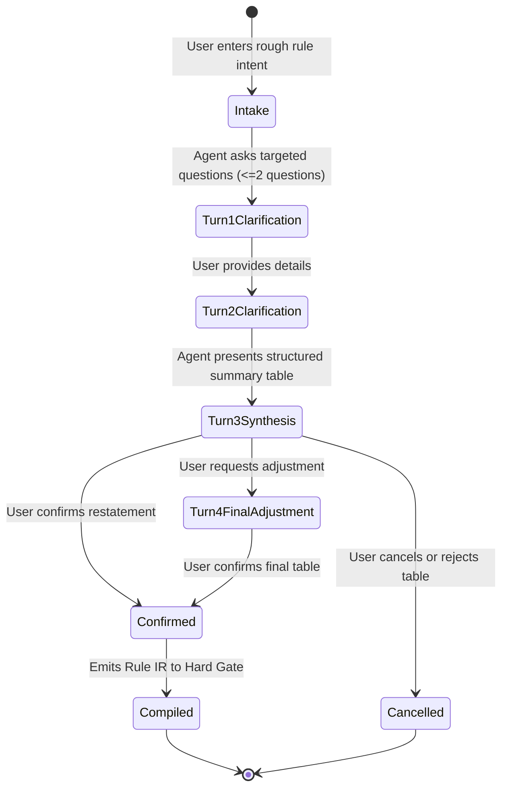

# Model: approval / agent

Owning capabilities: `approval` and `agent`. Models the multi-turn conversational elicitation pipeline, the 4-turn hard ceiling, fail-closed interpretation synthesis, and rule compilation invariants.

## Entities

| Entity | Meaning | Key Attributes | Relationships |
| --- | --- | --- | --- |
| **Elicitation Session** | A multi-turn dialogue dedicated to converting user intent into a compilable rule. | `session_id`, `turn_count` (<= 4), `status` | Governs one rule creation workflow in Settings. |
| **Elicitation Turn** | A single exchange within an Elicitation Session. | `turn_index`, `agent_inquiry`, `user_response` | Up to 4 turns per session. |
| **Rule Summary Table** | The structured restatement shown to the user before confirmation. | `tool_scope`, `target_resource`, `conditions`, `exceptions`, `unsupported_elements` | Presented at turn 3 or 4; requires user confirmation. |
| **Compiled Rule IR** | The deterministic intermediate representation evaluated by the Hard Gate. | `rule_id`, `ast_predicate`, `verdict` ("hold" / "refuse"), `version` | Produced upon confirmation; consumed by `req-009`. |
| **Ancestor Hierarchy Check** | The predicate evaluating whether an object descends from a protected parent. | `target_id`, `ancestor_ids` | Integrated into container-level Rule IR conditions. |

## Invariants

- **INV-AP-15** — The elicitation session enforces a strict hard ceiling of at most 4 conversation turns. If ambiguity remains at turn 3, the agent must formulate the safest fail-closed interpretation and ask for confirmation. · Rationale: prevents conversational abandonment (measured risk in SP-2 at turn 6). · Source: `spikes/SP-2-rule-elicitation/REPORT.md` §1 Q4.
- **INV-AP-16** — Uncompilable or subjective predicates MUST NOT be silently converted into soft reminders; unsupported portions must be explicitly reported per FR-AP-04. · Rationale: eliminates false security where users believe they are protected. · Source: `spikes/SP-2-rule-elicitation/REPORT.md` §0, §1 Q3; Constitution Principle II.
- **INV-AP-17** — The `rule-elicitation` role is assigned strictly to `LLM_MODEL_STRONG`; `LLM_MODEL_CHEAP` is forbidden. · Rationale: cheap model exhibited 25% silent downgrade in SP-2. · Source: `spikes/SP-2-rule-elicitation/REPORT.md` §0, §1 Q3.
- **INV-AP-18** — Any rule constraining "deletion" or "removal" must compile to both `archive_page` and `delete_block`. · Rationale: prevents evasion via content block destruction. · Source: `spikes/SP-2-rule-elicitation/REPORT.md` §1 Q2, §4 item 2.
- **INV-AP-19** — Container protection rules must evaluate ancestor inclusion (`ancestor_ids`) rather than exact ID match alone. · Rationale: ensures nested child pages and databases inherit protection. · Source: `spikes/SP-2-rule-elicitation/REPORT.md` §1 Q2, §4 item 3.

## Lifecycle

### Elicitation Session Lifecycle

## Variability

| Variability Point | Level | Extensible By | Contract | Notes (reserved: phase + rationale) |
| --- | --- | --- | --- | --- |
| Max Turns | closed | Core | `approval/contracts/rule-elicitation@0.1.0` | Strict ceiling of 4 turns |
| Condition Axes | closed | Core | `approval/contracts/rule-ir@0.1.0` | 7 closed axes: tool, target, property, time, ownership, threshold, exception |
| Assigned Model Profile | closed | Core | `agent/contracts/role-routing@0.1.0` | Fixed to `LLM_MODEL_STRONG`; cheap model forbidden |

## Physical Resource & Artifact Topology

### 1. Physical Format & Storage
- **Storage Location & Path Layout**: Session turns held in process memory during configuration; a confirmed rule is written to the rule catalogue store owned by `approval/contracts/rule-representation` (declared in `req-009-rule-ir-hardgate`), not to a store of this change's own.
- **Serialization & Codec Format**: Compiled Rule IR stored as JSON AST.
- **Physical Resource Budget**: Elicitation turns: <= 10MB RAM per session; maximum rule storage: <= 1MB (typically < 100 rules per user).
- **Lifecycle & Eviction**: Unconfirmed sessions discarded from memory on exit; compiled rules persist indefinitely until deleted by user.

### 2. Physical Storage & Data Schema

This change owns no store of its own. A confirmed rule becomes a row in the rule catalogue, whose physical shape
is frozen by `req-009-rule-ir-hardgate`, and declaring a second definition of that relation here would give the
catalogue two owners free to drift apart. What this change owns are the two shapes the conversation itself
produces, held as files beside the contract that owns them:
[`contracts/rule-elicitation.schema.json`](contracts/rule-elicitation.schema.json) and
[`contracts/rule-elicitation.turn.schema.json`](contracts/rule-elicitation.turn.schema.json). What this model
keeps is what a schema file cannot say: where each thing lands, who owns it, and what is deliberately held
nowhere.

| Store | Physical schema file | Owning contract | Retention / migration posture |
| --- | --- | --- | --- |
| Rule catalogue — the confirmed rule, once the user accepts the restatement | — | `approval/contracts/rule-representation` | Declared by `req-009-rule-ir-hardgate` as `contracts/rule-representation.sql` and `contracts/rule-representation.schema.json`. Account-owned and replicated; the store itself refuses a rule that claims any origin but the user's and a rule with no confirmation instant, which is what makes the moment of confirmation durable rather than merely recorded. **Note**: this change and its relations name that contract `rule-ir`, the draft name it carried before `req-009` froze it; the frozen name is `rule-representation` and it is the one the store answers to |
| Confirmation table as the user sees it | `contracts/rule-elicitation.schema.json` | `approval/contracts/rule-elicitation` | **Not stored as such.** It is the restatement shown for confirmation; what persists is the rule it compiles to, which carries the restatement as displayed text. An unconfirmed table is discarded with its session, because a table nobody accepted protects nothing and a stored one would look like a rule |
| Elicitation session — turns, questions, answers | `contracts/rule-elicitation.turn.schema.json` | `approval/contracts/rule-elicitation` | **Not persisted.** Held in process memory for the life of the configuration dialogue and released when it ends, whether by confirmation, refusal or the turn ceiling. The conversation is a means of arriving at a rule, not evidence about a job: nothing in it reached a connector |
| Model responses and prompts from the elicitation session | — | — | **In no store.** Parsed into the turn shape and dropped. The user's own words survive only where they are part of the rule they confirmed |

### 3. State-to-Artifact Mapping Matrix
| State / Event / Workflow | Physical Artifact / File / Slot | Identifier / Handler / Entry Point | Constraint Notes |
| --- | --- | --- | --- |
| Elicitation Session | Main Process Memory | `sessionId` | Hard limit of 4 turns |
| Rule Summary Table | App Window Renderer UI | `RULE_CONFIRMATION_TABLE` | Must show unsupported parts |
| Compiled Rule | SQLite `approval_rules` table | `ruleId` (UUIDv4) | Validated against Rule IR schema |

## Manifest Schema

Not applicable.

## Trust Boundary

- **Natural Language Intent**: Untrusted user prompt. Normalized and compiled into deterministic AST without executing arbitrary shell/code.
- **External Object Names**: Database names and user tags referenced in rules are resolved to persistent UUIDs before compiling.

## Relations

- `approval/contracts/rule-elicitation@0.1.0`: defines the elicitation session and prompt contracts.
- `approval/contracts/rule-ir@0.1.0`: defines the compiled AST format evaluated by `req-009`.
- `agent/contracts/role-routing@0.1.0`: enforces the strong model routing constraint.
