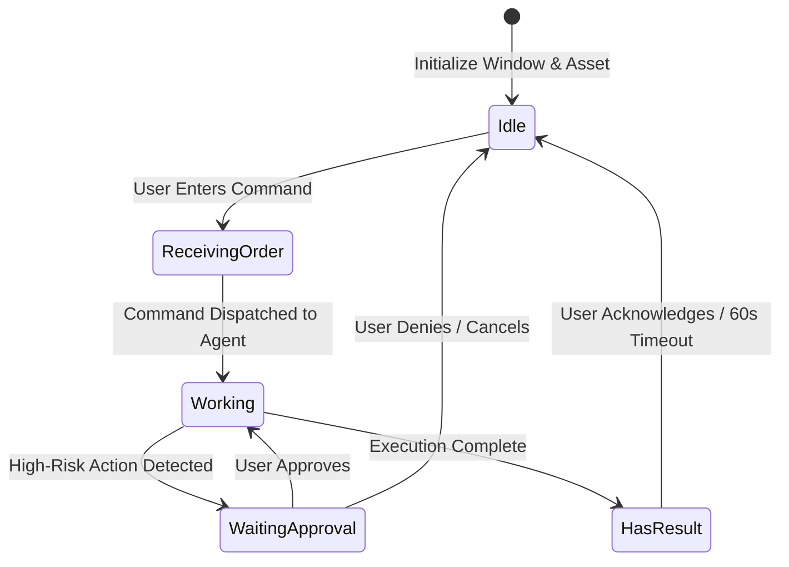

# Model: pet

## Entities

| Entity | Meaning | Key Attributes | Relationships |
| --- | --- | --- | --- |
| `PetWindow` | Frameless transparent Electron desktop window hosting the pet | `position`, `dimensions`, `alwaysOnTop`, `transparent` | Hosts `PetSurface`; managed by desktop shell |
| `PetSurface` | WebGL hardware-accelerated canvas rendering the character | `canvasId`, `fps`, `antialiasing`, `pixelRatio` | Contained inside `PetWindow`; executes Rive runtime |
| `PetAsset` | Binary Rive file package containing artboards and animations | `assetPath`, `artboardName`, `fileSize`, `checksum` | Loaded by `PetSurface` as `Uint8Array` buffer |
| `PetStateMachine` | Runtime controller orchestrating state transitions and blend curves | `stateMachineName`, `stateInput` (0-4), `blendDuration` | Binds to `PetAsset`; driven by Agent & Workflow events |

## Invariants

- **INV-PET-01** — State-Machine Driven Control · The pet animation must always be driven through the frozen `PetStateMachine` numeric input interface (0-4) and never by ad-hoc animation names. Rationale: Eliminates runtime breakage caused by internal animation renaming in design files. Source: `spikes/SP-3-electron-rive/REPORT.md#3-dau-vao-cho-tai-lieu-ky-thuat`.
- **INV-PET-02** — Transparent Compositor Integrity · The hosting window surface must have `backgroundColor = '#00000000'`, `hasShadow = false`, and `backgroundThrottling = false` to guarantee clean anti-aliasing without dark or grey fringing. Rationale: Dark fringing compromises visual quality against light application backgrounds. Source: `spikes/SP-3-electron-rive/REPORT.md#0-ket-luan`.
- **INV-PET-03** — Binary Buffer Loading · Pet assets must load into memory via local binary buffers (`Uint8Array`) rather than fetch URLs. Rationale: Guarantees 100% offline functionality and avoids web CORS restrictions. Source: `spikes/SP-3-electron-rive/REPORT.md#1-tra-loi-tung-cau-hoi` (Q6).

## Lifecycle

## Variability

| Variability Point | Level | Extensible By | Contract | Notes (reserved: phase + rationale) |
| --- | --- | --- | --- | --- |
| Character Asset Skin | open | Designers & Themes | `pet/contracts/rive-state-machine@1.0.0` | Any `.riv` asset implementing artboard `Pet` and `PetStateMachine` |
| Rendering Engine Surface | closed | Internal Core Platform | None | Fixed to WebGL/Rive runtime; escape hatch to 3D/Spline preserved per ADR-002 |
| Locomotion & Physics Behavior | reserved | Core Animation | None | Reserved for post-MVP desktop roaming physics |

## Physical Resource & Artifact Topology

### 1. Physical Format & Storage
- **Storage Location & Path Layout**: Shipped default asset at `resources/assets/pet.riv`; dynamic skins stored in `userData/assets/skins/<skin-id>/pet.riv`.
- **Serialization & Codec Format**: Proprietary compiled Rive binary format (`.riv`), parsed by `@rive-app/canvas` WebAssembly module (`rive.wasm`).
- **Physical Resource Budget**:
  - Memory: Peak Private Working Set < 120MB in renderer; App cluster working set ~358MB baseline.
  - Disk: Default `.riv` asset budget < 500KB; WebAssembly binary ~1.9MB.
  - CPU: Idle CPU usage < 3% on 16-core system; maintains steady 60 fps.
- **Lifecycle & Eviction**: Single singleton canvas instance persistent throughout app lifetime; buffer freed immediately after WebAssembly compilation.

### 2. Physical Storage & Data Schema

This change stores no structured records. What it does hold on disk is binary animation assets, and the shape
they are required to satisfy is held as a file beside the contract that owns it rather than described here.

| Store | Physical schema file | Owning contract | Retention / migration posture |
| --- | --- | --- | --- |
| Shipped default asset, `resources/assets/pet.riv` | [`contracts/rive-state-machine.schema.json`](contracts/rive-state-machine.schema.json) | `pet/contracts/rive-state-machine` | Replaced wholesale by a release, never edited in place. It is the fallback every failure path lands on, so it is the one asset the application may not start without |
| Installed skins, `userData/assets/skins/<skin-id>/pet.riv` | [`contracts/rive-state-machine.schema.json`](contracts/rive-state-machine.schema.json) | `pet/contracts/rive-state-machine` | Added and removed by the user at any time and hot-swapped without restart. A skin that fails the descriptor, or whose buffer is unreadable, is refused at load and the shipped default is used instead; the failing file is left on disk rather than deleted, so the user can see what was rejected |
| The state written to the running asset | [`contracts/rive-state-machine.set-state.schema.json`](contracts/rive-state-machine.set-state.schema.json) | `pet/contracts/rive-state-machine` | Not persisted at all. The pet's state is derived from the jobs in flight and is rebuilt at start, so nothing about the animation survives a restart |

### 3. State-to-Artifact Mapping Matrix
| State / Event / Workflow | Physical Artifact / File / Slot | Identifier / Handler / Entry Point | Constraint Notes |
| --- | --- | --- | --- |
| App Startup | `resources/assets/pet.riv` | `fs.readFileSync` -> `rive.Rive({ buffer })` | Synchronous initial read; zero network calls |
| Skin Hot-Reload | `userData/assets/skins/*.riv` | `PetRenderer.loadSkin(filePath)` | Instant hot-swap; no app reload |
| State Transition | IPC Channel `pet:setState` | `stateMachineInput.value = stateNum` | Latency between 2.9ms and 15.1ms |

## Manifest Schema

The pet asset descriptor is the manifest here, and it is owned by `pet/contracts/rive-state-machine@1.0.0`. Its
normative shape is the file [`contracts/rive-state-machine.schema.json`](contracts/rive-state-machine.schema.json)
and is not restated in this model.

## Trust Boundary

Dynamic character skin files downloaded or supplied by third parties are untrusted binary inputs. The Rive WebAssembly parser executes within the sandboxed Electron renderer process. Malformed or corrupted `.riv` files must fail safely with an error event, falling back to the bundled default asset without crashing the main process.

## Relations

- `gui/contracts/window-manager@1.0.0`: Coordinates window coordinates and focus handoff.
