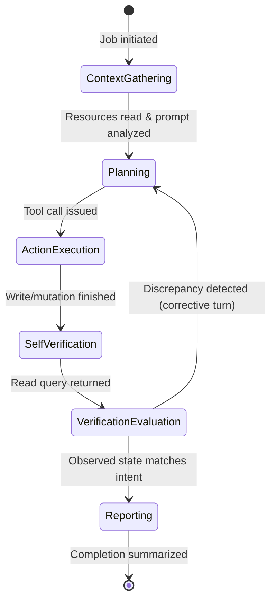

# Model: agent / job

Owning capabilities: `agent` and `job`. Models the internal mechanics, invariants, and execution lifecycle of the worker agent's multi-step agentic loop, including self-verification, multimodal precedence, and temporal anchoring.

## Entities

| Entity | Meaning | Key Attributes | Relationships |
| --- | --- | --- | --- |
| **Agentic Loop** | The multi-step reasoning and execution cycle carried out by a Worker Agent. | `turn_count`, `max_turns`, `current_phase` | Governs execution of one Job; interacts with Tool Registry and LLM Provider. |
| **Temporal Anchor** | The local machine date, time, and timezone context provided to the agent. | `date`, `day_of_week`, `time`, `timezone` | Injected into Worker Agent prompt before initial turn. |
| **Self-Verification Step** | A mandatory read operation executed after state mutation to verify external state. | `target_id`, `expected_properties`, `observed_properties`, `matched` | Occurs before final turn completion. |
| **Clarification Directive** | Constraint mandating tool-based inquiries and forbidding text-based question leakage. | `rule_text`, `enforcement_level` | Bound to Worker Agent system prompt. |
| **Multimodal Precedence Rule** | The hierarchy establishing typed user text as authoritative over attached images. | `text_weight`, `image_weight` | Evaluated during prompt ingestion and planning. |
| **Standard Tool Result** | Format required by Pi Agent SDK encapsulating text content and raw details. | `content`, `details` | Returned by every Connector Tool Adapter to Harness. |

## Invariants

- **INV-AG-24** — Every write or mutate tool operation must be followed by at least one read/query tool invocation prior to emitting the final job completion message. · Rationale: prevents premature or false completion reporting when mutations fail silently. · Source: `spikes/SP-4-agent-loop/REPORT.md` §1 Q2.
- **INV-AG-25** — When user typed text contradicts information extracted from an attached image, the typed text is authoritative and completely overrides the image content. · Rationale: user intent takes precedence over external visual documents (Case S-17). · Source: `spikes/SP-4-agent-loop/REPORT.md` §1 Q1; Constitution Principle V.
- **INV-AG-26** — Relative date arithmetic (e.g. "tomorrow", "next Friday", "end of month") resolves strictly against the injected Temporal Anchor. · Rationale: prevents day-of-week and timezone calculation errors on boundary days (Case S-16). · Source: `spikes/SP-4-agent-loop/REPORT.md` §1 Q1.
- **INV-AG-27** — The agent is prohibited from asking clarification questions in conversational response text; all clarification inquiries must be issued via the `ask_user` tool call. · Rationale: conversational questions leave the user with no input affordance to respond (Case S-10). · Source: `spikes/SP-4-agent-loop/REPORT.md` §1 Q1.
- **INV-AG-28** — All connector tool implementations return results formatted as `{ content: [{ type: "text", text: string }], details: object }`. · Rationale: required by `@earendil-works/pi-agent-core` to ensure LLM context serialization. · Source: `spikes/SP-4-agent-loop/REPORT.md` §1 Q5.

## Lifecycle

### Multi-Step Agentic Loop

## Variability

| Variability Point | Level | Extensible By | Contract | Notes (reserved: phase + rationale) |
| --- | --- | --- | --- | --- |
| Max Turns Per Job | closed | Core | `agent/contracts/worker-loop@0.1.0` | Bounded at 15 turns to prevent runaway reasoning |
| Temporal Format | closed | Core | `agent/contracts/worker-loop@0.1.0` | Standard ISO 8601 + IANA timezone identifier |
| Tool Result Envelope | closed | Core | `agent/contracts/worker-loop@0.1.0` | Mandatory `{ content, details }` structure |

## Physical Resource & Artifact Topology

### 1. Physical Format & Storage
- **Storage Location & Path Layout**: Turn transcripts and prompt context held in process memory during execution; durable session history is written to the transcript store owned by `agent/contracts/agent-session` (declared in `req-007-pi-sdk-harness`), not to a store of this change's own.
- **Serialization & Codec Format**: JSON Lines (JSONL) transcript log.
- **Physical Resource Budget**: Maximum resident memory per agent loop: <= 20MB heap; token context bounded by provider model window (e.g. 128k tokens).
- **Lifecycle & Eviction**: Loop turns deallocated from process memory upon job completion or transition to `suspended`.

### 2. Physical Storage & Data Schema

This change owns no store of its own. Both shapes it freezes are shapes in flight — what a tool hands back, and
what is injected before the first turn — and they are held as files beside the contract that owns them rather
than transcribed here: [`contracts/worker-loop.schema.json`](contracts/worker-loop.schema.json) and
[`contracts/worker-loop.prompt-context.schema.json`](contracts/worker-loop.prompt-context.schema.json). What
this model keeps is what a schema file cannot say: which store each thing eventually lands in, who owns that
store, and what is deliberately kept out of every store.

| Store | Physical schema file | Owning contract | Retention / migration posture |
| --- | --- | --- | --- |
| Tool result envelope | `contracts/worker-loop.schema.json` | `agent/contracts/worker-loop` | **Not persisted as such.** It is the shape a tool returns; a copy reaches disk only where a ledger record or a transcript turn carries it, and then it follows that store's retention. The file is listed here because the `details` member is what the ledger and the self-verification comparison read, so its shape outlives the turn that produced it |
| Injected prompt context, including the temporal anchor | `contracts/worker-loop.prompt-context.schema.json` | `agent/contracts/worker-loop` | **Not persisted.** Assembled at turn 0 from the machine clock and the registered tool set, and released with the loop. It is reproduced rather than stored, which is why a resumed job re-anchors to the instant it resumes at rather than to the instant it began |
| Turn transcript — the session's conversation, durable across a restart | — | `agent/contracts/agent-session` | A store declared by `req-007-pi-sdk-harness` and not by this change; its shape is `req-007`'s `contracts/agent-session.schema.json`. Append-only, account-owned, expiring with the ledger's retention floor so a job's conversation and a job's record leave together |
| Intent and result records for every tool call, including the verifying read | — | `ledger/contracts/ledger-store` | A store declared by `req-013-sqlite-ledger`. Append-only and never edited, which is what makes a self-verification read afterwards checkable rather than merely asserted |
| Live loop state — turn counter, in-flight arguments, attached image buffers | — | — | **In no store.** Held in process memory for the life of the job and released at its terminal state. The absence is deliberate: a turn counter that survived a restart would let a job exceed the ceiling across restarts, and an image buffer that reached disk would outlive the consent under which it was attached |

### 3. State-to-Artifact Mapping Matrix
| State / Event / Workflow | Physical Artifact / File / Slot | Identifier / Handler / Entry Point | Constraint Notes |
| --- | --- | --- | --- |
| Turn Execution | Node.js Process Memory | `jobId`, `turnIndex` | Bounded by maxTurns |
| Self-Verification | SQLite Ledger Tool Calls | `tool_intent`, `tool_result` | Read query logged as ledger pair |
| Temporal Injection | System Prompt Header | `TEMPORAL_ANCHOR` | Generated at turn 0 |

## Manifest Schema

Not applicable — no pluggable manifest schema introduced in this change.

## Trust Boundary

- **External Platform State**: Read query results from connectors are external data. Must be parsed safely without executing embedded instructions.
- **Attached Image Content**: OCR data extracted from user images is untrusted and subordinate to user typed instructions.

## Relations

- `agent/contracts/worker-loop@0.1.0`: defines the agent loop execution interface and system prompt contracts.
- `agent/contracts/ask-user@0.1.0`: consumed for clarification inquiries.
- `job/contracts/job-lifecycle@0.1.0`: tracks job status transitions throughout loop execution.
