# Model: agent

The `agent` capability already holds a conceptual shape seeded from the product definition: a pet-agent that hands
work over, a worker-agent that performs it, and a wrapping obligation on every tool. Nothing in that shape is
replaced here. What this change adds is the layer underneath it — what a session is, what a wrapped tool is as an
entity rather than as a rule, where a suspended run actually lives, and what a provider profile holds — because
the product embeds a third-party reasoning engine and every guarantee the constitution makes about gating and
recording has to hold at the seam between that engine and the product.

The model is written so that the engine is replaceable. Nothing below names it, and nothing below depends on a
capability only it has. Its replacement would rewrite `design.md` and leave this file standing, which is the
point: the wrap is outside the engine precisely so that the engine is not load-bearing for principles II and III.

## Entities

| Entity | Meaning | Key attributes | Relationships |
| --- | --- | --- | --- |
| **Agent role** | What an agent is for. The product recognises exactly four: pet-agent, worker-agent, rule elicitation, undo. | name; the tool set the role is entitled to; the model the role routes to | A session is started for exactly one role. The role-to-model mapping is owned by `req-017-provider-matrix`. |
| **Harness session** | One running agent: its transcript, its tool set, its suspension state, and nothing else. It is the unit of isolation. | identity; role; the job it serves; live or rebuilt; suspended or running | Belongs to exactly one job. A job has at most one live session at a time. |
| **Transcript** | The ordered turns of one session — what the user said, what the agent reasoned and said, what each tool returned. It is the conversation, not the history of the product. | ordered turns; the job it belongs to | Held in the product's own store. Distinct from the ledger, which records acts; the two join on the call identifier. |
| **Turn** | One entry in a transcript. | position; author (user, agent, tool result, reasoning); content; token usage when the author is the agent | Belongs to one transcript. A tool-result turn names the call it answers. |
| **Tool implementation** | The executable thing that reaches an external platform or an internal service. Produced from a connector manifest, or declared internally for the handful of tools that touch no platform. | name; origin (a connector, or internal); parameter shape; the manifest declarations the gate reads — irreversibility, permission change, reconciliation | Held privately by exactly one wrapped tool. Reachable by no other name. |
| **Wrapped tool** | What an agent actually holds. The obligation made into an object: record the intent, obtain a verdict, act only on allow, record the result. | the tool's public name and parameter shape; the private implementation | The only value a session accepts as a tool. Produced only by the wrapping factory. |
| **Wrapping factory** | The single function that turns a tool implementation into a wrapped tool. | the ledger it writes to; the evaluator it asks | One per process. It is the only holder of the path from a tool name to an implementation. |
| **Suspension point** | Where a run stopped: a specific held call in a specific transcript, waiting for a decision. | the call identifier; the transcript position; the job | Identified by the same call identifier the ledger uses to join intent to result, so a suspension and an unresolved call are the same fact seen from two sides. |
| **Provider profile** | A user-created configuration naming where model requests go and which credential opens it. | identity; display name; endpoint descriptor; credential reference; the models it offers | Referenced by the role-to-model mapping. Its credential lives in operating-system secure storage and is never part of the profile record. |
| **Endpoint descriptor** | What the profile says about the service: its address, the protocol dialect it speaks, and any headers it needs. | address; protocol dialect; extra headers; compatibility notes | Belongs to one provider profile. |
| **Attached image** | An image the user gave with a command, carried into the session as content rather than as a file. | dimensions; byte size; media type | Belongs to one job. Released when the job ends. |
| **Harness identity** | The pinned package identity and version of the embedded engine, and the record of which measurements are attached to it. | distribution identity; version; the evidence that covers it | One per build. Not selectable per session. |

## Invariants

Invariants that are externally observable are requirements in `specs/` rather than here. What remains below is
structural: true of the shape regardless of implementation, and not checkable by watching the product behave.

- **INV-AG-01** — A session accepts no tool value that the wrapping factory did not produce. This is the
  structural half of the single registration path; the observable half is the requirement that the harness starts
  holding no tool the factory did not return.
- **INV-AG-02** — A tool implementation is reachable only from inside the wrapper that holds it. There is no
  registry, name, index or message by which the implementation can be obtained separately from its wrapper.
- **INV-AG-03** — A transcript is append-only within a run. A turn, once written, is never edited; a correction is
  a later turn. Redaction removes a whole turn and records that it did, rather than rewriting one.
- **INV-AG-04** — A session belongs to exactly one job, and a job has at most one live session. Two live sessions
  for one job would make the suspension point ambiguous, which is the only thing a decision can be applied to.
- **INV-AG-05** — The identifier of a held call is the identifier the ledger correlates intent to result by. A
  suspension point and an unresolved intent are therefore the same call, and recovery needs no second index to
  find one from the other.
- **INV-AG-06** — A session rebuilt from a transcript, at a given position, is indistinguishable from the live
  session that was suspended at that position: same turns, same tool set, same next step. Without this, the
  durable path and the in-memory path would be two behaviours rather than one.
- **INV-AG-07** — No session state is held anywhere shared between sessions. A process-wide suspension gate, a
  module-level current-agent, or a shared tool registry each break isolation in a way no test of one session can
  reveal.
- **INV-AG-08** — A credential appears in no transcript, no ledger record, no log and no provider profile record.
  The profile holds a reference; the value is fetched at the moment of the request.
- **INV-AG-09** — Model output selects a tool only by naming one already registered. No field of model output is
  ever interpreted as a path, a command, an address or a handle to something executable, so an unrecognised name
  fails as unknown and never resolves to anything.
- **INV-AG-10** — An attached image exists only for the life of the job that received it, apart from any copy a
  ledger record holds, which lives under the ledger's retention rather than the session's.
- **INV-AG-11** — There is one harness identity per build. A session cannot select an engine, so no measurement
  recorded against the pinned identity can be silently claimed for a different one.

## Lifecycle

A harness session moves through these states. The two resume edges are the substance of this change: both arrive
at `running` at the same suspension point, and they differ only in whether the session had to be rebuilt.

```mermaid
stateDiagram-v2
    [*] --> Starting
    Starting --> Running : tool set from the factory, transcript empty or loaded
    Running --> Suspended : gate returns hold; turns made durable first
    Running --> Awaiting_answer : the agent asks the user
    Suspended --> Running : decision is approve, session still live
    Suspended --> Rebuilt : decision arrives after the process stopped or the wait expired
    Awaiting_answer --> Running : the user answers
    Awaiting_answer --> Rebuilt : the answer arrives after the process stopped
    Rebuilt --> Running : session reconstructed from the transcript at the same position
    Running --> Finished : the run reports and no call is outstanding
    Running --> Failed : ledger write refused, provider error, or the job's time limit
    Suspended --> Discarded : the job is cancelled while waiting
    Awaiting_answer --> Discarded : the job is cancelled while waiting
    Finished --> [*]
    Failed --> [*]
    Discarded --> [*]
```

`Suspended` is a durable state and `Rebuilt` is a transition rather than a resting place. A session that is merely
`Suspended` in memory holds nothing the store does not already hold, which is what makes an abrupt stop
uninteresting: the product restarts into the same suspension, and the start-up recovery pass specified by
`req-013-sqlite-ledger` sees the held call as an unresolved intent like any other.

## Variability

| Point | Kind | Statement |
| --- | --- | --- |
| The registration path | `closed` | One factory, no exceptions, no trusted-tool category. Opening this point is the bypass the factory exists to prevent, so it is closed by construction rather than by policy. |
| The order of the four steps | `closed` | Record intent, evaluate, act on allow, record result. No caller reorders, skips or batches them. |
| The harness identity | `closed` | One pinned distribution and version per build. Changing it is a change with its own evidence, not a configuration. |
| Tool sources | `open` | Tools arrive from connector manifests. The manifest and adapter contract is owned by `req-019-connector-framework`; this model requires only that whatever a manifest produces enters through the factory like anything else. |
| Provider profiles | `open` | The user adds a profile for any service that speaks a protocol dialect the engine supports. Specified by `agent/contracts/provider-profile@0.1.0`. |
| Internal tool origins | `closed` | The internal origin is a fixed, enumerated set — the five tools the pet-agent holds and the job-control tools — not an extension point third parties reach. |
| Reserved slots | — | None. No slot is reserved by this change; the constitution permits a reserved point only with a documented phase, rationale and activation condition, and nothing here has one. |

## Physical Resource & Artifact Topology

### 1. Physical Format & Storage

| Artifact | Format | Where it lives | Budget | Eviction |
| --- | --- | --- | --- | --- |
| Transcript | Ordered turns in the product's own store, one store identity of its own, append-only | The device's per-user application data, beside the ledger; replicated to the account encrypted at rest | Dominated by tool-result turns, which carry platform responses. No measured figure exists — UNVERIFIED | Retention floor of 90 days, matching the ledger's, so a job's conversation does not outlive or predecease its record |
| Live session | In memory: turns, tool set, suspension state | The process that owns connectors, the evaluator and the ledger writer | Three concurrent sessions completed in 5.9 s wall-clock in one process — VERIFIED (`spikes/SP-6-pi-sdk/REPORT.md` §1 Q4). Memory per session was not measured — UNVERIFIED | Released when the job reaches a terminal state, or when the session is suspended and the process stops |
| Attached image | Content carried in a turn, not a file path | In memory for the life of the job; in the ledger only where a record references it | At most 3 per command, at most 10 MB each, at least 14 px in either dimension | Released at the job's terminal state (INV-AG-10); a ledger copy follows the ledger's retention |
| Token usage | Counts on each agent turn, and in the turn-completion event | Part of the turn, so it is stored with the transcript | Four counts per agent turn | Removed with the turn it belongs to |
| Harness identity | The dependency lockfile and the build's refusal check | The repository and the build pipeline | One pinned pair | Changed only by a deliberate change |

The engine's own session-file mechanism is deliberately unused. It is a perfectly good format, but a store the
product does not own cannot be given a retention rule, a replication descriptor, an erase-on-sign-out behaviour or
a redaction pass, and principle VII requires all four of transcripts. The engine is therefore handed its messages
at construction and asked to continue, which is also the mechanism that makes INV-AG-06 true rather than hoped
for.

### 2. Physical Storage & Data Schema

The shapes this change persists are held as files beside the contracts that own them rather than transcribed
here. What this model keeps is what a schema file cannot say: who owns each store, what leaves it and when, and
what is deliberately not stored at all.

| Store | Physical schema file | Owning contract | Retention / migration posture |
| --- | --- | --- | --- |
| Transcript store — the turns of every agent session, one store identity of its own | `contracts/agent-session.schema.json` | `agent/contracts/agent-session` | Account-owned and replicated, append-only, resolved by append-and-reconcile. Retention floor of 90 days matching the ledger's, so a job's conversation and a job's record expire together. A turn removed by retention or by the user is replaced by a redaction marker at the same position rather than deleted, and a reader meeting a content kind it does not know renders it as unreadable rather than dropping it |
| Provider profiles, in the product's configuration store | `contracts/provider-profile.schema.json` | `agent/contracts/provider-profile` | Account-owned and replicated; the credential each profile names is not, because it lives in the device's own secure storage under `platform/contracts/secure-storage`. A newer build reads an older profile unchanged; an older build meeting a newer `profileVersion` refuses that profile rather than reading around what it does not recognise |
| Registered tool declarations | `contracts/tool-wrapping.schema.json` | `agent/contracts/tool-wrapping` | Not persisted. Tools are registered at start-up from the connector manifests `req-019-connector-framework` owns, so the file is the shape of what registration accepts rather than of anything on disk. It is listed here because the declarations it requires are the ones the gate and recovery read |
| Attached images, and the live session | — | `agent/contracts/agent-session` | In memory for the life of the job, released at its terminal state (INV-AG-10). A copy reaches disk only where a transcript turn or a ledger record carries it, and then it follows that store's retention |
| The engine's own session files | — | — | **Deliberately absent.** A store the product does not own cannot be given a retention rule, a replication descriptor, an erase-on-sign-out behaviour or a redaction pass, and principle VII requires all four of transcripts |

### 3. State-to-Artifact Mapping Matrix

| Session state | What exists on disk | What exists in memory | What a restart finds |
| --- | --- | --- | --- |
| Starting | Nothing yet, or a transcript to load | The tool set | Nothing to recover |
| Running, between calls | Turns up to the last completed one | The live session | The job resumes from the stored turns, having lost at most a turn in progress |
| Running, inside a call | Turns, plus the ledger's record of intent with no result | The live session | An unresolved intent; recovery classifies it before the job may continue |
| Suspended | Turns up to the held call, plus the record of intent, plus the pending approval request | The live session, or nothing | The suspension, reconstructible in full |
| Awaiting answer | Turns up to the question, plus the open question | The live session, or nothing | The open question, reconstructible in full |
| Finished, failed or discarded | The whole transcript and the job's records | Nothing | A terminal job, and any attached image already released |

## Manifest Schema

The one descriptor a user or a third party writes is the provider profile. Tools are described by the connector
manifest, which `req-019-connector-framework` owns and this change does not define.

### Required Fields

| Field | Meaning |
| --- | --- |
| Identity | A stable name for the profile, used by the role-to-model mapping to refer to it. |
| Display name | What the user called it, shown wherever a model choice is presented. |
| Endpoint address | Where requests go. A well-known provider is named by its identity; anything else carries an address. |
| Protocol dialect | Which completion protocol the service speaks. A dialect the engine does not implement is refused at configuration time, not at the first job. |
| Credential reference | A key in operating-system secure storage. Never the credential itself. |
| Models offered | The model names this profile can be asked for, each with the capabilities it has — reasoning, images — so the role mapping can refuse an impossible pairing. |

### Optional Fields

| Field | Meaning |
| --- | --- |
| Extra headers | Headers some services require. Values that look like credentials are stored by reference like any other. |
| Compatibility notes | Known deviations of a service from the dialect, recorded so a failure is diagnosable. |
| Minimum image dimension | A floor higher than the product's own 14 px, where a service demands one. Absent means the product floor applies. |

### Discovery & Registry

Profiles are user-created and stored with the product's configuration, so they replicate with the account while
their credentials do not: a second device signed in to the same account sees the profile and is missing only the
credential, which it asks for once. A built-in set of well-known providers ships with the product as starting
points; they are ordinary profiles with the address and dialect pre-filled, not a privileged category.

### Fallback on Missing Manifest

No profile configured is not an error state to recover from — it is the product's first-run condition. The product
states that a provider must be configured and offers the settings, and creates no job. A profile whose credential
has been removed from secure storage behaves the same way for the roles that route to it, naming the profile
rather than failing a job with a provider error. A profile naming a dialect the engine does not implement is
refused when it is saved.

## Trust Boundary

| Input | Trusted? | Consequence |
| --- | --- | --- |
| Model output — reasoning, prose, tool names, tool arguments | No | It is a proposal, never an instruction. A tool name is matched against the registry and fails as unknown if absent; arguments are the subject the gate judges, never an input to the judgement; and no output field ever resolves to something executable (INV-AG-09). |
| Tool results returned into the transcript — platform content, file content, message bodies | No | Data under the constitution's External Content Is Data clause. It may inform what the agent proposes next; it can never authorise an act, relax a verdict, or alter a rule. |
| User command text and attached images | No | Data. Images are validated for size and dimension before they enter a session, so a malformed attachment fails at the composer rather than at the provider. |
| A provider profile's endpoint address | Partly | Supplied by the user and used only as the destination of model requests. It is never used to fetch code, never used to resolve a tool, and carries only the credential referenced by that same profile, so a mistyped address leaks a credential the user themselves configured and nothing else. |
| The connector manifest declarations the gate reads — irreversibility, permission change, reconciliation | Yes, as declarations | They are read from the manifest and never from the call's own arguments, so an agent cannot declare its own call reversible. |
| The pinned engine itself | Yes, within its pin | Trusted to reason and to call what it is given. Not trusted to enforce anything: the gate and the ledger sit outside it, which is why an engine change cannot narrow them. |

## Relations

- **`approval`** — through `approval/contracts/gate-evaluation@0.1.0`. The wrapper submits the call subject and
  receives a verdict; it holds no rule, evaluates nothing, and has no other route to a decision. The refusal
  notice the contract defines is what the disclosure requirement in `specs/agent` attaches to later questions.
- **`ledger`** — through `ledger/contracts/ledger-record@0.1.0` for the shape of what is written and
  `ledger/contracts/ledger-store@0.1.0` for the guarantee that a record is durable before the call is made. The
  wrapper is one of the in-process callers that contract reserves appending to.
- **`job`** — through the job lifecycle states, and through `job/contracts/tool-reconciliation@0.1.0`, which is
  what decides whether an interrupted call happened. A session never reconciles anything itself; it is rebuilt
  after recovery has concluded, not during it.
- **`connector`** — through the manifest and adapter contract owned by `req-019-connector-framework`. This model
  requires only that a manifest yields tool implementations, and that they enter through the factory.
- **`platform`** — through `platform/contracts/secure-storage@0.1.0` for provider credentials, under the
  credential class the profile names.
- **`sync`** — through `sync/contracts/replicated-store-descriptor@0.1.0`. The transcript store is registered as
  an append-only store resolved by append-and-reconcile; `req-022-account-sync` already treats any other
  resolution rule for it as inadmissible.
- **`uix`** — no contract. The composer's image floor is a requirement in that capability, and this change's only
  claim on it is the dimension the provider refuses.
