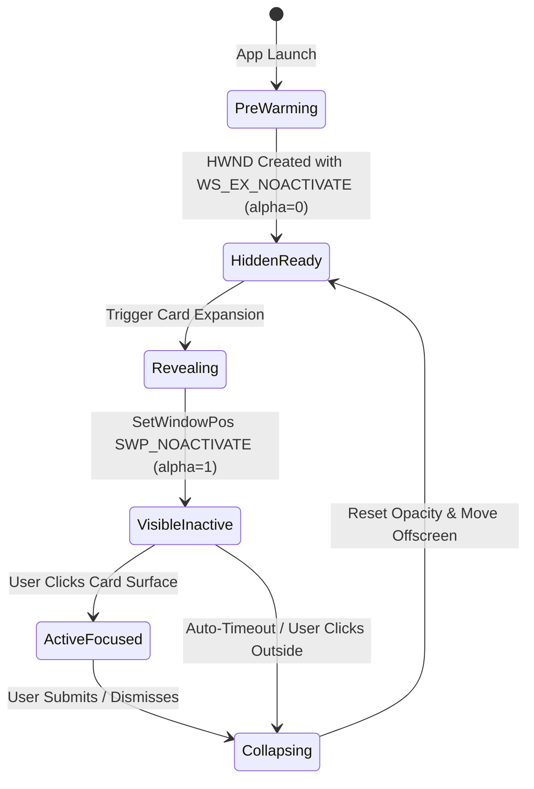

# Model: pet

## Entities

| Entity | Meaning | Key Attributes | Relationships |
| --- | --- | --- | --- |
| `OSWindowHook` | Low-level OS native hook managing Win32 window procedures | `hwnd`, `extendedStyles`, `hitTestSubclass` | Attached to `PetWindow` and `CardWindow` |
| `PreWarmedCardWindow` | Pre-initialized hidden card surface ready for instantaneous reveal | `hwnd`, `preWarmedState` (HIDDEN, VISIBLE), `bounds` | Reused across all card expansions; owned by Window Manager |
| `DisplayWorkArea` | Usable screen coordinate bounds of an active connected display | `displayId`, `bounds`, `workArea`, `scaleFactor` | Queried from OS display subsystem |
| `AdaptiveWindowPlacement` | Calculated coordinates ensuring card stays adjacent to pet inside workArea | `targetX`, `targetY`, `horizontalFlip`, `verticalFlip` | Computed from `PetWindow.bounds` and `DisplayWorkArea` |

## Invariants

- **INV-WIN-01** — Absolute Focus Preservation · Auto-expanding a dialogue card must never activate the window or alter foreground window state without direct physical user interaction. Rationale: Dropping keystrokes in active applications destroys trust and interrupts user work. Source: `docs/spec/constitution.md` principle I, `spikes/SP-7-pet-window-os/REPORT.md#0-ket-luan`.
- **INV-WIN-02** — Zero Interference with Third-Party Processes · The application must manipulate only its own window handles and must never suspend external processes (`NtSuspendProcess`) or move the user's cursor (`SetCursorPos`). Rationale: Freezing external processes stalls OS low-level hooks and causes severe cursor stutter. Source: `spikes/SP-7-pet-window-os/REPORT.md#4-rui-ro-moi-phat-hien`.
- **INV-WIN-03** — Work Area Containment · All window bounds must remain fully contained within the work area of an active display; orphaned coordinates from detached displays must fallback to the primary work area. Rationale: Prevents pet or cards from becoming permanently unreachable off-screen. Source: `spikes/SP-7-pet-window-os/REPORT.md#1-tra-loi-tung-cau-hoi` (Q4, Q5).
- **INV-WIN-04** — Pixel-Exact Click-Through · Transparent areas of the pet window must immediately pass clicks through to background windows at kernel level via `HTTRANSPARENT`. Rationale: Prevents rectangular invisible window borders from blocking user access to underlying desktop icons and apps. Source: `spikes/SP-7-pet-window-os/REPORT.md#1-tra-loi-tung-cau-hoi` (Q2).

## Lifecycle

## Variability

| Variability Point | Level | Extensible By | Contract | Notes (reserved: phase + rationale) |
| --- | --- | --- | --- | --- |
| Platform Window Subsystem | open | Native Platform Addon | `platform/contracts/native-window-manager@1.0.0` | Windows implemented via Rust napi-rs; macOS reserved |
| Adaptive Edge Corner Logic | closed | Window Manager Core | None | Deterministic 4-corner flip algorithm |
| Multi-Window Card Stacking | reserved | UI Shell | None | Post-MVP: side-by-side multi-card docking |

## Physical Resource & Artifact Topology

### 1. Physical Format & Storage
- **Storage Location & Path Layout**: Native addon binary compiled to `packages/native-windows/desktop_window_win32.node`.
- **Serialization & Codec Format**: Compiled native C-ABI shared library / Win32 PE binary.
- **Physical Resource Budget**:
  - Memory: Pre-warmed card window holds ~45MB resident private working set.
  - CPU: Zero CPU overhead during background typing; 0ms hit-test latency in window procedure subclass.
- **Lifecycle & Eviction**: HWND created once during application startup and destroyed only upon application shutdown.

### 2. Physical Storage & Data Schema

This change owns no store of its own. One datum outlives the session — where the user last left the pet — and
its shape is the placement descriptor held beside the contract that owns it rather than described here.

| Store | Physical schema file | Owning contract | Retention / migration posture |
| --- | --- | --- | --- |
| Remembered pet placement, in the application's own configuration | [`contracts/native-window-manager.schema.json`](contracts/native-window-manager.schema.json) | `platform/contracts/native-window-manager` | Written when the user moves the pet and read once at start. It is advisory, never authoritative: a remembered placement that intersects no connected display's work area is replaced by the bottom-right corner of the primary display rather than honoured, so a monitor detached between sessions can never leave the pet unreachable (INV-WIN-03) |
| Window handles, styles and the hit-test subclass | — | `platform/contracts/native-window-manager` | Not persisted in any form. Every handle is created at start and released at shutdown, and a handle from an earlier session has no meaning in this one |
| Pre-warmed card window contents | — | `uix` | Not persisted. The window is reused across expansions and holds no card between them; the card queue that refills it is rebuilt from the job store after a restart |

### 3. State-to-Artifact Mapping Matrix
| State / Event / Workflow | Physical Artifact / File / Slot | Identifier / Handler / Entry Point | Constraint Notes |
| --- | --- | --- | --- |
| Window Initialization | `desktop_window_win32.node` | `initWindow(hwnd, flags)` | Sets `WS_EX_NOACTIVATE` & `WS_EX_TOPMOST` |
| Hit-Testing (Mouse Move/Click) | Win32 Window Procedure | `WM_NCHITTEST` subclass hook | Returns `HTTRANSPARENT` or `HTCLIENT` |
| Card Reveal | `desktop_window_win32.node` | `repositionCard(hwnd, x, y, w, h)` | Uses `SetWindowPos` with `SWP_NOACTIVATE` |

## Manifest Schema

Not applicable.

## Trust Boundary

Raw Win32 window handles (`HWND`) passed to native functions must be strictly validated to ensure they belong exclusively to the application's own process (`GetCurrentProcessId()`). Native code refuses to hook or manipulate foreign window handles.

## Relations

- `gui/contracts/window-manager@1.0.0`: Coordinates application window visibility and state.
