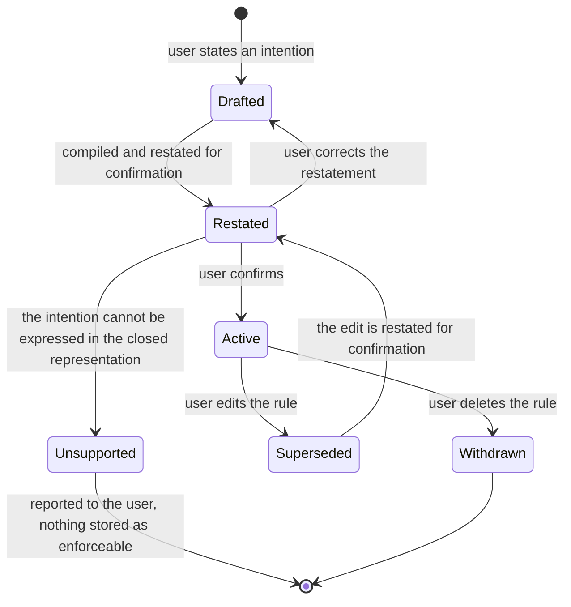
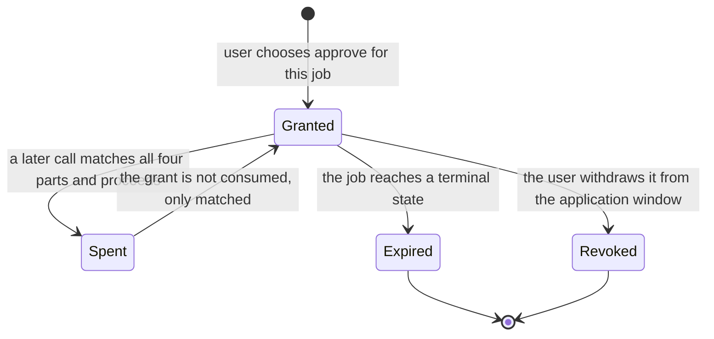

# Model: approval

This change introduces the conceptual model of the gate: what a rule is, what the gate is shown when it decides,
what a decision is worth once made, and where each of those things physically lives. The `agent` capability
contributes only the wrapper that makes the gate unavoidable; it holds no new concepts of its own and is covered
under Relations.

## Entities

| Entity | Meaning | Key Attributes | Relationships |
| --- | --- | --- | --- |
| Rule | One stored decision the gate can reach: a condition, and the verdict that follows when the condition holds. | Identifier; name; origin; verdict; condition; the restatement the user confirmed; confirmation state; the moment it began to bind. | Belongs to exactly one Rule Catalogue. Produces a Verdict. Referenced by a Scoped Approval and by every Evaluation Record it caused. |
| Rule Origin | Where a rule came from, which decides who may change it. | One of: hardline (shipped with the product, not editable, never absent); user (elicited in conversation and confirmed); static pattern (shipped with the product, editable off only by changing the approval mode). | Constrains which attributes of a Rule may be edited and by whom. |
| Condition | The closed expression a rule tests, as a finite tree. | Node kind; child nodes for conjunction, disjunction and negation; for a leaf, the single aspect it tests and the values it tests against. | Held by exactly one Rule. Tested against a Call Subject. |
| Leaf Aspect | The single thing one leaf of a condition looks at. | One of: tool identity; target scope; field change; ownership; accumulated count; time of day; irreversibility; permission change. | The closed set that makes the gate deterministic; see Variability. |
| Rule Catalogue | The whole set of rules in force for an account at a moment. | Account; the user rules it holds; the representation version it was written against; the moment it last changed. | Replicates to every signed-in device. Read in full by every evaluation. |
| Call Subject | Everything the gate is allowed to look at when deciding one tool call. | Connector; tool; object type; object identifier; ancestor identifiers; the fields this call changes and their resulting values; who created the object; who it is assigned to; whether the operation is irreversible; whether it changes permission; the approval mode in force for the job; the current time and the user's time zone. | Assembled once per call. Discarded after the verdict; never stored as such. |
| Accumulation Window | A count the gate reads rather than keeps: how much of something has already happened within a stated boundary. | Metric; boundary (the current job, or the calendar day in the user's time zone); the count derived from ledger records within that boundary. | Derived from the account's Ledger Records. Read by a condition leaf that tests an accumulated count. |
| Verdict | What the gate decided, and on whose authority. | One of allow, hold for approval, refuse; the rule or rules that produced it; the reason stated in the user's language. | Produced by evaluating a Call Subject against a Rule Catalogue. Recorded as an Evaluation Record. |
| Scoped Approval | A grant the user gave that spares a later call from stopping again, without widening beyond what they saw. | Job; rule; tool; the scope of the object they were shown; the moment it was granted. | Expires when its job reaches a terminal state. Matches a later call only when all four parts match. |
| Allowlist Entry | A grant the user made permanent, outside any one job. | The operation it covers; the scope it covers; the moment it was added. | Belongs to the account and replicates. Never overrides a rule whose verdict stops. |
| Refusal Notice | The fact, held for the length of a job, that the gate stopped something in it. | Job; the operation stopped; the object; the rule that fired; the moment. | Attached to every question the agent puts to the user for the remainder of that job. |
| Evaluation Record | The ledger's account of one decision. | The call; the verdict; the rule; the reason; the moment. | A Ledger Record, owned by the `ledger` capability; written before execution, never edited. |

## Invariants

- **INV-APPROVAL-01** — An evaluation may read only the Call Subject, the Rule Catalogue, the Accumulation
  Windows its conditions name, the approval mode in force for the job, and the clock. No other source may reach
  it, and in particular no text the model produced other than the arguments of the call being judged. ·
  Rationale: principle II is only true if it is true of the inputs; a gate that reads the model's prose has put
  the model back in the decision. · Source: `docs/spec/constitution.md` principle II;
  `spikes/SP-8-rule-ir-hardgate/REPORT.md#1-tra-loi-tung-cau-hoi` (Q1).
- **INV-APPROVAL-02** — A condition is a finite tree whose leaves are drawn only from the closed set of Leaf
  Aspects, and no node may carry text that is executed rather than compared. · Rationale: the expressiveness
  boundary is the whole safety argument; an escape hatch for arbitrary expressions reintroduces exactly the
  unpredictability the closed format exists to remove. · Source:
  `spikes/SP-8-rule-ir-hardgate/REPORT.md#1-tra-loi-tung-cau-hoi` (Q1).
- **INV-APPROVAL-03** — Evaluating a call changes nothing except the Evaluation Record it produces: it does not
  advance a counter, consume a grant, or alter a rule. Counts change because the ledger gained a record, not
  because the gate was consulted. · Rationale: an evaluation that mutates state cannot be repeated for
  diagnosis, and a gate that is asked twice must answer the same both times. · Source: INV-APPROVAL-01;
  the determinism requirement in `specs/approval/spec.md`.
- **INV-APPROVAL-04** — Every hardline rule has the verdict refuse and the origin hardline, exists in the
  product's own build rather than in the stored catalogue, and no stored catalogue entry can claim that origin. ·
  Rationale: if hardline rules lived in the replicated catalogue, corrupting or editing the catalogue would be a
  way to delete them, which is the escalation the hardline list exists to prevent. · Source:
  `docs/spec/constitution.md` principle II;
  `spikes/SP-8-rule-ir-hardgate/REPORT.md#1-tra-loi-tung-cau-hoi` (Q3).
- **INV-APPROVAL-05** — A Scoped Approval matches a later call only when the job, the rule, the tool and the
  object scope all match; a grant missing any one of the four matches nothing at all. · Rationale: the widening
  of a grant from its tuple to a bare tool name is the measured evasion route. · Source:
  `spikes/SP-8-rule-ir-hardgate/REPORT.md#2-tac-dong-len-adr-prd` (item 2; case A-19).
- **INV-APPROVAL-06** — The object metadata an evaluation uses — who created an object, what its ancestors are,
  what it currently holds — is obtained from the connector's own record of that object, never from arguments the
  agent supplied in the call. · Rationale: the agent can state anything in its arguments; anchoring ownership to
  an argument would let a rule about another person's work be escaped by asserting otherwise. · Source:
  `spikes/SP-8-rule-ir-hardgate/REPORT.md#1-tra-loi-tung-cau-hoi` (Q5, case A-17).
- **INV-APPROVAL-07** — The Rule Catalogue and the ledger are separate stores. Editing, adding or withdrawing a
  rule never alters a ledger record, and a rule withdrawn today does not change what the gate decided
  yesterday. · Rationale: principle III makes the ledger append-only; a decision is a historical fact about the
  rules then in force. · Source: `docs/spec/constitution.md` principle III.
- **INV-APPROVAL-08** — A rule binds only from the moment the user confirmed its restatement; an unconfirmed
  rule is absent from every evaluation rather than present in a weaker form. · Rationale: a half-formed rule that
  partly binds is worse than none, because the user cannot tell which half. · Source:
  `docs/spec/capabilities/approval/spec.md`, "Rules are elicited in conversation and compiled before they bind";
  `req-004-rule-elicitation`.
- **INV-APPROVAL-09** — A Refusal Notice lives exactly as long as its job: it appears with every question asked
  after the refusal within that job, and it does not follow the user into another job. · Rationale: the
  disclosure exists to keep one job's user informed; carrying it further would make every later job noisy and
  the notice ignorable. · Source: `clarifications.md` session 2026-09-12.

## Lifecycle

A rule's life, from the conversation that produced it to the moment it stops binding:

A grant's life is shorter and deliberately narrow:

## Variability

| Variability Point | Level | Extensible By | Contract | Notes (reserved: phase + rationale) |
| --- | --- | --- | --- | --- |
| The set of Leaf Aspects a condition may test | closed | Nobody; a new aspect is a versioned change to the rule representation and re-runs the adversarial corpus | `contracts/rule-representation.md` | The closed set is the safety argument. Widening it toward general expressions is the named rabbit hole in the proposal. |
| The set of verdicts | closed | Nobody | `contracts/rule-representation.md` | Three verdicts, ordered by strictness; the ordering is what resolves conflicts, so a fourth verdict would have to state its place in that order. |
| The way conflicting rules are resolved | closed | Nobody | `contracts/rule-representation.md` | Strictest verdict wins. Deliberately not configurable: a configurable precedence is a way to weaken a rule without editing it. |
| Object types a rule may name | open | Connector manifests | `connector/contracts/connector-manifest` (owned by `connector`); consumed as described under Manifest Schema | Notion's database, page and block become three declared values among others rather than part of the rule format. |
| Tool identities a rule may name | open | Connector manifests | `connector/contracts/connector-manifest` | Tools are generated from the manifest, so the set of nameable tools grows with connectors and never with core edits. |
| Which operations count as irreversible, and which change permission | open | Connector manifests | `connector/contracts/connector-manifest` | Principle IV requires every write to declare a compensating action or the irreversible flag; the gate reads that declaration rather than keeping its own list. |
| The metrics an accumulated count may use | closed | Nobody | `contracts/rule-representation.md` | Each metric must be derivable from ledger records within a stated boundary; adding one is a versioned change because it adds a read to the hot path. |
| Hardline rules | closed | The product's own releases | `contracts/rule-representation.md` | Not in the replicated catalogue at all (INV-APPROVAL-04), therefore not extensible by the user, an administrator, or a connector. |
| Static patterns of the smart tier | closed | The product's own releases | `contracts/rule-representation.md` | Expressed in the same representation as user rules, shipped in the build. The model-based tier that runs after them is owned by `req-011-risk-judge`, not here. |

## Physical Resource & Artifact Topology

### 1. Physical Format & Storage

- **Storage Location & Path Layout**: the Rule Catalogue is one account-owned collection in the desktop
  client's local store, alongside jobs and the ledger, and replicates under the same envelope as the rest of the
  account's data (principle VII). Hardline rules and static patterns are not in that store at all — they are part
  of the application build, so no store edit and no replication conflict can remove them. Scoped Approvals live
  with their job and disappear with it; Allowlist Entries live in the account-owned collection beside the rules.
  Refusal Notices live with the running job only.
- **Serialization & Codec Format**: rules are stored in the serialised form defined by
  `contracts/rule-representation.md` and validated against it on every load; nothing else may be stored in the
  catalogue. A catalogue that fails validation is refused rather than partially loaded — see the fail-closed
  requirement in `specs/approval/spec.md`.
- **Physical Resource Budget**: the catalogue is held resident in full while the application runs, because the
  evaluation path may not perform a store read to learn its own rules. Expected size is tens of rules for a
  single user and low hundreds at the outside — UNVERIFIED, an expectation rather than a measurement; the spike
  evaluated against twenty-one rules. Accumulated counts are the one figure the gate does not hold: they are
  derived from ledger records and must be answerable without scanning the ledger, which means the ledger keeps a
  maintained count per open job and per calendar day rather than the gate counting records itself. The whole
  evaluation, including that read, is bounded by the latency threshold in `verification.md`; the measured
  0.48 ms p99 predates the read and does not cover it.
- **Lifecycle & Eviction**: the catalogue is loaded when the application starts and reloaded when it changes,
  whether the change came from this device or from replication; there is no eviction, because the catalogue is
  small and a partially resident catalogue would be a gate with holes in it. The maintained counts are rebuilt
  from ledger records at start and after a replication merge, so that a device that was offline corrects its
  counts rather than continuing from a stale figure.

### 2. Physical Storage & Data Schema

The catalogue store is held as a file beside the contract that owns it rather than transcribed here:
[`contracts/rule-representation.sql`](contracts/rule-representation.sql). The shape of the condition it stores as
structured text is [`contracts/rule-representation.schema.json`](contracts/rule-representation.schema.json). What
this model keeps is what a schema file cannot say — who owns each relation, what is deliberately in no store at
all, and how the shape moves.

| Store | Physical schema file | Owning contract | Retention / migration posture |
| --- | --- | --- | --- |
| Rule Catalogue — stored rules and the permanent allowlist, with the origin and confirmation guards | `contracts/rule-representation.sql` | `approval/contracts/rule-representation` | Account-owned and replicated; a rule leaves only when the user deletes it, and deleting one never alters what the gate decided while it was in force (INV-APPROVAL-07). The store advances one whole shape step at a time; a catalogue whose representation version is ahead of the build stops writes rather than being read around (`RULE_VERSION_AHEAD`) |
| Rule condition | `contracts/rule-representation.schema.json` | `approval/contracts/rule-representation` | Fixed at the moment the user confirmed the restatement. Widening the leaf set is a versioned change to that contract and re-runs the frozen adversarial corpus, because it is a change to what can be protected |
| Hardline rules and the smart tier static patterns | — | `approval/contracts/rule-representation`, as product build content | **In no store.** They ship inside the application build (INV-APPROVAL-04), so no catalogue edit, corruption or replication conflict can remove one. This row exists to record the absence as deliberate |
| Scoped Approvals and Refusal Notices | — | `job` | Held with the running job and gone when it reaches a terminal state. Never persisted beyond it, which is why neither has a relation in the schema file |
| Evaluation Records and the counts a `CountLeaf` reads | — | `ledger/contracts/ledger-store` | A separate store, declared by `req-013-sqlite-ledger`. The gate writes to it only through `ledger/contracts/ledger-record` and reads it only for a count a rule named |

### 3. State-to-Artifact Mapping Matrix

| State / Event / Workflow | Physical Artifact / File / Slot | Identifier / Handler / Entry Point | Constraint Notes |
| --- | --- | --- | --- |
| A user rule is confirmed | Rule Catalogue entry in the account-owned store | Rule identifier | Replicates to every signed-in device; binds only from confirmation (INV-APPROVAL-08). |
| The product starts | Resident catalogue, plus hardline rules and static patterns from the build | Catalogue load | Validation failure refuses every write rather than yielding an empty catalogue. |
| A tool call is evaluated | Evaluation Record in the ledger | Ledger record for that call | Written before execution; never edited (principle III). |
| A counting rule is tested | Maintained count held with the ledger, per open job and per calendar day | Metric and boundary | Rebuilt from records at start and after a replication merge; never held only in session memory. |
| The user grants approval for this job | Scoped Approval held with the job | Job, rule, tool, object scope | All four parts required to match (INV-APPROVAL-05); vanishes with the job. |
| The user adds a permanent allowlist entry | Allowlist Entry in the account-owned store | Entry identifier | Replicates; never overrides a stopping rule. |
| The gate refuses or holds an operation | Refusal Notice held with the running job | Job | Attached to every subsequent question in that job; not persisted beyond the job. |
| Two devices edited rules while apart | Two catalogue versions meeting at replication | Account | Reconciliation is owned by `sync`; until it completes, each device evaluates the catalogue it holds, and the stricter outcome of a divergence is never the unsafe one because a rule absent on one device cannot allow what the other's rule refuses on that device. |

## Manifest Schema

The gate defines no manifest of its own. It consumes the connector manifest, which is owned by the `connector`
capability and specified in `req-019-connector-framework`; what follows is only the part of that manifest the gate
depends on, stated so that the dependency is explicit and testable rather than assumed.

### Required Fields

| Field | Type | Description |
| --- | --- | --- |
| Connector identity | Identifier | The name a rule uses when it says which platform it is talking about. |
| Object types | List of identifiers | The object types this connector exposes, which are the values a rule may name as its target type. Notion contributes its database, page and block here. |
| Object identity and ancestry | Declaration | How an object of each type is identified immutably, and how its ancestors are obtained, so that a rule can anchor to something a rename cannot move. |
| Tools | List, each with identity and whether it writes | The operations a rule may name. A tool that writes carries the obligations below. |
| Irreversibility declaration | Per write tool | Either the method of taking a pre-write snapshot and the formula for the compensating action, or the irreversible flag — principle IV, and the flag the gate's irreversibility aspect tests. |
| Permission-change declaration | Per write tool | Whether the operation changes who may see or do what, which the gate's permission aspect tests. |
| Field naming | Declaration | The fields an object exposes, so that a rule written about a field the user named can be matched against the connector's own spelling and nesting of it. |

### Optional Fields

| Field | Type | Description |
| --- | --- | --- |
| Scope declaration | Declaration | The bounds of what the user granted this connector, against which the hardline rule about acting outside granted scope is tested. Absent means the connector exposes no scope narrower than the whole authorisation. |
| Field value shapes | Declaration | How a field's value is nested in this connector's payloads, which lets extraction be driven by the manifest rather than inferred. Absent means extraction falls back to the general rules in the rule representation contract. |

### Discovery & Registry

Discovery is the connector capability's concern, not the gate's. The gate requires only that by the time a tool
exists to be called, the manifest that generated it is loaded and its declarations are readable, because a tool
whose irreversibility and permission declarations are unknown cannot be evaluated.

### Fallback on Missing Manifest

There is no fallback that permits execution. A tool whose manifest is missing, malformed, or silent on the
declarations listed as required above is refused: it cannot be evaluated, and an operation that cannot be
evaluated does not execute. This is the same fail-closed rule the catalogue obeys, applied at the other end.

## Trust Boundary

Everything that reaches the gate from outside the product is data, never authority:

- **Connector-fetched content** — page bodies, message bodies, file content, object names, database titles. The
  measured attack put instructions in exactly these places and steered the model in eight of twelve cases. None
  of it is an input to evaluation; it reaches the gate only where it is the value a rule is testing, and a value
  being tested cannot alter the test.
- **The user's free text and attached images** — the same standing. A rule changes only through the elicitation
  conversation and the user's confirmation of a restatement, never because something the agent read said so.
- **The model's output** — the arguments of the call being judged are the only part the gate reads, and it reads
  them as the subject of the decision. The model's prose, its stated intentions, its claims about what it has
  been permitted, and any question it composes are not inputs; the disclosure attached to its questions is
  composed by the product from the Refusal Notice, not extracted from what the agent wrote.
- **Object metadata** — treated as trusted only when it came from the connector's own record of the object, never
  when it arrived as an argument (INV-APPROVAL-06). This is the boundary that case A-17 attacked, by reassigning
  an object to the user before acting on it.
- **The replicated catalogue** — trusted only after it validates. It arrives from the account's own backend, but
  principle VII makes that protection operational rather than cryptographic, so the catalogue is validated on
  every load and a catalogue that fails validation stops writes rather than being repaired silently. Hardline
  rules are outside this boundary entirely, which is why they are not replicated.

The consequence, stated plainly: a total compromise of the model, of the content it reads, and of the prose it
produces changes nothing about which operations execute. A compromise of the connector's own object records, or
of the stored catalogue in a way that still validates, would change it — those are the two surfaces worth
guarding, and neither is reachable from the model.

## Relations

- `ledger/contracts/ledger-record` — every Evaluation Record is a ledger record, and the Accumulation Windows are
  derived from ledger records. The gate never writes to the ledger except through that contract, and never reads
  the ledger for any purpose other than a count a rule named.
- `connector/contracts/connector-manifest` — the source of object types, tool identities, irreversibility and
  permission declarations, and field naming, as set out under Manifest Schema. The gate holds no per-connector
  knowledge of its own.
- `job` — the boundary of a Scoped Approval and of a Refusal Notice is a job, and the approval mode in force for
  an evaluation is the one recorded on the job at its creation, not the one currently configured.
- `agent` — the wrapper that makes every tool call reach the gate is specified in `specs/agent/spec.md` in this
  change; the gate itself neither registers tools nor knows how they were wrapped.
- `sync` — the Rule Catalogue and the Allowlist replicate under the account's replication envelope, and the
  reconciliation of divergent rule edits between devices is owned there, not here.
- `undo` — the irreversibility declaration the gate tests is the same one `undo` uses to build compensating
  actions; both read it from the connector manifest, and neither keeps a second list.
