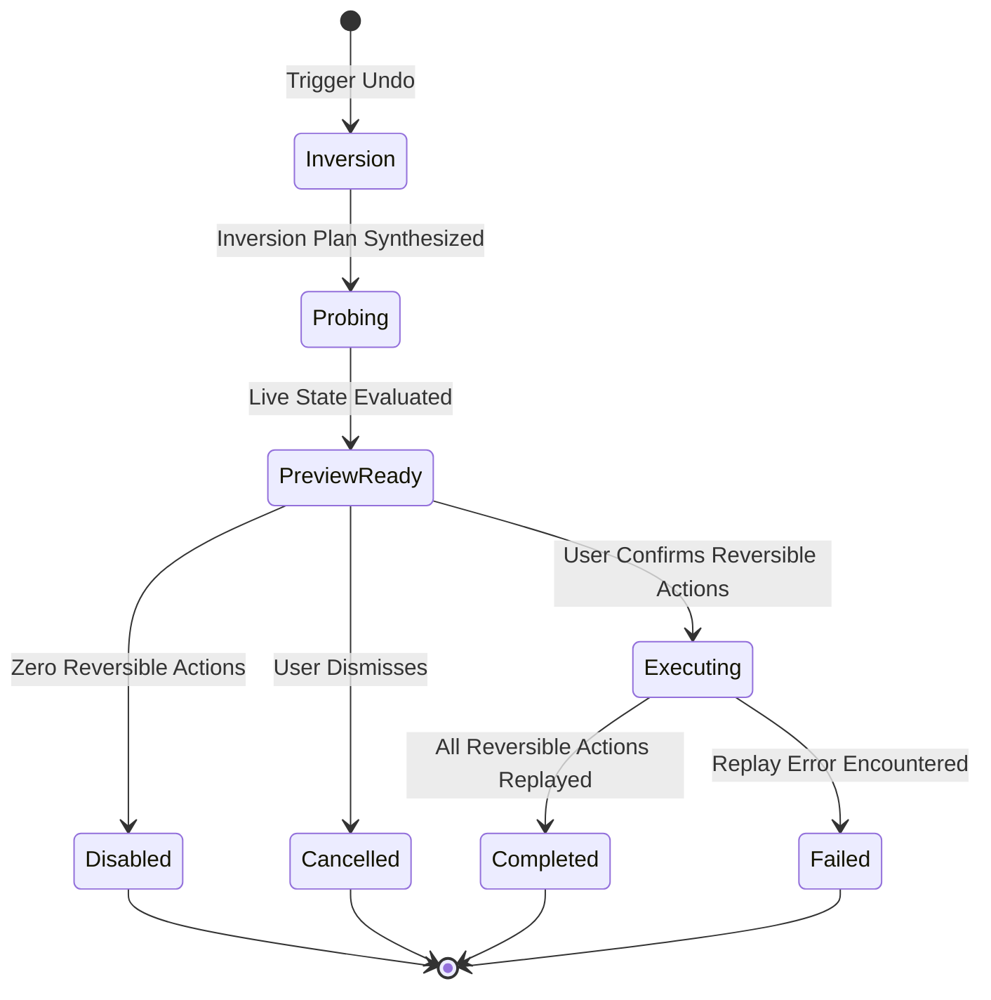

# Model: undo

## Entities

| Entity | Meaning | Key Attributes | Relationships |
| --- | --- | --- | --- |
| `UndoJob` | An executable job instance dedicated to executing an undo plan | `job_id`, `undo_of_job_id`, `state`, `created_at` | References target `Job` via `undo_of_job_id`; owns `CompensatingActionRecord`s |
| `InversionPlan` | The synthesized reverse sequence of compensating actions derived from ledger | `plan_id`, `source_job_id`, `steps` | Derived from `ActionRecord` sequence of source job |
| `ConflictProbeResult` | Result of inspecting live external state against expected snapshot properties | `target_id`, `status` (CLEAN, CONFLICT, UNREACHABLE), `live_payload`, `diff` | Evaluates target object referenced in an `ActionRecord` |
| `UndoPreview` | The tripartite partition of plan items shown to the user | `reversible_items`, `irreversible_items`, `conflict_items`, `can_undo` | Aggregates `InversionPlan` and `ConflictProbeResult`s |
| `CompensatingActionRecord` | Append-only ledger record written during undo execution | `record_id`, `job_id`, `sequence`, `tool_name`, `snapshot_before`, `snapshot_after` | Appended to `desktop-assistant.db` ledger table |

## Invariants

- **INV-UD-01** — Zero Blind Overwrite · Live object state must match recorded `snapshot_after.properties` exactly; any discrepancy or unreachable error blocks automated execution. Rationale: Blind overwriting corrupts third-party concurrent edits and destroys trust. Source: `docs/spec/constitution.md` principle IV, `spikes/SP-9-undo-agent/REPORT.md#0-ket-luan`.
- **INV-UD-02** — Independent Job Lineage · Every undo operation executes as a distinct job possessing its own ledger records and referencing the parent job via `undo_of`. Rationale: Guarantees full auditability and enables arbitrary recursive undo of undo. Source: `spikes/SP-9-undo-agent/REPORT.md#1-tra-loi-tung-cau-hoi` (Q5).
- **INV-UD-03** — Multi-Touch Reference Baseline · For objects modified across multiple steps in a single job, the conflict baseline is strictly the `snapshot_after` of the latest sequential record modifying that object. Rationale: Prevents the job's own intermediate step state changes from registering as third-party conflicts. Source: `spikes/SP-9-undo-agent/REPORT.md#3-dau-vao-cho-tai-lieu-ky-thuat`.
- **INV-UD-04** — Irreversible Control Disable · When a job's candidate action set contains zero reversible steps, undo creation is disabled. Rationale: Avoids generating empty jobs or misleading user expectations. Source: `spikes/SP-9-undo-agent/REPORT.md#1-tra-loi-tung-cau-hoi` (Q6).

## Lifecycle

## Variability

| Variability Point | Level | Extensible By | Contract | Notes (reserved: phase + rationale) |
| --- | --- | --- | --- | --- |
| Platform Conflict Prober | open | Connector Manifest & Adapter | `connector/contracts/connector-manifest@1.0.0` | Adapters supply platform-specific object reader and property extractor |
| Inversion Plan Heuristic | closed | Internal Model Logic | None | Pinned to reverse topological sequencing of recorded ledger actions |
| Conflict Resolution Merge | reserved | Core Pipeline | None | Future phase: interactive 3-way manual field merge (Post-MVP) |

## Physical Resource & Artifact Topology

### 1. Physical Format & Storage
- **Storage Location & Path Layout**: Stored within local SQLite database `desktop-assistant.db` in table `action_records` with `job_id = <undo_job_id>` and table `jobs` with `undo_of = <target_job_id>`.
- **Serialization & Codec Format**: JSON-encoded payload strings for `snapshot_before`, `snapshot_after`, and `arguments`.
- **Physical Resource Budget**: Peak memory budget < 15MB heap resident during conflict diffing; network bandwidth bounded by fetching live target objects (1 HTTP GET per unique modified entity).
- **Lifecycle & Eviction**: Ephemeral preview state retained in memory during dialog interaction and discarded upon dismiss or execution start.

### 2. Physical Storage & Data Schema

This change writes durable data and declares no store of its own: every row an undo produces belongs to a store
another change owns, and duplicating those relations here would create a second definition free to drift from
the first. What it does own are the two shapes that cross the boundary between the window and the process that
holds the ledger, and those are held as files beside the contract that owns them:
[`contracts/undo-pipeline.schema.json`](contracts/undo-pipeline.schema.json) and
[`contracts/undo-pipeline.execute.schema.json`](contracts/undo-pipeline.execute.schema.json). What this model
keeps is what a schema file cannot say: where each thing lands, who owns it, and what is deliberately kept out
of every store.

| Store | Physical schema file | Owning contract | Retention / migration posture |
| --- | --- | --- | --- |
| Compensating action records written while an undo runs | — | `ledger/contracts/ledger-store` | Declared by `req-013-sqlite-ledger`. Append-only and never edited, so an undo is itself a recorded act with its own intent and result records; this is what makes an undo of an undo the same operation applied again rather than a special case |
| Undo job lineage — the undo job and the `undo_of` reference to the job it reverses | — | `job` | The job row's own shape belongs to the `job` capability; the ledger store declares job identity only. **UNVERIFIED**: no change has yet frozen the job store's physical schema, so the column carrying this reference has no file to point at. Whichever change declares that store owns the lineage relation, and INV-UD-02 is the constraint it must carry — an undo job references exactly one source job, and the reference is set at creation and never changed |
| Undo preview | `contracts/undo-pipeline.schema.json` | `undo/contracts/undo-pipeline` | **Not persisted.** Built on demand from the ledger and a live probe, held for the life of the dialogue, and discarded when the user dismisses it or execution starts. Deliberately so: a stored preview would age, and a user confirming an aged preview would be confirming a world that has moved (INV-UD-01) |
| Execution request | `contracts/undo-pipeline.execute.schema.json` | `undo/contracts/undo-pipeline` | **Not stored.** It is what the window sends; what is durable is the undo job it starts and the records that job writes. The request carries positions rather than operations, so nothing about how compensation is performed can enter the system from the window |
| Live platform state read during the conflict probe | — | — | **In no store.** Read once per distinct object, compared, and dropped. Retaining it would mean holding a copy of third-party content whose consent the product cannot account for, and a stale copy would be worse evidence than a fresh read |

### 3. State-to-Artifact Mapping Matrix
| State / Event / Workflow | Physical Artifact / File / Slot | Identifier / Handler / Entry Point | Constraint Notes |
| --- | --- | --- | --- |
| Inversion & Probe | Memory Buffer / Ephemeral State | `UndoPipeline.generatePreview(jobId)` | Completes within < 5s for up to 20 action records |
| Three-Way Preview | UI Modal Dialog Card | `UndoPreviewModal` | Renders clean 3-column or tabbed grouping |
| Execution & Ledger Append | SQLite Ledger (`desktop-assistant.db`) | `JobRunner.execute(undoJobId)` | Strict append-only via `sqlite-ledger` engine |

## Manifest Schema

Not applicable — uses existing `connector/contracts/connector-manifest@1.0.0` with `is_reversible` field.

## Trust Boundary

External platform live data returned during the conflict probe is untrusted. If the API returns unexpected schemas, missing properties, 404 Not Found, 403 Forbidden, or HTTP 5xx errors, the prober fails closed and marks the target object as `CONFLICT` or `UNREACHABLE`. The system never assumes unreadable objects are safe to overwrite.

## Relations

- `ledger/contracts/action-record@1.0.0`: Reads historical actions and snapshots; writes new compensating actions.
- `connector/contracts/connector-manifest@1.0.0`: Reads `is_reversible` flags and tool schemas.
