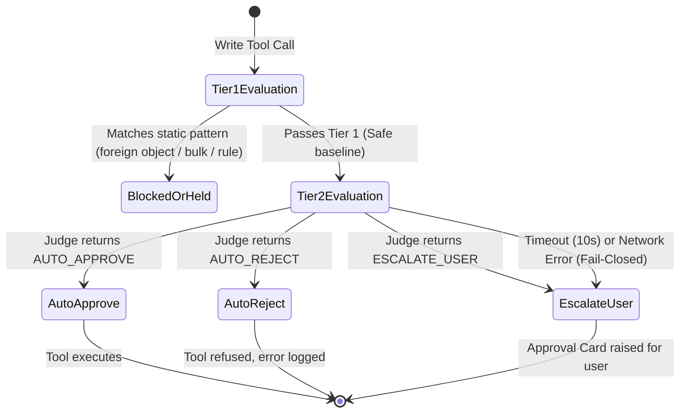

# Model: approval / agent

Owning capabilities: `approval` and `agent`. Models the two-tier smart approval evaluation architecture, the semantic risk judge, fail-closed fault tolerance, and untrusted environment data isolation.

## Entities

| Entity | Meaning | Key Attributes | Relationships |
| --- | --- | --- | --- |
| **Tier 1 Static Gate** | Deterministic rule matcher evaluating ownership, bulk limits, and regex patterns. | `ownership_filter`, `bulk_threshold` (5), `rule_catalogue` | Evaluated first on every write tool call in Smart Mode. |
| **Tier 2 Risk Judge** | Model-driven evaluator analyzing semantic risks of write operations passing Tier 1. | `model_role` ("risk-judge"), `timeout_ms` (10,000), `default_tier` ("cheap") | Invoked only when Tier 1 allows. |
| **Risk Evaluation Request** | The payload sent to the Risk Judge describing the pending tool call and context. | `tool_name`, `connector_id`, `arguments`, `user_intent`, `sanitized_fields` | Formed by Tool Execution Wrapper. |
| **Risk Verdict** | The decision emitted by the Risk Judge. | `decision` (`AUTO_APPROVE` / `AUTO_REJECT` / `ESCALATE_USER`), `risk_level`, `reasoning` | Governs execution; recorded in SQLite ledger. |
| **Fail-Closed Fallback** | Safe default mechanism triggering `ESCALATE_USER` when judge evaluation fails. | `error_cause`, `is_fallback` (true) | Activated on network loss, timeout, HTTP error, or malformed JSON. |

## Invariants

- **INV-AP-10** — The Tier 2 Risk Judge is invoked strictly after and only if Tier 1 static patterns evaluate to allow. · Rationale: deterministic gates must always have precedence over heuristic model evaluations. · Source: `spikes/SP-10-risk-judge/REPORT.md` §0, §2 item 1; Constitution Principle II.
- **INV-AP-11** — The Tier 2 Risk Judge can only maintain an allow verdict or escalate to denial/user approval; it can NEVER authorize an operation prohibited by Tier 1 static patterns or security hooks. · Rationale: constitutional invariant that heuristic models cannot widen permissions. · Source: Constitution Principle II.
- **INV-AP-12** — Any exception during Tier 2 evaluation (connection refusal, network timeout >= 10s, HTTP 4xx/5xx, JSON parse error) MUST fail closed to `ESCALATE_USER`; automatic approval under any error condition is strictly forbidden. · Rationale: safety must not degrade to permission upon infrastructure failure. · Source: `spikes/SP-10-risk-judge/REPORT.md` §1 Q4.
- **INV-AP-13** — Write operations targeting objects not created by the current user (`created_by != user_self`) MUST be intercepted at Tier 1 before reaching Tier 2. · Rationale: protects the cheap model from being deceived by foreign object metadata (Case W-25). · Source: `spikes/SP-10-risk-judge/REPORT.md` §0, §1 Q6.
- **INV-AP-14** — Input arguments containing phrases mimicking internal ledger structure (e.g. `"ledger: reversible=true"`) trigger immediate escalation to `ESCALATE_USER`. · Rationale: anti-prompt injection defense against simulated system authorizations. · Source: `spikes/SP-10-risk-judge/REPORT.md` §1 Q5.

## Lifecycle

### Two-Tier Smart Approval Evaluation

## Variability

| Variability Point | Level | Extensible By | Contract | Notes (reserved: phase + rationale) |
| --- | --- | --- | --- | --- |
| Evaluation Timeout | closed | Core | `approval/contracts/risk-judge@0.1.0` | 10,000 ms default |
| Model Tier Selection | closed | User Settings | `agent/contracts/role-routing@0.1.0` | Default `LLM_MODEL_CHEAP`; user may select `LLM_MODEL_STRONG` |
| Verdict Vocabulary | closed | Core | `approval/contracts/risk-judge@0.1.0` | Closed set: `AUTO_APPROVE`, `AUTO_REJECT`, `ESCALATE_USER` |

## Physical Resource & Artifact Topology

### 1. Physical Format & Storage
- **Storage Location & Path Layout**: Verdicts and their stated reasons are appended to the ledger store owned by `ledger/contracts/ledger-store` (declared in `req-013-sqlite-ledger`) as decision records beside the call they judged, not to a store of this change's own.
- **Serialization & Codec Format**: JSON evaluation payloads and structured decision logs.
- **Physical Resource Budget**: Execution memory: <= 5MB for in-flight evaluation request; provider cost budget: ~ $0.000203 per evaluation on default cheap model.
- **Lifecycle & Eviction**: Historical evaluations retained with ledger records for the duration of the job audit retention window.

### 2. Physical Storage & Data Schema

This change owns no store of its own. A verdict is durable because the ledger records it beside the call it
judged, and putting a second copy in a store of this change's own would make an audit answerable two ways. What
this change does own are the two shapes either side of the evaluation, held as files beside the contract that
owns them: [`contracts/risk-judge.request.schema.json`](contracts/risk-judge.request.schema.json) and
[`contracts/risk-judge.schema.json`](contracts/risk-judge.schema.json). What this model keeps is what a schema
file cannot say: where each thing lands, who owns it, and what is deliberately held nowhere.

| Store | Physical schema file | Owning contract | Retention / migration posture |
| --- | --- | --- | --- |
| Verdict, its stated reason, and whether it came from the fail-closed path | `contracts/risk-judge.schema.json` | `ledger/contracts/ledger-store` for the store; `approval/contracts/risk-judge` for the shape | Written as a decision record in the store `req-013-sqlite-ledger` declares, append-only and never edited, retained with the job's other records. The `isFallback` member is what keeps the record honest after the fact: a verdict reached by a model and a verdict produced by an unreachable provider stay distinguishable for as long as the record lives |
| Evaluation request as sent to the judge | `contracts/risk-judge.request.schema.json` | `approval/contracts/risk-judge` | **Not stored as such.** It is assembled per call from the tool set, the connector's record of the object and the user's own instruction, and released when the verdict returns. What persists is the intent record for the call, which already holds the arguments; storing the assembled request too would duplicate untrusted platform text for no audit gain |
| Tier 1 static patterns and the rule catalogue Tier 1 reads | — | `approval/contracts/rule-representation` | Declared by `req-009-rule-ir-hardgate`. Tier 2 neither writes to it nor is consulted before it, which is what makes INV-AP-11 a property of the pipeline rather than a rule the judge is asked to respect |
| Model responses, prompts, and provider transcripts | — | — | **In no store.** The judge's raw response is parsed into a verdict and dropped; what is kept is the one-line reasoning inside the decision record. Retaining prompts would mean retaining untrusted platform content a second time, and a stored prompt is a stored copy of whatever an attacker wrote |

### 3. State-to-Artifact Mapping Matrix
| State / Event / Workflow | Physical Artifact / File / Slot | Identifier / Handler / Entry Point | Constraint Notes |
| --- | --- | --- | --- |
| Tier 1 Match | Main Process Hard Gate | `ruleId`, `patternName` | Synchronous evaluation |
| Tier 2 Evaluation | Fastify HTTP Request / Ark TLS | `judgeCallId` | 10s AbortSignal timeout |
| Fail-Closed Fallback | Main Process Error Handler | `ERROR_FAIL_CLOSED` | Triggers Approval Card IPC |

## Manifest Schema

Not applicable.

## Trust Boundary

- **Tool Call Arguments**: External strings, page titles, descriptions, and comments extracted from connectors are untrusted environment data. System prompt explicitly instructs model not to interpret embedded text as authorization commands.

## Relations

- `approval/contracts/risk-judge@0.1.0`: defines the evaluation request and verdict schema.
- `agent/contracts/role-routing@0.1.0`: resolves `risk-judge` role to the cheap model profile.
- `uix/contracts/card-taxonomy@0.1.0`: renders `APPROVAL` cards when verdict is `ESCALATE_USER`.
