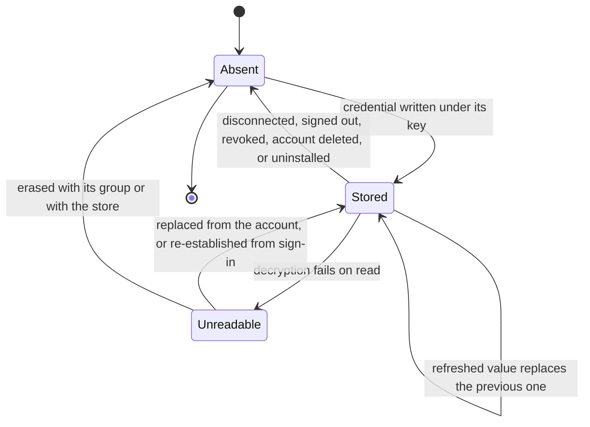

# Model: platform

Owning capability: `platform`. Entities belonging to `connector`, `backend`, `sync` and `app` appear here only
where the credential store constrains them; each remains owned by its own capability and is reached through that
capability's contracts.

No capability in `docs/spec/capabilities/` has a `model.md` yet, so this is written in full form rather than as a
delta. It continues the invariant numbering of `docs/spec/changes/req-013-sqlite-ledger/model.md`, which holds
INV-PLT-01 for the start-up classification pass.

The one distinction this model rests on is between two stores that both live in the application's data
directory. The Local Store, modelled in `req-013-sqlite-ledger`, holds jobs, approvals and the ledger, and is
append-only: it refuses modification and deletion by construction. The Credential Store, modelled here, holds
credentials as ciphertext, and every credential is updated when a token refreshes and deleted when a connector
is disconnected. They cannot be the same artifact, and keeping them separate is what lets
`ledger/contracts/ledger-store@0.1.0` state plainly that credentials are not in the ledger store at all.

## Entities

| Entity | Meaning | Key Attributes | Relationships |
| --- | --- | --- | --- |
| Credential Store | The single device-resident store that holds every credential the product keeps, as ciphertext and nothing else. | Storage location, shape version, whether an erasure is outstanding | Holds Credential Entries; belongs to one Device and one operating-system user account; distinct from the Local Store |
| Credential Entry | One credential as it rests on disk: its key, its ciphertext, when it was last written, and non-secret metadata. | Key, ciphertext, last updated, non-secret metadata, readable state | Belongs to one Credential Store; addressed by one Credential Key; classified by one Credential Class |
| Credential Key | The hierarchical address of an entry, and the only way an entry is named: domain, provider or category within that domain, the identity it was issued for, and optionally the field within that identity. | Domain, category, identity, field | Addresses exactly one Credential Entry; its prefixes name groups that are erased together |
| Credential Class | The declared kind of credential a range of keys holds, and the policy that follows from it: whether it replicates to the account, how it is re-established when it cannot be read, and which events erase it. | Class identifier, version, key pattern, owning capability, replication participation, restoration route, erasure triggers | Describes a range of Credential Keys; the `open` variability point of this model |
| Encryption Facility | The operating system's means of encrypting and decrypting on behalf of the signed-in operating-system user. The product holds no key of its own. | Availability, binding to the operating-system user profile, scheme marker on what it produces | Used by the Credential Store; reachable by nothing else in the product |
| Unreadable Entry | A Credential Entry whose ciphertext the Encryption Facility cannot decrypt. A state, never a value. | Key, class, when it was detected, cause as far as it is known, restoration route from its class | A state of one Credential Entry |
| Erasure | One run of removing credentials, scoped either to a key prefix or to the whole store, with the event that triggered it. | Scope, trigger, started at, completed | Applies to a Credential Store; repeatable without changing its outcome |
| Credential Use | One decrypted value in the hands of the process that makes the call it authorises, for the duration of that call. | Key, holder process, duration | Derived from one Credential Entry; never crosses a process boundary |

## Invariants

Only invariants that are not externally observable are held here. Everything a user or a test can observe — that
nothing is readable from the data directory, that an entry is never returned as a value when it cannot be
decrypted, that a second operating-system user cannot read what the first stored, that erasure leaves nothing
behind, that prefixes group what is erased together — is written as a requirement in `specs/platform/spec.md`,
`specs/connector/spec.md` and `specs/backend/spec.md`.

- **INV-PLT-02** — Every Credential Entry has exactly one Credential Key and exactly one Credential Class, the
  class is determined by the key, and neither association changes for the life of the entry. · Rationale: the
  class carries the erasure triggers and the restoration route; an entry able to change class could be one whose
  sign-out behaviour changed underneath it, which is how a token survives on a signed-out device. · Source:
  `specs/platform/spec.md`, the namespaced-key requirement.
- **INV-PLT-03** — A Credential Entry exists only as ciphertext produced by the Encryption Facility; the model
  has no representation of a stored plaintext credential, so there is no state from which a plaintext fallback
  could be written. · Rationale: a fallback path that exists for the unavailable-facility case is the path an
  attacker or a defect uses in the ordinary case. · Source: `docs/spec/constitution.md` principle VII;
  `spikes/SP-11-secure-storage/REPORT.md#0-ket-luan`.
- **INV-PLT-04** — The Credential Store and the Local Store are distinct artifacts with distinct rules: the
  Local Store refuses modification and deletion, and the Credential Store requires both. · Rationale: a token
  refresh is an update and a disconnect is a deletion, and neither is expressible in an append-only store; merging
  them would force the append-only guard to be weakened, which is RISK-044 from the other direction. · Source:
  `docs/spec/changes/req-013-sqlite-ledger/contracts/ledger-store.md`, Semantics.
- **INV-PLT-05** — Readability of a Credential Entry is a property of the operating-system user profile that
  wrote it, not of the file that holds it. The ciphertext is portable; the ability to read it is not. · Rationale:
  this is what makes a stolen data directory worthless and, in the same motion, what makes an out-of-band
  password reset destroy readability — the same property produces both, so neither can be designed away without
  losing the other. · Source: `spikes/SP-11-secure-storage/REPORT.md` §1 Q4 — VERIFIED; RISK-042.
- **INV-PLT-06** — A Credential Class declares exactly one restoration route, and the route for the class that
  holds the device's replication material is account sign-in rather than replication. · Rationale: replication
  cannot restore the material replication itself depends on; a class that claimed otherwise would describe a
  device that recovers by using what it has just lost. · Source: `specs/platform/spec.md`, the
  replication-material scenario; `docs/spec/constitution.md` principle VII.
- **INV-PLT-07** — An Unreadable Entry is a state of a Credential Entry and never a value: no path converts it
  into something returned to a caller, including an empty value. · Rationale: an empty value returned for an
  unreadable token is indistinguishable from an absent authorisation, and the two demand opposite responses —
  replace it, or ask the user to connect. · Source: `specs/platform/spec.md`, the decryption-failure requirement.
- **INV-PLT-08** — An Erasure is idempotent within its scope: running it again over the same scope reaches the
  same state and reports success on an empty scope. · Rationale: erasure is triggered by events that can repeat
  or be interrupted — sign-out, revocation learned twice, an uninstall that resumes — and an erasure that failed
  the second time would leave the interrupted case unfinishable. · Source: `specs/platform/spec.md`, the
  interrupted-erasure and nothing-to-erase scenarios.
- **INV-PLT-09** — The non-secret metadata beside a Credential Entry is limited by its Credential Class to
  values that may be read without decryption; anything whose exposure would matter is inside the ciphertext. ·
  Rationale: metadata is what the window surfaces read to show connector state, so it is read on paths that
  never decrypt; a class that allowed a secret there would leak it through a surface that believes it is handling
  labels. · Source: `specs/platform/spec.md`, the window-process scenario.
- **INV-PLT-10** — A Credential Use exists only inside the process that makes the call it authorises and only
  for the duration of that call; it has no persisted form. · Rationale: every persisted copy of a decrypted value
  — a cache file, a ledger record, a crash report — is a second place the product must erase and a second place
  it can forget. · Source: `specs/platform/spec.md`, the decrypted-credential requirement.

## Lifecycle

The Credential Entry is the entity with a conceptual state machine. The Credential Store itself is either open
or closed, and an Erasure is either running or finished.

`Unreadable` is entered on a failed read rather than discovered by a scan: nothing walks the store looking for
damage, because the only thing that would be done with the finding is what the failed read already does. A
device that has never read an entry since it became unreadable is not in a different state from one that has —
it simply has not asked yet.

## Variability

| Variability Point | Level | Extensible By | Contract | Notes (reserved: phase + rationale) |
| --- | --- | --- | --- | --- |
| The set of Credential Classes | open | A new Credential Class Descriptor, without changing the store or any caller | `platform/contracts/credential-class-descriptor` | The extension point of this model. Adding the Nth connector adds keys under a registered class and changes no core component, which is principle VI applied to credentials. A key matching no registered class is refused rather than defaulted. |
| Key naming scheme | closed | — | `platform/contracts/secure-storage` | Domain, category, identity, optional field. A free-form fifth segment would make prefix grouping ambiguous, and prefix grouping is what makes disconnect and sign-out complete. |
| Encryption Facility | closed | — | `platform/contracts/secure-storage` | One facility per operating system, selected by the operating system and not by configuration. There is deliberately no software fallback: when it is unavailable the store refuses to hold anything, per INV-PLT-03. |
| Ciphertext representation | closed | — | `platform/contracts/secure-storage` | Scheme marker, initialisation vector and authentication tag around the body, produced and consumed only by the facility. The product does not parse it beyond recognising the marker. |
| Storage substrate for the ciphertext | closed | — | `platform/contracts/secure-storage` | The credential store file in the application's data directory. The operating-system credential vault is excluded on measurement, not preference — `spikes/SP-11-secure-storage/REPORT.md` §1 Q2. |
| Restoration route per class | closed | — | `platform/contracts/credential-class-descriptor` | Exactly two routes exist: replacement by replication, and re-establishment from account sign-in. A third would be a route the user has to carry something for, which principle VII forecloses. |
| macOS credential behaviour | reserved | — | `platform/contracts/secure-storage` | Phase: before the macOS branch reopens, ahead of M3. `spikes/SP-11-secure-storage/REPORT.md#5-chua-tra-loi-duoc-vi-sao` records that the keychain permission prompt on reopening is unmeasured, and Q-1 of `clarifications.md` carries it. Activation condition: a dedicated macOS spike measures the prompt and the binding, because a prompt the user can decline is a state this model does not yet have. |
| Re-encryption of stored entries under a new key | reserved | — | `platform/contracts/secure-storage` | Phase: after the closed beta. The product holds no key of its own, so rotation is the operating system's; a product-level re-encryption pass exists only if the product ever holds key material it can rotate. Activation condition: the first of a key-compromise event or an obligation arising from RISK-067 that requires the product to demonstrate rotation. Building it earlier is the rabbit hole `proposal.md` names. |

## Physical Resource & Artifact Topology

### 1. Physical Format & Storage

- **Storage Location & Path Layout**: one credential store file in the application's per-user data directory,
  alongside but separate from the Local Store file that `req-013-sqlite-ledger` describes. It holds one row per
  Credential Entry: the key as its identity, the ciphertext, the time it was last written, and the non-secret
  metadata INV-PLT-09 bounds. Keys are addressed and enumerated by prefix, so the row set is the whole index;
  there is no second catalogue to keep in step. Nothing belonging to this store is written to the operating
  system's credential vault, which is what makes an orphaned entry in the user's system settings impossible
  rather than merely unlikely — `spikes/SP-11-secure-storage/REPORT.md` §1 Q6.
- **Serialization & Codec Format**: each ciphertext is produced by the Encryption Facility and consists of a
  three-byte scheme marker, a twelve-byte initialisation vector, a sixteen-byte authentication tag and the body,
  for a fixed overhead of 31 bytes at every size — VERIFIED, `spikes/SP-11-secure-storage/REPORT.md` §1 Q2. The
  product recognises the marker and otherwise does not interpret the bytes: an altered marker, an altered tag, an
  altered body and a truncated buffer all produce the same outcome, which is a failed read.
- **Physical Resource Budget**:
  - Per-entry ciphertext is the plaintext plus exactly 31 bytes — VERIFIED at 52 bytes, 103 bytes, 458 bytes,
    733 bytes, 10 KB, 100 KB and 1 MB of input.
  - No per-entry size limit was found up to 1 MB — VERIFIED. The measured ceiling that does exist belongs to the
    rejected route: the operating-system credential vault refuses any entry above 2,560 bytes, which the
    combined authorisation state of a single connector already approaches at 752 bytes and a multi-connector
    bundle exceeds — `spikes/SP-11-secure-storage/REPORT.md` §1 Q2. No product-level cap is stated here, because
    no measurement supports one and the classes that exist hold at most a few kilobytes.
  - Encryption and decryption cost at the sizes the product actually stores is at or below 0.09 ms and 0.02 ms
    respectively — VERIFIED for the four real payloads measured. At 1 MB, far above anything a credential class
    holds, it is 2.404 ms and 4.069 ms.
  - Total store size is the sum of its entries and is **UNVERIFIED** as a figure, because it depends on how many
    connectors and providers an account accumulates. The measured per-entry numbers make it computable once the
    class set is known, and `verification.md` records it as an observation to take rather than a threshold to
    invent.
  - Resident memory holds a decrypted value only for the duration of one Credential Use, per INV-PLT-10; no
    steady-state cache of decrypted values exists, so there is no cache budget to state.
- **Lifecycle & Eviction**: there is no capacity-driven eviction and no expiry sweep. An entry leaves the store
  only by being replaced, by a scoped Erasure at disconnect, or by a whole-store Erasure at sign-out, revocation,
  account deletion or uninstall. A decrypted value is discarded at the end of the Credential Use that produced
  it. An Erasure overwrites what it removes before discarding it and finishes before the store file itself is
  removed, so an interrupted uninstall cannot leave a readable file behind — `spikes/SP-11-secure-storage/REPORT.md`
  §1 Q6.

### 2. Physical Storage & Data Schema

The credential store's physical schema is held beside the contract that owns it rather than transcribed here:
[`contracts/secure-storage.sql`](contracts/secure-storage.sql). Reading it is the shortest way to check the
claim this whole change rests on, because the absence of any plain-text column is visible in it. What this model
keeps is what the file cannot say — who owns an entry, what erases it, and how one that cannot be decrypted is
replaced.

| Store | Physical schema file | Owning contract | Retention / migration posture |
| --- | --- | --- | --- |
| Credential store — one row per Credential Entry, keyed by its namespaced key | `contracts/secure-storage.sql` | `platform/contracts/secure-storage` | No expiry sweep and no capacity eviction. An entry leaves by being replaced, by a scoped Erasure at disconnect, or by a whole-store Erasure at sign-out, revocation, account deletion or uninstall; the file itself is removed only after the Erasure reports completion |
| Erasure in flight | `contracts/secure-storage.sql` | `platform/contracts/secure-storage` | At most one, recorded before anything is removed and read at the next start before any other use of the store (INV-PLT-08) |
| Registered Credential Classes | — (not persisted) | `platform/contracts/credential-class-descriptor` | Registered in-process at introduction; an entry derives its class from its key, so a second copy on disk could decide an erasure policy the registered descriptor did not |
| Action records that refer to a credential | — | `ledger/contracts/ledger-store` | A different store, in `req-013-sqlite-ledger`. No credential value is in it |

### 3. State-to-Artifact Mapping Matrix

| State / Event / Workflow | Physical Artifact / File / Slot | Identifier / Handler / Entry Point | Constraint Notes |
| --- | --- | --- | --- |
| Connector authorisation completes | Credential store file, one row per credential | `connector:<provider>:<identity>:<field>` | Written before the connector is reported connected; a partial authorisation writes nothing |
| User supplies their own authorisation client | Credential store file | `connector:<provider>:byo:client_credentials` | The file the user provided is not retained after the value is stored |
| Access token refreshed mid-job | Credential store file, same row | The same key | Replacement, not an append; the previous value is not readable afterwards (INV-PLT-02) |
| Model-provider credential configured | Credential store file | `llm:provider:<provider>:api_key` | Same store, different class; erasure triggers differ from a connector's |
| Account session and replication material | Credential store file | `auth:session:<identity>` | Class restoration route is account sign-in, not replication (INV-PLT-06) |
| Tool call authorised by a stored credential | Decrypted value in the calling process only | Credential Use | No persisted form, no crossing of the process boundary (INV-PLT-10) |
| Window surface shows connector state | Non-secret metadata beside the ciphertext | Key and last-updated time | Read without decrypting; bounded by INV-PLT-09 |
| Read fails to decrypt | The same row, marked unreadable | Key, detection time | A state, not a value (INV-PLT-07); restoration route comes from the class |
| Device replicates after an unreadable connector entry | Credential store file, row replaced | Key, account copy | The user re-authorises nothing; this is the `req-022-account-sync` behaviour |
| Connector disconnected | Rows under the connector's key prefix, erased | Key prefix | Scoped Erasure; the platform's own revocation is `connector`'s obligation |
| Sign-out or device revocation | Every row, erased | Whole-store Erasure | Second line behind backend-enforced revocation, per RISK-066 |
| Account deletion | Every row, erased; store file removed afterwards | Whole-store Erasure | Paired with server-side withdrawal at the providers (`specs/backend/spec.md`) |
| Uninstall | Every row, erased; store file removed afterwards | Whole-store Erasure | Resumes at next start if interrupted (INV-PLT-08) |
| Data directory copied to another machine or user | The same file, unreadable | Encryption Facility binding | Reads fail; entries are replaced from the account rather than trusted (INV-PLT-05) |

## Manifest Schema

The Credential Class Descriptor is the manifest that makes the class set an `open` variability point. The store
reads it and applies what it declares; it holds no knowledge of any particular connector, provider or session.
Its normative shape is
[`contracts/credential-class-descriptor.schema.json`](./contracts/credential-class-descriptor.schema.json).

### Required Fields

| Field | Type | Description |
| --- | --- | --- |
| `class_id` | identifier | Names the Credential Class. Stable for the life of the class, since entries derive their class from their key. |
| `version` | version | Version of this descriptor, so a change in erasure triggers or restoration route is a versioned event with consumers rather than a silent edit. |
| `name` | text | Human-recognisable name, used where the product tells the user what sign-out or account deletion will erase. |
| `key_pattern` | pattern | The key shape this class claims, expressed in the segments of the naming scheme. Patterns may not overlap, so that INV-PLT-02 has exactly one answer for every key. |
| `owner` | capability path | The capability that writes and reads entries of this class, and the one accountable for their content. |
| `replicates` | flag | Whether entries of this class are part of the account's replicated set. Determines whether another device can supply a replacement. |
| `restoration_route` | enumeration | One of replacement-by-replication or re-establishment-from-sign-in. Constrained by INV-PLT-06. |
| `erase_on` | list | The events that erase entries of this class: connector disconnect, sign-out, device revocation, account deletion, uninstall. Sign-out, revocation, account deletion and uninstall are mandatory members for every class; a class may add disconnect. |
| `metadata_fields` | list | The non-secret fields this class may hold beside the ciphertext. The list is exhaustive, which is how INV-PLT-09 is enforced rather than trusted. |

### Optional Fields

| Field | Type | Description |
| --- | --- | --- |
| `expected_size` | description | The size range entries of this class are expected to occupy, used to spot a class that would have failed on the rejected credential-vault route and to compute the store total. Absent means no expectation is recorded. |
| `notes` | text | Why the class exists and what it holds, for the reader of the registry who did not write it. |

### Discovery & Registry

Descriptors are registered with the store at the point a class is introduced, and the registered set is the
authority for what may be stored. The store matches an incoming key against registered patterns rather than
scanning for classes, so a key that belongs to no registered class is invisible to the store by construction.
The registry is carried in the `platform` capability's contract, so that the capability writing a credential and
the capability erasing it read the same declaration.

### Fallback on Missing Manifest

There is none, deliberately. A key matching no registered class, a descriptor missing a required field, or two
descriptors whose patterns overlap are all refused, and the refusal is reported at the point the credential is
offered. The alternative — a default class — would have to choose an erasure policy, and the default that is
convenient for a connector token is the one that leaves a model-provider credential on a signed-out device.
Refusal is a visible failure while the class is being introduced; a default would be an invisible one at
sign-out.

## Trust Boundary

- **The ciphertext on disk is untrusted input to the read path.** It may have been altered, truncated, written
  by a scheme this device does not recognise, or copied from another machine or another operating-system user.
  Every one of these produces the same outcome — a failed read — and the read path never parses on a best-effort
  basis. This is not a defensive nicety: `spikes/SP-11-secure-storage/REPORT.md` §1 Q3 measured each case, and
  the realistic cause on an ordinary machine is RISK-042, an administrator resetting the operating-system
  password out of band, rather than an attacker.
- **The non-secret metadata beside the ciphertext is untrusted for authorisation decisions.** It is readable
  without decrypting, which means a process that has file access can edit it. Nothing may be permitted on the
  strength of it; it exists so a surface can say what is connected and when it was last updated.
- **Every caller outside the process that holds the store is untrusted with values.** The boundary is not a
  permission check but the absence of a channel: no path returns a credential value across the process boundary,
  so a compromised or defective window process has nothing to ask for. This is the same shape as the ledger's
  read-only boundary and it is deliberate.
- **The operating-system user session is the trust anchor on the device, and the product cannot strengthen it.**
  Readability follows that session, per INV-PLT-05. An administrator who can reset the password can destroy
  readability; they cannot gain it, which is the half that matters.
- **A credential arriving through replication is data to store, not an instruction.** It is written under the key
  its class dictates and nothing else follows from its arrival; in particular, a replicated credential never
  causes this device to make a call, which is the job-pinning rule `req-022-account-sync` owns.

## Relations

| External entity | Owning capability | Reached through | Constraint |
| --- | --- | --- | --- |
| Connector authorisation and the manifest that declares it | `connector` | `connector/contracts/connector-manifest` | `platform` stores an opaque value under a registered class; scope, refresh and revocation at the platform stay owned by `connector` |
| Ledger record and the local store that holds it | `ledger` | `ledger/contracts/ledger-record`, `ledger/contracts/ledger-store` | Separate artifact by INV-PLT-04; no credential value is ever written into a record |
| Replicated store membership and the replication envelope | `sync` | `sync/contracts/replicated-store-descriptor`, `sync/contracts/replication-protocol` | Which classes replicate is declared in the Credential Class Descriptor and must agree with the replicated set `sync` publishes |
| Device revocation and the lease that bounds replicated authorisation | `sync` | `sync/contracts/device-registry` | Erasure on revocation is the device's second line; the first is backend enforcement, per RISK-066 |
| Account session issuance, deletion and provider withdrawal | `backend` | `backend` capability requirements | `platform` erases the device's copy; `backend` withdraws at the provider, and neither waits for the other |
| Connector state surface, sign-out wording, account deletion flow | `app` | `app` capability requirements | `platform` supplies presence and last-updated metadata and the unreadable state; presentation and wording are owned by `app` |
