# Model: ledger

Owning capability: `ledger`. Entities belonging to `job`, `approval`, `connector`, `platform` and `sync` appear
here only where the store constrains them; each remains owned by its own capability and is reached through that
capability's contracts.

No capability has a `model.md` in `docs/spec/capabilities/` yet, so this is written in full form rather than as
a delta. It refines rather than restates the product baseline in
`docs/spec/changes/req-001-mvp-product-definition/model.md`: that model established ActionRecord, Job,
ApprovalRequest and Tool as concepts, and invariants INV-LG-01 to INV-LG-03 over them. This model describes what
the store holding them actually is, and continues the same invariant numbering.

Replication of these records to the account is owned by `sync` and modelled in
`docs/spec/changes/req-022-account-sync/model.md`. What is modelled here is the device-resident store that
replication carries.

## Entities

| Entity | Meaning | Key Attributes | Relationships |
| --- | --- | --- | --- |
| Local Store | The single device-resident store in which the product's working copy lives: its jobs, its approval requests and its action records together. | Storage location, shape version, configuration in force, guard state | Holds Action Records, Jobs and Approval Requests; belongs to one Device and one operating-system user account |
| Action Record | One immutable entry in the history, refining the baseline entity. Its type says what kind of event it accounts for. | Job, position in the job, record type, correlation identifier, originating device, position in that device's sequence, recorded time, content | Belongs to one Job; may reference another Action Record it corrects, answers or announces |
| Record Type | The closed set of things an Action Record can be: intent, result, decision, error, information, removal announcement, superseded version. | Type name, whether it may carry a correlation identifier, whether it may exist without a counterpart | Classifies every Action Record |
| Tool Call | One invocation of a tool, which exists in the store as a pair of Action Records rather than as a row of its own. | Correlation identifier, tool, connector, parameters | Made of one intent record and at most one result record; belongs to one Job |
| Correlation Identifier | The value that joins the two records of one Tool Call and nothing else. | Identifier | Carried by exactly one intent record and at most one result record |
| Snapshot | The state of a target object as it stood at one moment, held whole rather than as a difference. | Target reference, captured state or the reason none could be captured, which side of the call it belongs to | Carried by an intent record (before) or a result record (after); read by an Undo Plan |
| Reconciliation Declaration | The statement of whether a tool's effect can be read back from the platform after the fact, and how. | Method, read operation, comparison basis | Declared by a Tool in its connector manifest; copied into each intent record for that Tool |
| Unresolved Intent | An intent record with no result record carrying its correlation identifier. Not stored as such: it is what the store answers when asked. | Derived set | Derived from Action Records; read by the Recovery Pass |
| Recovery Pass | The work done at a start to establish what interrupted Tool Calls actually did. Exists in two parts that run at different times. | Part (local classification, external reconciliation), start it belongs to | Reads Unresolved Intents; changes Job state; appends Action Records when an outcome is established |
| Immutability Guard | The store's own refusal to modify or delete an Action Record, present in the store's definition rather than in the code that writes to it. | Guarded records, refusal message | Belongs to the Local Store; applies to every process that opens it |
| Retention Window | The period for which Action Records are kept before they become eligible to be removed. | Period, whether user-configurable | Belongs to the Account; governs Action Records on every device and the backend |
| Removal Announcement | The Action Record appended before records are removed, stating what is going and why, so a gap in the history is explained by the history. | Range removed, reason, requester | Precedes the removal it announces; itself an Action Record and not removable by the removal it announces |
| Store Shape Version | The marker on the Local Store saying which shape its records are held in, so a product version knows what it is opening. | Version, target version of the running product | Belongs to the Local Store; advanced by a Shape Change |
| Shape Change | One whole step that moves the Local Store from one shape to the next without rewriting the records it already holds. | From version, to version, whether it adds or restructures | Applies to the Local Store; refused if it would rewrite history |

## Invariants

Only invariants that no interface exposes are held here. Everything a user or a test can observe — the record
pair, the engine-level refusal, listability of unresolved intents, whole-record removal, shape changes that
leave history alone, the recovery states and the classification that precedes the first window — is written as a
requirement in `specs/ledger/spec.md`, `specs/job/spec.md` and `specs/platform/spec.md`.

- **INV-LG-04** — A correlation identifier is carried by exactly one intent record and by at most one result
  record, and is never reused by a second Tool Call. · Rationale: INV-LG-01 makes the pair the representation of
  a call; a reused identifier would make two calls indistinguishable exactly when recovery needs to tell them
  apart, and would let one call's result close another call's intent. · Source: `specs/ledger/spec.md`, the
  requirement that one tool call is two records.
- **INV-LG-05** — The Reconciliation Declaration held by an intent record is a copy taken when the record was
  written, never a reference resolved when the record is read. · Rationale: manifests change between the call
  and the recovery, and a declaration resolved late would let a later edit decide how an old interrupted call is
  treated — which for a tool that sends a message is the difference between asking the user and sending it
  twice. · Source: `docs/spec/changes/req-013-sqlite-ledger/clarifications.md` Q-3; RISK-045.
- **INV-LG-06** — The Immutability Guard belongs to the Local Store's own definition, not to the code that
  writes records, and the only operation permitted to set it aside is one that restores it inside the same
  transaction. · Rationale: a guard that lives in the writing path protects only against that path, and an
  operation that can leave it off leaves the store unguarded for every later writer. · Source:
  `spikes/SP-12-sqlite-ledger/REPORT.md` §1 Q2 and §1 Q6 — VERIFIED.
- **INV-LG-07** — A Removal Announcement precedes in record order every removal it announces, and is never
  within the range it announces. · Rationale: an announcement removed by its own removal would leave the gap it
  exists to explain. · Source: `docs/spec/changes/req-013-sqlite-ledger/clarifications.md` Q-4.
- **INV-LG-08** — The Store Shape Version advances only forward and only in whole steps, and every step leaves
  the records written before it readable by the version that follows. · Rationale: the store is the only copy of
  what the product did on this device; a step that half-applies, or that makes older records unreadable, loses
  history without removing it. · Source: `spikes/SP-12-sqlite-ledger/REPORT.md` §1 Q6 — VERIFIED.
- **INV-LG-09** — The position an Action Record holds in its originating device's sequence is assigned when the
  record is written and is never recomputed, including when the record is replicated. · Rationale: the position
  is the ordering basis that undo and the readable history depend on, and recomputing it on a replica would make
  two devices read the same history in different orders. · Source:
  `docs/spec/changes/req-022-account-sync/clarifications.md` Q-2; INV-SYNC-05; RISK-068.
- **INV-LG-10** — A record's content is fixed at write time; anything the product later learns about that event
  is a new record referencing it, including a result established by reconciliation rather than observed. ·
  Rationale: this is what makes the reconciled result honest — the history says the outcome was inferred from
  the platform's later state rather than seen, which is a materially weaker claim and must not be presentable as
  the stronger one. · Source: `docs/spec/constitution.md` principle III; `specs/job/spec.md`, the reconciliation
  scenarios.
- **INV-JOB-04** — A Job holding an Unresolved Intent has no resumable step: it cannot become `running` until
  that intent has a result record, a user confirmation, or a recorded failure. · Rationale: resuming past an
  unresolved intent is precisely how a tool call is made twice, which is the failure the whole two-record model
  exists to prevent. · Source: `specs/job/spec.md`, the crash requirement.
- **INV-PLT-01** — The local classification part of the Recovery Pass writes Job state only and never writes an
  Action Record, so running it again after an interruption reaches the same classification. · Rationale: it runs
  before the first window, when nothing has yet been shown to the user; if it appended records it would have to
  be correct on the first attempt, whereas being repeatable lets an interrupted start simply start again. ·
  Source: `docs/spec/changes/req-013-sqlite-ledger/clarifications.md` Q-5.

## Lifecycle

The Tool Call is the entity with a conceptual state machine. An Action Record has no lifecycle by construction:
it is written once and thereafter only read, which is INV-LG-10. The Local Store's own lifecycle is a sequence
of Shape Changes governed by INV-LG-08.

```mermaid
stateDiagram-v2
    [*] --> Intended: intent record written, before the call leaves the device
    Intended --> Resolved: result record written after the call returns
    Intended --> Unresolved: process stops before the result is written
    Unresolved --> Reconciling: recovery reads the declaration carried by the intent
    Reconciling --> Resolved: platform state shows the call happened; result appended, marked as reconciled
    Reconciling --> Abandoned: platform state matches the before snapshot; interruption recorded, job fails
    Reconciling --> AwaitingUser: effect cannot be read back, or none is declared
    Reconciling --> Unresolved: platform cannot be reached; nothing is assumed and nothing is repeated
    AwaitingUser --> Resolved: user states the call happened; their decision is recorded
    AwaitingUser --> Abandoned: user states it did not
    Resolved --> [*]
    Abandoned --> [*]
```

`Reconciling` is where the Job is `recovering`; `AwaitingUser` is where it is `waiting_user_confirmation`. The
edge from `Reconciling` back to `Unresolved` is the offline case and is deliberately a loop rather than a
failure: an unreachable platform is not evidence about what happened.

## Variability

| Variability Point | Level | Extensible By | Contract | Notes (reserved: phase + rationale) |
| --- | --- | --- | --- | --- |
| Whether and how a tool's effect can be read back after a crash | open | A new tool declaring its own method in its connector manifest, without any change to recovery | `job/contracts/tool-reconciliation` | The extension point of this model. An absent declaration is read as "cannot be read back" rather than defaulted to a readback, because the unsafe direction here sends a message twice. |
| The set of record types | closed | — | `ledger/contracts/ledger-record` | Seven types. A new kind of event is a change, because every reader of the history — undo, the job detail page, replication — decides what it may do from the type. |
| Where immutability is enforced | closed | — | `ledger/contracts/ledger-store` | In the store's own definition, per INV-LG-06. No configuration relaxes it; the retention path is an operation, not a setting. |
| The store's host process | closed | — | `ledger/contracts/ledger-store` | One process opens the store; every other part of the product reaches it through the contract. Opening a second writer is not an extension point. |
| Retention period | closed | — | `ledger/contracts/ledger-store` | The value is user-configurable within the bounds the `ledger` spec states; what is closed is that expiry and deliberate deletion are the only two ways records leave. |
| Snapshot payload encoding | reserved | — | `ledger/contracts/ledger-record` | Phase: after the account-total sizing that SP-22 owns. `spikes/SP-12-sqlite-ledger/REPORT.md` §1 Q5 measured a 44.5 percent reduction from general-purpose compression and deliberately left it unapplied, because 12.36 MB to 30.83 MB per device over 90 days does not justify losing direct readability of the store. Activation condition: a measured account total or transfer volume that does — the same condition `req-022-account-sync` records against its own compression slot, so the two activate together rather than diverging. |
| Where the store file lives | closed | — | `ledger/contracts/ledger-store` | The per-user application data directory. Making this configurable would put the history somewhere the product cannot guarantee the permissions RISK-044 depends on. |

## Physical Resource & Artifact Topology

### 1. Physical Format & Storage

- **Storage Location & Path Layout**: one store file in the product's per-user application data directory —
  `%APPDATA%\<product>\` on Windows and the equivalent per-user application support directory on macOS — with
  the write-ahead companion files the store maintains alongside it. It is never placed inside the installed
  application directory, which a standard user cannot write to, and never in a location shared between
  operating-system user accounts, because the credentials the records refer to are encrypted per user
  (`spikes/SP-11-secure-storage/REPORT.md`, and RISK-043 which is resolved on that basis). Credentials
  themselves are never in this file: they live in the operating system's secure storage, reached through
  `platform/contracts/secure-storage`.
- **Serialization & Codec Format**: each Action Record is a row of named fields; parameters, outcome and both
  Snapshots are held as structured text carrying the complete object state, uncompressed, per
  `docs/spec/changes/req-013-sqlite-ledger/clarifications.md` Q-2. The store is configured for write-ahead
  logging with the ordinary durability setting and with referential integrity enforced, which is the
  configuration the crash injection actually ran against —
  `spikes/SP-12-sqlite-ledger/REPORT.md#3-dau-vao-cho-tai-lieu-ky-thuat` item 2 — and it carries an index on
  descending recorded time, which took the recent-jobs query from roughly 30 ms to under 1 ms in the same
  measurement.
- **Physical Resource Budget**: **VERIFIED** from `spikes/SP-12-sqlite-ledger/REPORT.md` §1 Q5, measured over a
  simulated 90-day retention period on both ext4 and NTFS with realistic platform payloads:

  | Measure | 20 jobs per day (1,800 jobs) | 50 jobs per day (4,500 jobs) |
  | --- | --- | --- |
  | Store file | 12.36 MB | 30.83 MB |
  | Action records | 5,400 | 13,500 |
  | Average per job | ~7.0 KB | ~7.0 KB |
  | Average per record | ~2.4 KB | ~2.4 KB |
  | One job's detail, p50 | 0.25 ms | 0.13 ms |
  | One job's detail, p99 | 0.77 ms | 0.29 ms |
  | Write-ahead file after checkpoint | 0 bytes | 0 bytes |

  Two quantities are **UNVERIFIED** and are not invented here: the account total across devices, which RISK-069
  records and `req-022-account-sync` owns; and the duration of the local classification pass against a store
  holding a full retention period, which is the open question Q-6 in this change's clarifications. Resident
  memory is bounded structurally rather than numerically: the store is read by query rather than loaded, and the
  classification pass reads only unresolved intents, so neither requires the history to be resident.
- **Lifecycle & Eviction**: there is no capacity-driven eviction. Records leave only by retention expiry and by
  deliberate deletion, each announced first (INV-LG-07), and the image extracts a record references are removed
  with it. The write-ahead companion returns to nothing at checkpoint, so the store does not grow through use
  alone. The store is closed before any maintenance that moves or replaces the file, because one supported
  operating system refuses to remove a file that is still open.

### 2. Physical Storage & Data Schema

The Local Store's physical schema is held as a file beside the contract that owns it, rather than transcribed
here: [`contracts/ledger-store.sql`](contracts/ledger-store.sql). The record shape it stores as structured text
is [`contracts/ledger-record.schema.json`](contracts/ledger-record.schema.json). What this model keeps is what a
schema file cannot say — who owns each relation, what leaves and when, and how the shape moves.

| Store | Physical schema file | Owning contract | Retention / migration posture |
| --- | --- | --- | --- |
| Local Store — action records, the immutability guard, the derived unresolved-intent set | `contracts/ledger-store.sql` | `ledger/contracts/ledger-store` | Records leave only by retention expiry and by deliberate deletion, each announced first (INV-LG-07) and each all-or-nothing. The shape advances one whole step at a time and never rewrites a record already written (INV-LG-08); an additive step leaves earlier records with no value for the new field rather than backfilling one |
| Action Record content | `contracts/ledger-record.schema.json` | `ledger/contracts/ledger-record` | Fixed at write time (INV-LG-10). A record whose type a later version does not understand is presented as an unintelligible step and never removed or rewritten |
| Job and Approval Request rows, in the same store file | — | `job`, `approval` | Not declared by this change: the ledger's schema file carries only the job identity its foreign key rests on, so the two are not specified twice |
| Credentials the records refer to | — | `platform/contracts/secure-storage` | Never in this store. They are held in the device's credential store, whose own schema is `req-012-secure-storage` |

### 3. State-to-Artifact Mapping Matrix

| State / Event / Workflow | Physical Artifact / File / Slot | Identifier / Handler / Entry Point | Constraint Notes |
| --- | --- | --- | --- |
| A tool call is about to be made | Store file, one appended intent record | Correlation identifier, job, device sequence position | Committed to durable storage before the call leaves the device; a failed write stops the call |
| The call returns | Store file, one appended result record | Same correlation identifier | Never written by editing the intent record (INV-LG-10) |
| Process stops mid-call | Store file as it stands | Unresolved-intent query | The unresolved intent is the recorded state, not an error condition |
| Start after an interruption | Store file, read; job rows, written | Local classification part of the Recovery Pass | Writes job state only (INV-PLT-01); needs no network; precedes the first window |
| Outcome established from the platform | Store file, one appended result or error record | External reconciliation part of the Recovery Pass | Marked as established by reconciliation, never presented as directly observed |
| Outcome established by the user | Store file, one appended decision record | User confirmation on the waiting job | The user's statement is not later overwritten by a reconciliation |
| Human decision on an approval | Store file, one appended decision record | Approval request identifier | Decision records are ordinary records and carry the same guard |
| Retention expiry or deliberate deletion | Store file: one appended announcement, then whole rows removed | Retention window, or the user's request | Atomic: all of the stated range or none; the guard is restored inside the same transaction (INV-LG-06) |
| Product version changes the store's shape | Store file, shape version marker advanced | Shape Change | Adds fields without backfilling; refuses to rewrite historical records |
| Replication of a record to the account | Store file read; the record's envelope sent | `sync/contracts/replication-protocol` | Position and identifiers are those assigned at write time (INV-LG-09) |
| Native component load at start | Native component file on disk beside the packaged archive | Operating-system loader | Must exist as a file, not only inside the archive, or the store cannot be opened at all |

## Manifest Schema

The Reconciliation Declaration is the manifest entry that makes recovery extensible. It is not a manifest of its
own: it is a field of the tool declaration that `connector/contracts/connector-manifest` already defines, and
`job/contracts/tool-reconciliation` specifies its shape and meaning. Recovery reads what the declaration says
and holds no knowledge of any particular tool or platform.
Its normative shape is
[`contracts/tool-reconciliation.schema.json`](./contracts/tool-reconciliation.schema.json).

### Required Fields

| Field | Type | Description |
| --- | --- | --- |
| `method` | enumeration | `readback` when the platform can be asked what the object looks like now, `none` when it cannot. There is no third value: an effect is either observable after the fact or it is not. |
| `read_operation` | reference | For `readback`, the tool's own read operation that recovery calls to observe the target. Required when `method` is `readback`, absent otherwise. |
| `comparison` | declaration | For `readback`, what recovery compares to decide the outcome: which part of the read result is set against the before snapshot and against what the call intended. Required when `method` is `readback`. |

### Optional Fields

| Field | Type | Description |
| --- | --- | --- |
| `ambiguous_outcome` | enumeration | What to conclude when the read succeeds but matches neither the before snapshot nor the intended result — for example because a third party edited the object in between. Absent means the safe reading: treat it as undetermined and ask the user. |
| `reason` | text | Why a tool declares `none`, shown to the user in the confirmation card so the question they are asked is answerable. Absent means the product asks in general terms. |

### Discovery & Registry

Declarations arrive with the connector manifest that declares the tool, and are registered when that manifest is
loaded. Recovery never scans for them: it reads the copy carried by the intent record (INV-LG-05). This is what
lets a connector be added without editing the recovery engine, which principle VI requires, and what makes an
interrupted call from an uninstalled connector still recoverable.

### Fallback on Missing Manifest

A tool whose declaration is absent, malformed, or names a read operation the connector does not offer is treated
as `none` — its effect is presumed unobservable and the user is asked. This is deliberately not a refusal at
load time and deliberately not a default of `readback`. Refusing to load would take the connector away over a
field that matters only after a crash; defaulting to `readback` would call a read operation that may not exist
and, worse, would let a missing field decide that a message was safe to reconcile automatically. The fallback
therefore costs a question to the user in a rare case, which is the cheap direction of the error.

## Trust Boundary

- **The store file is reachable by anything running as the user.** The Immutability Guard refuses modification
  and deletion to every process that opens the store, including tools that are not the product, which was
  measured — `spikes/SP-12-sqlite-ledger/REPORT.md` §1 Q2. What it does not stop is a process with file-system
  write access removing the guard itself or overwriting the file's bytes, which is RISK-044 and is open. The
  boundary that remains is the operating system's: the store lives in a per-user directory the application owns,
  and the store is never exposed on a network port.
- **The platform's answer during reconciliation is untrusted input, not an oracle.** It is read after an
  unknown interval during which anything may have changed the object, including a third party. A read that
  matches neither the before snapshot nor the intended result is undetermined and is escalated to the user; it
  is never rounded to the nearer of the two. RISK-038 records a related measurement from another platform —
  timestamps rounded to the minute hide a same-minute third-party edit — which is why the comparison is declared
  per tool rather than assumed to be a timestamp check.
- **Record content is data, never instruction.** Parameters, outcomes and snapshots hold text fetched from
  platforms and typed by the user, per the constitution's External Content Is Data section. Reading the history
  — to present it, to plan an undo, to reconcile after a crash — never treats that content as an instruction and
  never lets it widen what an operation may do.
- **A record arriving through replication is untrusted by the receiving device**, and is reconciled rather than
  applied. That boundary is owned by `sync`; what this model fixes is that such a record cannot displace one
  already held, since the guard refuses it on the receiving side too.
- **The user's confirmation outranks a later inference.** Once the user has stated what happened to an operation
  that could not be read back, a subsequent reconciliation does not overwrite it, because the user is the only
  party with evidence in that case.

## Relations

| External entity | Owning capability | Reached through | Constraint |
| --- | --- | --- | --- |
| Job and its execution state | `job` | `job/contracts/job-record` | The ledger records what a job did and never drives it; job state changes as a consequence of records, not the other way round |
| Tool declaration and its reconciliation method | `connector` | `connector/contracts/connector-manifest` | The ledger copies the declaration at write time and never resolves it later (INV-LG-05) |
| Recovery outcome for an interrupted call | `job` | `job/contracts/tool-reconciliation` | The contract this change introduces; recovery reads the declaration and never holds tool-specific knowledge |
| Approval request and its decision | `approval` | `approval/contracts/gate-evaluation` | A decision is an ordinary Action Record; the gate decides, the ledger records |
| Undo plan built from snapshots | `undo` | `ledger/contracts/ledger-record` | Undo reads records and appends its own as a new job; it never edits the records it is compensating |
| Replication of records to the account | `sync` | `sync/contracts/replication-protocol` | Append-and-reconcile only; identifiers and sequence positions are those assigned at write time |
| Operating-system secure storage | `platform` | `platform/contracts/secure-storage` | Credentials the records refer to are held there and never in the store file |
| The store's location, packaging and start sequence | `platform` | `specs/platform/spec.md` in this change | The store cannot be opened at all unless the native component is a file on disk, which makes packaging a precondition of principle III rather than a detail |
