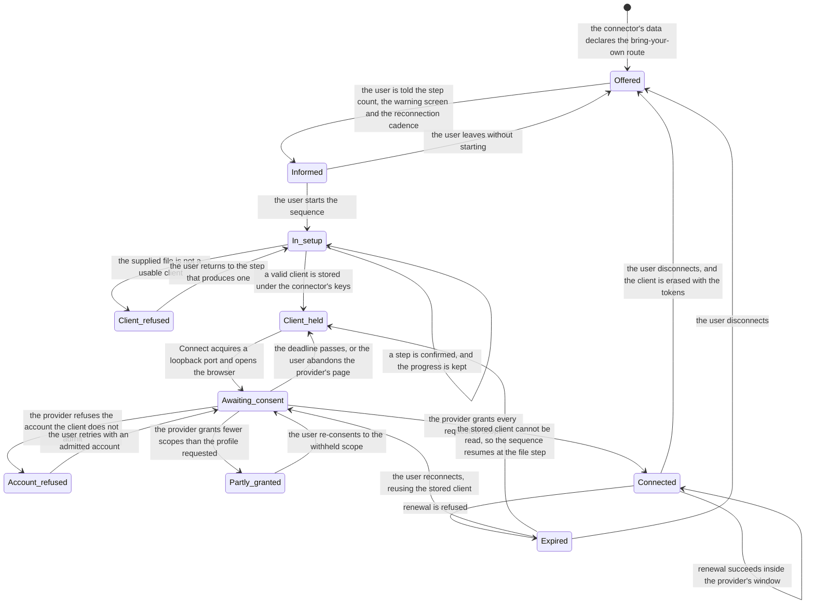

# Model: connector

This change adds no capability. It is the second concrete platform expressed inside the shape
`req-019-connector-framework` established, and the first one that connects by a route the product does not own:
the authorisation client belongs to the user, is created by them in the provider's console, and is held by the
product as the user's property rather than as a product secret.

The delta form is not used: the `connector` capability has no living `model.md` yet, and everything below is an
addition to the shape `req-019-connector-framework` publishes rather than a modification of it. Two of its
entities are refinements of entities that shape already names — an authorisation grant that carries the client it
was issued under, and a connection state whose expiry has a known cadence — and they are written here as what
this platform makes of them, not as replacements.

Nothing below is read by the job manager, the evaluator, the ledger or the tool generator. Where the measured
platform demanded knowledge the frozen manifest could not carry, the answer is a descriptor published beside the
manifest and reviewed as data, which is the shape `req-003-notion-compensation` established for platform rules
and the reason `connector/contracts/connector-manifest@1.1.0` is read here rather than amended.

## Entities

| Entity | Meaning | Key Attributes | Relationships |
| --- | --- | --- | --- |
| **User-supplied authorisation client** | The authorisation client the user created in the provider's console and handed to the product. It is the user's property, not the product's, and it is what every request on this route is made under. | client identity; client secret, which is not confidential for a client of this kind; the client kind the provider issued it as; the provider it belongs to; the instant it was supplied | One per connector per account. Held through `platform/contracts/secure-storage@0.1.0` under the connector's keys; replicated with the account under `sync/contracts/replicated-store-descriptor@0.1.0`. Erased with the connector's authorisation. |
| **Setup guide descriptor** | The ordered sequence a platform declares for creating an authorisation client: what the user does, where, and what they confirm before moving on. It is data, so the application that renders it knows no platform. | connector identity; ordered steps; the warning the user is given before the first step; the words used when the route stops working | One per connector offering this route. Published as `connector/contracts/byo-setup-guide@0.1.0`. Rendered by `app`; never interpreted by the connector. |
| **Setup step** | One unit of the sequence: an instruction, optionally a provider page to open and an illustration, and the confirmation that closes it. | step identity; title; body; provider page address; illustration reference; what closes the step — a confirmation, a supplied file, or a completed consent | Belongs to one guide descriptor. The step that accepts the credential file is the only one that changes stored state. |
| **Setup progress** | How far through the sequence one user has reached on this account, so that the sequence survives the window being closed. | connector identity; the last step confirmed; the instant | One per connector per account while the sequence is unfinished. Discarded when the connector reaches connected, and when the user abandons the route. |
| **Loopback authorisation session** | The short-lived fact that this device is waiting for one particular redirect: the port it acquired, the value that binds the redirect to this request, the proof of possession for the exchange, and the moment it stops waiting. | the acquired port; the binding value; the proof key; the requested scopes; the deadline | Exists only between Connect and its deadline, in memory, on one device. Produces at most one authorisation grant. Never replicated, never written down. |
| **Authorisation grant under a user's client** | What the provider issued: the tokens, the scopes it actually granted, and the client it was issued under. | reference into the credential store; granted scopes; access expiry; the profile requested; the client identity it was issued under | A refinement of the framework's authorisation grant. Bound to the client that obtained it: replacing the client discards it. |
| **Granted-scope comparison** | What was asked for set against what was granted, because this provider lets the user grant part of a request. | requested scopes per capability; granted scopes; the capabilities left unavailable | Made at the end of every consent. Decides whether the connector is connected or short of permission. |
| **Renewal refusal** | The provider declining to renew an authorisation, held as an observation rather than as a verdict about the user. | the instant; the provider's own code and message; whether the device could reach the provider at all | Moves a connection state to expired. Distinguished from an unreachable provider, which establishes nothing. |
| **Unverified-client lifetime expectation** | What the product expects of an authorisation obtained through a client the provider has not verified: that it stops working on a fixed cadence, and that the remedy is one consent. | the cadence the provider applies; the instant the current authorisation was granted; the instant it is expected to stop working | Belongs to one authorisation grant. Used to warn before setup and to explain an expiry afterwards, never to pre-emptively expire an authorisation the provider still accepts. |
| **Content route** | How one kind of file becomes text an agent can read: whether it is exported or downloaded, into what form, and up to what size. | the file kind; the route; the form produced; the ceiling and whose ceiling it is | One per file kind. Published as `connector/contracts/drive-content-projection@0.1.0`. A kind with no route is unsupported, which is a statement rather than a gap. |
| **Content read outcome** | What one read produced: the content, or the reason it produced none, in terms a user can act on. | the file reference; the route taken; the produced size; the outcome — content, too large, unsupported kind, or platform refusal | Produced per read. The reason travels into the job's account of itself and into the ledger record of the call. |

## Invariants

Externally observable truths are requirements in `specs/`. What follows is structural — true of the shape rather
than established by watching the product behave.

- **INV-GG-01** — On this route the product holds no authorisation client of its own. What is stored is the
  user's client, under the user's account, and the product's own client for this provider is not present in the
  flow at any point. · Rationale: the route exists precisely because the product's own client cannot yet be used
  for this provider at mass-market scale; a flow that quietly fell back to it would be using an authorisation the
  provider has not granted for that purpose. · Source: `spikes/SP-13-byo-oauth-google/REPORT.md#2-tac-dong-len-adr-prd`.
- **INV-GG-02** — A supplied authorisation client is either validated and stored whole, or refused and not stored
  at all. There is no state in which a partially usable client is held. · Rationale: a client stored but unusable
  produces a failure in the browser, after the user has left the application, which is the worst place for it. ·
  Source: requirement "A supplied authorisation client is checked before the browser is opened".
- **INV-GG-03** — A loopback authorisation session exists on exactly one device, lives only until its deadline,
  and is never written to disk or replicated. · Rationale: it holds the proof of possession for an exchange; a
  replicated one would be a second device able to complete an authorisation it did not begin.
- **INV-GG-04** — At most one authorisation grant is produced per session, and a redirect carrying a binding
  value the session did not issue produces none. · Rationale: the listener is reachable by anything on the
  machine, so the binding value is the only thing that makes the redirect this device's own.
- **INV-GG-05** — Tokens and the client they were issued under live and die together: replacing the client
  discards the tokens, and erasing the connector erases both. · Rationale: a token outliving its client is
  unusable and indistinguishable from a working one until it is used.
- **INV-GG-06** — What the provider granted is recorded as granted, never inferred from what was requested. ·
  Rationale: this provider's consent screen lets a user grant part of a request, so a requested scope treated as
  a granted one is a tool that fails at the moment a job depends on it. · Source:
  `spikes/SP-13-byo-oauth-google/REPORT.md#1-tra-loi-tung-cau-hoi` Q5.
- **INV-GG-07** — Expiry is an observation carrying the instant it was made and the provider's own words, and an
  unreachable provider produces no observation at all. This is the framework's INV-CN-10 seen on the one route
  where expiry is routine rather than exceptional.
- **INV-GG-08** — The expected lifetime of an authorisation is used to warn and to explain, never to decide. An
  authorisation the provider still accepts stays connected however old it is. · Rationale: the cadence is the
  provider's policy, not a clock the product owns, and a product that expired an authorisation the provider would
  have renewed would be manufacturing the failure it is trying to soften.
- **INV-GG-09** — Every content route is declared, and the adapter reads no file by a route that is not in the
  declared set. · Rationale: an undeclared route is platform knowledge no reviewer can see, which is the erosion
  principle VI forbids.
- **INV-GG-10** — A ceiling belongs to a route and states whose ceiling it is — the product's or the platform's.
  · Rationale: the two behave differently and are remedied differently; collapsing them tells the user the
  platform refused something the product refused.
- **INV-GG-11** — The guide is data and the application renders it. No step of any platform's setup is expressed
  as a screen written for that platform. · Rationale: the Nth platform offering this route must cost a descriptor,
  not an interface change, which is principle VI applied to the one surface that is otherwise tempting to
  special-case.

## Lifecycle

The bring-your-own route adds states before the framework's `Connecting`, and gives `Expired` a cadence. States
named in `req-019-connector-framework`'s model are shown where they join.

`Client_held` is the state that makes reconnection cheap: everything the provider needs is already stored, so the
return from `Expired` is one browser consent rather than a repetition of the console work. `Account_refused` is
deliberately not a failure of the product — the client admits a list of accounts the user themselves wrote, and
the remedy is a step of the guide.

## Variability

| Variability Point | Level | Extensible By | Contract | Notes (reserved: phase + rationale) |
| --- | --- | --- | --- | --- |
| Which platforms offer the bring-your-own route | `open` | A connector declaring the route in its manifest and publishing a guide descriptor | `connector/contracts/byo-setup-guide@0.1.0` | The route is declared per connector under `auth.byo_client` in `connector/contracts/connector-manifest@1.1.0`; nothing in the application branches on which platform it is. |
| The steps of one platform's setup | `open` | A guide descriptor, reviewed as data | `connector/contracts/byo-setup-guide@0.1.0` | Measured content for this provider: six console steps and two in the application — VERIFIED (`spikes/SP-13-byo-oauth-google/REPORT.md#1-tra-loi-tung-cau-hoi` Q7). |
| How a file kind becomes readable content | `open` | A route added to the projection rules | `connector/contracts/drive-content-projection@0.1.0` | A kind with no route is unsupported and says so. Adding a kind is a row and a measurement, never an adapter branch (INV-GG-09). |
| What a user-supplied client must contain to be accepted | `open` | A provider's client shape added to the acceptance rules | `connector/contracts/byo-authorisation-client@0.1.0` | Written from one measured provider. The second provider offering this route is what turns the shape below into a family, and the contract's compatibility rules say what that costs. |
| The redirect strategy | `closed` | — | `connector/contracts/byo-authorisation-client@0.1.0` | A loopback address on a port acquired when Connect starts. Measured as accepted without pre-registration for a desktop-kind client — VERIFIED (Q2). Anything else — a fixed port, an out-of-band code the user copies — is a step back onto the user, which is what this change exists to avoid. |
| Where the exchange happens | `closed` | — | — | On the device for a user's own client; through `backend/contracts/authorisation-broker-api@0.1.0` for the product's client. There is no third arrangement and no fallback between them (INV-GG-01). |
| Where a supplied client is held | `closed` | — | `platform/contracts/secure-storage@0.1.0` | The credential store, under the connector's keys, replicated with the account. The file the user supplied it in is not retained. |
| The verified mass-market channel for this provider | `reserved` | — | — | Phase: when the provider's verification and security-assessment track completes, M2 at the earliest. Rationale: the route specified here exists because that track was deferred on budget, and the product's own client with a narrower scope profile is already expressible in the manifest. Activation condition: the provider verifying the product's own client, at which point this route becomes one of two and a decision is needed about users who already hold their own client. |
| The managed-organisation client type | `reserved` | — | — | Phase: when an organisation account is available to measure on. Rationale: a client created inside a managed organisation may not carry the unverified-client cadence at all, which would remove the reconnection this change is built around. Activation condition: the measurement recorded as Q-1 in `clarifications.md`; until then the product declares the behaviour unknown rather than assuming either answer. |

## Physical Resource & Artifact Topology

### 1. Physical Format & Storage

| Artifact | Format | Where it lives | Budget | Eviction |
| --- | --- | --- | --- | --- |
| The credential file the user supplies | The provider's own client file, as downloaded from its console | Wherever the user saved it; read once by the application and never copied | About four hundred bytes for a client of this kind — VERIFIED (`spikes/SP-11-secure-storage/REPORT.md` §1 Q5) | Not retained: what is kept is the client, written through the credential store; the file is the user's own |
| User-supplied authorisation client | The client identity and secret, as credential-store entries under the connector's keys | `platform/contracts/secure-storage@0.1.0`, replicated encrypted with the account | One entry group per connector per account | Erased on disconnect, on sign-out, on device revocation and on account deletion |
| Authorisation grant | Access token, refresh token, expiry, granted scopes, requested profile, and the client identity it was issued under | The credential store, under the same connector's keys | One per connector per account | Replaced on each renewal; erased with the client |
| Setup guide descriptor and its illustrations | A descriptor validated at load, with image resources beside it | Build resources shipped with the application, beside the connector's manifest | Eight steps and three illustrations for this provider — VERIFIED (`spikes/SP-13-byo-oauth-google/evidence/byo-setup-guide-draft.md`, `consent_flow_diagram.svg`, `ui_unverified_warning.svg`, `ui_scope_consent.svg`) | Lives with the build |
| Setup progress | The connector, the last confirmed step and its instant | The account's local store, replicated with configuration | One record per unfinished setup | Discarded when the connector connects or the user abandons the route |
| Loopback authorisation session | The acquired port, the binding value, the proof key and the deadline | Process memory on the device that started Connect | One at a time per connector | Released at the deadline, on completion, and on abandonment; never written to disk (INV-GG-03) |
| Exported document content | The text form declared for the file kind | A job's working memory, then the agent's context under the connector's content-sanitization declaration | The platform refuses an export above its own ceiling — UNVERIFIED, taken from provider documentation and scheduled for measurement in `verification.md` | Released with the job |
| Downloaded file content | The file's own bytes | A job's working memory while it is turned into text | A stored file of 30,749,685 bytes downloaded successfully — VERIFIED (`spikes/SP-13-byo-oauth-google/evidence/q6_drive_export_read.log`); the ceiling the product applies is lower and is a product decision, recorded in `design.md` | Released as soon as the text form is produced; never held across calls |

### 2. Physical Storage & Data Schema

This change owns three descriptors and no store. What it produces that persists — the user's authorisation client
and the grant issued under it — is written through a store another capability owns, and the shapes this change
does own are held as files beside the contracts that own them rather than transcribed here. What this model keeps
is what a schema file cannot say: whose store each thing is in, what replicates, and what is deliberately never
written at all.

| Store | Physical schema file | Owning contract | Retention / migration posture |
| --- | --- | --- | --- |
| Provider acceptance descriptors, read at load | `contracts/byo-authorisation-client.schema.json` | `connector/contracts/byo-authorisation-client` | Not a store: one descriptor per provider, shipped inside the build that reads it, so there is no mixed-version window. A stored client outlives builds, which is why narrowing the kinds a descriptor admits is MAJOR — a client accepted last month must either keep working or be refused with an explanation, never fail in the browser |
| Setup guide descriptors, read at load | `contracts/byo-setup-guide.schema.json` | `connector/contracts/byo-setup-guide` | Not a store either. A guide that does not satisfy its file makes the route absent rather than partial, and the illustrations beside it live and die with the build |
| Content route tables, read at load | `contracts/drive-content-projection.schema.json` | `connector/contracts/drive-content-projection` | Not a store. Adding a route is additive and requires the evidence the file demands; a row still carrying `unmeasured` is a deliberate marker rather than an omission, and `verification.md` treats clearing them as a condition of done |
| The user's authorisation client and the grant issued under it | — | `platform/contracts/secure-storage` | Never in this change's own store. Written under the connector's keys, replicated encrypted with the account, replaced on each renewal, and erased as a pair on disconnect, on sign-out, on device revocation and on account deletion (INV-GG-05) |
| Setup progress — the last confirmed step | — | `app` | The account's local store, replicated with configuration so the sequence continues where the account left it. Discarded when the connector connects or the user abandons the route; it names a step identity this guide declares, and progress is never recorded against an unknown step |
| Loopback session — acquired port, binding value, proof key, deadline | — | `connector/contracts/byo-authorisation-client` | **Never written down.** Memory on one device for the life of one Connect, released at the deadline, on completion and on abandonment (INV-GG-03). A restart finds no session, and Connect is started again with the client still held |
| The credential file the user chose | — | — | **Not copied, not moved, not retained.** It is the user's own file; what the product keeps is the client it contained, in the credential store |

### 3. State-to-Artifact Mapping Matrix

| State | What exists in the credential store | What exists elsewhere on disk | What exists in memory | What a restart finds |
| --- | --- | --- | --- | --- |
| Offered | Nothing for this connector | Nothing | Nothing | The route offered again |
| In setup | Nothing yet | The setup progress | The step being rendered | The sequence resumed at the last confirmed step |
| Client refused | Nothing | The setup progress, unchanged | The refusal and the step it names | The sequence at the step that produces a correct file |
| Client held | The client, under the connector's keys | The setup progress | Nothing pending | A connector ready to connect, with no console work outstanding |
| Awaiting consent | The client | The setup progress | The loopback session and its listener | No session; Connect must be started again, and the client is still held |
| Partly granted | The client and the grant, with the granted scopes recorded | The account's connector record | The comparison and the capabilities left unavailable | The same, with the state established by asking the provider |
| Connected | The client and the grant | The account's connector record | The connection state and its instant | The same, re-established rather than trusted |
| Expired | The client and the grant, both kept | The account's connector record | The refusal observation | The same; reconnection needs the browser only |
| Disconnected | Nothing | Nothing for this connector | Nothing | The route offered again, from the first step |

## Manifest Schema

This change defines two descriptors and consumes a third. The consumed one is
`connector/contracts/connector-manifest@1.1.0`, unchanged: the route's availability, the guidance caveat and the
scope profile for this channel are all fields it already carries. What follows is what the two new descriptors
mean conceptually; their checkable shapes are in `contracts/`.

### Required Fields

| Descriptor | Field | Meaning |
| --- | --- | --- |
| Setup guide | Connector identity | Which connector's route this guide describes. The pairing is by identity, exactly as an adapter is paired to a manifest, so no field points from one to the other. |
| Setup guide | Preamble | What the user is told before the first step: how many steps, the provider warning screen they will meet, and the reconnection cadence they are accepting. |
| Setup guide | Steps | The ordered sequence. Each carries what to do, what closes it, and — where the step happens on a provider page — the address that page lives at. |
| Setup guide | Expiry words | What the user is told when an authorisation obtained this way stops working, in the same terms as the preamble's warning. |
| Client acceptance | Provider identity | Which provider's client shape is described. |
| Client acceptance | Accepted client kind | The kind of client that can complete the loopback route, and therefore the kind the guide instructs the user to create. |
| Client acceptance | Required identifiers | What must be present in a supplied client for the flow to be possible at all. |
| Client acceptance | Refusal reasons | What is said about each way a client can be unusable, and which guide step remedies it. |
| Content routes | File kind | The platform's own name for a kind of file. |
| Content routes | Route | Whether the kind is exported into another form or downloaded as stored. |
| Content routes | Produced form | What the job receives. |
| Content routes | Ceiling and its owner | The size above which the read is refused, and whether the ceiling is the platform's or the product's. |

### Optional Fields

| Descriptor | Field | Meaning |
| --- | --- | --- |
| Setup guide | Illustration per step | An image resource shipped with the build. A step without one is rendered as text, never as a broken image. |
| Setup guide | Troubleshooting entries | The failures the route is known to produce, each tied to the step that remedies it, so a user who meets one is not left to search. |
| Content routes | Alternative form | A second form the same kind can be exported to when the job asks for it, such as a document rendered rather than flattened to text. |

### Discovery & Registry

Both descriptors are build resources discovered at start-up beside the connector's manifest and validated whole,
exactly as the manifest is. There is no scan of a user directory, no download and no runtime installation. A
connector whose manifest declares the bring-your-own route and whose guide descriptor fails to validate does not
offer the route, and says so with the failing declaration named, rather than offering a route it cannot guide.

### Fallback on Missing Manifest

A connector declaring the route with no guide descriptor falls back to the plain guidance the manifest itself can
carry, and, failing that, does not offer the route at all — the product never invents setup instructions for a
provider's console. A file kind with no content route is unsupported and is reported as such by name. A supplied
client that does not match any accepted shape is refused before the browser opens. In every case the rest of the
product is unaffected: other connectors work, and the connector in question is simply not connectable by this
route.

## Trust Boundary

| Input | Trusted? | Consequence |
| --- | --- | --- |
| The credential file the user supplies | No, as data; secret, as content | Parsed structurally and never executed or interpreted; accepted only if it carries what the route needs and is of the kind that can complete it. Its contents are secret from the moment they are read: they go to the credential store and appear in no log, no diagnostic bundle and no ledger record. |
| The provider's redirect to the loopback listener | No | Anything on the machine can reach the listener. A redirect is acted on only if it carries the binding value this session issued; anything else is discarded silently and changes no state (INV-GG-04). |
| The provider's authorisation and token responses | Partly | Believed as observations with instants attached. What the response says was granted is recorded as granted; what it says about a refusal is quoted, not paraphrased into a product verdict. |
| Everything Drive and Gmail return — message bodies, document text, file bytes | No | Data under the constitution's External Content Is Data section. It may inform what an agent proposes; it may never authorise an act, relax a verdict or alter a rule. The connector declares its sanitization in the manifest. |
| The provider's error text shown to the user | No | Displayed as the provider's words, attributed to the provider, and never used to decide anything. |
| The setup guide descriptor and its illustrations | Yes, as first-party build resources, and only after validating whole | They are authored by the product and shipped in the build. A descriptor that arrived over a channel would be instructions telling a user what to do in their own cloud console, which is not a thing this product will accept from a network. |
| The account the user authorises with | Partly | Recorded as the account the authorisation was issued for, and stated, so that an authorisation granted for a mailbox the user did not intend is visible rather than silent. |

## Relations

- **`platform`** — through `platform/contracts/secure-storage@0.1.0`. The supplied client and every token live
  there, under the credential class `req-012-secure-storage` defines for connector authorisation; this change
  stores nothing itself.
- **`sync`** — through `sync/contracts/replicated-store-descriptor@0.1.0`. The supplied client replicates with the
  account, which is what makes the second device work without console work; the loopback session does not
  replicate and is not a replicated store.
- **`backend`** — by deliberate absence on this route. The broker at
  `backend/contracts/authorisation-broker-api@0.1.0` is not in the path of a user-supplied client (INV-GG-01),
  and this is the one connect route that works while the backend does not.
- **`app`** — the connectors area renders the guide descriptor and holds the setup progress. It reads
  `connector/contracts/byo-setup-guide@0.1.0` and knows no platform.
- **`uix`** — a connector needing the user reaches the dialog surface as a SYSTEM card; the words come from the
  guide descriptor's expiry text, so the interface writes none of them.
- **`agent`** — through `agent/contracts/tool-wrapping@0.1.0`, unchanged. This connector's tools are read tools
  like any others, wrapped in the gate and the ledger obligation before an agent holds them.
- **`approval`** and **`ledger`** — unchanged by this change. Every tool here is a read tool, so no snapshot and
  no compensating action is declared; rules the user has written over read operations still bind, which is the
  framework's requirement and not a property of this platform.
- **`job`** — through `job/contracts/tool-reconciliation@0.1.0`. A read interrupted mid-call is repeated rather
  than reconciled, because it changed nothing.
