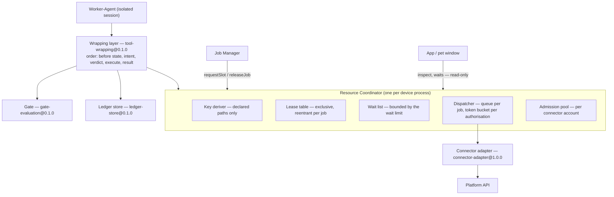

# Design: req-015-concurrency-coordinator

## Context

The product already has a fixed order for a tool call. `agent/contracts/tool-wrapping@0.1.0` states it once:
form the call subject, read the before state when the tool is a reversible write, append the intent record and
wait for it to be durable, evaluate, invoke on `allow`, append the result record. That order is what makes
principles II, III and IV hold for one call in isolation, and it was measured against a real harness in
`spikes/SP-6-pi-sdk/REPORT.md`.

What it does not account for is a second job. `spikes/SP-15-concurrency/REPORT.md` §1 Q2 ran two jobs against
one object with that order in place and reproduced the failure end to end: the second job read its before state
while the first was between its own call and its own result record, recorded a state that was already false, and
the later compensation of the second job restored it — erasing the first job's completed work, which the first
job's history still described as present. The same report measured the two mechanisms that fix it, and where
they must live: one lock manager and one queue, in the process every call passes through, because worker agents
are isolated by design and anything held inside one governs nothing outside it.

Three constraints shape everything below.

1. **The order is not ours to rewrite.** The gate's verdict cannot move ahead of the intent record without
   contradicting a living requirement in `approval` — that a refused call leaves an intent record and a refusal
   record — and the VERIFIED evidence behind it (`spikes/SP-6-pi-sdk/REPORT.md` §1 Q2). So the exclusive span
   has to be fitted around an order in which the before state is read before anyone knows whether the call is
   permitted.
2. **An approval has no time limit.** A person may take an hour. Any design that holds an object exclusively
   across that wait converts one person's deliberation into a product-wide stall, and the 15-second wait limit
   turns the stall into unexplainable failures for unrelated jobs.
3. **Nothing here may learn about a platform.** Principle VI is the reason the coordinator reads declarations
   instead of branching on connector identity, and the reason a missing declaration costs a tool rather than
   being guessed at.

## Goals / Non-Goals

**Goals:**

- Make the before state a ledger record carries true at the moment the call acts on it, under concurrency, on
  one device.
- Keep an interactive job's wait independent of a bulk job's backlog, and keep the bulk job progressing.
- Keep the number of jobs touching one connector account inside the band that was measured to be comfortable.
- Prevent the cross-connector deadlock the spike identified, by construction rather than by detection.
- Add all of this without the coordinator, the job manager or the ledger learning anything about a platform.

**Non-Goals:**

- Exclusivity across devices. Two devices signed in to one account can each believe they hold an object; that is
  the roadmap's own boundary for R12 and a reserved point in `model.md`, and it cannot be closed before
  `req-022-account-sync` settles cross-device ordering.
- Conflict classification at undo time. `spikes/SP-15-concurrency/REPORT.md` §1 Q5 measured that field-level
  comparison detects a same-field dispute with no false negatives while page-level comparison over-reports; that
  finding belongs to `req-010-undo-agent`, which owns conflict classification, and is not restated here.
- Changing how an interrupted call is decided after a crash. That remains
  `job/contracts/tool-reconciliation@0.1.0`.
- A general distributed lock manager, which the proposal names as the rabbit hole of this change.
- Making the concurrency limit a user-facing setting.

## Structure

| Component | Responsibility | Model entity | Reached through |
| --- | --- | --- | --- |
| Resource Coordinator | The one entry point. Derives keys, grants lease sets, admits jobs, dispatches requests. Holds no policy. | Resource Coordinator | `connector/contracts/resource-coordinator@0.1.0` |
| Lease table | Which job holds which key, since when, at what reentrancy depth. One entry per key. | Lease, Lease Set | Internal to the coordinator |
| Wait list | Calls waiting for a lease set, with their limit and the jobs holding what they want. | Wait | Internal; surfaced read-only through `inspect` |
| Key deriver | Turns a call's arguments plus its declaration into canonical keys. The only component that reads a call's arguments, and it reads only the declared paths. | Resource Key, Coordination Declaration | `connector/contracts/coordination-declaration@0.1.0`, carried in `connector/contracts/connector-manifest@1.2.0` |
| Dispatcher | One queue per job per authorisation, rotated; one token bucket per authorisation; the pause a platform asks for. | Dispatch Queue, Pacing Budget | Internal; entered through `dispatch` |
| Admission pool | The concurrency limit per connector account, with a slot reserved for the interactive class. | Admission Slot, Job Class | `requestSlot` on the same contract |
| Wrapping layer | Unchanged in its order. Calls the coordinator at four points: acquire, suspend, resume, release; and wraps its platform call in `dispatch`. | Tool Call | `agent/contracts/tool-wrapping@0.1.0` |
| Job manager | Asks for an admission slot before a job becomes `running`, returns it when the job leaves `running`, classifies a coordinator refusal from its declared code. | — | `job` spec; the same coordinator contract |
| Connector adapter | Unchanged. Reached only from inside `dispatch`. | Connector adapter | `connector/contracts/connector-adapter@1.0.0` |

The mapping to the model is one-to-one on purpose: every component above is one entity, and the entities that
have no component — Resource Key, Job Class — are values rather than things that act.

## Execution Boundary & Protocol Topology

### Communication Channels & Protocols

| Channel / Endpoint / Topic | Direction | Interaction Pattern | Payload Schema | Return Type | Side Effects | Error Handling & Timeout |
| --- | --- | --- | --- | --- | --- | --- |
| `acquire`, `suspend`, `resume`, `release` | Wrapping layer → Coordinator (in-process) | Request-Response | `CoordinatedCall`, `SuspensionToken`, `ResumeInput` | `AcquireOutcome`, `ResumeOutcome` | A lease set is taken or released | `RESOURCE_HELD` after the wait limit, 15 s by default; `STATE_CHANGED` on resume; never throws for contention |
| `dispatch` | Wrapping layer → Coordinator (in-process) | Request-Response, deferred | `CoordinatedCall` and the function to run | Whatever the function returns | One token consumed; the adapter invoked | `CALL_CANCELLED` while queued; a platform-stated delay pauses the whole authorisation |
| `requestSlot`, `releaseJob` | Job manager → Coordinator (in-process) | Request-Response | Job, class, connector, authorisation | `SlotOutcome` | A slot is taken or returned | `SLOT_UNAVAILABLE` — the job stays `queued`; no waiting list is held here |
| `coordinator.inspect` | Window → Coordinator (cross-process) | Request-Response | — | `CoordinatorSnapshot` | None — read-only | `COORDINATOR_UNAVAILABLE`; the surface says so rather than showing idleness |
| `coordinator.waits` | Coordinator → Window (cross-process) | Stream | — | A wait beginning or ending | None | Stream loss is not an error; the surface re-reads |
| Platform request | Adapter → Platform (network) | Request-Response | The platform's own request | The platform's own response | The user's real account changes | Owned by `connector-adapter@1.0.0`; unchanged by this design |

### Execution Boundaries & Isolation

There is one process that owns connectors, the ledger, the gate and now the coordinator; there are window
processes that render; and there are agent sessions that are isolated from one another by
`agent/contracts/agent-session@0.1.0` but live inside the first process. The coordinator is a single instance in
that first process (INV-CN-14), and the boundary is deliberately asymmetric: every mutating operation is
in-process only, and the only thing that crosses to a window is reading.

This asymmetry is the whole security argument for the component. A window that could call `release` could free
another job's lease and reintroduce the measured failure at will; a window that can call `inspect` can only say
"job 3 is changing this page". It mirrors the same choice `ledger/contracts/ledger-store@0.1.0` makes for
appending, and for the same reason.

Recovery when a component stops:

- **An agent session ends or crashes** — the job manager reaches a terminal state for that job and calls
  `releaseJob`, which frees leases, discards queued requests and returns slots. Nothing waits on a session.
- **The owning process stops** — everything the coordinator held ceases to exist (INV-CN-21). The next start
  holds nothing, and interrupted calls are classified from unresolved intent records exactly as they already
  are; the coordinator adds no recovery path of its own and deliberately does not try.
- **A window stops** — nothing happens. It held nothing.

### Trust Boundaries & Input Validation

The untrusted inputs are a call's arguments, a platform's identifiers, and a connector's declared numbers.
Arguments are read only at declared paths, and the key is derived from the same value the adapter will address
(INV-CN-15), so the worst a model can do is name a different object — and then it locks and changes that same
different object, which the gate judges as it would any other. Identifiers are normalised by declared rules that
may merge spellings and may not split an object; a rule that could split is refused at registration. Declared
numbers are clamped to the range the measurement supports, and the clamp is reported rather than silently
applied.

The coordinator performs no rate limiting of its own against a hostile caller and needs none: every caller is
in-process and already inside the gate.

## Decisions

### D1 — The exclusive span is the bracket, and it ends at the result record, not at the platform's answer

- **Choice**: leases are obtained before the before state is read and released when the result record is
  durable. The wrapping layer's four steps are unchanged and now happen inside that span.
- **Rationale**: this is the measured property. `spikes/SP-15-concurrency/REPORT.md` §1 Q2 showed both halves —
  without the span, the second job's recorded before state was false and compensating it destroyed the first
  job's work (`corruptedJobA`); with it, the second job recorded what the first had left and compensation
  preserved it (`preservedJobA`). Ending the span at the platform's answer leaves a smaller version of the same
  window, in which another job reads a state whose result record has not landed.
- **Alternatives Considered**: *ending the span at the platform's answer* — rejected because the remaining
  window is exactly long enough to produce an inconsistent pair of records and short enough to survive testing.
  *Optimistic concurrency, comparing the object at write time* — rejected because the measured platform accepts
  concurrent writes with HTTP 200 and offers no entity tag or precondition header
  (`spikes/SP-15-concurrency/REPORT.md` §1 Q1), so there is nothing to be optimistic against.
  *Serialising all jobs per account* — the proposal's Option B; rejected there for removing the product's
  parallelism.

### D2 — An approval suspends the bracket; the decision re-establishes it and re-compares

- **Choice**: a verdict of `hold` releases the lease set. When the decision arrives, the same keys are obtained
  again and the target is compared with the before state the intent record holds. A match executes. A mismatch
  refuses with `STATE_CHANGED`, and the agent may propose the operation again as a new call.
- **Rationale**: holding across a human's deliberation is the only alternative that keeps a single continuous
  span, and it stalls every other job on that object for as long as the person takes — with the 15-second limit
  converting the stall into failures whose cause is invisible. Re-comparison under the re-established lease
  gives the same guarantee that continuous holding gives: no call executes unless the state its record claims is
  the state that is there. It also closes a failure the spike did not run but its evidence implies — an approval
  that waits while another job writes produces precisely the stale recorded state of §1 Q2, with the user's own
  wait in place of the race. And it has an independent virtue: the user's decision is applied to the object they
  were shown, not to whatever it has since become.
- **Alternatives Considered**: *holding the lease across the wait* — rejected above; it is correct and
  unusable. *Moving the gate's verdict ahead of the intent record, so the bracket starts after the verdict* —
  rejected because it contradicts the living `approval` requirement that a refused call leaves an intent record
  and a refusal record, VERIFIED in `spikes/SP-6-pi-sdk/REPORT.md` §1 Q2, and would erase the history's account
  of what an agent attempted. *Re-snapshotting silently on resume and executing anyway* — rejected because it
  makes the ledger's before state a value that changed after it was written, which INV-LG-10 forbids, and
  because it executes an approval the user gave against a different state. *Appending a second, refreshed intent
  record* — rejected because it gives one call two intent records, which breaks the pair that recovery reads.

### D3 — Keys are derived from declared argument paths, are normalised per connector, and exclude the authorisation

- **Choice**: `<connector>:<type>:<identifier>`, with the identifier read at the path the tool declared and
  normalised by the connector's declared rule.
- **Rationale**: derivation from the declared path makes the locked object and the changed object the same by
  construction. Excluding the authorisation follows from §1 Q1: the platform silently resolves concurrent writes
  from separate callers, so two authorisations reaching one object must contend. Per-connector normalisation
  exists because the measured platform accepts one identifier in two spellings, and two spellings must not
  become two keys.
- **Alternatives Considered**: *a key supplied with the call* — rejected as an untrusted string deciding what is
  protected. *A key per authorisation* — rejected as exclusivity the product believes it has and does not.
  *A key per connector* — correct, and it serialises the product for no correctness gain.

### D4 — Lease sets are obtained whole, in canonical order, and never extended

- **Choice**: every declared resource is acquired in one ordered attempt; a call that needs an undeclared
  resource is refused rather than acquiring late.
- **Rationale**: RISK-049 is a cycle, and a cycle needs both a hold and a wait. Canonical ordering removes the
  cycle; wholeness removes the hold-while-waiting, which also stops a waiting call from withholding a free
  resource from everyone else. The spike names either mitigation; taking both costs nothing and removes the
  class rather than an instance.
- **Alternatives Considered**: *ordering alone, acquiring as the call discovers resources* — rejected because
  ordering only prevents cycles if nothing acquires after it has begun, which is a rule about code rather than a
  property of the design. *Deadlock detection with a victim* — rejected as a mechanism that has to be right at
  the moment everything else is already wrong, for a product whose lock graph is a handful of entries.

### D5 — Fairness is specified as a property; the mechanism is round-robin over per-job queues behind a token bucket

- **Choice**: the requirement states that a job's wait does not grow with another job's backlog and that no job
  is starved. The mechanism is one queue per job under one authorisation, rotated, dispatching only when the
  authorisation's token bucket permits, with a weight per job class and a floor for the background class carried
  as declared, unmeasured defaults.
- **Rationale**: the property is what was measured — 4,251 ms to 252 ms for an interactive job, 11.7 times
  faster, at a cost of about sixteen percent to the bulk job (§1 Q3). The weighting and the floor were not run;
  writing their numbers into a requirement would make an unmeasured figure a specification that the first
  measurement could only contradict.
- **Alternatives Considered**: *specifying weighted round-robin with fixed weights* — rejected as unmeasured
  precision. *Specifying plain round-robin only* — rejected because it leaves RISK-050, a stream of short jobs
  starving a long one, with no mechanism attached. *A priority queue by class* — rejected because strict
  priority is starvation by design, which is the risk rather than its mitigation.

### D6 — The concurrency limit is admission control over `queued`, held only while `running`

- **Choice**: four jobs per connector account by default, one slot reserved for the interactive class, declared
  per connector; a job over the limit stays `queued`; a slot is returned whenever a job leaves `running`.
- **Rationale**: the measured band is three comfortable, five acceptable, eight refused — §1 Q4. Four sits
  inside it rather than at its edge. Reusing `queued` avoids a second word for a state that already exists, and
  returning the slot at every departure from `running` follows the rule the job's time limit already uses: a
  person's response time is not the job's execution time. It also composes with D2 — if a waiting job kept its
  slot while the same wait released its leases, the two mechanisms would disagree about what an approval costs.
- **Alternatives Considered**: *one global limit* — rejected as either too strict or too loose, and not what was
  measured. *Deriving the limit from the declared request rate* — rejected because a job costs several calls and
  the real limit is how long a person will wait. *A new `pending` state* — rejected as vocabulary.

### D7 — The coordinator holds no policy and no persistence

- **Choice**: it forms no verdict, reads no rule, writes nothing to disk, and reconstructs nothing at start-up.
- **Rationale**: it is the last component before a platform, which makes it the most attractive place to put an
  exception and therefore the place where an exception would do the most damage to principle II. Persistence
  would create a second source of truth about interrupted work, competing with the ledger's unresolved-intent
  classification, which already exists and is measured.
- **Alternatives Considered**: *persisting leases so a crash does not lose them* — rejected because a lease
  outliving its process protects nothing: the job that held it is not running, and the question "what did that
  call do?" is answered from the ledger. *Letting the coordinator refuse calls to a connector in a bad state* —
  rejected as policy; connector state is established by asking the platform, and the job's pre-flight check owns
  it.

## Extensibility & Fallback Strategy

### 1. Pluggable Lifecycle & Registration

- **Loading & Registration Mechanism**: coordination declarations arrive inside connector manifests and are read
  once, in the same registration pass that already validates a manifest whole. The coordinator holds them keyed
  by connector and tool. There is no scan, no reload and no runtime installation — a declaration is a property
  of the release, exactly as the manifest is.
- **Isolation & Sandboxing**: none is added, and none is claimed. Adapters run in the process that owns the
  ledger and the gate because every manifest is first-party today; `req-019-connector-framework` holds the
  reserved point where third-party connectors reopen that question. What this design does add is that an adapter
  is now reachable only from inside `dispatch`, which narrows rather than widens the surface.
- **Resource Management & Eviction**: a lease is evicted when the result record is durable, when the bracket is
  suspended for an approval, or when `releaseJob` runs at a terminal job state. A wait is evicted at the wait
  limit. A per-job dispatch queue is discarded with its job. Everything is evicted when the process stops, and
  nothing is reconstructed.

### 2. Multi-Level Fallback Hierarchy

- **Tier 1 (Specific → General)**: a connector that declares no `connector_coordination` is coordinated by the
  product's defaults — four concurrent jobs, one reserved, a 15-second wait limit, and the connector's existing
  rate policy for pacing. A declared value outside the measured range is clamped to it, and the clamp is
  reported to the connector's author rather than to the user.
- **Tier 2 (Custom → Refusal, deliberately not a default)**: a manifest whose writing tool has a resource
  declaration that is absent, malformed or names an unknown path is refused whole, so that connector yields
  nothing while every other connector keeps working. This is the one place in this design where the fallback is
  to withhold a capability rather than to degrade, and the reason is that the degraded version — holding nothing
  while believing otherwise — is the failure of §1 Q2 with a false sense of safety on top. Refusing the whole
  manifest rather than the one tool follows the living requirement that a manifest is loaded whole or not at
  all, and matches how the manifest contract already treats an undeclared reversibility. Compare
  `job/contracts/tool-reconciliation@0.1.0`, where a missing declaration costs a question after a rare crash and
  the connector survives: there the cheap direction of the error is to keep the tool, here it is to lose the
  connector until its author fixes the declaration.
- **Tier 3 (Degraded safe mode)**: a coordinator that cannot admit work — starting, shutting down, or failed —
  makes every platform call fail closed with `COORDINATOR_UNAVAILABLE`. Reads of local data, the ledger, the
  history and the interface continue to work; no call takes an uncoordinated route, and there is no
  configuration that permits one. The product becomes unable to touch platforms rather than able to touch them
  unsafely.

## Complexity Tracking

None. No constitutional principle is violated by this change; two are strengthened. Principle III gains the
property that makes a record's before state true when it is acted on, and principle IV gains a compensating
action whose basis was not falsified between capture and use. Principle II is left exactly where it was: the
coordinator sits after the gate in authority and before the platform in position, and holds no power to allow
anything (INV-CN-13).

One thing worth a reviewer's explicit attention, recorded here rather than hidden in D2: this change introduces
a new way for a call the user approved not to happen — `STATE_CHANGED`. That is a behaviour the user can notice
and be annoyed by. It is not a constitutional deviation, and it is the honest outcome of applying an approval to
the object it was granted against, but it is a product-visible cost of the design and the decision-maker should
see it as one.

## Research

### R1 — Does the platform offer any concurrency control the product could rely on instead?

- **Decision**: no; application-level exclusivity is required.
- **Rationale**: three concurrent writes to one property all returned HTTP 200, and the final value was
  whichever request arrived last at the platform's own store; no conflict response, no entity tag, no
  precondition header. Property-level merges do happen for disjoint properties, which is why the failure is
  silent rather than noisy.
- **Alternatives**: optimistic concurrency, which needs a precondition the platform does not accept; comparing
  the object immediately before writing, which narrows the window without closing it and doubles the request
  count against a rate limit that is already the bottleneck.
- **Source / Verification Status**: `spikes/SP-15-concurrency/REPORT.md` §1 Q1 with
  `spikes/SP-15-concurrency/evidence/q1-concurrent-writes.json` — VERIFIED for the measured platform;
  UNVERIFIED for any other, and the design does not assume it.

### R2 — Where must the queue live for the measurement to hold?

- **Decision**: one shared instance in the process that owns connectors, not one per agent.
- **Rationale**: worker agents are isolated, so a queue inside one paces only that one; several agents then
  burst simultaneously and the platform's limit is reached by the sum. The head-of-line measurement is only
  meaningful for a queue that can see every job's requests.
- **Alternatives**: a queue per agent, which cannot see the requests it must interleave; a queue per job, which
  is what the shared dispatcher already holds internally and is not the same as a separate limiter.
- **Source / Verification Status**: `spikes/SP-15-concurrency/REPORT.md` §1 Q3 and §1 Q6 — VERIFIED.

### R3 — What does concurrency cost as it rises?

- **Decision**: treat three to five as the usable band and cap at four by default.
- **Rationale**: measured on one account — 1 job 457 ms; 3 jobs 1,725 ms with the longest queue wait at
  1,327 ms; 5 jobs 3,620 ms with waits to 3,332 ms; 8 jobs 7,533 ms with refusals at about five percent; 10 jobs
  9,533 ms with refusals above fifteen percent. A refusal costs a 40-to-49-second cooldown for the whole
  authorisation, which is why the band ends where refusals begin rather than where latency becomes unpleasant.
- **Alternatives**: capping at three, which is measurably smooth and wastes headroom the measurement shows is
  available; capping at five, which is inside the acceptable band but one job away from where refusals start.
- **Source / Verification Status**: `spikes/SP-15-concurrency/REPORT.md` §1 Q4 with
  `spikes/SP-15-concurrency/evidence/q4-concurrency-scaling.json` — VERIFIED for the measured platform and
  workload; the choice of four inside that band is a decision, recorded as Q-4 in `clarifications.md`.

### R4 — Do weights and a background floor do what the report expects?

- **Decision**: unknown; carried as declared defaults and measured during implementation.
- **Rationale**: the benchmark that produced the 11.7-times improvement ran plain round-robin. The weighting and
  the twenty percent floor appear in the report as recommendations under "input for the technical documents" and
  "newly discovered risks", not as measurements. Treating them as thresholds would be the exact
  evidence-discipline failure the constitution names.
- **Alternatives**: adopting the numbers as specified thresholds, rejected; omitting the mechanism until it is
  measured, rejected because RISK-050 would then have no mitigation attached at all.
- **Source / Verification Status**: `spikes/SP-15-concurrency/REPORT.md` §1 Q3 — VERIFIED for round-robin;
  `#3-dau-vao-cho-tai-lieu-ky-thuat` item 2 and `#4-rui-ro-moi-phat-hien` — UNVERIFIED for the weights and the
  floor. Open question Q-6 owns closing this.

### R5 — Does this change need to say anything about conflict detection at undo time?

- **Decision**: no. It is named as a non-goal and left to `req-010-undo-agent`.
- **Rationale**: §1 Q5 measured that a field-level comparison caught a same-field dispute with no false
  negatives, that timestamps alone missed it because the platform rounds them to the minute, and that a
  page-level comparison reports a conflict for a disjoint edit that is safe to compensate. That is a finding
  about how undo classifies, not about how calls are coordinated, and duplicating it here would give two
  capabilities a say in one rule.
- **Alternatives**: specifying field-level comparison here, rejected as cross-domain duplication; leaving the
  finding unreferenced, rejected because the next reader of the spike would wonder where Q5 went.
- **Source / Verification Status**: `spikes/SP-15-concurrency/REPORT.md` §1 Q5 with
  `spikes/SP-15-concurrency/evidence/q5-conflict-detection.json` — VERIFIED; carried forward as a reference in
  `impact.md` rather than as a requirement here.

## Migration & Rollback

No persistent data is touched: the coordinator stores nothing and reads no stored state (INV-CN-21). What must
migrate is a contract and the manifests written against it.

**Migration.** `connector/contracts/connector-manifest` moves from `1.1.0` — the version
`req-003-notion-compensation` published — to `1.2.0`, additively, to carry `tool_coordination` per tool and
`connector_coordination` per connector. This change publishes that version itself, in
`contracts/connector-manifest.md`, following the precedent that the connector amending the manifest carries the
amendment. Every manifest valid under `1.1.0` remains structurally valid; the behavioural difference is that a
manifest whose write tool declares no resources is refused whole. Of the two connectors specified so far, the
writing one in `req-003-notion-compensation` must declare resources for each of its write tools and the
read-only one in `req-014-byo-oauth-google` needs no change. Because this project has no application code yet,
updating the first is a documentation change to that change's artifacts, executed through `/specdocs:update`
before either is archived — not a runtime migration.

**Rollback.** Removing the coordinator means removing the exclusive span, which reinstates the measured data
loss; it is therefore not a rollback path but a decision to accept the failure. The parts that can be rolled
back independently, and how: the concurrency limit can be raised to the measured ceiling or effectively disabled
by declaring the maximum, which costs latency and refusals but not correctness; the dispatch weighting can be
reduced to plain round-robin, which is the measured configuration; and `STATE_CHANGED` can be made a warning
rather than a refusal only by a MAJOR change to `resource-coordinator`, because it would then be possible to
execute against a state the record misdescribes.

## Risks / Trade-offs

- **[An approved call is refused because the object changed while the user decided]** → Mitigation: the refusal
  names the change, the agent may propose the call again, and the case requires a concurrent write to the same
  object during an approval wait. Accepted as the honest cost of applying a decision to the object it was made
  about; recorded in Complexity Tracking for the decision-maker's attention.
- **[Two devices signed in to one account each believe they hold an object]** → Mitigation: none in this change.
  It is stated as a non-goal, a reserved variability point and an assumption rather than being left for someone
  to discover; `req-022-account-sync` owns the ordering that a cross-device lease would need.
- **[The concurrency limit is a fixed number measured on one platform with one workload]** → Mitigation: it is
  declared per connector, clamped to a measured range, and the adaptive successor is a reserved point with its
  activation condition; the first beta produces the data that would justify it.
- **[A connector author omits a resource declaration and loses a tool with no obvious cause]** → Mitigation: the
  failure is at registration, names the tool and the path, and reaches the author rather than the user; the
  extension procedure in `evolution.md` is written to make the declaration the first thing an author writes for
  a write tool.
- **[The coordinator becomes the place people put exceptions]** → Mitigation: INV-CN-13 and the contract's
  Compatibility section make "the coordinator may decide something about permission" a MAJOR change with a
  named reviewer instruction, rather than a patch nobody notices.
- **[Queue depth under a real bulk command is unmeasured]** → Mitigation: depth is bounded indirectly by the
  concurrency limit and the wait limit; open question Q-7 owns measuring it, and the eviction rule means a
  discarded job's queue does not accumulate.

## Open Questions

Only questions that can be postponed without altering these specs, this approach or these tasks.

- Q-6 from `clarifications.md`: what weight and what minimum share actually balance responsiveness against
  progress. The requirement states the property, the contract states provisional defaults, so only numbers move.
- Q-7 from `clarifications.md`: whether the coordinator should refuse to admit work when one authorisation's
  queue grows beyond a depth. Today the wait limit bounds a call and the concurrency limit bounds jobs, which
  bounds depth indirectly; a direct bound needs a measurement of real bulk workloads that does not yet exist.
- Whether `inspect` should report the leases a job is waiting for to the agent as well as to the user's
  surfaces, so a worker can re-plan around a busy object instead of retrying it. It changes no requirement here
  and would be a MINOR addition; it is postponed until there is evidence that agents retry contended objects
  often enough to matter.
