# Model: connector

Owning capability: `connector`. The coordinator is modelled here rather than in `job` or `ledger` because it
belongs in front of the connectors and behind everything else: it is the last thing a call passes through before
a platform, and the only thing that can see every call to every platform at once. Entities belonging to `job`,
`ledger`, `approval` and `agent` appear below only where the coordinator constrains them; each remains owned by
its own capability and is reached through that capability's contracts.

No capability has a `model.md` in `docs/spec/capabilities/` yet, so this is written in full form rather than as
a delta. It continues the entity vocabulary and the invariant numbering established for `connector` in
`docs/spec/changes/req-019-connector-framework/model.md`, which ended at INV-CN-12: that model established the
manifest, the adapter, the registration and the generated tool. This model adds what sits between the generated
tool and the adapter, and it deliberately adds no platform knowledge of its own — everything platform-specific
it needs is declared by the manifest it already reads, which is principle VI seen from the inside.

One property governs the whole model and is worth stating before the tables: **nothing here is persisted.** A
lease, a queue, a slot and a bucket all live in memory in one process and cease to exist when it stops. That is
a decision rather than an omission, and its consequence is specified: a lock that outlived the job holding it
would have to be reclaimed by something, and the thing that would have to reclaim it — start-up recovery — is
already specified to classify interrupted calls from the ledger, which is a better source of truth than a lock
file.

## Entities

| Entity | Meaning | Key Attributes | Relationships |
| --- | --- | --- | --- |
| **Resource Coordinator** | The single device-wide component every platform call passes through. It grants access to resources, admits jobs against a connector account's limit, and paces requests. It decides nothing about whether a call is permitted. | The connector policies in force; the live leases, queues, buckets and slots | One per device process that owns connectors. Stands between `agent/contracts/tool-wrapping@0.1.0` and `connector/contracts/connector-adapter@1.0.0`. |
| **Resource Key** | The name of one thing that can be exclusively held: one object, on one platform, whatever authorisation reaches it. | Connector identity; resource type; normalised identifier | Derived by the coordinator from a Coordination Declaration and a call's arguments. Names at most one Lease at a time. |
| **Coordination Declaration** | What a connector says about coordinating its own calls: which arguments of each writing tool name resources, how its identifiers are normalised, and what concurrency and pacing its platform tolerates. | Per tool: resource argument paths and types · Per connector: identifier normalisation, request rate, burst, concurrent-job limit, class weights, background floor | Belongs to a Connector Manifest. Its shape is `connector/contracts/coordination-declaration@0.1.0`. Read once at registration. |
| **Lease** | The fact that one job holds exclusive access to one Resource Key, and since when. | Key; holding job; acquired at; reentrancy depth | Held by one Job over one Resource Key. Released when the call's result record is durable, when the bracket is released for an approval wait, or when the job ends. |
| **Lease Set** | Every Lease one call needs, obtained together or not at all. | The ordered keys; the call it belongs to | Obtained in canonical key order (INV-CN-17). The unit of acquisition; a call never extends one. |
| **Coordinated Bracket** | The span of one tool call from the moment its Lease Set is obtained to the moment its result record is durable. It is what makes a recorded before state true. | The call; the Lease Set; whether it was interrupted by an approval | Wraps one Tool Call. May be released and re-established exactly once, for an approval (INV-CN-19). |
| **Wait** | A call queued for a Lease Set another job holds, and the limit beyond which it stops waiting. | The waiting call; the keys wanted; the limit; the holder | Ends in acquisition or in the resource-held refusal. Holds nothing while it waits (INV-CN-17). |
| **Dispatch Queue** | The set of requests waiting to reach one platform under one authorisation, held as one queue per job rather than one queue in total. | Authorisation; a queue per job; the rotation position | One per authorisation. Drained by the Pacing Budget. |
| **Pacing Budget** | The permission to make a request under one authorisation at the rate that connector declares, replenished over time and interrupted when the platform states a delay. | Rate; burst; tokens available; paused until | One per authorisation, shared by every job. Governs its Dispatch Queue. |
| **Job Class** | Whether a job was started by the user or by the product. It changes only what share of dispatches a job receives and which admission slot it may take; it changes nothing about what the job may do. | `interactive` or `background`; weight | Assigned at job creation. Read by the Dispatch Queue and by the Admission Slot pool. |
| **Admission Slot** | One unit of the limit on how many jobs may be `running` at once against one connector account, with a slot reserved for the interactive class. | Connector account; total; reserved; held by | One pool per connector account. Held only while a job is `running` (INV-JOB-05). |
| **Coordinator Refusal** | A call stopped by the coordinator rather than by a platform or by the gate: a resource held past the limit, an undeclared resource, a stale before state, or a coordinator that cannot admit work. | Code; the key or job involved; whether retrying may succeed | Returned to the wrapping layer and recorded. Never presented as a platform failure (INV-CN-20). |
| **Tool Call** | One invocation of a tool. Named here because the bracket and the lease set are defined against it; it is owned by `ledger` as a pair of records and by `agent` as a wrapped invocation. | Correlation identifier; job; tool; arguments | Owned by `ledger/contracts/ledger-record@0.1.0`; reached here only through the wrapping layer. |

## Invariants

Externally observable truths are requirements in `specs/` rather than here: that every call passes the
coordinator, that keys are derived from the call's own arguments, that a set is obtained whole, that the wait
limit refuses rather than proceeds, that fair dispatch bounds a job's wait, and that a stale before state does
not execute. What remains below is structural.

- **INV-CN-13** — The Resource Coordinator holds no policy: it cannot form a verdict, read a rule, or decide
  whether a call is permitted, and it never inspects the content of a call's arguments beyond the declared paths
  from which it derives keys. · Rationale: it is the last component before the platform, which makes it the most
  attractive place to put an exception; a coordinator that could decide anything about permission would be a
  second gate outside the one principle II places in the application layer. · Source:
  `docs/spec/constitution.md` principle II; `contracts/resource-coordinator.md` Semantics.
- **INV-CN-14** — There is exactly one Resource Coordinator per device process that owns connectors, and every
  Lease, Dispatch Queue, Pacing Budget and Admission Slot pool belongs to it. · Rationale: both measured
  mechanisms are meaningless when duplicated — two lock managers grant the same key twice, and two queues each
  pace to the full rate — and worker agents are specified to run isolated, so anything held inside one governs
  nothing outside it. · Source: `spikes/SP-15-concurrency/REPORT.md` §1 Q3 — VERIFIED.
- **INV-CN-15** — A Resource Key is derived from the same argument value the adapter will address, through the
  path the Coordination Declaration names, and never from a separate value supplied with the call. · Rationale:
  a key supplied alongside the call is a model-produced string in the position of deciding what is protected,
  which would let a call hold one object and change another. · Source:
  `docs/spec/changes/req-015-concurrency-coordinator/clarifications.md` Q-2; the constitution's External Content
  Is Data section.
- **INV-CN-16** — A Resource Key carries no authorisation. Two authorisations reaching one object contend for
  one key. · Rationale: the platform resolves concurrent writes silently as last-write-wins, so exclusivity that
  is scoped per authorisation is exclusivity the product believes it has and does not. · Source:
  `spikes/SP-15-concurrency/REPORT.md` §1 Q1 — VERIFIED.
- **INV-CN-17** — A Lease Set is obtained whole, in canonical key order, and a Wait holds nothing. A call never
  acquires a Lease after its bracket has begun. · Rationale: holding one resource while waiting for another is
  the precondition of the deadlock RISK-049 records; ordering alone prevents cycles only if nothing acquires
  late, and acquiring whole prevents a waiting call from withholding a free resource from everybody else. ·
  Source: `spikes/SP-15-concurrency/REPORT.md#4-rui-ro-moi-phat-hien` — VERIFIED as the risk.
- **INV-CN-18** — A Lease is reentrant for the job holding it and exclusive against every other job; its
  reentrancy is counted, so a nested call releases nothing the outer call still needs. · Rationale: a job that
  can deadlock against itself makes every multi-step tool sequence a hazard, and an uncounted reentrancy
  releases the outer bracket at the inner call's end — which would end the exclusive span before the result
  record is durable. · Source: `spikes/SP-15-concurrency/REPORT.md#3-dau-vao-cho-tai-lieu-ky-thuat` item 1 —
  VERIFIED.
- **INV-CN-19** — A Coordinated Bracket is released before execution at most once, and only because the gate
  held the call for a person to decide; on re-establishment the recorded before state is compared with the
  target before anything executes. · Rationale: every other reason to release early is a reason to abandon the
  call, and permitting a second release would allow a call to be re-verified, released again, and executed
  against a third state. · Source:
  `docs/spec/changes/req-015-concurrency-coordinator/clarifications.md` Q-1.
- **INV-CN-20** — A Coordinator Refusal is never expressed as a connector error code, and a connector error is
  never expressed as a Coordinator Refusal. · Rationale: the two are decided by different parties and mean
  different things about the world — one says nothing was observed at the platform, the other says the platform
  answered — and collapsing them makes a busy product look like an unhealthy connector. · Source:
  `specs/job/spec.md`, the retry requirement; `contracts/resource-coordinator.md` Error Matrix.
- **INV-CN-21** — Nothing the coordinator holds survives its process. Leases, queues, budgets and slots exist in
  memory only, and a start begins with none of them. · Rationale: a persisted lease would have to be reclaimed
  by something, and the only honest reclaimer is the ledger's own classification of unresolved intents, which
  already exists and does not need a second mechanism that can disagree with it. · Source:
  `specs/ledger/spec.md`, the scenario for a process that stops while access is held.
- **INV-JOB-05** — An Admission Slot is held only while its job is `running`, and a job holds at most one slot
  per connector account it may use. · Rationale: a slot held during a wait for a person would let three
  unanswered questions stop all work on a platform that is entirely idle, and it is the same rule the job's time
  limit already follows for the same reason. · Source:
  `docs/spec/changes/req-015-concurrency-coordinator/clarifications.md` Q-3; `specs/job/spec.md`.
- **INV-LG-11** — The before state an intent record carries was read inside the Coordinated Bracket of that same
  call, and is either still under that bracket when the call executes or was re-compared with the target after
  the bracket was re-established. · Rationale: this is the whole of what the change buys — the record's claim
  about the world is true at the moment the call acts on it, which is the precondition principle IV's
  compensating action silently assumes. · Source: `spikes/SP-15-concurrency/REPORT.md` §1 Q2 — VERIFIED;
  `specs/ledger/spec.md`.

## Lifecycle

The Coordinated Bracket is the entity with a conceptual state machine; every other entity here is either a fact
that exists or does not (a Lease, a Slot) or a continuously drained structure (a Dispatch Queue). The diagram is
one tool call seen from the coordinator, and it deliberately shows where each of the two ledger records falls,
because the bracket is defined by them rather than by the platform call.

```mermaid
stateDiagram-v2
    [*] --> Declared: the wrapping layer presents the call and its declared resources
    Declared --> Waiting: some declared resource is held by another job
    Waiting --> Held: the whole set becomes free within the wait limit
    Waiting --> Refused: the wait limit elapses — resource held, nothing observed at the platform
    Declared --> Held: the whole set is free
    Held --> Recorded: before state read, intent record durable
    Recorded --> Judged: the gate returns a verdict
    Judged --> Refused: the verdict refuses, or the user denies
    Judged --> Suspended: the verdict holds the call for a person; the set is released
    Suspended --> Revalidating: the decision arrives; the set is obtained again
    Revalidating --> Refused: the target no longer matches the recorded before state
    Revalidating --> Queued: the target still matches
    Judged --> Queued: the verdict allows
    Queued --> Executing: the pacing budget dispatches the request
    Executing --> Settled: the platform answers; after state read, result record durable
    Executing --> Settled: the platform fails; the failure is recorded as the result
    Settled --> [*]: the set is released
    Refused --> [*]: nothing was executed and the set, if held, is released
```

`Waiting` and `Queued` are different waits and are not interchangeable: the first is waiting for another job to
stop touching an object, bounded by the wait limit and ending in a refusal; the second is waiting for the
platform's own pace, bounded by nothing but fairness and ending in a dispatch. A call that is `Suspended` holds
nothing at all — no lease and no admission slot — which is what keeps one person's deliberation from stopping
the product.

## Variability

| Variability Point | Level | Extensible By | Contract | Notes (reserved: phase + rationale) |
| --- | --- | --- | --- | --- |
| Which arguments of a tool name the resources it touches | `open` | A connector author, in the manifest of a new platform | `connector/contracts/coordination-declaration@0.1.0` | The extension point of this model. The coordinator holds the Nth platform's objects correctly while knowing nothing about it. A manifest whose writing tool declares nothing is refused whole, because the alternative is a write whose record cannot be trusted. |
| How a connector's identifiers are normalised into a key | `open` | A connector author | `connector/contracts/coordination-declaration@0.1.0` | Identifier forms are a platform's business: the measured platform accepts one identifier in two spellings, and two spellings of one object must not become two keys. |
| A connector's concurrency limit, request rate and burst | `open` | A connector author | `connector/contracts/coordination-declaration@0.1.0` | Declared per platform because tolerance is per platform; the product's defaults apply when a connector declares nothing. |
| The shape of a Resource Key | `closed` | — | `connector/contracts/resource-coordinator@0.1.0` | Three parts, no authorisation (INV-CN-16). A fourth part would be a way to make two names for one object. |
| The set of coordinator error codes | `closed` | — | `connector/contracts/resource-coordinator@0.1.0` | The job manager decides what to retry from a fixed set; a coordinator that could invent a code would make the core learn about it, which is the same argument that closes the connector error codes. |
| Where exclusivity is enforced | `closed` | — | `connector/contracts/resource-coordinator@0.1.0` | In the one coordinator, in front of the adapters. No connector may implement its own, because a per-connector lock cannot see a cross-connector set and INV-CN-17 would have nothing to order. |
| The number of times a bracket may be released before execution | `closed` | — | — | Exactly one, and only for an approval (INV-CN-19). |
| Job classes | `closed` | — | `connector/contracts/coordination-declaration@0.1.0` | Two: what the user started and what the product started. A third class would need a rule for how it competes with both, and no evidence exists for one. |
| The dispatch weights and the background floor | `open` | Configuration of the declared defaults per connector | `connector/contracts/coordination-declaration@0.1.0` | Open rather than closed precisely because the numbers are unmeasured — `clarifications.md` Q-5 and open question Q-6. What is closed is the property they must satisfy, which is a requirement. |
| Exclusive access across devices | `reserved` | — | — | Phase: after `req-022-account-sync` settles cross-device ordering, M2 at the earliest. Rationale: two devices signed in to one account can each believe they hold one object exclusively, because nothing here crosses the replication boundary; the roadmap's R12 row already defers it to R3, and the honest reason is that a device-local lock cannot be extended to a second device without a coordination point that does not yet exist. Activation condition: replication defines an ordering across devices that a lease could be expressed against — until then, the product's single-device guarantee is stated rather than quietly assumed. |
| Admission decided from measured latency rather than a declared number | `reserved` | — | — | Phase: after the first beta produces real queue depth. Rationale: the cap is a fixed number chosen inside a measured band, which is the right instrument while the only measurements come from one platform and one workload; an adaptive limit that responds to observed wait times is the obvious successor and would be indefensible to build now, since there is nothing to calibrate it against. Activation condition: recorded queue waits from real use, which open question Q-7 also needs. |

## Physical Resource & Artifact Topology

### 1. Physical Format & Storage

- **Storage Location & Path Layout**: none. The coordinator creates no file, opens no store and writes nothing to
  disk. What it produces that outlives it are ledger records, which belong to `ledger` and are written through
  `ledger/contracts/ledger-store@0.1.0` by the wrapping layer rather than by the coordinator. The structures
  themselves — the lease table, one dispatch queue per authorisation, one token bucket per authorisation, one
  admission pool per connector account — live in the memory of the single process that owns connectors
  (INV-CN-21).
- **Serialization & Codec Format**: not applicable to the coordinator's own state, which crosses no boundary and
  is never serialised. The Coordination Declaration it reads is part of the connector manifest and is JSON,
  validated at registration against `connector/contracts/coordination-declaration@0.1.0`.
- **Physical Resource Budget**: bounded structurally rather than by a configured ceiling, because every
  structure is bounded by something already limited. Leases are bounded by the number of `running` jobs times
  the resources one call declares — at the default cap, at most four jobs per connector account hold a lease set
  at one time. Dispatch queues are bounded by the same cap and by what one job has in flight: the measured
  workload put fifteen requests in one bulk job's queue (`spikes/SP-15-concurrency/REPORT.md` §1 Q3), and a
  request in the queue is a set of call arguments, not a payload. Token buckets are a number and a timestamp per
  authorisation. **No memory figure was measured** — UNVERIFIED, and none is invented here; what is measured is
  the latency this structure produces, which is in `verification.md`. The quantity that could grow without a
  natural bound is a single job's queue depth under a bulk command, which is open question Q-7.
- **Lifecycle & Eviction**: a Lease is evicted when the result record is durable, when the bracket is released
  for an approval, or when the job holding it reaches a terminal state — the last is the reclaiming path that
  makes an abandoned job's lease not a permanent obstruction. A Wait is evicted at the wait limit. A Dispatch
  Queue's per-job queue is evicted when the job ends, discarding anything still waiting, because a request for a
  job that no longer exists has nothing to return to. Everything is evicted at once when the process stops, and
  nothing is reconstructed at the next start.

### 2. Physical Storage & Data Schema

**No persistent store.** The coordinator creates no file, opens no store and writes nothing to disk; everything
it holds lives in the memory of the single process that owns connectors and ceases to exist with it (INV-CN-21).
What this change does own are three shapes, each held as a file beside the contract that owns it rather than
transcribed here, and what durably records a coordinated call is the ledger, which belongs to another capability.

| Store | Physical schema file | Owning contract | Retention / migration posture |
| --- | --- | --- | --- |
| Coordination declarations, read once at registration | `contracts/coordination-declaration.schema.json` | `connector/contracts/coordination-declaration` | Not a store: the declaration ships inside the manifest, inside the build. Read once and never reloaded while the product runs, so a declaration cannot change under a call that is already coordinated |
| Connector manifests carrying those declarations | `contracts/connector-manifest.schema.json` | `connector/contracts/connector-manifest` | Not a store either, and additive at `1.2.0` except in one respect: a manifest whose write tool declares no resources is refused whole, because a write the coordinator cannot protect must not be offered at all |
| What `coordinator.inspect` returns | `contracts/resource-coordinator.schema.json` | `connector/contracts/resource-coordinator` | Not stored anywhere. It is the shape of a read-only picture crossing one process boundary outward, derived from live memory at the moment it is asked for; a surface that cannot read it says so rather than showing an empty state that looks like idleness |
| Leases, waits, dispatch queues, token buckets, admission slots | — | `connector/contracts/resource-coordinator` | **Deliberately not persisted.** Reconstructing them at start-up would mean re-establishing exclusive spans for calls that are no longer in flight; the next start holds nothing, and an interrupted call is classified from the ledger exactly as it already is |
| Everything a coordinated call leaves behind | — | `ledger/contracts/ledger-store` | Written by the wrapping layer, not by the coordinator. The exclusive span ends when that record is durable, which is the one coupling between this capability's memory and another capability's disk |

### 3. State-to-Artifact Mapping Matrix

| State / Event / Workflow | Physical Artifact / File / Slot | Identifier / Handler / Entry Point | Constraint Notes |
| --- | --- | --- | --- |
| A job is about to become `running` | Admission pool for each connector account it may use | Connector account; job class | Held only while `running`; the reserved slot is available to the interactive class only (INV-JOB-05) |
| A write call is presented | Lease table, one entry per key | Keys derived from the declared argument paths | Whole set or nothing, in canonical order (INV-CN-17) |
| The before state is read | No coordinator artifact; one ledger intent record | Correlation identifier | The read happens inside the bracket; the record is written by the wrapping layer through the ledger store |
| The gate holds the call | Lease entries removed; nothing else changes | Correlation identifier | The suspension itself is durable and belongs to `agent`; the coordinator keeps nothing about it (INV-CN-21) |
| The decision arrives | Lease table, the same keys obtained again | Correlation identifier | Re-comparison against the recorded before state precedes execution (INV-CN-19) |
| The call is dispatched | Dispatch queue entry consumed; one token taken | Authorisation; job | One queue per job under one authorisation; rotation decides which job is served next |
| The platform states a delay | Pacing budget marked paused | Authorisation | Every job under that authorisation waits together; other authorisations are unaffected |
| The result record is durable | Lease entries removed | Correlation identifier | This, and not the platform's answer, is what ends the bracket |
| A job reaches a terminal state | Lease entries removed; queue discarded; slot returned | Job | The reclaiming path for a job that failed while holding something |
| The process stops | Everything ceases to exist | — | The next start holds nothing; interrupted calls are classified from the ledger as they already are |

## Manifest Schema

The Coordination Declaration is the manifest content that makes coordination extensible. It is not a manifest of
its own: it is an addition to the connector manifest and to the tool declarations that
`connector/contracts/connector-manifest@1.0.0` already defines, and
`connector/contracts/coordination-declaration@0.1.0` specifies its shape and meaning. Carrying it requires that
manifest contract to be republished at `1.2.0`, additively — which this change does, in
`contracts/connector-manifest.md`; `evolution.md` and `impact.md` record the bump and its consumers.

### Required Fields

| Field | Type | Description |
| --- | --- | --- |
| `resources` (per writing tool) | list | One entry for each resource the tool may change. Each names the argument path holding the resource's identifier and the resource's type. Required for every tool that writes; a manifest whose writing tool lacks it is refused whole. |
| `type` (per resource entry) | text | The connector's own word for what kind of thing this is — the second part of the key. Constant per entry rather than read from the arguments, so the type cannot be chosen by the call. |
| `path` (per resource entry) | reference | Where in the tool's arguments the identifier sits. Must name a path the tool's parameter shape contains, or the tool is refused at registration. |

### Optional Fields

| Field | Type | Description |
| --- | --- | --- |
| `identifier_normalisation` | enumeration | How the platform's identifier forms are reduced to one key. Absent means the identifier is used exactly as given, which is right for a platform with one spelling and wrong for one with two. |
| `concurrency` | number | How many jobs may be `running` at once against one account of this connector. Absent means the product's default of four. |
| `reserved_interactive` | number | How many of those slots only a job the user started may take. Absent means one. |
| `rate` | object | Requests per second and burst for one authorisation, superseding `rate_policy` where both are present. Absent means the connector's existing rate policy, and absent from that too means the product's conservative default. |
| `class_weights` | object | Relative share of dispatches per job class. Absent means the declared default. Unmeasured — see `clarifications.md` Q-5. |
| `background_floor` | number | The least share of dispatches the background class receives when both classes are waiting. Absent means the declared default. Unmeasured — RISK-050. |
| `optional` (per resource entry) | boolean | That this resource is present only in some calls of this tool, so a call whose arguments do not contain the path is not malformed. Absent means the resource is always present. |

### Discovery & Registry

Declarations arrive with the connector manifest that declares the tool and are read once, at registration, in
the same pass that already validates the manifest whole. The coordinator holds them keyed by connector and tool;
it never scans, never reloads and never fetches. A tool call therefore costs a lookup of a declaration that was
validated long before, and adding a platform adds a manifest — not a branch in the coordinator.

### Fallback on Missing Manifest

A manifest containing a writing tool whose resource declaration is absent, malformed, or names a path its
parameter shape does not contain is refused whole, so that connector yields no tool and every other connector is
unaffected. Refusing the manifest rather than the one tool is what the living requirement that a manifest is
loaded whole or not at all already demands, and it is how the manifest contract already treats a write tool that
declares neither a compensation nor its irreversibility. This is the opposite of the fallback
`job/contracts/tool-reconciliation@0.1.0` takes for a missing reconciliation declaration, and deliberately so:
there, the missing information costs a question to the user after a rare crash, so the connector stays usable;
here, the missing information means a write nobody can hold exclusively, whose recorded before state can be
false and whose compensation can therefore destroy another job's work — the failure measured in
`spikes/SP-15-concurrency/REPORT.md` §1 Q2. The cheap direction of the error is to lose the connector until its
author fixes the declaration.

A connector-level policy that is absent or malformed falls back to the product's defaults with the failure
reported to the connector's author, because a missing rate is a pacing question rather than a correctness one.

## Trust Boundary

- **A call's arguments are untrusted, and the key is derived from them anyway.** This is safe only because of
  how: the coordinator reads the declared path from the arguments the adapter will use, so whatever the model
  put there is simultaneously what gets locked and what gets written (INV-CN-15). A separate key travelling
  beside the call would be the unsafe version of the same idea, and is forbidden rather than validated.
- **A platform identifier is untrusted text and is normalised, never parsed for meaning.** Normalisation may
  only reduce spellings of one identifier to one key. A normalisation that could map two distinct objects to one
  key would serialise work unnecessarily, which is a cost; one that maps a single object to two keys would
  destroy the guarantee, which is a defect — so the declared rules are validated in that direction at
  registration.
- **The coordinator is not a policy boundary and must not be treated as one.** It holds no rule, forms no
  verdict, and refuses only for reasons of contention and staleness (INV-CN-13). A reader looking for where an
  operation is permitted or forbidden must look at `approval/contracts/gate-evaluation@0.1.0`; anything that
  looked like an exception here would be an exception outside the gate, which principle II forbids.
- **A connector's declared limits are trusted about the platform, not about the product.** A connector may say
  its platform tolerates a high rate; it may not thereby raise the product's own concurrency beyond what the
  coordinator will admit, and a declared value outside the accepted range is clamped with the clamp reported.
- **A job cannot be starved by another job's claim about itself.** The job class is assigned at job creation by
  the product, from whether a person started the job, and is not carried in a tool call's arguments — so nothing
  a model produces can promote its own work.

## Relations

| External entity | Owning capability | Reached through | Constraint |
| --- | --- | --- | --- |
| The wrapped tool and the fixed order of its four steps | `agent` | `agent/contracts/tool-wrapping@0.1.0` | The coordinator is invoked inside the wrapper, never around it; the wrapper keeps ownership of the ledger records and the verdict, and the coordinator owns only the exclusive span and the dispatch |
| The adapter that speaks to a platform | `connector` | `connector/contracts/connector-adapter@1.0.0` | The adapter is reached only from inside the coordinator's dispatch; the four operations are unchanged by this model |
| The tool declaration that a resource declaration extends | `connector` | `connector/contracts/connector-manifest@1.2.0` | The additive bump this change publishes; the coordinator reads declarations and holds no platform knowledge of its own |
| The intent and result records that bound the bracket | `ledger` | `ledger/contracts/ledger-record@0.1.0` | The bracket ends when the result record is durable, which the coordinator learns from the wrapping layer rather than by writing anything itself |
| The verdict that may hold a call | `approval` | `approval/contracts/gate-evaluation@0.1.0` | A hold releases the bracket; the coordinator neither reads a rule nor influences a verdict |
| Job state, the retry policy and the concurrency cap | `job` | `job/contracts/job-record` | The job manager asks for an admission slot and classifies a coordinator refusal from its declared code; the coordinator never changes a job's state |
| The compensating action a recorded before state feeds | `undo` | `ledger/contracts/ledger-record@0.1.0` | Undo is the reason the bracket exists and is unchanged by it; the field-level conflict recommendation from this spike belongs to `req-010-undo-agent` and is not duplicated here |
| Replication of records written inside a bracket | `sync` | `sync/contracts/replication-protocol` | Nothing the coordinator holds replicates; exclusivity is device-local, which is the reserved point above |
