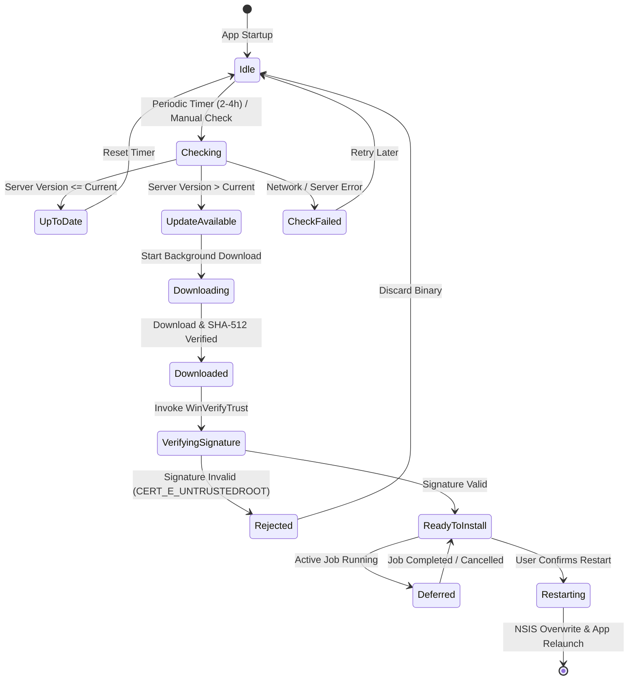

# Model: platform

## Entities

| Entity | Meaning | Key Attributes | Relationships |
| --- | --- | --- | --- |
| `ReleaseArtifact` | Distributable signed executable and updater metadata | `version`, `installerPath`, `sha512`, `sizeBytes`, `signatureValid` | Generated by CI pipeline; served by backend |
| `UpdateManifest` | Static YAML descriptor of the latest release | `version`, `files`, `path`, `sha512`, `releaseDate` | Fetched by client `electron-updater` |
| `UpdateCoordinator` | Client manager reconciling update availability with job execution state | `updateState`, `downloadProgress`, `pendingReleaseVersion`, `activeJobCount` | Interacts with `JobManager` and UI cards |

## Invariants

- **INV-UPD-01** — Two-Layer Update Verification Gate · Downloaded update installers must pass both SHA-512 payload hash validation and Win32 `WinVerifyTrust` Authenticode signature verification before execution. Rationale: Prevents distribution of tampered, corrupt, or man-in-the-middle binaries. Source: `spikes/SP-16-signing-update/REPORT.md#0-ket-luan`, `spikes/SP-16-signing-update/REPORT.md#1-tra-loi-tung-cau-hoi` (Q3).
- **INV-UPD-02** — Active Work Non-Interference · The application must never restart automatically to apply an update while any agent job remains running without explicit user confirmation. Rationale: Unexpected application restarts truncate in-flight jobs and corrupt uncommitted external state. Source: `docs/spec/constitution.md` principle I, `spikes/SP-16-signing-update/REPORT.md#1-tra-loi-tung-cau-hoi` (Q5).
- **INV-UPD-03** — Cloud HSM Key Protection · Production code-signing keys must be hosted in FIPS 140-2 Level 2 compliant cloud HSMs; unexportable private keys and physical USB dongles are prohibited in automated CI. Rationale: CA/Browser Forum rules prohibit exportable software keys, and physical USB tokens cannot be automated on cloud runners. Source: `spikes/SP-16-signing-update/REPORT.md#1-tra-loi-tung-cau-hoi` (Q1).

## Lifecycle

## Variability

| Variability Point | Level | Extensible By | Contract | Notes (reserved: phase + rationale) |
| --- | --- | --- | --- | --- |
| Release Distribution Host | open | Cloud & Self-Hosted S3/CDN | `backend/contracts/update-feed@1.0.0` | Standard generic HTTP feed serving YAML and binaries |
| Code Signing Provider | closed | CI/CD Infrastructure | None | Azure Trusted Signing (enterprise) or SSL.com eSigner |
| Differential Patching | reserved | Release Pipeline | None | Post-MVP: blockmap differential delta updates |

## Physical Resource & Artifact Topology

### 1. Physical Format & Storage
- **Storage Location & Path Layout**:
  - Installer download cache: `%LOCALAPPDATA%\<appId>-updater\pending\`.
  - Installed binary location: `%LOCALAPPDATA%\Programs\<appId>\`.
- **Serialization & Codec Format**: NSIS Windows 64-bit installer executable (`.exe`), YAML manifest (`latest.yml`).
- **Physical Resource Budget**:
  - Download cache disk space: ~110MB transient during download; purged upon successful installation or signature error.
  - Network download bandwidth: Throttled background streaming.
- **Lifecycle & Eviction**: Installer executable deleted automatically by NSIS after elevation and executable replacement.

### 2. Physical Storage & Data Schema

This change owns no database. What it owns is a published document and a transient download, and the shape of
each is held beside the contract that owns it rather than described here.

| Store | Physical schema file | Owning contract | Retention / migration posture |
| --- | --- | --- | --- |
| Published update manifest, served at `/updates/latest.yml` | [`contracts/update-feed.schema.json`](contracts/update-feed.schema.json) | `backend/contracts/update-feed` | Replaced wholesale by each release and never edited in place. Unknown members are admitted, which is what makes adding optional metadata a MINOR change: a client that does not know a member ignores it rather than refusing the manifest |
| Published release artifacts, served at `/updates/<filename>` | [`contracts/update-feed.openapi.yaml`](contracts/update-feed.openapi.yaml) | `backend/contracts/update-feed` | Kept as long as any client may still be resuming a download of them. An artifact removed while a manifest still names it produces a clean failure on the device rather than a partial installation |
| Download cache, `%LOCALAPPDATA%\<appId>-updater\pending\` | [`contracts/update-feed.schema.json`](contracts/update-feed.schema.json) | `platform` | Transient, roughly 110 MB while it exists. Purged on successful installation, and purged immediately when the digest or the signature check fails — a file that failed either check is never kept for a later attempt |
| Installed application, `%LOCALAPPDATA%\Programs\<appId>\` | — | `platform` | Replaced by the installer after the user accepts a restart, and only while no job is running. The previous version is not retained, so a failed upgrade is recovered by installing again rather than by rolling back |

### 3. State-to-Artifact Mapping Matrix
| State / Event / Workflow | Physical Artifact / File / Slot | Identifier / Handler / Entry Point | Constraint Notes |
| --- | --- | --- | --- |
| Update Query | HTTP GET `/updates/latest.yml` | `autoUpdater.checkForUpdates()` | Unauthenticated; static response |
| Binary Download | HTTP GET `/updates/*.exe` | `autoUpdater.downloadUpdate()` | SHA-512 checked on complete |
| Signature Gate | `WinVerifyTrust(HWND, ...)` | `electron-updater` native hook | Rejects un-trusted root certs |
| Installation | Local Executable Spawn | `autoUpdater.quitAndInstall(true, true)` | Only when `activeJobCount === 0` |

## Manifest Schema

The update manifest is the descriptor here, owned by `backend/contracts/update-feed@1.0.0`. Its normative shape
is the file [`contracts/update-feed.schema.json`](contracts/update-feed.schema.json), which states the generic
feed shape the packaging tool emits rather than restating it in this model.

## Trust Boundary

All downloaded update files from remote HTTP endpoints are completely untrusted until both the cryptographic SHA-512 hash and the Authenticode digital signature have been verified by the operating system kernel trust provider.

## Relations

- `backend/contracts/update-feed@1.0.0`: Defines the static feed endpoint.
- `app/contracts/window-manager@1.0.0`: Coordinates restart confirmation dialogs.
