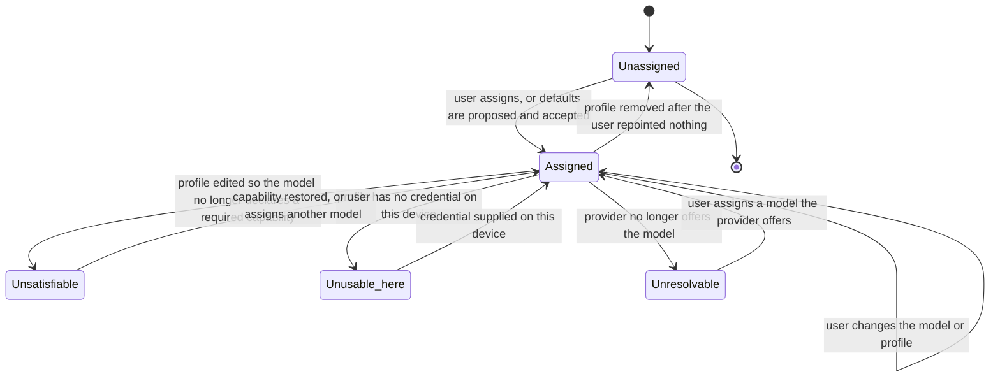

# Model: agent

The `agent` capability already holds a provider profile — where model requests go and which credential opens
that door — from `req-007-pi-sdk-harness`. What this change adds is the layer above it: which of the user's
models answers which question, what happens when the answer cannot be obtained, and what each answer cost.

The model is written around one asymmetry. The set of roles belongs to the product and is small, fixed and
knowable; the set of models belongs to the user and is unbounded, unstable and mostly unmeasured. Everything
below follows from keeping those two apart: the product enforces what it can observe about a model — the
capabilities its profile declares — and states, rather than enforces, what it merely measured about models it
happened to test.

## Entities

| Entity | Meaning | Key attributes | Relationships |
| --- | --- | --- | --- |
| **Role** | A named reason the product needs a model. Six exist: pet text, pet image, worker, rule elicitation, undo, risk judge. A role is a slot in the product, not a value the user can add. | name; the capability requirement it carries; whether measured suitability exists for it | Exactly one assignment per role in a routing table. A harness session is started for a role (`req-007-pi-sdk-harness`). |
| **Capability requirement** | What a role's requests need a model to declare before any request is sent: image input for pet image, tool calling for worker and undo, text for all six. | the required capabilities | Checked against the `ModelOffer` capabilities of `agent/contracts/provider-profile@0.1.0`. |
| **Assignment** | The user's decision that one role is served by one model of one profile. It names a profile and a model; it never carries an address, a credential or a dialect. | role; profile identity; model name; when it was set; whether it departs from a measured default | Belongs to one routing table. Points at one profile. |
| **Routing table** | The complete set of assignments — one per role, or an explicit record that the role is unassigned. It is the thing that replicates, and the thing settings edits. | table version; six entries; the account it belongs to | Account-owned configuration under principle VII. Read by resolution; never read by a window. |
| **Input shape** | What a request carries, as far as routing is concerned: text alone, or text with images. Nothing about the request's meaning is part of it. | carries images or not | With a role, it is the whole input to resolution. |
| **Resolution** | Turning a role and an input shape into the profile and model that will serve it, and then into a resolved endpoint through the profile. | role; input shape; the assignment chosen | Produces a `ResolvedEndpoint` from `provider-profile@0.1.0`, which lives for one request. |
| **Measured suitability** | What the product knows about a specific model in a specific role because a spike measured it: suitable, unsuitable, or nothing at all. Absence is the normal case. | role; model identity within a shipped profile; verdict; the evidence citation | Advisory everywhere except inside the profiles the product ships, where an unsuitable verdict removes the model from that role's offered choices. |
| **Failure cause** | One of the declared ways a model request fails: credential refused, model unavailable, quota exhausted, endpoint unreachable, response unusable, profile written by a newer build. | code; what it means in the user's words; the remedy it points at | Every failed request maps to exactly one. Each maps to exactly one remedy. |
| **Remedy** | The single place that repairs a cause: a profile's credential, a role's assignment, the user's own provider account, or the product's update. | the settings destination; the words that describe the action | Carried by the system card the `uix` capability presents. |
| **Usage record** | What one model request consumed: its role, its profile and model, the input and output token counts the provider reported, and how long it took. | job; request identity; role; profile; model; input tokens; output tokens; duration; whether usage was reported at all | One per model request. Belongs to one job. |
| **Unit price** | A price the user entered for one model of one profile: an amount per unit of input tokens, an amount per unit of output tokens, and the currency both are stated in. | profile; model; input price; output price; currency | Optional. Absent for most models, and absence is a displayed state rather than a zero. |
| **Price book** | The set of unit prices the user has entered. | entries; currency per entry | Account-owned configuration, replicating with the routing table. |
| **Cost basis** | The unit prices and currency a recorded cost was computed from, kept with the cost. | input price; output price; currency; when the price was entered | Belongs to a usage record that has a cost. Without it a cost is a number nobody can explain. |
| **Acknowledgement line set** | The persona-authored lines the product may present on send, before any model has answered. Owned by the persona specification, not by this layer. | language; lines; no interpolation slots | Presented by the `pet` capability. Referenced here because it is what makes the response commitment independent of every entity above. |

## Invariants

Externally observable truths are requirements in `specs/`. What follows is structural. The numbering continues
from `req-007-pi-sdk-harness`, which holds `INV-AG-01` to `INV-AG-11` in the same capability; a gap is left so
the two merge without renumbering.

- **INV-AG-20** — The role catalogue is fixed in the product. No configuration value, manifest, model response or
  replicated record adds, removes or renames a role. A seventh role is a contract change and a release.
- **INV-AG-21** — An assignment names a profile and a model within it, and holds nothing else. It carries no
  address, no credential, no dialect and no capability list, because each of those already has one owner in
  `provider-profile@0.1.0` and a second copy would be a second truth.
- **INV-AG-22** — Resolution is a function of the routing table, the role and the input shape alone. It reads
  nothing from the request's content, nothing the model reported about itself, and nothing about the current
  failure state of other profiles.
- **INV-AG-23** — Resolution never substitutes. If the assignment for a role cannot be used, resolution fails
  and names why; it does not fall back to another profile, another model, or the model another role uses.
- **INV-AG-24** — A role is representable as unassigned. The absence of a decision is a value in the routing
  table, not an empty string, a missing key, or an implicit default.
- **INV-AG-25** — Every recorded cost carries its cost basis. A cost that cannot state the prices it came from
  is not recorded, because it could never afterwards be explained or recomputed.
- **INV-AG-26** — A measured-suitability verdict attaches to a model identity inside a profile the product
  ships. It is never inferred for a model the user typed in, never inherited by a model with a similar name, and
  never derived from a model's declared capabilities.
- **INV-AG-27** — The mapping from a failed request to a cause is total: every failure, including one that
  matches nothing anticipated, has exactly one cause, and every cause has exactly one remedy. There is no
  unclassified state a failure can occupy.
- **INV-AG-28** — The acknowledgement line set is structurally incapable of carrying request content: its lines
  hold no interpolation slot, so a line cannot be made to quote, name or summarise what the user asked for.
- **INV-AG-29** — A usage record is written per request and never mutated afterwards. A job's total is derived
  from its records at the moment it is shown, so a record arriving late changes the total rather than a stored
  total having to be corrected.

## Lifecycle

An assignment is the entity with states worth drawing. A role moves between them as the user edits it, as
profiles change under it, and as a device turns out to lack a credential.

`Unusable_here` is the only state that is a property of the device rather than of the account, which is why it is
reported by naming the profile and the roles waiting on it rather than by changing the assignment: the same
assignment is perfectly usable on the device where the credential was entered.

## Variability

| Variability point | Level | Extensible by | Contract | Notes (reserved: phase + rationale) |
| --- | --- | --- | --- | --- |
| The role catalogue | closed | Nobody. A role is added by changing this product. | `agent/contracts/role-routing@0.1.0` | Six roles. Each has an owner change: pet text and pet image here, worker in `req-006-agent-loop`, rule elicitation in `req-004-rule-elicitation`, undo in `req-010-undo-agent`, risk judge in `req-011-risk-judge`. |
| The set of models a role may be assigned to | open | The user, by writing a profile | `agent/contracts/provider-profile@0.1.0` | The product neither ships nor curates this set beyond the built-in starting points. |
| Unit prices | open | The user | `agent/contracts/usage-accounting@0.1.0` | Deliberately user-supplied: a shipped price table would be a stale claim about a third party's commercial terms. |
| The failure cause taxonomy | closed | Nobody | `agent/contracts/provider-failure@0.1.0` | Adding a cause is a MINOR contract change with a remedy attached; the unusable-response cause is the total mapping's catch-all so no failure escapes. |
| The acknowledgement line set | open | The persona specification, per language | Persona specification, owned by `pet` | Content is persona work, not engineering configuration; the structural constraint that lines carry no slots is INV-AG-28. |
| Remote update of shipped defaults and suitability verdicts | reserved | The product's own update path | `agent/contracts/role-routing@0.1.0` | Phase: M2. Rationale: when a provider retires a model named in a built-in profile, every user's default assignment stops resolving at once, and a release is a slow remedy for a change the product did not make. Activation condition: the first time a model named in a shipped profile stops resolving. Until then the defaults ship with the build, and this is recorded as open question Q-2 in `clarifications.md`. |

## Physical Resource & Artifact Topology

### 1. Physical Format & Storage

- **Storage location and path layout**: the routing table and the price book are records in the product's
  configuration store beside the provider profiles, which is a replicated store under `req-022-account-sync`.
  Usage records are written with the job they belong to, in the local store that `req-013-sqlite-ledger`
  defines, and replicate with it. No artifact of this change has a file of its own on disk.
- **Serialization and codec format**: structured records in the configuration store's own encoding; the
  routing table's document form, which is also what settings validates against before saving, is the descriptor
  in `role-routing@0.1.0`. Nothing here is a binary format.
- **Physical resource budget**: the routing table is six entries and is measured in hundreds of bytes; the price
  book has at most one entry per model the user configured, realistically fewer than twenty. Usage records are
  bounded by requests, which the spike measured at roughly four model requests per job
  (`spikes/SP-17-provider-matrix/REPORT.md#1-tra-loi-tung-cau-hoi` Q6), so a year of heavy use at sixty jobs a
  month is a few thousand small rows. The one genuine memory cost is elsewhere: attached images are held in
  memory while the capability decision is made, bounded by the composer's existing limit of three images at
  10 MB each, and released as `req-007-pi-sdk-harness` already requires when the job ends.
- **Lifecycle and eviction**: the routing table and price book live as long as the account. Usage records live
  as long as the job record they belong to and are removed by the same retention rule; they are never evicted
  separately, because a job whose cost had been evicted would show a total contradicting its own ledger.

### 2. Physical Storage & Data Schema

The shapes this change stores are held as files beside the contracts that own them rather than transcribed here.
What this model keeps is what a schema file cannot say: which store each lives in, what replicates and what does
not, and when each is removed.

| Store | Physical schema file | Owning contract | Retention / migration posture |
| --- | --- | --- | --- |
| Routing table, in the configuration store | `contracts/role-routing.schema.json` | `agent/contracts/role-routing` | One per account, replicated, last-writer-wins with the superseded version kept. Lives as long as the account. A newer build reads an older table unchanged; an older build meeting a newer `tableVersion` refuses the whole table rather than reading around a member it does not recognise, because reading around one here would mean running a role on a model the user assigned elsewhere |
| Price book, in the same configuration store | `contracts/usage-accounting.unit-price.schema.json` | `agent/contracts/usage-accounting` | Account-owned and replicated, at most one entry per model the user configured. Changing a price never rewrites a record already written: it changes what future records cost, and the job list is honest about having been priced differently at different times |
| Usage records, written with the job they belong to in the local store | `contracts/usage-accounting.schema.json` | `agent/contracts/usage-accounting` | Write-once per request identity (INV-AG-29); the identity is the one the ledger and the transcript already correlate by, so no second index exists. They live and die with the job record under the ledger's retention and are never evicted separately, because a job whose costs had been evicted would contradict its own ledger. Read field by field, with unknown members ignored — deliberately the opposite of the routing table, because a usage record is a report about the past |
| Job totals | — | `agent/contracts/usage-accounting` | **Not stored.** Derived at read time from the records present, so a record arriving late changes the total when the page is next read rather than requiring a stored total to be corrected |
| Provider failure notices | `contracts/provider-failure.schema.json` | `agent/contracts/provider-failure` | **Not stored and not replicated.** A notice is the presentation state of one system card in one running product on one device; repairing the condition withdraws it. The file is the shape it takes crossing the boundary, not a shape on disk |
| Provider profiles the table points at | — | `agent/contracts/provider-profile` | Declared by `req-007-pi-sdk-harness` and not repeated here. The credential each names never leaves the device's secure storage, which is why a replicated assignment can be correct while this device cannot serve it |

### 3. State-to-Artifact Mapping Matrix

| State / event / workflow | Physical artifact | Identifier / entry point | Constraint notes |
| --- | --- | --- | --- |
| Role assigned or changed | Routing table record in the configuration store | role name within the account's table | Replicates; last-writer-wins as the configuration store defines, with the superseded version kept |
| Role unassigned | The same record, holding the explicit unassigned value | role name | Never represented by the key being absent (INV-AG-24) |
| Unit price entered | Price book entry | profile identity plus model name | Currency is part of the entry, not a global setting |
| Model request made | Usage record | job identity plus request identity | Written once, never mutated (INV-AG-29) |
| Cost computed | Cost fields inside the usage record, with the cost basis | same request identity | Written only when a unit price existed at that moment |
| Provider failure classified | No stored artifact of its own | profile identity plus cause | Held as the presentation state of one system card; repaired configuration withdraws it |
| Command acknowledged | No stored artifact | — | The acknowledgement precedes the job; nothing is persisted until the job is created |

## Manifest Schema

The routing table is the descriptor this change introduces. It is what settings writes, what replicates, and
what an older build must be able to refuse rather than misread.

### Required Fields

| Field | Type | Description |
| --- | --- | --- |
| `tableVersion` | string | The version of `role-routing` this table is written against. An older build meeting a newer value refuses the table rather than reading around what it does not recognise. |
| `assignments` | object | Exactly six members, keyed by role name. Each is either an assignment or the explicit unassigned value. |
| `assignments.<role>.profileId` | string | The profile this role routes to. Meaningless without a profile of that identity in `provider-profile@0.1.0`. |
| `assignments.<role>.model` | string | A model name the named profile offers. |

### Optional Fields

| Field | Type | Description |
| --- | --- | --- |
| `assignments.<role>.acknowledgedUnmeasured` | boolean | True when the user confirmed an assignment the product holds no measurement for. Its purpose is to avoid repeating a statement the user has already read, never to suppress it the first time. |
| `assignments.<role>.setAt` | string | When the assignment was made, used by the configuration store's conflict resolution. |
| `prices` | array | The price book: entries of profile, model, input price, output price and currency. |

### Discovery and Registry

There is no discovery. The routing table is a single record per account, created when the user's first profile
is saved and edited only through the settings surface. Roles are enumerated from the product's own catalogue,
never from the table, so a table missing a role reads as that role being unassigned rather than as a role that
does not exist.

### Fallback on Missing Manifest

No table at all is the first-run condition: every role is unassigned, the product states that a provider must be
configured, and no request is made. A table naming a profile that no longer exists leaves those roles
unassigned and names them; a table naming a model the profile no longer offers leaves the assignment in place
and reports it as unresolvable, because the user's intent is still legible and the repair is one choice rather
than six. A table whose `tableVersion` is ahead of this build is refused whole — not merged, not partially read
— and the roles it would have assigned behave as unassigned until the product is updated.

## Trust Boundary

Four inputs are untrusted, and none of them may influence routing.

1. **Model output.** A model never selects a role, a profile, a model or a price. Routing is resolved before the
   request is made, from the routing table alone (INV-AG-22), so nothing a model returns can change where the
   next request goes.
2. **Provider error payloads.** The words a provider returns on failure are attacker-influenceable in the same
   way any external content is: they are displayed as data inside a system card, never interpreted as markup, a
   link target, or an instruction, and never used to select the remedy — the cause selects the remedy, and the
   cause comes from the transport and status the product observed.
3. **Profile-declared capabilities.** A profile's capability list is the user's own claim, not a measurement.
   The product enforces it as a gate before sending a request, which is safe because the failure mode of a wrong
   claim is a refused or empty response the product already classifies. It is never treated as evidence that a
   model performs a role well.
4. **User-entered prices.** A price is a number and a currency the user typed. It is validated as such, it
   affects only the cost shown on a job page, and it reaches no other calculation, so a mistyped price
   misreports one page and nothing else.

The composer's side of the boundary deserves naming separately: a window is told whether images may be attached
and why not, and is told nothing about which profile or model produced that answer. The request is made in the
main process regardless of what the window believes, so a window that lied to itself about attachment would
still meet the same refusal.

## Relations

- `agent/contracts/provider-profile@0.1.0` — the sole source of addresses, dialects, credentials and declared
  model capabilities. This change stores none of those and reads all of them through that contract.
- `platform/contracts/secure-storage@0.1.0` — where the credential behind a profile lives, reached only through
  the profile contract, never by this layer directly.
- `ledger`, through the job and ledger records of `req-013-sqlite-ledger` — where usage records are written and
  retained, joined to a job by the job's identity.
- `sync`, through `req-022-account-sync` — the replication of the routing table and the price book as
  account-owned configuration, and the deliberate exclusion of credentials from it.
- `approval`, through `req-011-risk-judge` and the gate contracts of `req-009-rule-ir-hardgate` — the risk judge
  role is a routed model call inside the gate's path, and its fail-closed behaviour on failure belongs to those
  changes, not to this one.
- `pet` and `uix` — the acknowledgement and every card this change's failures produce; this layer supplies the
  classification, those capabilities own what the user sees.
