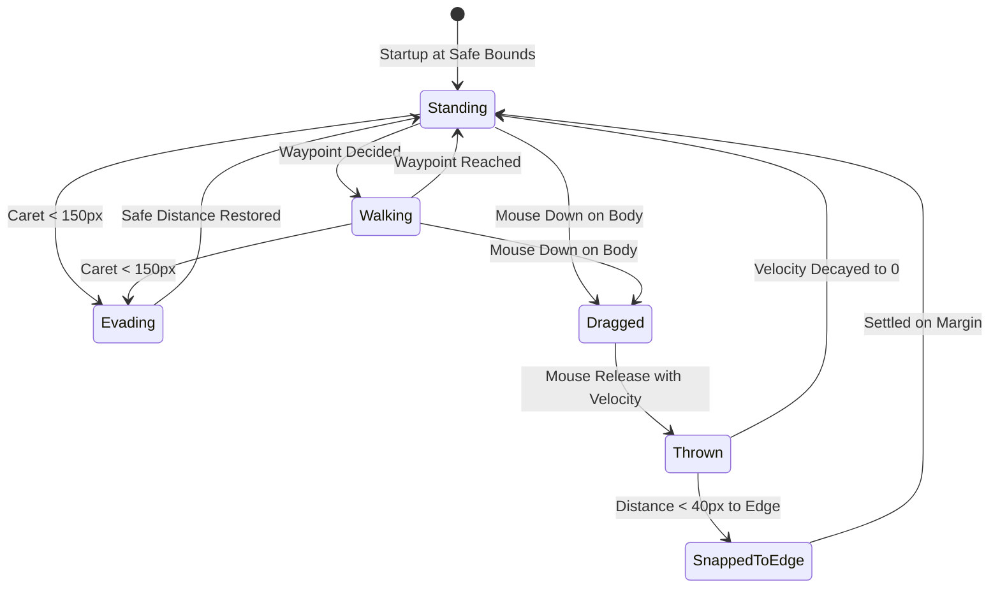

# Model: pet

## Entities

| Entity | Meaning | Key Attributes | Relationships |
| --- | --- | --- | --- |
| `LocomotionController` | Controls pet screen navigation, trajectory decay, and edge snapping | `currentPosition`, `targetWaypoint`, `velocityVector`, `locomotionState` | Drives `PetWindow` coordinates |
| `ScreenContextSnapshot` | Ephemeral structural layout of desktop windows and caret coordinates | `activeDisplayId`, `caretPosition`, `foregroundWindow` | Polled by `LocomotionController` |
| `PrivacyFilteredWindowInfo` | Sanitized window metadata stripped of sensitive text | `category` (EDITOR, BROWSER, TERMINAL, OTHER), `bounds` | Emitted by Native Module; consumed by Pet Engine |
| `TwoLayerAnimationState` | Concurrent combination of locomotion and work states | `locomotion` (STANDING, WALKING, DRAGGED, FALLING), `workStatus` (0..4) | Binds to Rive StateMachine |

## Invariants

- **INV-LIVE-01** — Zero Persistent Window Title · Raw operating system window titles must never be written to disk, stored in the SQLite ledger, or sent to external models. Rationale: Window titles routinely contain confidential filenames, personal messages, and sensitive URLs; persisting them violates the privacy boundary. Source: `docs/spec/constitution.md` principle VII, `spikes/SP-18-pet-liveness/REPORT.md#0-ket-luan`.
- **INV-LIVE-02** — Caret Clearance Corridor · The pet must maintain a minimum 150-pixel buffer zone around the user's active typing caret, autonomously clearing the area when the caret approaches. Rationale: Visual obstruction of active typing frustrates users and disrupts work. Source: `spikes/SP-18-pet-liveness/REPORT.md#1-tra-loi-tung-cau-hoi` (Q16).
- **INV-LIVE-03** — Two-Layer Animation Orthogonality · Locomotion state transitions and work status transitions are completely decoupled and execute concurrently on independent Rive state layers. Rationale: Changes in agent workflow status must not interrupt fluid character locomotion. Source: `spikes/SP-18-pet-liveness/REPORT.md#1-tra-loi-tung-cau-hoi` (Q19, Q20).

## Lifecycle

## Variability

| Variability Point | Level | Extensible By | Contract | Notes (reserved: phase + rationale) |
| --- | --- | --- | --- | --- |
| Application Categorization Patterns | open | Core & Plugin Config | `platform/contracts/privacy-filter@1.0.0` | Local regex mapping process names to generic categories |
| Autonomous Locomotion Heuristics | closed | Core Motion Engine | None | Deterministic idle waypoints and margin docking |
| Perched Interaction Behaviors | reserved | Character Animation | None | Post-MVP: special animations when sitting on specific app titlebars |

## Physical Resource & Artifact Topology

### 1. Physical Format & Storage
- **Storage Location & Path Layout**: Ephemeral state in RAM; absolutely zero persistent disk files created for screen context.
- **Serialization & Codec Format**: In-memory JavaScript structures; native FFI passing integer structs.
- **Physical Resource Budget**:
  - RAM: Working Set remains under 100MB during continuous 60fps locomotion.
  - CPU: Screen tracking hook consumes < 0.5% CPU; locomotion calculation consumes < 1.0% CPU.
  - OS Handles: Zero GDI/USER handle leakage over 8 hours continuous run (>15,000 frames).
- **Lifecycle & Eviction**: Screen context snapshots overwritten every poll tick (~200ms) or on WinEvent triggers; immediate garbage collection.

### 2. Physical Storage & Data Schema

No persistent structured data. That is the point of this change rather than an omission: screen context exists
only as a value in working memory, overwritten on the next observation, and the shape of that value is held
beside the contract that owns it.

| Store | Physical schema file | Owning contract | Retention / migration posture |
| --- | --- | --- | --- |
| Screen context, in working memory only | [`contracts/privacy-filter.schema.json`](contracts/privacy-filter.schema.json) | `platform/contracts/privacy-filter` | Never written to disk, to the local store, to the ledger or to a model provider. Each observation replaces the previous one and nothing accumulates, so there is no retention period to set and nothing to delete on request (INV-LIVE-01) |
| Raw window titles | — | `platform/contracts/privacy-filter` | Never leave native memory. They are read, matched against the category patterns and cleared before any runtime value exists, so no store in the product could hold one |
| The pet's locomotion and work state | — | `pet/contracts/rive-state-machine` | Not persisted. Both layers are derived at start — locomotion from where the pet is placed, work status from the jobs in flight — so a restart loses nothing that was not already derivable |

### 3. State-to-Artifact Mapping Matrix
| State / Event / Workflow | Physical Artifact / File / Slot | Identifier / Handler / Entry Point | Constraint Notes |
| --- | --- | --- | --- |
| Foreground Change | Win32 Event Hook | `SetWinEventHook(EVENT_SYSTEM_FOREGROUND)` | Dispatched in < 1ms; CPU overhead < 0.5% |
| Screen Coordinate Update | Main Process Timer | `SetWindowPos(SWP_NOACTIVATE)` | 60Hz update rate without focus stealing |
| Caret Query | Win32 GUI Thread Info | `GetGUIThreadInfo` | Queries active caret coordinate |

## Manifest Schema

Not applicable.

## Trust Boundary

Raw Win32 window text strings are considered untrusted, high-risk privacy data. They are inspected exclusively within a localized native C/Rust memory buffer, matched against hardcoded category regexes, and immediately cleared from memory before creating Node.js strings.

## Relations

- `platform/contracts/privacy-filter@1.0.0`: Defines the sanitized screen context structure.
- `pet/contracts/rive-state-machine@1.0.0`: Receives work status and locomotion inputs.
