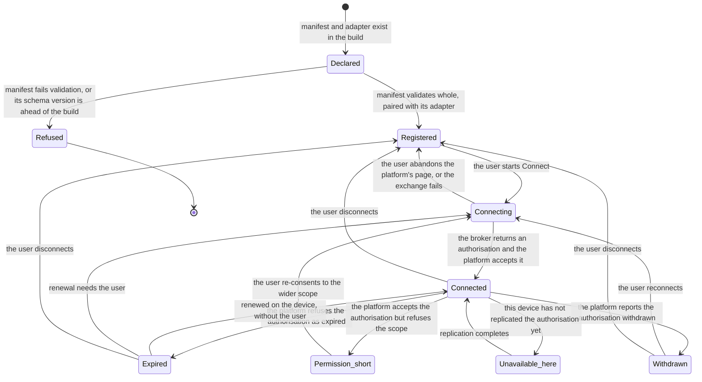

# Model: connector

The `connector` capability already holds a conceptual shape seeded from the product definition: a platform is
described by a manifest, performed by an adapter, and reached only through tools the gate and the ledger wrap.
Nothing in that shape is replaced here. What this change adds is the layer underneath it — what a manifest is as
an entity rather than as a file, what an adapter is reduced to, what a connector's state actually is, and what a
failure is allowed to be — because principle VI's claim was measured and the boundary that produced the
measurement now has to be written down precisely enough that the third platform cannot quietly renegotiate it.

The model is written so that a platform is replaceable and the core is not. Nothing below names a platform, and
nothing below depends on a capability a particular platform has. A connector that cannot be expressed within it
is a manifest-schema change with its own evidence, which is the cost this change deliberately accepts in exchange
for the property it protects.

## Entities

| Entity | Meaning | Key attributes | Relationships |
| --- | --- | --- | --- |
| **Connector manifest** | The whole of what the product knows about a platform. It is data, authored once per platform, and it is the only place platform-specific behaviour may be expressed. | connector identity; display name and icon; schema version; manifest version; authorisation configuration; capability declarations; scope profiles; tool declarations | Describes exactly one connector. Paired at registration with exactly one adapter. Its frozen shape is `connector/contracts/connector-manifest@1.0.0`. |
| **Tool declaration** | One operation an agent may perform on a platform: its name, what it takes, what it does to the platform, and what must be true before it may be undone. | name; direction (reads or writes); the capability it belongs to; parameter shape; snapshot declaration; compensation formula or the irreversible flag; reconciliation declaration; permission-changing flag; bulk-threshold parameter | Belongs to one manifest. Becomes exactly one generated tool while the connector is connected. Read by the gate and by the undo planner, never rewritten by either. |
| **Capability declaration** | A functional grouping of tools — reading mail, writing tasks — that the user enables or does not, and that scope is requested for. | name; description | Declared by a manifest. Referenced by tool declarations and by every scope profile. |
| **Scope profile** | One mapping from capabilities to the platform scopes that must be requested for them, so that a release channel is a selection rather than an edit. | profile name; capability-to-scope mapping | Belongs to one manifest; exactly one is selected per build, and the selected one is recorded with each authorisation it produced. |
| **Snapshot declaration** | How the prior state of a write target is read before the write, and which of that state's values the platform computes and will refuse to have restored. | the read operation to use; where the target is named in the arguments; the excluded computed values | Belongs to one write tool declaration. Its output is a ledger record, not a connector artifact. |
| **Compensation formula** | How the action that reverses a write is built from the recorded prior state. | the tool that performs the reversal; where its arguments come from in the snapshot | Belongs to one write tool declaration, exclusive with the irreversible flag. Consumed by `undo`. |
| **Connector adapter** | The executable half of a connector: the code that speaks one platform's protocol. Four operations and no fifth. | the four operations; the authorisation reference it presents | Paired with one manifest at registration. Reachable only from inside a wrapped tool. |
| **Connector registration** | The fact that a manifest and an adapter have been paired and made available to the product, together with what is currently true of the pair. | connector identity; selected scope profile; connection state; when that state was established; whether the device can renew the authorisation without the user | One per connector per account. Read by the job manager when it assembles a tool set. |
| **Connection state** | What the platform last said about the stored authorisation: accepted, expired, insufficient permission, withdrawn — or, on a device that has not yet replicated, not available here. | the state; the instant it was established; whether renewal is possible on the device | Belongs to one registration. An observation with a time, never a stored truth (INV-CN-10). |
| **Connector error** | A failure expressed in terms the core understands, so that the job manager can decide without knowing the platform. | code from the declared set; the platform's own message; whether a retry may succeed; how long to wait | Produced by an adapter operation. Consumed by the wrapping layer, the job's retry policy and the ledger record of the result. |
| **Generated tool** | What the agent is actually offered: a tool declaration turned into a callable surface, wrapped in the gate and the ledger obligation before anything holds it. | public name; description; parameter shape; the declarations the gate reads | Produced from one tool declaration and one adapter. Enters an agent only through `agent/contracts/tool-wrapping@0.1.0`. |
| **Authorisation grant** | The platform's permission to act on the user's behalf, and the profile it was granted under. Held elsewhere; named here because the registration depends on it. | reference into the credential store; granted scopes; expiry; the profile it was granted under | Owned by `platform` through `platform/contracts/secure-storage@0.1.0`; obtained through `backend/contracts/authorisation-broker-api@0.1.0`. Never part of a manifest, a registration record or a generated tool (INV-CN-09). |

## Invariants

Invariants that are externally observable are requirements in `specs/` rather than here. What remains below is
structural: true of the shape regardless of implementation, and not established by watching the product behave.

- **INV-CN-01** — Every tool an agent can reach that touches a platform exists as exactly one tool declaration in
  exactly one manifest. There is no second way to bring a platform operation into the product, so "the manifest is
  the sole surface" is a property of the shape rather than a review rule.
- **INV-CN-02** — No component outside a connector branches on a connector's identity. A core component that
  needed to know which platform it was serving would be the first line of the erosion principle VI forbids, and
  the measurement that justified this change would stop being repeatable.
- **INV-CN-03** — The adapter surface is exactly four operations: execute, read prior state, establish state,
  withdraw. A platform capability that does not fit becomes a declared tool, never a fifth operation.
- **INV-CN-04** — A connector's identity is stable for the life of the product. Changing it produces a different
  connector rather than a new version of one, because ledger records, rules and authorisations all refer to it.
- **INV-CN-05** — A generated tool's public name is unique within the tool set of one job, and carries its
  connector's identity, so that two platforms offering the same operation are two tools rather than a collision.
- **INV-CN-06** — The declarations a call is judged and later reconciled by are copied into the record of intent
  when the call is made. A manifest edited afterwards therefore cannot change how an already-recorded call is
  treated, which is the same guarantee `ledger` states as INV-LG-05 seen from this side.
- **INV-CN-07** — A write tool declaration carries exactly one of a compensation formula or the irreversible flag:
  never both, and never neither. Both would make reversibility ambiguous; neither is the case principle IV exists
  to forbid.
- **INV-CN-08** — An adapter holds no policy. It cannot form a verdict, cannot read a rule, cannot decide whether
  a call should happen, and is reachable only from inside the wrapper that holds it — so a connector author cannot
  weaken the gate by writing an adapter, however they write it.
- **INV-CN-09** — An authorisation value appears in no manifest, no registration record, no generated tool, no
  ledger record and no agent context. What travels is a reference; the value is fetched at the moment the platform
  is called.
- **INV-CN-10** — A connection state is an observation carrying the instant it was established. There is no
  state that means "true now" without saying when it was last confirmed, because a stale state presented as
  current is how a user is told they revoked something they did not.
- **INV-CN-11** — A scope profile maps only capabilities that at least one declared tool requires. Scope that no
  tool would use cannot be requested from a user by accident.
- **INV-CN-12** — Registration is one manifest to one adapter, keyed by connector identity. A second registration
  under an existing identity is an error rather than a merge or a replacement.

## Lifecycle

A connector registration moves through these states. `Registered` is the state of a connector the product knows
about and the user has not connected; every state below it is a statement about an authorisation that exists.

`Refused` is terminal within a build: a manifest that does not validate is not retried at runtime, because
nothing about the running product will make it valid. `Unavailable_here` is deliberately not a failure state —
it says the authorisation exists for the account and has not arrived, which is a different sentence from every
other state here and is the one `req-022-account-sync` requires be told apart from revocation.

## Variability

| Variability Point | Level | Extensible By | Contract | Notes (reserved: phase + rationale) |
| --- | --- | --- | --- | --- |
| The set of platforms | `open` | A manifest and an adapter, added without touching the core | `connector/contracts/connector-manifest@1.0.0` | Measured at zero lines of core change for the second platform — VERIFIED (`spikes/SP-19-connector-framework/REPORT.md#1-tra-loi-tung-cau-hoi` Q3). |
| What an adapter must implement | `open` | A connector author, implementing four operations | `connector/contracts/connector-adapter@1.0.0` | Open to new implementations, closed as to its shape: implementations vary, the operation set does not. |
| Capability-to-scope mapping per release channel | `open` | A profile added to a manifest | `connector/contracts/connector-manifest@1.0.0` | Switching channel selects a profile and edits nothing — VERIFIED (Q8). The default profile per channel is a release decision, recorded as Q-1 in `clarifications.md`. |
| The adapter operation set | `closed` | — | — | Four operations. A fifth is how platform-specific behaviour re-enters the core, so it is closed by construction rather than by policy (INV-CN-03). |
| The connector error codes | `closed` | — | `connector/contracts/connector-adapter@1.0.0` | The job manager decides what to retry and what ends a job from this fixed set; a connector that could invent a code could make the core learn about it. |
| Authorisation kinds | `closed` | — | `connector/contracts/connector-manifest@1.0.0` | Three enumerated kinds. A platform needing a fourth is a MINOR contract change with its evidence, not a per-connector improvisation. |
| The path from declaration to agent | `closed` | — | `agent/contracts/tool-wrapping@0.1.0` | One generator, one wrapping factory, no exceptions and no trusted-tool category. |
| Connectors the product did not write | `reserved` | — | — | Phase: after the first mass-market release channel exists (M2 at the earliest). Rationale: importing an external tool description was measured as costing no architectural change — VERIFIED (Q11) — so what remains is the isolation and review decision that running other people's code requires, and the in-process adapter of this change is sound only while every manifest is first-party. Activation condition: a decision-maker ruling on third-party acceptance, which then makes the adapter's execution boundary a question this model must reopen. |

## Physical Resource & Artifact Topology

### 1. Physical Format & Storage

| Artifact | Format | Where it lives | Budget | Eviction |
| --- | --- | --- | --- | --- |
| Connector manifest | JSON, validated against the frozen schema at load | A build resource shipped with the application; not user-editable and not fetched at runtime in this scope | Measured at 251 lines for a seven-tool writing connector and 78 lines for a two-tool read-only one — VERIFIED (`spikes/SP-19-connector-framework/evidence/notion.manifest.json`, `gmail.manifest.json`) | Loaded once at start-up and held for the life of the process |
| Connector adapter | Application code, one module per platform | The process that owns the ledger, the gate and the connectors | Measured at 194 lines for the second connector — VERIFIED (`spikes/SP-19-connector-framework/evidence/core-diff-report.md`) | Lives with the process |
| Registration table | The paired manifest and adapter, with the connection state and its instant | In memory, rebuilt at each start from the build's manifests and the account's connector records | One entry per connector; two in the measured configuration | Rebuilt at start-up; no durable form of its own |
| Generated tool set | Tool surfaces built from the declarations of connected connectors | In memory, assembled per job | Measured at 7 tools with one connector connected and 9 with both — VERIFIED (`spikes/SP-19-connector-framework/REPORT.md#1-tra-loi-tung-cau-hoi` Q6). No per-tool memory figure was measured — UNVERIFIED | Released with the job |
| Pre-write snapshot | The prior state read before a write, with the platform's computed values excluded | A ledger record under `ledger/contracts/ledger-record@0.1.0`; nothing is stored by the connector itself | Bounded by what the platform returns for one object; no measured figure — UNVERIFIED | Follows the ledger's retention, not the connector's |
| Authorisation grant | Tokens, expiry, granted scopes and the profile they were granted under | The device's credential store under `platform/contracts/secure-storage@0.1.0`, replicated encrypted with the account | Four credential groups measured in `spikes/SP-11-secure-storage/REPORT.md` §1 Q5 | Erased on disconnect, on sign-out and on account deletion |
| Connector icon | An image resource named by the manifest | A build resource beside the manifest | One per connector | Lives with the build |

A manifest is a build resource rather than a file the product discovers on disk, and this is a deliberate
restriction rather than an implementation detail: a discovered manifest is a way to introduce a tool the product
did not review, and the reserved point above is where that question is opened with its isolation answer attached.

### 2. Physical Storage & Data Schema

This capability owns no persistent structured store. What it owns are two shapes, held as files beside the
contracts that own them rather than transcribed here; what durable data a connector produces is written into
stores other capabilities own, under those capabilities' retention. What this model keeps is what a schema file
cannot say: where each shape is read, what outlives a restart, and what deliberately does not.

| Store | Physical schema file | Owning contract | Retention / migration posture |
| --- | --- | --- | --- |
| Connector manifests, as build resources read once at start-up | `contracts/connector-manifest.schema.json` | `connector/contracts/connector-manifest` | Not a store: every manifest ships inside the build that reads it, so the mixed-version window is empty by construction and `schema_version` exists for reviewers rather than for a negotiation. A manifest is validated whole at each start; a build meeting a major version above its own refuses that connector and leaves every other one untouched |
| Adapter outcomes, as they are recorded | `contracts/connector-adapter.schema.json` | `connector/contracts/connector-adapter` | Not a store either: the file is the shape of what crosses the adapter boundary, and what persists is the ledger record the wrapping layer writes from it. A failure is therefore kept in the platform's own words under the ledger's retention, and is never rewritten by a later build that classifies it differently |
| Registration table and generated tool sets | — | `connector/contracts/connector-manifest`, `agent/contracts/tool-wrapping` | **Not stored.** Rebuilt at every start from the build's manifests and the account's connector records, so there is no cached registration that can disagree with the build |
| Authorisation grants the manifests configure | — | `platform/contracts/secure-storage` | Never in this capability. They live in the device's credential store, replicated encrypted with the account, and are erased on disconnect, on sign-out and on account deletion |
| Pre-write snapshots and every recorded call | — | `ledger/contracts/ledger-record` | Written by the wrapping layer, under the ledger's retention. The connector stores nothing of its own about a call it made |

### 3. State-to-Artifact Mapping Matrix

| Registration state | What exists on disk | What exists in memory | What a restart finds |
| --- | --- | --- | --- |
| Declared | The manifest and adapter in the build | Nothing yet | The same manifest, validated again |
| Refused | The manifest in the build, and the recorded validation failure | Nothing for that connector | The same refusal, reported the same way |
| Registered | The manifest; no credential entry | The pairing and an empty connection state | A connector offered for Connect |
| Connecting | No credential entry until the exchange completes | The pending exchange and the loopback listener | Nothing pending; Connect must be started again |
| Connected | The credential entry, and the account's connector record | The pairing, the state and the instant it was established | The credential entry, with the state re-established by asking the platform |
| Expired or permission-short | The credential entry, unchanged | The state and whether renewal is possible here | The same entry; the state is established again rather than trusted |
| Withdrawn | The credential entry until it is erased | The state and the reason | The same, until the user disconnects or reconnects |
| Unavailable here | The account's connector record, without a credential entry on this device | The state, with the reason that replication has not completed | The same, until replication completes |

## Manifest Schema

The manifest is the one descriptor this capability defines. Its frozen shape, with types and validation rules, is
`connector/contracts/connector-manifest@1.0.0`; what follows is what the fields mean conceptually.

### Required Fields

| Field | Meaning |
| --- | --- |
| Schema version | Which version of the frozen schema the manifest is written against. A major number ahead of the build's is refused with the version it requires. |
| Connector identity | The stable name of the platform within the product. Ledger records, rules and authorisations all refer to it, so it never changes (INV-CN-04). |
| Display name and icon | What the user sees in the catalogue and beside a job's operations. |
| Manifest version | The version of this particular manifest's content, so a connector's own evolution is visible separately from the schema's. |
| Authorisation configuration | The kind of authorisation, the platform's endpoints, and whether the platform publishes a way to withdraw an authorisation. Its absence is declared rather than discovered. |
| Capability declarations | The functional groupings the user enables, each with the words the consent step shows. |
| Scope profiles | At least one mapping from capabilities to platform scopes; the selected one is recorded with each authorisation it produced. |
| Tool declarations | At least one. Each carries a name, a direction, the capability it belongs to, a parameter shape, and — when it writes — either a snapshot declaration with its compensation formula or the irreversible flag. |
| Reconciliation declaration per tool | How an interrupted call is decided after a restart, under `job/contracts/tool-reconciliation@0.1.0`. Absent means the effect cannot be read back, which is the safe reading rather than the convenient one. |

### Optional Fields

| Field | Meaning |
| --- | --- |
| Rate policy | What the platform tolerates, so the shared queue paces requests rather than discovering the limit by being refused. |
| Content sanitization | How content this connector returns is neutralised before it enters an agent's context, required of any connector that returns document or message bodies under the constitution's External Content Is Data section. |
| Snapshot exclusions | Which of a write target's values the platform computes, and therefore excludes from the snapshot and from any compensating action built from it. Required of a write tool that snapshots a structured object. |
| Bring-your-own client support | Whether the user may supply their own authorisation client for this platform, with the guidance steps and the caveat about how long such an authorisation lasts. |
| Bulk-threshold parameter | Which parameter's length decides whether a call counts as bulk, so the approval tier counts objects without knowing the platform. |
| Permission-changing flag | Whether a tool alters who can reach something, which the gate treats as its own class of act. |

### Discovery & Registry

Manifests are discovered at start-up among the build's own resources: each is validated whole, paired with the
adapter registered under the same identity, and entered in the registration table. There is no scan of a user
directory, no download and no runtime installation in this scope. Adding a platform is therefore a manifest, an
adapter and one line at the point where the product wires itself together — measured exactly so, at zero lines of
core change — VERIFIED (`spikes/SP-19-connector-framework/evidence/core-diff-report.md`).

### Fallback on Missing Manifest

A connector whose manifest is absent, malformed, or written against a later major schema version yields no tool
at all and is presented as unavailable with the reason. The product continues with every other connector, and a
job that needed the missing one fails with a reason naming it rather than by attempting a substitute. A manifest
whose adapter is missing is the same case seen from the other side, and is treated identically: the pair is what
registers, so half a pair registers nothing.

## Trust Boundary

| Input | Trusted? | Consequence |
| --- | --- | --- |
| The manifest itself | Yes, as a first-party declaration, and only after it validates whole | It is authored by the product and shipped in the build, which is what permits its adapter to run in the process that owns the ledger and the gate. The day that stops being true is the reserved point in Variability, not an assumption left standing. |
| A tool call's arguments, produced by a model | No | They are the subject the gate judges, never an input to the judgement. No declaration about a call is ever read from them (INV-CN-06). |
| Everything a platform returns — page content, message bodies, file content, error text | No | Data under the constitution's External Content Is Data section. It may inform what an agent proposes; it may never authorise an act, relax a verdict, or alter a rule. A connector that returns such content declares its sanitization. |
| A platform's statement about the authorisation | Partly | Believed as an observation with a time attached, never as a stored truth. A failure to reach the platform establishes nothing, and never becomes "revoked" (INV-CN-10). |
| The authorisation grant | Secret | Held only in the credential store, presented only by the adapter at the moment of the call, and present in no record this capability writes (INV-CN-09). |
| A platform's rate and error semantics | No | Mapped into the declared error codes at the adapter's edge, so that an unexpected shape becomes the general platform-failure code rather than something the core has to interpret. |

## Relations

- **`agent`** — through `agent/contracts/tool-wrapping@0.1.0`. Generated tools reach a harness only as wrapped
  tools; this capability produces implementations and declarations and holds no route to a session.
- **`approval`** — through `approval/contracts/gate-evaluation@0.1.0`. The declarations the call subject carries —
  irreversibility, permission change, the object's declared type and identity — are read from the manifest and
  supplied by the wrapper, never assembled by a connector.
- **`ledger`** — through `ledger/contracts/ledger-record@0.1.0`. Snapshots, compensating actions and connector
  error codes are recorded there; this capability stores none of them itself.
- **`job`** — through `job/contracts/tool-reconciliation@0.1.0` for what an interrupted call means, and through
  the job lifecycle for what a declared error code does to a running job.
- **`undo`** — through the compensation formula and the irreversible flag in the manifest. The undo planner reads
  declarations; it never asks a connector what it thinks is reversible.
- **`backend`** — through `backend/contracts/authorisation-broker-api@0.1.0` for the code exchange and the
  renewal a confidential client requires, and through
  `backend/contracts/authorisation-provider-descriptor@0.1.0`, which is the server-side half of the same platform:
  the scopes it offers come from this manifest, and the two are declared together when a platform is added.
- **`platform`** — through `platform/contracts/secure-storage@0.1.0` for every authorisation value, under the
  credential class that contract defines.
- **`sync`** — through `sync/contracts/replicated-store-descriptor@0.1.0`. A connector's account-level record —
  that it is connected, under which profile — replicates; its credential material follows the rules `req-012`
  and `req-022` set, and this capability adds no store of its own.
