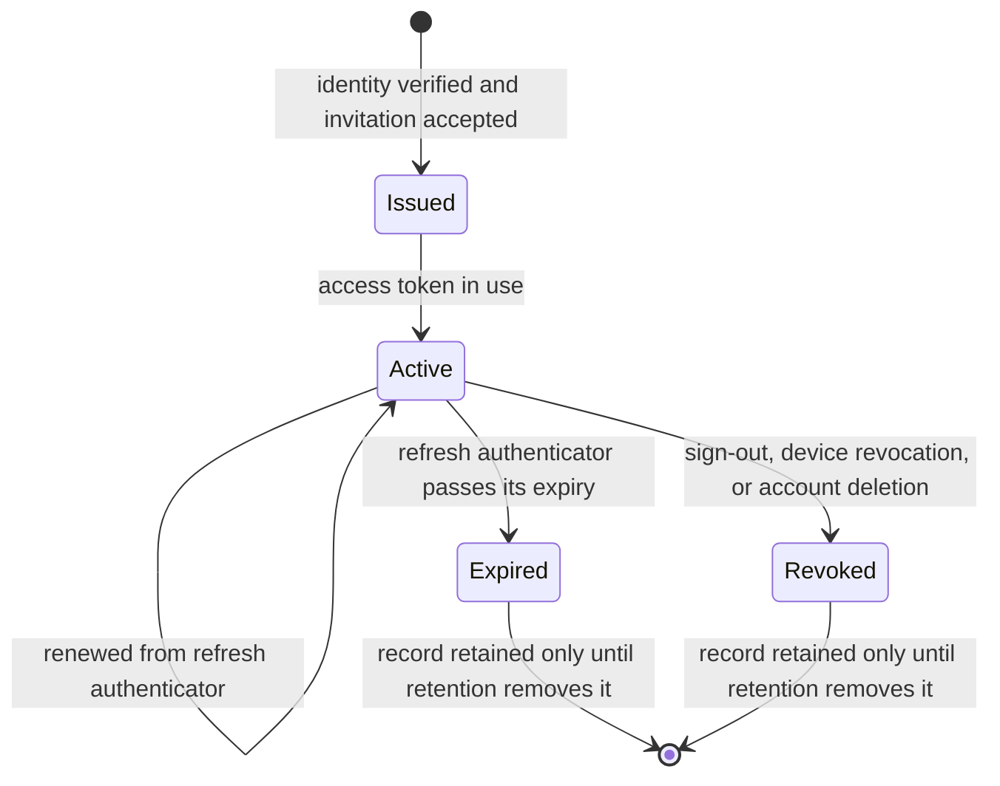
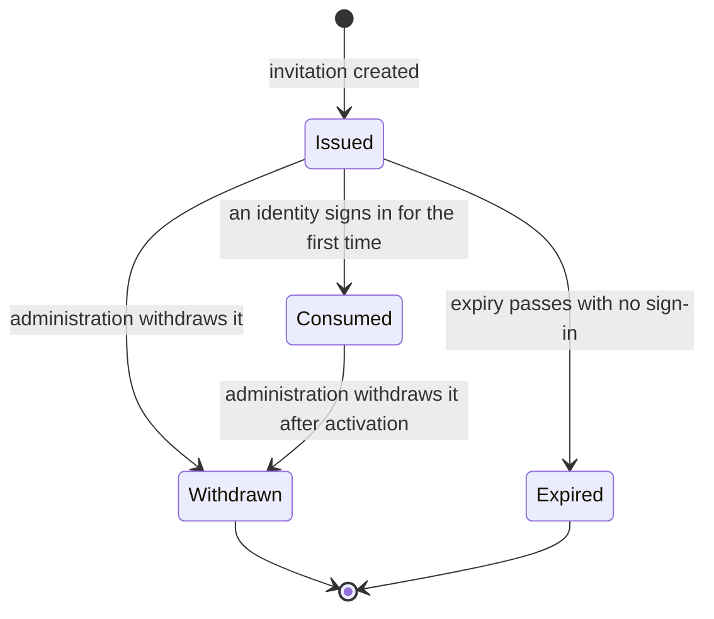

# Model: backend

Owning capability: `backend`. Entities belonging to `sync`, `connector`, `platform` and `app` appear here only
where the server's shape constrains them; each remains owned by its own capability and is reached through that
capability's contracts. The `backend` capability has no `model.md` yet, so this is written in full form rather
than as a delta.

Two server-side stores exist and this model owns only the first. The **authentication and brokering store** holds
the account, device, session and invitation records that this change specifies, and its shape is fixed by a
requirement in `specs/backend/spec.md`. The **encrypted replication store** holds the account's replicated data
and is specified by `req-022-account-sync`; it is referenced here as a neighbour, never described. Keeping them
distinct is what makes the first store's shape inspectable at all: a dump that proves what the server holds is
only meaningful if the boundary of "the server" is drawn somewhere.

## Entities

| Entity | Meaning | Key Attributes | Relationships |
| --- | --- | --- | --- |
| Account | The identity the service recognises and the unit of isolation. Everything the backend holds for a user hangs from exactly one Account. | Account identifier, identity-provider subject, email address, status | Owns many Device Enrolments, many Sessions; consumes at most one Invitation; owns one Encrypted Replication Partition |
| Device Enrolment | One installation of the product recognised against an Account. The backend's half of the device registry the user sees. | Enrolment identifier, device identifier supplied by the device, display label, last activity, enrolment state | Belongs to one Account; carries zero or more Sessions; presented through `sync/contracts/device-registry` |
| Session | The right of one Device Enrolment to call authenticated endpoints for a bounded period, renewable until it is revoked or expires. | Session identifier, refresh authenticator, expiry, revocation mark | Belongs to one Account and one Device Enrolment |
| Invitation | The closed-beta admission ticket. Without one, a verified identity is still refused. | Invitation identifier, address or code, status, expiry, consuming account | Consumed by at most one Account |
| Authorisation Provider | An external platform the product can broker authorisation for. It exists as configuration, not as code. | Provider identifier, display name, authorisation endpoint, token endpoint, credential references, default scopes, proof-key requirement, token-call authentication method, extra authorisation parameters | Described by exactly one Provider Descriptor; referenced by Authorisation Requests |
| Provider Descriptor | The declaration that makes a provider brokerable. It is the extension point of this model: the whole of what must be written to add the Nth platform. | The Authorisation Provider's fields, as a single declarative record | Describes exactly one Authorisation Provider |
| Authorisation Request | The server-side memory of a connect attempt, addressed by an opaque binding value, so that a code arriving later can be matched to the session that began it. | Binding value, provider identifier, session identifier, redirect address, proof-key challenge, issue time, expiry, consumed mark | Belongs to one Session; names one Authorisation Provider |
| Brokered Exchange | The act of turning an authorisation code or a provider refresh token into provider tokens. It has no persistent form — it exists for the duration of one call and leaves nothing behind. | Provider identifier, inbound code or refresh token, outbound provider tokens | Derived from one Authorisation Request or one client-held provider refresh token; never stored |
| Server Secret | A credential the service holds and the device must not: provider client secrets, the session signing key, store credentials. | Secret name, resolution source, rotation state | Referenced by name from Provider Descriptors and from session issuance; the value belongs to the secret manager, never to this store |
| Rate Limit Window | The service's memory of how much one source has asked for recently, applied at the edge before any session is examined. | Source key, endpoint class, count, window start | Applies to unauthenticated and authenticated callers alike |
| Health Probe Result | The answer to "is this instance serving", computed by exercising the store rather than by reporting that the process is alive. | Status, store reachability, uptime, resident footprint | Owned by the service, reachable from no Account |
| Release Manifest Reference | What the version check answers with: the current version and, when one exists, where the update is described. | Current version, minimum supported version, mandatory flag, manifest location | Owned by the service; its content is owned by `platform` under `req-016-signing-update` |
| Encrypted Replication Partition | The account's replicated data as this model sees it: an opaque neighbour that account deletion must destroy and that the brokering path must not reach into. | Account scope, encryption key reference | Belongs to one Account; specified by `req-022-account-sync`, not here |

## Invariants

Only invariants that are not externally observable are held here. Everything a user or a test can observe — the
shape of the store, the broker retaining nothing, refresh tokens being unrecoverable, the failure radius of an
outage, the single-use binding, rate-limit refusals, allowlist gating — is written as a requirement in
`specs/backend/spec.md` and `specs/connector/spec.md`.

- **INV-BE-01** — A Session belongs to exactly one Account and exactly one Device Enrolment, and neither
  association changes for the life of the Session. · Rationale: revoking a device must revoke exactly the
  sessions that device holds; a Session able to move between enrolments would make revocation unprovable. ·
  Source: `specs/backend/spec.md`, sign-out and multi-device scenarios; `sync/contracts/device-registry`.
- **INV-BE-02** — An Account is identified by the identity provider's subject, and the email address is a
  mutable attribute that is never the join key. · Rationale: an address can be renamed at the provider or
  reassigned to a different person after an account is closed; joining on it would silently merge or transfer an
  account's entire history. · Source: `spikes/SP-20-backend-slice/REPORT.md#1-tra-loi-tung-cau-hoi` (Q1), where
  the subject and the address are distinct attributes of the account record.
- **INV-BE-03** — A Brokered Exchange has no persistent representation at any point in its life. · Rationale: the
  requirement that the broker retains no provider credential is enforceable only if there is no record to forget
  to delete; a short-lived row with a cleanup job would make the guarantee depend on the cleanup job running. ·
  Source: `specs/backend/spec.md`, broker retention requirement.
- **INV-BE-04** — Provider-specific behaviour is expressed only in a Provider Descriptor, and no broker or route
  path branches on provider identity. · Rationale: this is precisely what made the second provider cost 19 lines
  of configuration and nothing else; a single conditional on provider identity in the broker converts the
  extension point back into a code change per platform, against principle VI. · Source:
  `spikes/SP-20-backend-slice/REPORT.md#1-tra-loi-tung-cau-hoi` (Q3), diff across routes, broker and interface
  description.
- **INV-BE-05** — A Server Secret is referenced by name and resolved at the moment of use; its value is never an
  attribute of a Provider Descriptor, an Account, a Session or any other entity in this model. · Rationale: every
  mechanism that makes the store inspectable — dumps, backups, log lines, error payloads — would otherwise
  become a disclosure path, which is the failure the secret scan exists to detect. · Source:
  `specs/backend/spec.md`, secret-manager requirement; `spikes/SP-20-backend-slice/REPORT.md#1-tra-loi-tung-cau-hoi` (Q7).
- **INV-BE-06** — An Invitation is consumed by at most one Account, and a consumed Invitation does not return to
  an unconsumed state. · Rationale: the allowlist is the only admission control during the beta, and an
  invitation that could be re-consumed would let one ticket admit a second identity. · Source:
  `specs/backend/spec.md`, invitation-consumed scenario.
- **INV-BE-07** — No path that serves authentication or brokering can reach a key that decrypts an Encrypted
  Replication Partition. · Rationale: principle VII confines key access to the replication path, and the
  authentication and brokering path is the largest attack surface the service exposes; the confinement is only
  real if it is a property of the model rather than a convention. · Source: `docs/spec/constitution.md`
  principle VII; RISK-062, RISK-063.
- **INV-BE-08** — A binding value is opaque and carries no account, device, session or provider credential; it is
  a lookup key into server-side Authorisation Request state and never a bearer token. · Rationale: it travels
  through the user's browser, the provider's redirect and the operating system's URL handling, so it must be
  worthless to anyone who intercepts it. · Source: `specs/backend/spec.md`, exchange-binding requirement.
- **INV-BE-09** — Rate limiting is evaluated before session verification. · Rationale: verification costs more
  than refusal, so a limiter that runs after it would let an unauthenticated flood buy the expensive path with
  worthless tokens. · Source: `spikes/SP-20-backend-slice/REPORT.md#1-tra-loi-tung-cau-hoi` (Q8), where the
  burst was refused at the edge.
- **INV-BE-10** — Every entity in this model is reachable from exactly one Account, except Provider Descriptor,
  Server Secret, Rate Limit Window, Health Probe Result and Release Manifest Reference, which belong to the
  service and to no account. · Rationale: account deletion is verified by walking from the Account and finding
  nothing left; an account-derived record reachable only from somewhere else would survive deletion unnoticed. ·
  Source: `specs/backend/spec.md` and `docs/spec/capabilities/backend/spec.md`, account deletion requirements;
  `spikes/SP-20-backend-slice/REPORT.md#1-tra-loi-tung-cau-hoi` (Q10).

## Lifecycle

Session and Invitation are the entities with conceptual state machines. Account has three states — invited,
active, deleted — and deletion is terminal rather than a status an account returns from. Device Enrolment's
lifecycle is owned by `sync` and is not restated here; the backend is where its states are enforced.

A Session in `Expired` and one in `Revoked` are both refused, and the refusals are distinguishable to the
device: expiry means renew, revocation means sign in again. Withdrawing a consumed Invitation stops renewal of
the account's Sessions rather than deleting the account, because withdrawal is an admission decision and
deletion is a data decision.

## Variability

| Variability Point | Level | Extensible By | Contract | Notes (reserved: phase + rationale) |
| --- | --- | --- | --- | --- |
| The set of Authorisation Providers | open | A new Provider Descriptor, with no change to the broker, the routes or the client-facing interface | `backend/contracts/authorisation-provider-descriptor` | The extension point of this model, measured at 19 lines of configuration for the second provider. A provider with no descriptor is refused, never defaulted. |
| Provider token-call authentication method | closed | — | `backend/contracts/authorisation-provider-descriptor` | Two methods exist: credentials in the request body, credentials in the request header. Both were exercised. A third is a descriptor version bump, because it changes what the broker must do. |
| Proof-key exchange | closed | — | `backend/contracts/authorisation-provider-descriptor` | Declared per provider as required or not required. Not a provider-supplied algorithm choice: one challenge method is supported, and a provider needing another is a change. |
| Identity provider | closed | — | `backend/contracts/client-session-api` | Google Sign-In alone. Principle VII makes account identity the sole gate on the user's whole history, which RISK-064 records; widening it is a decision, not a configuration. |
| Session token shape and lifetimes | closed | — | `backend/contracts/client-session-api` | Lifetimes are service configuration, not a device-selectable parameter. A device cannot request a longer session. |
| Authentication and brokering store record types | closed | — | — | Fixed at account, device, session and invitation by a requirement in `specs/backend/spec.md`. Widening it is an amendment, which is the entire point of writing the shape down. |
| Rate limit policy per endpoint class | closed | — | `backend/contracts/public-service-endpoints` | Thresholds are service configuration; the classes themselves — authentication, brokering, public — are fixed, so a new endpoint must be placed in one of them rather than escape limiting by being new. |
| Store topology: connection pooling and read/write separation | reserved | — | — | Phase: before the release load test on production-equivalent infrastructure. 200 concurrent writers on a development machine pushed median sign-in latency to about 1.5 s — VERIFIED, `spikes/SP-20-backend-slice/REPORT.md#4-rui-ro-moi-phat-hien`, RISK-060. Activation condition: pooling before release regardless; read/write separation on the first measurement, on production-equivalent infrastructure, where a single writer does not sustain twice the beta population. |
| Encryption key custody granularity | reserved | — | `sync/contracts/replication-protocol` | Owned by `req-022-account-sync` and restated here only because the backend is where custody is implemented. Its phase, rationale and activation condition live in that change's model and are not duplicated. |

## Physical Resource & Artifact Topology

### 1. Physical Format & Storage

- **Storage Location & Path Layout**: the authentication and brokering store is a relational store holding
  exactly four record types — account, device, session, invitation — each in its own relation, with unique
  constraints on the identity-provider subject, on the email address, on the account-and-device pair, and on the
  session's refresh authenticator. Records derived from an Account cascade from it, which is what makes deletion
  provable by walking from the Account rather than by enumerating cleanup steps. The encrypted replication store
  is a separate partition addressed by account identifier and is not described here. Server Secrets live outside
  both, in the secret manager. Logs are a third artifact and carry redacted fields by construction rather than
  by review.
- **Serialization & Codec Format**: records are relational rows of textual identifiers and timestamps. A
  Session's refresh authenticator is a one-way hash of the token value, so the stored form is not convertible
  back into a usable token — VERIFIED, `spikes/SP-20-backend-slice/REPORT.md#1-tra-loi-tung-cau-hoi` (Q1, Q4).
  The client-facing wire format is structured text over encrypted transport, described by
  `backend/contracts/client-session-api` and `backend/contracts/authorisation-broker-api`. Provider tokens have
  no stored form at all, by INV-BE-03.
- **Physical Resource Budget**:
  - Measured on a development machine at 200 concurrent connections, twice the assumed beta population, with a
    0.00 percent error rate throughout — VERIFIED,
    `spikes/SP-20-backend-slice/REPORT.md#1-tra-loi-tung-cau-hoi` (Q9): the public version check sustained
    4,281 requests per second at a median of 42 ms; the brokered authorisation URL behind the session guard
    sustained 1,301 requests per second at a median of 147 ms; sign-in with its store write sustained 150
    requests per second at a median of 1,559 ms and a 99th percentile of 4,173 ms.
  - **These are not release thresholds.** They were taken on a development workstation whose network stack and
    graphical subsystem the production host does not have, and the spike says so explicitly. The question they
    answer is whether the architecture collapses at twice beta scale, and the answer is that it does not. The
    release thresholds are UNVERIFIED and are sourced by a load test on production-equivalent infrastructure,
    which `verification.md` carries.
  - Per-account storage in the authentication and brokering store is bounded by construction rather than by a
    budget: one account row, one row per enrolled device, one row per live session, one invitation row. It does
    not grow with the user's work, because the user's work is not in this store. The volume that does grow with
    use belongs to the encrypted replication store and is UNVERIFIED, assigned to SP-22 by
    `req-022-account-sync`; RISK-069 records that gap and no figure is invented here.
  - Resident memory and connection ceilings for a production instance are UNVERIFIED. The known structural
    constraint is that sign-in performs a store write under contention, which is the path that degraded first
    under load, and RISK-060 assigns pooling to it.
- **Lifecycle & Eviction**: Authorisation Requests expire on a short bound and are destroyed on use, so an
  abandoned connect leaves nothing. Sessions are removed once expired or revoked and past retention. Rate Limit
  Windows are transient and are not durable state. Health Probe Results are computed per call and never stored.
  Accounts, and everything reachable from them in both stores, are destroyed on account deletion together with
  the keys that would decrypt the replicated part — VERIFIED for this store's four record types,
  `spikes/SP-20-backend-slice/REPORT.md#1-tra-loi-tung-cau-hoi` (Q10), by a before-and-after dump.

### 2. Physical Storage & Data Schema

The authentication and brokering store's physical schema is held beside the contract that owns it rather than
transcribed here: [`contracts/client-session-api.sql`](contracts/client-session-api.sql). Reading it is how the
central claim of this change is checked, because the relations that would hold a provider token, a user's
request, a model's answer or an action record are absent from it rather than emptied by a cleanup job.

| Store | Physical schema file | Owning contract | Retention / migration posture |
| --- | --- | --- | --- |
| Authentication and brokering store — account, device enrolment, session, invitation | `contracts/client-session-api.sql` | `backend/contracts/client-session-api` | Everything derived from an Account cascades from it, so deletion is provable by walking from the Account. Sessions are removed once expired or revoked and past retention. Deletion destroys rows; it is not a status, which is why the account status values do not include one |
| Brokered Exchange | — (no persistent representation, INV-BE-03) | `backend/contracts/authorisation-broker-api` | There is nothing to delete afterwards. The response is the only copy of a provider token the service ever produced |
| Authorisation Request behind a binding | — (transient, destroyed on use or expiry) | `backend/contracts/authorisation-broker-api` | An abandoned connect leaves nothing. A durable relation here would make the single-use rule depend on a cleanup job |
| Server Secrets | — (secret manager, outside both stores) | `backend/contracts/authorisation-provider-descriptor` | Referenced by name and resolved at the moment of use (INV-BE-05), so no dump, backup or log line of these stores can disclose one |
| Encrypted replication partition | — (separate store) | `sync/contracts/replication-protocol` | Owned by `req-022-account-sync`, addressed by account identifier, destroyed with its keys on account deletion |

### 3. State-to-Artifact Mapping Matrix

| State / Event / Workflow | Physical Artifact / File / Slot | Identifier / Handler / Entry Point | Constraint Notes |
| --- | --- | --- | --- |
| First sign-in on a device | Account row, Device Enrolment row, Session row, Invitation marked consumed | Identity-provider subject; device identifier supplied by the device | Refused outright when no Invitation admits the address; INV-BE-06 bounds the Invitation to one Account |
| Sign-in on an already enrolled device | Existing Device Enrolment row, new Session row | Account and device identifier pair, unique by constraint | Produces no second enrolment; the uniqueness is in the store, not in the calling code |
| Session renewal | Session row's refresh authenticator and expiry | Session identifier carried in the refresh token | Only the hash is stored; the presented value is verified against it and never recovered from it |
| Sign-out | Session row marked revoked | Session identifier | Other devices' sessions are untouched, by INV-BE-01 |
| Connect started | Authorisation Request, held server-side for a short bound | Opaque binding value | Carries no credential, by INV-BE-08; destroyed on use or expiry |
| Authorisation code exchanged | No artifact — the provider tokens are returned in the response | Provider identifier plus the binding value | INV-BE-03: there is nothing to delete afterwards, which is what makes the retention claim checkable |
| Provider token refreshed through the broker | No artifact | Provider identifier | The client supplies the refresh token per call; the server holds only the Server Secret, by name |
| Rate limit triggered | Rate Limit Window, transient | Source key and endpoint class | Evaluated before session verification, by INV-BE-09 |
| Health check | Health Probe Result, computed per call | Public endpoint | Exercises store reachability; never reports a live process as healthy while the store is unreachable |
| Version check | Release Manifest Reference | Public endpoint | Content owned by `platform` under `req-016-signing-update`; served without a session |
| Account deletion | Account, Device Enrolment, Session and Invitation rows destroyed; replication partition and its keys destroyed | Account identifier | Verified by a before-and-after dump of every relation, by INV-BE-10 |
| Backend outage | No server-side artifact; the device's local working copy and its unreplicated extent | Device-side | Running jobs, model calls and ledger writes continue on the device; replication resumes from its checkpoint |

## Manifest Schema

The Provider Descriptor is the manifest that makes the authorisation provider set an `open` variability point.
The broker reads it and does what it declares; it holds no knowledge of any particular platform. Its normative
shape is [`authorisation-provider-descriptor.schema.json`](./contracts/authorisation-provider-descriptor.schema.json);
error handling and compatibility rules are in `backend/contracts/authorisation-provider-descriptor`.

### Required Fields

| Field | Type | Description |
| --- | --- | --- |
| `provider_id` | identifier | Names the Authorisation Provider. It appears in the client-facing endpoints, so it is stable for the life of the provider. |
| `version` | version | Version of this descriptor, so that a change in endpoints, scopes or authentication method is a versioned event with consumers rather than a silent edit. |
| `name` | text | Display name, used wherever the product names the platform to the user. |
| `authorize_endpoint` | location | Where the user is sent to authorise. |
| `token_endpoint` | location | Where codes and refresh tokens are exchanged. |
| `client_id_ref` | secret name | Name under which the client identifier is resolved. A name, never a value, by INV-BE-05. |
| `client_secret_ref` | secret name | Name under which the client secret is resolved. A name, never a value, by INV-BE-05. |
| `token_auth_method` | enumeration | Whether client credentials go in the request body or the request header. Both values were exercised against real providers. |
| `uses_proof_key` | flag | Whether the provider requires the proof-key exchange. |
| `default_scopes` | list | Scopes requested when the caller names none. May be empty for a provider that scopes at its own consent screen. |

### Optional Fields

| Field | Type | Description |
| --- | --- | --- |
| `extra_authorize_params` | map | Provider-specific parameters appended to the authorisation URL — consent forcing, offline access, response type. Absent means none, which is why this is where provider idiosyncrasy is absorbed instead of in the broker. |
| `revoke_endpoint` | location | Where an authorisation is withdrawn. Absent means the provider offers none, which the account-deletion requirement already treats as a case the user must be told about by name. |
| `status` | enumeration | Whether the provider is offered, or configured but withheld from the catalogue. Absent means offered. |

### Discovery & Registry

Descriptors are registered with the broker at startup, and the registered set is the authority for which
providers exist. The broker enumerates registered descriptors rather than discovering providers by any other
means, so a provider that is not declared is invisible by construction. The registry is read once at startup and
is not a runtime extension point: a provider added while the service is running is not brokerable until the
service reads the registry again, which keeps the set of brokerable platforms a deployment decision rather than
a request-time one.

### Fallback on Missing Manifest

There is none, deliberately. A request naming a provider with no descriptor is refused with a reason naming the
provider as unsupported. A descriptor that is present but missing a required field, or whose named secret does
not resolve, causes the service to refuse to serve that provider and to report the missing piece at startup,
rather than starting and failing at the first user's exchange. A default — inheriting another provider's
endpoints or authentication method — would send a user's authorisation code to the wrong platform, which is a
worse failure than a startup refusal by every measure.

## Trust Boundary

- **The identity token presented at sign-in is untrusted.** It is supplied by the device and verified against the
  identity provider before anything is created; an account and a device enrolment are consequences of
  verification, never of the claim. The address inside it is then checked against the Invitation set, so a
  genuine identity outside the beta is still refused.
- **The device identifier and display label supplied at sign-in are untrusted.** The label is display text and is
  never an identifier — `sync/contracts/device-registry` states the same rule on the presentation side. The
  device identifier scopes an enrolment within one account and confers nothing on its own: possession of a
  session is what authorises, and INV-BE-01 ties a session to the enrolment it was issued for.
- **The authorisation code and binding value arriving from the browser are untrusted.** They pass through the
  user's browser, the provider's redirect and the operating system's URL handling. The binding value is matched
  to server-side state, is single-use, and is worthless to an interceptor by INV-BE-08; a code presented without
  a recognised binding never reaches the provider.
- **The provider's token response is untrusted input to the device, not to the server.** The broker passes it
  through without interpreting it beyond what the exchange requires, and holds none of it, by INV-BE-03. What the
  device then does with it — storing it in the operating system's secure storage under
  `platform/contracts/secure-storage`, replicating it as opaque account data under `req-022-account-sync` — is
  owned elsewhere.
- **The backend is trusted to serve and is not trusted to be private in the cryptographic sense.** Principle VII
  says so plainly: because recovery must work from account sign-in alone, the service holds the means to
  decrypt. That is the replication path's problem, and INV-BE-07 keeps it out of this one — the authentication
  and brokering path, the part of the service most exposed to the internet, cannot reach a decryption key.
  RISK-062 records the accepted exposure and RISK-063 records that nothing mechanical stops the key path
  widening over time.
- **Unauthenticated volume is a hostile input in its own right.** The public endpoints answer without a session
  by design, and sign-in must answer before one exists, so INV-BE-09 puts refusal ahead of verification. RISK-060
  records the measured consequence of contention on the sign-in path specifically.

## Relations

| External entity | Owning capability | Reached through | Constraint |
| --- | --- | --- | --- |
| Device registry view and revocation | `sync` | `sync/contracts/device-registry` | `backend` persists Device Enrolments and enforces revocation; the registry's shape, states and confirmation semantics are owned by `sync` and are not redefined here |
| Replicated records, replication checkpoints, encryption keys | `sync` | `sync/contracts/replication-protocol`, `sync/contracts/replicated-store-descriptor` | `backend` implements custody and serving; INV-BE-07 keeps the authentication and brokering path out of key access |
| Connector manifest, scope profiles, revocation at the platform | `connector` | `connector/contracts/connector-manifest` | The broker supplies provider tokens and knows nothing of what a connector does with them; scopes reaching the broker come from the connector's manifest |
| Device-side secure storage for provider tokens | `platform` | `platform/contracts/secure-storage` | The broker's response is the hand-off point; the server holds no copy, by INV-BE-03 |
| Release artifact and update manifest content | `platform` | `platform` capability requirements, `req-016-signing-update` | `backend` serves the version check and points at the manifest; it does not author or sign the artifact |
| Sign-in, connect and account-deletion surfaces | `app` | `app` capability requirements | `backend` supplies outcomes and reasons; the wording, confirmation and presentation are owned by `app` |
