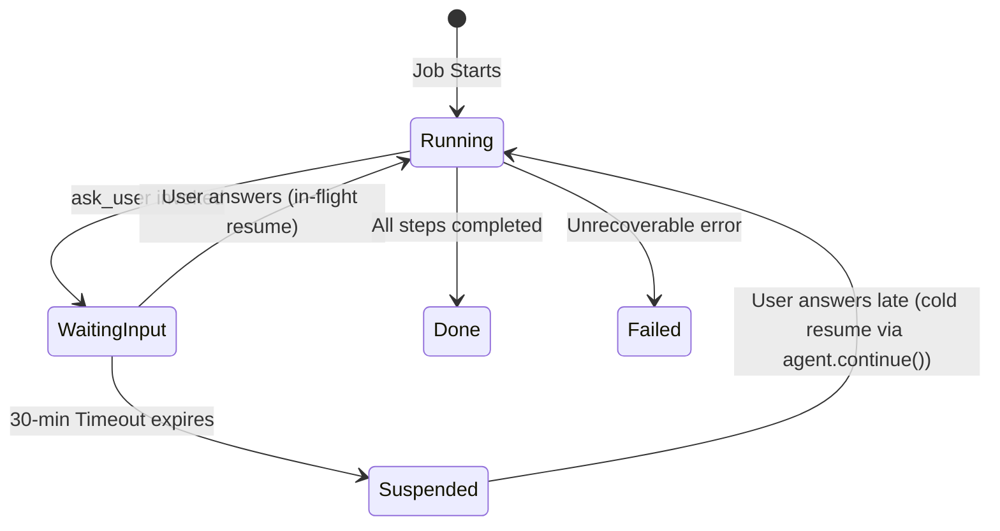
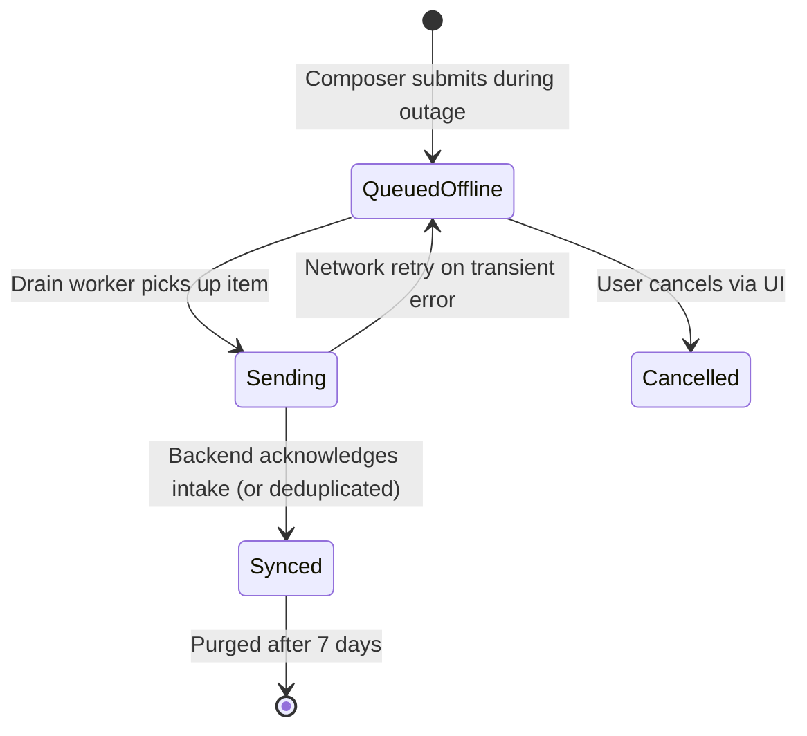

# Model: agent / app

Owning capabilities: `agent`, `job`, `app`, and `uix`. This model formalizes the conceptual entities, lifecycle transitions, and invariants governing mid-run user inquiries (`ask_user`) and local offline command queueing during backend disruption.

## Entities

| Entity | Meaning | Key Attributes | Relationships |
| --- | --- | --- | --- |
| **Ask Inquiry** | A structured inquiry emitted by an agent when key information is missing to complete a task. | `question`, `options` (0–4 items), `allow_free_text` | Emitted by a Worker Agent; presented to User via Pet Bubble or App Window. |
| **Inquiry Option** | A pre-computed quick choice presented to the user within an inquiry. | `id`, `label` (<= 30 chars), `description` | Belongs to exactly one Ask Inquiry. |
| **Inquiry Answer** | The user's response to an Ask Inquiry. | `option_id`, `text`, `source` ("bubble" / "app") | Supplied by User; resolves an Ask Inquiry. |
| **Pending Ask Slot** | A runtime tracking mechanism ensuring at most one inquiry is open per job. | `job_id`, `call_id`, `opened_at`, `status` | Owned by the Agent Runtime Harness (`AskUserManager`); 1:1 with an active Job in `waiting_input`. |
| **Decision Record** | An immutable audit log entry recording the inquiry and the user's answer. | `id`, `job_id`, `question`, `options`, `answer`, `source`, `timestamp` | Appended to the Ledger upon receiving an Inquiry Answer; protected by SQLite triggers. |
| **Offline Command** | A user instruction submitted through the Composer while the backend is unreachable. | `id`, `command_text`, `status`, `idempotency_key`, `created_at`, `synced_at` | Stored in SQLite `offline_command_queue`; drained to Backend Intake Endpoint. |
| **Idempotency Key** | A client-generated UUID guaranteeing exactly-once command intake at the backend. | `key_value` | Attached 1:1 to an Offline Command; recognized by Backend Intake. |
| **Disruption Notification** | A non-blocking UI alert and pet badge indicating active offline queueing. | `classification`, `explanation`, `action`, `is_blocking`, `badge_active` | Rendered by `uix` on App Window and Pet Window during backend outages. |

## Invariants

- **INV-AG-21** — At most one Ask Inquiry may be active for a job at any time; any second inquiry call emitted before the first is resolved is rejected by the runtime harness with code `MAX_ONE_PENDING_ASK_EXCEEDED`. · Rationale: prevents unbounded accumulation of unordered prompts that degrade user comprehension. · Source: `spikes/SP-21-ask-user-offline/REPORT.md` §1 Q2.
- **INV-AG-22** — An Inquiry Answer containing free text that contradicts all provided options is authoritative; the agent adopts the free text as ground truth without forcing option re-selection. · Rationale: user intent takes precedence over pre-computed agent options (Case E9). · Source: `spikes/SP-21-ask-user-offline/REPORT.md` §1 Q4.
- **INV-AG-23** — An Inquiry Answer is conversational transcript data only and cannot satisfy, override, or substitute for a cryptographic approval token or hard gate security hook. · Rationale: prevents evasion of deterministic security gates through conversational manipulation (Principle II). · Source: `spikes/SP-21-ask-user-offline/REPORT.md` §1 Q7; Constitution Principle II.
- **INV-JOB-06** — A job in `waiting_input` that exceeds the 30-minute inquiry timeout transitions to `suspended`, releasing in-memory promises and listeners. · Rationale: avoids leaking memory or leaving orphan background worker loops active indefinitely. · Source: `spikes/SP-21-ask-user-offline/REPORT.md` §1 Q6.
- **INV-JOB-07** — A suspended job resumes upon receiving a late answer by appending the answer to the session transcript and calling `agent.continue()`, executing subsequent steps with zero repetition of previously completed tool calls. · Rationale: idempotency and efficiency; preserves work already committed. · Source: `spikes/SP-21-ask-user-offline/REPORT.md` §1 Q3.
- **INV-APP-01** — Offline commands persist in `offline_command_queue` in the shared SQLite database (`desktop-assistant.db`) and survive process termination and restarts without data loss. · Rationale: guarantees user work is not silently lost when network or backend connectivity is interrupted. · Source: `spikes/SP-21-ask-user-offline/REPORT.md` §1 Q8, Q12.
- **INV-APP-02** — Queued offline commands drain in strict chronological FIFO order (`ORDER BY created_at ASC`) upon restoration of backend connectivity. · Rationale: preserves user causality across sequential commands. · Source: `spikes/SP-21-ask-user-offline/REPORT.md` §1 Q10.
- **INV-APP-03** — Retransmission of a queued command with an identical `idempotency_key` results in duplicate suppression at the backend, returning success without redundant command execution. · Rationale: network retries must not execute duplicate actions on external services. · Source: `spikes/SP-21-ask-user-offline/REPORT.md` §1 Q10.

## Lifecycle

### Job Inquiry & Suspension Lifecycle

### Offline Command Queue Lifecycle

## Variability

| Variability Point | Level | Extensible By | Contract | Notes (reserved: phase + rationale) |
| --- | --- | --- | --- | --- |
| Inquiry Option Count | closed | Core | `agent/contracts/ask-user@0.1.0` | 0 to 4 options enforced by schema |
| Option Label Length | closed | Core | `agent/contracts/ask-user@0.1.0` | Maximum 30 characters enforced by schema |
| Inquiry Timeout | closed | Core | `agent/contracts/ask-user@0.1.0` | Default 1,800,000 ms (30 minutes) |
| Offline Storage Backend | closed | Core | `app/contracts/offline-queue@0.1.0` | SQLite table `offline_command_queue` in `desktop-assistant.db` |
| Replicating Queued Commands | closed | Core | `app/contracts/offline-queue@0.1.0` | Deliberately excluded: unsent commands belong strictly to the accepting device until promoted to active jobs |

## Physical Resource & Artifact Topology

### 1. Physical Format & Storage
- **Storage Location & Path Layout**: Single SQLite database file at `app.getPath('userData')/desktop-assistant.db`, sharing the database with the ledger and jobs.
- **Serialization & Codec Format**: Structured SQLite table `offline_command_queue` with indexed `created_at` timestamp and unique `idempotency_key` string.
- **Physical Resource Budget**: Maximum resident memory footprint for pending inquiries: <= 5MB RAM for in-memory promises; max disk footprint for offline queue: <= 10MB (bounded at 1,000 offline commands before queue warning).
- **Lifecycle & Eviction**: Completed `SYNCED` entries in `offline_command_queue` are retained for 7 days for audit/traceability, then pruned via automated weekly vacuuming.

### 2. Physical Storage & Data Schema

The queue relation is held as a file beside the contract that owns it rather than transcribed here:
[`contracts/offline-queue.sql`](contracts/offline-queue.sql). The payload a queued command is eventually sent as
is [`contracts/offline-queue.schema.json`](contracts/offline-queue.schema.json), and the shape of an inquiry the
harness validates before showing it is [`contracts/ask-user.schema.json`](contracts/ask-user.schema.json). What
this model keeps is what a schema file cannot say: what replicates, what is removed and when.

| Store | Physical schema file | Owning contract | Retention / migration posture |
| --- | --- | --- | --- |
| Offline command queue, in the device database beside the ledger and the jobs | `contracts/offline-queue.sql` | `app/contracts/offline-queue` | **Device-bound and never replicated**: a command the backend has not accepted is not yet a job, and carrying one to a second device would mean two devices racing to submit the same intention. Rows that reached `SYNCED` are retained for seven days for traceability and then pruned; the closed status set means a future status value is a schema change rather than a row a drain worker cannot interpret |
| Intake payload | `contracts/offline-queue.schema.json` | `app/contracts/offline-queue` | Not stored. It is the shape a queued command takes when it is finally sent, and it is the same shape a command sent immediately takes — the idempotency key is what lets the backend tell a retry from a second command |
| Open inquiry | `contracts/ask-user.schema.json` | `agent/contracts/ask-user` | Held in memory for the life of the open ask, with the job row carrying which call is waiting so a restart finds it. Not replicated. The answer, once given, becomes a decision record and is durable under the ledger's own rule |
| Decision records for answered inquiries | — | `ledger/contracts/ledger-record` | Owned by `req-013-sqlite-ledger` and not declared here. Append-only, which is why an answer can be shown afterwards exactly as it was given |

### 3. State-to-Artifact Mapping Matrix
| State / Event / Workflow | Physical Artifact / File / Slot | Identifier / Handler / Entry Point | Constraint Notes |
| --- | --- | --- | --- |
| `QUEUED_OFFLINE` | `desktop-assistant.db` / `offline_command_queue` | `id` (UUIDv4), `idempotency_key` | Single transaction with Composer submission |
| `waiting_input` | In-memory `AskUserManager` + SQLite `jobs` table | `job_id`, `call_id` | Enforces max 1 pending ask per job |
| `suspended` | SQLite `jobs` table + Session transcript log | `job_id` | In-memory promise deallocated |
| `decision` | `desktop-assistant.db` / `decisions` table | `id` (UUIDv4) | Protected by append-only triggers |
| Disruption Card | Pet Window / App Window Renderer | `SYSTEM_CARD_DISRUPTION` | Non-blocking, pinned badge |

## Manifest Schema

Not applicable — this change introduces internal agent tools and core offline queueing mechanisms, not third-party plugin or connector manifests.

## Trust Boundary

- **Inquiry Free-Text Input**: Untrusted conversational content from the user. Evaluated by LLM reasoning for task parameters, but strictly isolated from security authorization. Hard gates and approval hooks evaluate independently at the tool execution wrapper.
- **Offline Command Payloads**: User input entered via Composer. Validated upon submission, stored locally, and transmitted over TLS with client-generated `idempotency_key` to prevent tampering or replay attacks.

## Relations

- `agent/contracts/ask-user@0.1.0`: defines the schema and runtime gate for the inquiry tool.
- `app/contracts/offline-queue@0.1.0`: defines the schema, table DDL, and drain protocol for offline commands.
- `job/contracts/job-lifecycle@0.1.0`: defines state transitions between `running`, `waiting_input`, and `suspended`.
- `ledger/contracts/ledger-record@0.1.0`: defines append-only persistence for `decision` records.
