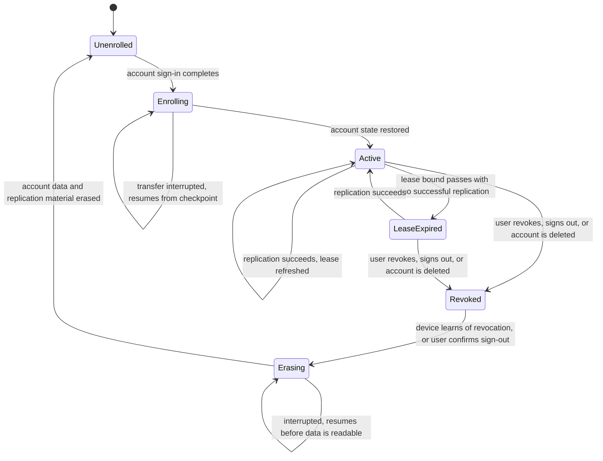

# Model: sync

Owning capability: `sync`. Entities belonging to `backend`, `ledger`, `connector`, `platform` and `app` are
referenced here only where replication constrains them; each remains owned by its own capability and is reached
through that capability's contracts. No capability in this project has a `model.md` yet, so this is written in
full form rather than as a delta.

## Entities

| Entity | Meaning | Key Attributes | Relationships |
| --- | --- | --- | --- |
| Account | The owner of all replicated data. The unit of isolation: nothing crosses from one account to another. | Account identifier, identity-provider subject, allowlist activation state, deletion state | Owns many Devices; owns one Replicated Data Set |
| Device | One installation of the product enrolled to an account. The unit of enrolment, revocation and local working copy. | Device identifier, human-recognisable label, enrolment time, last successful replication, enrolment state | Belongs to one Account; holds one Local Working Copy; holds zero or one Lease; writes Records under its own Device Sequence |
| Device Registry | The account's list of enrolled devices, held by the backend and served to every signed-in device. | Set of Devices with their states | Belongs to one Account; read by every Device; the authority for revocation |
| Replicated Store | One named body of account data that replicates as a unit and declares how it resolves conflicts. The extension point of this model. | Store identifier, store version, ordering basis, resolution rule, retention rule, membership | Belongs to the Account's Replicated Data Set; described by one Store Descriptor; contains many Records |
| Store Descriptor | The declaration that makes a Replicated Store participate in replication. Without it a store does not replicate. | Store identifier, version, resolution rule, ordering basis, retention rule, encryption class | Describes exactly one Replicated Store |
| Record | One unit of replicated data within a store — a job, a ledger record, a snapshot, a transcript turn, a rule, a configuration value, a connector authorisation. | Record identifier, owning store, originating device, device sequence number, causal position, recorded time, payload, version | Belongs to one Replicated Store; originates on one Device |
| Device Sequence | The monotonic counter a device stamps on each Record it originates. The ordering basis that does not depend on any clock. | Device identifier, current position | Belongs to one Device; stamped on every Record that device originates |
| Superseded Version | The losing version of a mutable Record after conflict resolution, preserved rather than discarded. | Record identifier, superseded payload, superseding version, originating device, resolution position | Derived from one Record; appended to the ledger store |
| Replication Checkpoint | How far a device and the backend agree, so an interrupted transfer resumes instead of restarting. | Device identifier, store identifier, agreed position, last successful exchange | Held per Device per Replicated Store |
| Lease | The bounded right of a Device to use replicated connector authorisation, refreshed by successful replication. | Device identifier, issued position, expiry bound, state | Held by one Device; derived from that Device's Replication Checkpoints |
| Encryption Key | The service-managed means of decrypting an account's stored Records. Held by the backend, never by the user. | Key identifier, account scope, state, rotation position | Protects one Account's stored Records; every use produces an Access Audit Record |
| Access Audit Record | The immutable evidence that a key was used, by which path, for which account, when. | Account identifier, key identifier, requesting path, time, outcome | Produced by every Encryption Key use; not modifiable by the path that caused it |
| Local Working Copy | The device-resident copy the product actually reads and writes, which keeps working when the backend does not. | Device identifier, per-store contents, unreplicated extent | Held by one Device; mirrors the Account's Replicated Data Set |

## Invariants

Only invariants that are not externally observable are held here. Everything a user or a test can observe —
enrolment from sign-in alone, append-and-reconcile, consistent ordering, preservation of superseded versions,
lease expiry, erasure on sign-out, account isolation — is written as a requirement in
`specs/sync/spec.md`, `specs/ledger/spec.md`, `specs/backend/spec.md`, `specs/connector/spec.md`,
`specs/platform/spec.md` and `specs/app/spec.md`.

- **INV-SYNC-01** — Every Record belongs to exactly one Replicated Store and exactly one Account, and neither
  association changes for the life of the Record. · Rationale: the account association is the isolation boundary
  and the store association selects the resolution rule; a Record able to move between them would be a Record
  whose resolution rule and isolation could change underneath it. · Source: `specs/sync/spec.md` requirements on
  the replicated set and on serving one account.
- **INV-SYNC-02** — A Replicated Store participates in replication only while a Store Descriptor names it, and a
  Descriptor names exactly one Store. · Rationale: this is what makes the store set an extension point rather
  than a hard-coded list, and what prevents a store from replicating under an inherited default rule. · Source:
  `specs/sync/spec.md`, requirement that each store declares its own rule.
- **INV-SYNC-03** — A Store Descriptor declares exactly one resolution rule, and that rule is one of
  append-and-reconcile or last-writer-wins-with-preservation. · Rationale: two rules for one store, or a rule
  outside the closed set, would make the outcome of a conflict depend on which path resolved it. · Source:
  `docs/spec/changes/req-022-account-sync/clarifications.md` Q-1.
- **INV-SYNC-04** — A Store whose encryption class is append-only declares append-and-reconcile; it is not
  expressible for the ledger or transcript stores to declare last-writer-wins. · Rationale: principle III is
  absolute, and RISK-065 records that the failure mode is silent history loss; the model forecloses it at the
  descriptor rather than relying on review. · Source: `docs/spec/constitution.md` principle III; RISK-065.
- **INV-SYNC-05** — A Device Sequence position, once stamped on a Record, is never reused by that Device, and
  positions are never reassigned between Devices. · Rationale: the sequence is the ordering basis; a reused
  position makes two distinct Records indistinguishable in order and corrupts the reading undo depends on. ·
  Source: `specs/ledger/spec.md`, requirement carrying device and sequence.
- **INV-SYNC-06** — Recorded time is carried on every Record and participates in no ordering computation. ·
  Rationale: device clocks are not trustworthy across machines, and RISK-068 records reordering as the
  consequence; keeping the attribute while forbidding its use in ordering is what lets the user still read when
  something happened. · Source: `docs/spec/changes/req-022-account-sync/clarifications.md` Q-2; RISK-068.
- **INV-SYNC-07** — A Lease is derived from the Device's own Replication Checkpoints and is not independently
  settable. · Rationale: if a Lease could be extended by any path other than a successful exchange with the
  backend, an offline or revoked Device could extend its own right to act, which is the window RISK-066 exists to
  bound. · Source: `docs/spec/changes/req-022-account-sync/clarifications.md` Q-3; RISK-066.
- **INV-SYNC-08** — Every use of an Encryption Key produces exactly one Access Audit Record, and no path can
  produce a key use without one or modify the Record its own use produced. · Rationale: the audit record is the
  whole of the privacy boundary that principle VII claims, per RISK-062; a use that can escape or edit its own
  audit makes the claim false. · Source: `docs/spec/constitution.md` principle VII; RISK-062.
- **INV-SYNC-09** — A Replication Checkpoint is per Device and per Replicated Store, never per Account. ·
  Rationale: stores replicate at different rates and one store failing must not force another to restart; a
  per-account checkpoint would couple them. · Source: `specs/sync/spec.md`, resumable-enrolment scenario.
- **INV-SYNC-10** — A Superseded Version references both the Record it belongs to and the version that displaced
  it, and is itself held in an append-only store. · Rationale: a preserved version that can be lost or edited
  preserves nothing; holding it append-only is what makes the Q-1 resolution honest rather than nominal. ·
  Source: `docs/spec/changes/req-022-account-sync/clarifications.md` Q-1.

## Lifecycle

The Device is the entity with a conceptual state machine; every other entity in this model is either immutable
once written or has a two-state existence.

`Revoked` is reached and enforced at the backend whether or not the device is reachable; `Erasing` is the
device's own obligation and is the second line rather than the first. A device in `LeaseExpired` still reads and
writes its Local Working Copy — only the use of replicated connector authorisation stops.

## Variability

| Variability Point | Level | Extensible By | Contract | Notes (reserved: phase + rationale) |
| --- | --- | --- | --- | --- |
| The set of Replicated Stores | open | A new Store Descriptor, without changing the replication protocol | `sync/contracts/replicated-store-descriptor` | The extension point of this model. A store with no descriptor is refused rather than defaulted. |
| Resolution rule choice per store | closed | — | `sync/contracts/replicated-store-descriptor` | Exactly two rules exist: append-and-reconcile, last-writer-wins-with-preservation. A third requires a change, because each carries a distinct guarantee to the user. |
| Ordering basis | closed | — | `sync/contracts/replication-protocol` | Per-device sequence with causal ordering. Wall-clock ordering is not selectable, by INV-SYNC-06. |
| Replication transport and exchange shape | closed | — | `sync/contracts/replication-protocol` | One protocol serves every store; stores vary by descriptor, not by transport. |
| Device registry and revocation | closed | — | `sync/contracts/device-registry` | Revocation is backend-enforced; no device-side extension point exists, deliberately. |
| Identity provider | closed | — | `backend` capability | Google Sign-In, unchanged by this change. Principle VII makes it the sole gate, which RISK-064 records. |
| Encryption key custody granularity | reserved | — | `sync/contracts/replication-protocol` | Phase: after the closed beta. MVP holds keys at service scope. The reserved slot is per-account key separation, which narrows the blast radius in RISK-062. Activation condition: the first of either a beta population large enough that a single key compromise is not an acceptable loss, or a data-residency obligation arising from RISK-067 that requires per-account or per-region key scoping. |
| Payload compression for replicated snapshots | reserved | — | `sync/contracts/replication-protocol` | Phase: after SP-22 sizing. `spikes/SP-12-sqlite-ledger/REPORT.md` §1 Q5 measured 44.5 percent reduction on snapshot payloads with general-purpose compression and deliberately left it unapplied, because per-device volume did not justify the loss of direct inspectability. Activation condition: SP-22 measures an account-total or transfer volume that does justify it. |

## Physical Resource & Artifact Topology

### 1. Physical Format & Storage

- **Storage Location & Path Layout**: account data exists in two places. On each device, the Local Working Copy
  lives in the application's per-user data directory as the authoritative copy for that device's work, with
  replication material and connector authorisation held instead in the operating system's secure storage, never
  in that directory. On the backend, the Account's Records are held in the server-side store partitioned by
  account identifier, so that one account's Records are separable as a unit for service and for deletion.
- **Serialization & Codec Format**: Records carry a structured payload plus replication metadata — originating
  device, device sequence position, causal position, recorded time, store identifier, version. The device-side
  representation is the ledger's existing text-structured payload, measured in `req-013-sqlite-ledger` and left
  uncompressed there deliberately. The backend-side representation is the same payload held encrypted at rest;
  encryption is applied to the payload, while the replication metadata needed to route, order and resolve a
  Record remains readable to the replication path, since ordering and conflict resolution must not require
  decrypting content — INV-SYNC-06 and the backend requirement that resolution does not interpret content.
- **Physical Resource Budget**:
  - Per-device ledger volume over a 90-day retention period is **VERIFIED**: 12.36 MB at 1,800 jobs and
    30.83 MB at 4,500 jobs, with detail-query latency p50 between 0.13 ms and 0.25 ms, measured on both ext4 and
    NTFS — `spikes/SP-12-sqlite-ledger/REPORT.md` §1 Q5, the storage and query table.
  - The account total is **UNVERIFIED**. It is the reconciled union of every enrolled device's Records rather
    than one device's volume, and transcripts — added to the replicated set by Q-4 — were not part of what SP-12
    measured. RISK-069 records this gap. No per-account, per-device or transfer budget is stated here, because
    stating one would be an invented threshold; SP-22 sources them and `verification.md` carries them.
  - Resident memory and transfer ceilings during enrolment and steady-state replication are likewise
    **UNVERIFIED** and assigned to SP-22. The constraint that is known now is structural rather than numeric:
    enrolment must resume from a Replication Checkpoint rather than restart, which means neither side may require
    the whole account state to be resident at once.
- **Lifecycle & Eviction**: Records are removed by the ledger's retention rule, which Q-4 extends to transcripts
  and which applies to the account across every device and the backend rather than to one store. Eviction is by
  retention period and by deliberate user deletion only; there is no capacity-driven eviction, because a Record
  silently dropped for space would break the append-only guarantee as surely as one overwritten. Replication
  material and connector authorisation are disposed on sign-out, on revocation, and on account deletion.
  Encryption Keys are destroyed with the account they protect.

### 2. Physical Storage & Data Schema

Account data exists in three physical shapes, each owned by the contract that owns its surface, and none of
them transcribed here. What this model keeps is what a schema file cannot say — which shape is authoritative
for what, what leaves and when, and what a device may hold once it is no longer part of the account.

| Store | Physical schema file | Owning contract | Retention / migration posture |
| --- | --- | --- | --- |
| The account's replicated records on the backend, partitioned by account, with the per-device per-store checkpoint and the key-access audit | `contracts/replication-protocol.sql` | `sync/contracts/replication-protocol` | Removed by the retention rule the Store Descriptor declares, account-wide rather than per device, and by deliberate user deletion. Destroyed with the account together with the keys that would decrypt it, so a surviving backup artifact stays unreadable. Audit records refuse their own modification |
| The device's Local Working Copy of the same records | `docs/spec/changes/req-013-sqlite-ledger/contracts/ledger-store.sql` | `ledger/contracts/ledger-store` | Owned by `req-013-sqlite-ledger` and not restated here. It is the working copy each device runs from; replication carries records between it and the store above |
| The account's device rows the registry presents and revokes | `docs/spec/changes/req-020-backend-slice/contracts/client-session-api.sql` | `backend/contracts/client-session-api` | Owned by `req-020-backend-slice`. `sync/contracts/device-registry` governs what may be done with those rows; duplicating them here would give one relation two owners |
| Replication material and connector authorisation on the device | `docs/spec/changes/req-012-secure-storage/contracts/secure-storage.sql` | `platform/contracts/secure-storage` | Held in the device's credential store, never in the application data directory. Disposed on sign-out, on revocation and on account deletion |
| The record payload carried between all of them | `docs/spec/changes/req-013-sqlite-ledger/contracts/ledger-record.schema.json` | `ledger/contracts/ledger-record` | Encrypted at rest on the backend; the replication metadata that routes, orders and resolves a record stays outside the ciphertext, because resolution must never require decrypting content |

Volumes are deliberately absent from this section. The per-device figure is verified and recorded in
`req-013-sqlite-ledger`; the account total across devices is UNVERIFIED and belongs to SP-22, and stating one
here would be an invented threshold.

### 3. State-to-Artifact Mapping Matrix

| State / Event / Workflow | Physical Artifact / File / Slot | Identifier / Handler / Entry Point | Constraint Notes |
| --- | --- | --- | --- |
| Device enrolment from sign-in | Local Working Copy, created per store | Device identifier plus per-store Replication Checkpoint | Resumable by checkpoint; partial state is never presented as complete |
| Job execution on the creating device | Local Working Copy, ledger and transcript stores | Job identifier, Device Sequence position | Writes proceed while the backend is unreachable; execution never moves to another device |
| Ledger append | Local Working Copy, then the backend's encrypted store | Record identifier, originating device, sequence position | Append-and-reconcile only; INV-SYNC-04 forecloses any other rule for this store |
| Mutable record edit | Local Working Copy for the owning store | Record identifier and version | On conflict, the losing payload becomes a Superseded Version in the append-only ledger store |
| Conflict resolution at the backend | Encrypted store, plus an appended Superseded Version | Store Descriptor's declared rule | Resolution reads replication metadata only, never decrypted payload content |
| Connector authorisation use | Operating-system secure storage on the device | Connector identifier, Lease state | Refused once the Lease expiry bound passes with no successful replication |
| Key use to serve replication | Encryption Key, plus one Access Audit Record | Account identifier, key identifier, requesting path | INV-SYNC-08: no key use without its audit record, and no self-modification of it |
| Retention expiry | Records and the image extracts they reference, on every device and the backend | Retention rule from the Store Descriptor | Applies account-wide; an offline device applies it on reconnection rather than replicating expired Records back |
| Sign-out or revocation | Local Working Copy and secure-storage material, erased | Device identifier | Unreplicated extent is stated to the user before erasure; erasure resumes if interrupted |
| Account deletion | Backend partition and its Encryption Keys, destroyed | Account identifier | Keys are destroyed with the data, so a surviving backup artifact stays unreadable |

## Manifest Schema

The Store Descriptor is the manifest that makes the replicated store set an `open` variability point. Its
normative shape is [`replicated-store-descriptor.schema.json`](./contracts/replicated-store-descriptor.schema.json).
The replication protocol reads it and applies what it declares; it holds no knowledge of any particular store.

### Required Fields

| Field | Type | Description |
| --- | --- | --- |
| `store_id` | identifier | Names the Replicated Store. Stable for the life of the store, since Records reference it and INV-SYNC-01 forbids reassociation. |
| `version` | version | Version of this descriptor, so a change in resolution or retention is a versioned event with consumers rather than a silent edit. |
| `name` | text | Human-recognisable name, used where the product tells the user what is replicating or what sign-out erases. |
| `resolution_rule` | enumeration | One of append-and-reconcile, last-writer-wins-with-preservation. Constrained by INV-SYNC-03 and INV-SYNC-04. |
| `ordering_basis` | enumeration | The basis on which this store's Records order. Wall-clock is not an available value, by INV-SYNC-06. |
| `encryption_class` | enumeration | Whether the store is append-only or mutable. Determines which resolution rules are admissible and whether Superseded Versions can arise. |
| `retention_rule` | reference | The retention that governs this store's Records, expressed as a period and whether it is user-configurable. |
| `membership` | description | What belongs in this store, so that the replicated set stated in `specs/sync/spec.md` is checkable against the descriptors rather than asserted. |

### Optional Fields

| Field | Type | Description |
| --- | --- | --- |
| `superseded_target` | identifier | For a mutable store, the append-only store that receives its Superseded Versions. Absent only where the store's rule cannot produce one. |
| `erase_on_signout` | flag | Whether this store's Records are erased from a device on sign-out. Absent means erased, since account data on a signed-out device is the case that needs justification, not the default. |
| `capabilities` | list | Optional replication behaviours the store supports, such as partial transfer during enrolment. Absent means the protocol's baseline behaviour. |

### Discovery & Registry

Descriptors are registered with the replication protocol at the point a store is introduced, and the registered
set is the authority for what replicates. The protocol enumerates registered descriptors rather than scanning
for stores, so a store that exists on a device but holds no registered descriptor is invisible to replication by
construction rather than by omission. The registry is carried in the `sync` capability's contract so that both
sides of the client/backend boundary read the same declaration.

### Fallback on Missing Manifest

There is none, deliberately. A store presented for replication with no descriptor, with a malformed one, or with
a descriptor missing any required field is refused, and the refusal is reported rather than silently skipped.
The alternative — a default rule — is exactly the failure INV-SYNC-04 exists to prevent, because the default
that is convenient for a mutable store is the one that destroys history in an append-only store. Refusal is a
visible failure at introduction time; a default would be an invisible one at conflict time.

## Trust Boundary

- **Records arriving through replication are untrusted input to the receiving device.** They originate on another
  device, and a device may be compromised, may be running an older version of the product, or may have been
  revoked while offline and still be pushing. A receiving device validates a Record's store membership, its
  originating device against the Device Registry, and its sequence position, and it applies the store's declared
  resolution rule. It does not treat a replicated Record as an instruction: a replicated ledger record describes
  work that was done elsewhere and never causes the receiving device to perform a tool call, which is what the
  job-pinning requirement in `specs/sync/spec.md` makes observable.
- **The backend is trusted to serve and not trusted to be private in the cryptographic sense.** Principle VII
  states this outright: because sign-in alone must be sufficient for recovery, the service holds the means to
  decrypt, so the boundary is operational — confined key access, least privilege, audited access. RISK-062
  records the accepted consequence, and RISK-063 records that no mechanism prevents the key path from widening
  over time; the controls are enforced by review and by the audit record, which is why INV-SYNC-08 makes the
  audit record inescapable and self-protecting.
- **A device's own Lease claim is untrusted by the backend.** The Lease bounds what a device may do while it
  cannot be reached; it is not a credential the device presents to gain anything. Revocation is enforced at the
  backend independently, so a device that lies about its Lease gains only local behaviour against an
  authorisation the backend has already stopped honouring.
- **Content inside replicated Records remains data, never instructions**, exactly as the constitution's External
  Content Is Data section requires. Replication moves connector-fetched content and user input between devices;
  passing through replication grants it no authority it did not have when it was first ingested.
- **Account identity is now the sole gate on the entire history.** RISK-064 records this as the direct
  consequence of the amendment: what was previously bounded by possession of a machine is now bounded by an
  identity-provider account, and the device registry exists so the user can see and revoke what that gate has
  admitted.

## Relations

| External entity | Owning capability | Reached through | Constraint |
| --- | --- | --- | --- |
| Ledger record, snapshot, retention rule | `ledger` | `ledger/contracts/ledger-record` | `sync` replicates records and never authors or edits one; append-and-reconcile is the only rule admissible for this store |
| Connector authorisation | `connector` | `connector/contracts/connector-manifest` | `sync` replicates the authorisation as an opaque Record; scope, refresh and revocation at the platform stay owned by `connector` |
| Device-local secure storage | `platform` | `platform/contracts/secure-storage` | Replication material and connector authorisation are held there, never in the application data directory |
| Session issuance and the encrypted store | `backend` | `backend` capability requirements | `sync` owns the replication protocol and the device registry as contracts; `backend` owns their server-side persistence, key custody and enforcement, and is a consumer of both |
| Job record and its execution state | `job` | `job/contracts/job-record` | Replicated for visibility only; execution stays pinned to the originating device, so the in-process object lock and rate queue measured in `req-015-concurrency-coordinator` remain in-process |
| Sync state surface, device list, revocation action | `app` | `app` capability requirements | `sync` supplies state and actions; presentation and confirmation wording are owned by `app` |
