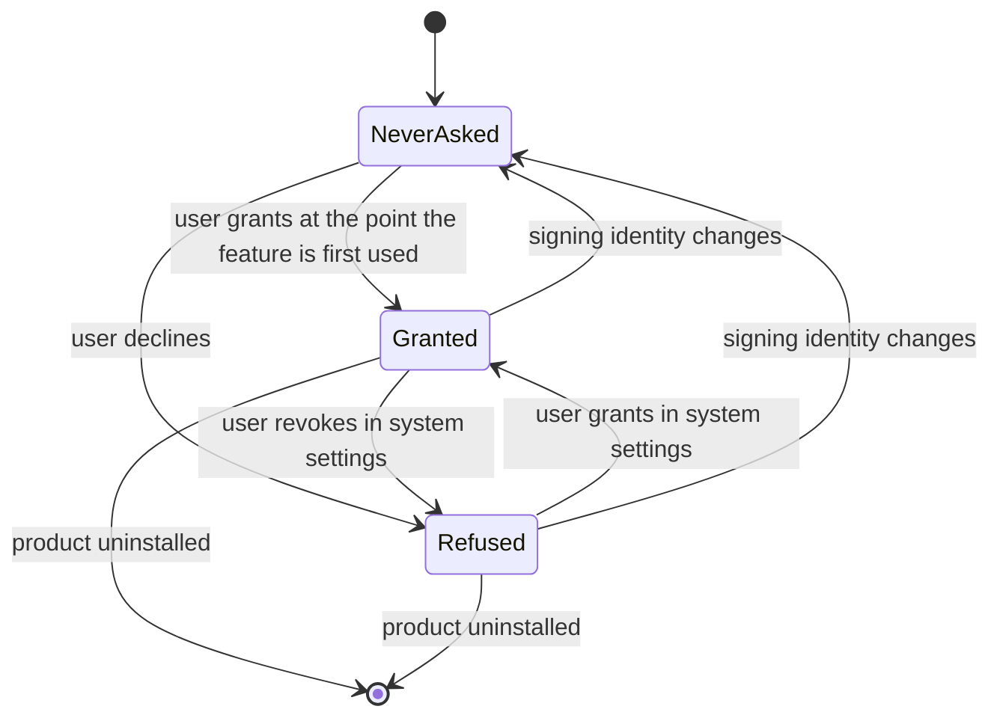

# Model: platform, ledger, pet, app, uix, backend (macOS delta)

This change adds no entity. It makes explicit two attributes of entities the existing models already carry —
the operating system a device runs, and the signing identity a build is distributed under — because macOS
behaviour turns on both. Sections below are in delta form against the existing capability models.

## ADDED Entities

| Entity | Meaning | Key Attributes | Relationships |
| --- | --- | --- | --- |
| Signing identity | The identity a distributed build is signed with, which the operating system uses to decide whether the build is the same application as the one it granted things to | issuer class (development or distribution), stability across releases, notarisation state | A build carries exactly one. The device's stored credentials and its granted permissions are held against the identity of the build that obtained them. |
| Permission grant | A privacy permission the user has given the installed product on this device | subject (what it allows), state (granted, refused, never asked), the signing identity it was granted to | Held by a device, against a signing identity. A feature depends on zero or more; the product's core behaviour depends on none. |

## ADDED Invariants

- **INV-PLATFORM-20** — A device's stored credentials and its permission grants are readable only by a build
  whose signing identity matches the one they were established under. · Rationale: the operating system, not
  the product, enforces this binding, so the product cannot recover from breaking it and must instead never
  break it. · Source: `spikes/SP-11-secure-storage/macos/REPORT.md` §1 Q3;
  `spikes/SP-22-macos-permissions/REPORT.md` §4.
- **INV-PLATFORM-21** — The set of permission grants the product's core behaviour depends on is empty. ·
  Rationale: a permission can be refused, and a core that depends on one is a core that can be refused; keeping
  the set empty is what makes a refusal a feature-level event rather than a product-level one. · Source:
  `spikes/SP-22-macos-permissions/REPORT.md` §0.
- **INV-LEDGER-20** — A record is durable when the storage hardware has it, not when the operating system says
  so. · Rationale: the two differ on macOS, and Principle III rests on the former; this invariant is not
  externally observable on its own, which is why the observable consequence is stated as a requirement instead.
  · Source: `spikes/SP-12-sqlite-ledger/macos/REPORT.md` §1 Q3.
- **INV-PET-20** — Window presentation that does not activate the application is a property of the window's
  own kind, not of the moment it is shown. · Rationale: it explains why the guarantee holds on macOS for both
  a still and a moving pet without per-event handling, and why the equivalent on Windows needs an extended
  style applied by native code. · Source: `spikes/SP-7-pet-window-os/macos/REPORT.md` §1 Q1.

## Lifecycle

The permission grant is the only entity added here with more than two states.

The transition back to `NeverAsked` on a change of signing identity is the reason this change specifies
identity continuity across updates: from the operating system's point of view the updated build is a different
application that has never asked for anything.

## Variability

| Variability Point | Level | Extensible By | Contract | Notes (reserved: phase + rationale) |
| --- | --- | --- | --- | --- |
| Native window integration module | open | The platform, one implementation per operating system | The product-facing window behaviour specified in `platform` and `pet`; no third-party surface | Two implementations exist, Win32 and AppKit. They share no code and are selected by the operating system, which is what keeps the platform difference out of the rest of the design. |
| Store durability setting | closed | — | — | Determined by the operating system's flush semantics, not configurable by the user or by a third party. Exposing it would let a deployment turn off Principle III. |
| Permission-dependent feature | reserved | — | — | Reserved for M3, when screen awareness arrives. The slot exists now so that the requirement keeping the core free of permissions is written before the first feature needs one, rather than after. |
| Update package format per operating system | open | The release pipeline | `backend` update manifest | Each operating system's updater dictates the format it can install; adding an operating system adds a manifest and a format, not a change to the clients that already work. |

## Physical Resource & Artifact Topology

**Physical formats and storage.** The ledger and job stores are the only stores this change constrains. On
macOS they are opened so that a commit reaches durable media before it is reported; on Windows and Linux the
existing setting already carries that meaning. No file format changes and no data is rewritten, so a store
written by one setting is readable by the other.

**Resource budgets.** The durable setting is what this change costs, and it is a throughput budget rather than
a space budget: 241 ledger commits per second on the measured machine against 28,000 without it, with the
median commit taking 4.033 ms rather than 0.028 ms. The budget is sufficient because a ledger commit
accompanies a tool call whose own latency runs to hundreds of milliseconds; it is not sufficient for any design
that writes the ledger in a tight loop, and such a design would have to be reconsidered rather than the setting
relaxed.

**Distribution artifacts.** A macOS release produces one archive and one disk image per processor
architecture. The archive is what the updater installs; the disk image is what a user downloads by hand. A
combined-architecture package may exist as a manual download and is not offered through the update feed.

**Lifecycle and eviction.** Unchanged. This change adds no data that is stored and later evicted.

**State-to-artifact mapping.** A permission grant and a stored credential are held by the operating system
against the signing identity, not in any file the product owns, which is why neither survives a change of
identity and why neither can be backed up by copying a file.

## Manifest Schema

Not applicable. The update manifest is an existing contract of the `backend` capability; this change adds
per-operating-system and per-architecture entries to it rather than a new descriptor format.

## Trust boundary

Untrusted inputs are unchanged by this change. Two consequences are worth stating. The permission state is read
from the operating system and is authoritative over anything the product believes about it, so a feature checks
before it acts rather than trusting a stored flag. The signing identity of a downloaded update is verified by
the operating system's updater before installation, so a package that fails verification never reaches the
point where it could touch stored credentials.

## Relations

`ledger` relates to `platform` only through the durability obligation stated in its own requirements; it does
not read the operating system anywhere else. `pet` and `app` reach the native window integration module through
the product-facing behaviour specified in `platform`, not through an operating-system interface of their own.
`backend` publishes the update manifest that the desktop client consumes, and this change widens the manifest's
key from one dimension to two — operating system and architecture — without altering who owns it.
