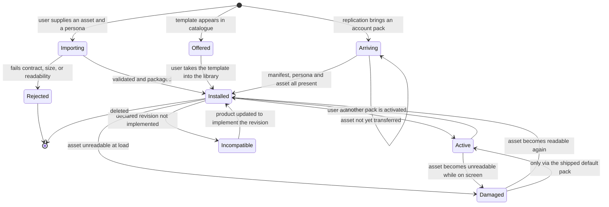

# Model: pet

## Entities

| Entity | Meaning | Key Attributes | Relationships |
| --- | --- | --- | --- |
| Pet Pack | The unit the product ships, the user creates, and the account owns. A pack is what gets activated; nothing below it is activatable on its own | identity, display name, author, pack version, provenance, targeted contract major revision, declared capability set | Holds exactly one Pack Manifest, one Animation Asset and one Persona Specification; belongs to a Pack Library |
| Pack Manifest | The declaration that makes a pack a pack: who it is, what it implements, and which interface revision it was authored against | identity, name, version, author, targeted contract major revision, declared capabilities, asset reference, asset digest | Describes one Animation Asset and one Persona Specification; validated against `pet/contracts/pet-pack-manifest` |
| Animation Asset | The compiled binary carrying the character's artboard and its state machine layers | binary content, size, digest | Referenced by one Pack Manifest; satisfies `pet/contracts/rive-state-machine` |
| Persona Specification | The pet's voice: who it is and how it speaks. The artifact the living pet specification has always referred to and never had | name, supported languages, fallback language, talkativeness, character description, acknowledgement line set | Belongs to one Pet Pack; consumed by the pet-agent as advisory input only |
| Acknowledgement Line Set | The localised receipt lines the product may present without a model, one group per supported language | language, lines | Part of one Persona Specification |
| Capability Declaration | What a pack claims to implement, layer by layer, so that absence is known before activation rather than discovered at render time | capability identity, declared, present-in-asset | Belongs to one Pack Manifest; drives per-capability substitution |
| Pack Library | The set of packs available to one account on one device, holding both provenances side by side | templates, account packs, arrival state per pack | Contains Pet Packs; one per account per device |
| Active Pack Selection | Which pack the account has chosen. Account-level, so it replicates and is not a property of a machine | selected pack identity, selected at | References one Pet Pack; part of the account's configuration |
| Provenance | Where a pack came from, which fixes what may be done to it | `built-in-template` or `account-pack` | An attribute of a Pet Pack, immutable for its lifetime |

## Invariants

- **INV-PACK-01** — A pack's provenance never changes. Deriving a pack from a built-in template produces a new pack with its own identity rather than converting the template. · Rationale: a template is the product's data and an account pack is the user's; a mutable provenance would make it undecidable whether a release may overwrite a pack, and whether deleting an account destroys it. · Source: `specs/pet/spec.md` requirement "A built-in template is read-only and a copy of it is independent".
- **INV-PACK-02** — Capability substitution always terminates at the shipped default pack. Every substitution chain is one step: the activated pack, or the shipped default for that capability alone. · Rationale: a chain that could substitute one custom pack's capability with another's would make the rendered result depend on library order, and no user could predict what their pet does. · Source: `specs/pet/spec.md` requirement "A pack declares which animation capabilities it implements and degrades per capability".
- **INV-PACK-03** — Persona text occupies only positions in the agent's input that the harness treats as advisory. It is never composed into a position from which the approval gate or any tool selection reads. · Rationale: this is the structural counterpart of the observable requirement; the observable form says a persona cannot cause an action, and this says why it cannot — the text has no path to the gate, rather than being filtered on the way. · Source: `docs/spec/constitution.md` principle II and §External Content Is Data; `specs/pet/spec.md` requirement "Persona text is advisory and cannot reach the approval gate".
- **INV-PACK-04** — At most one pack is active per account, and at least one pack is resolvable at all times. · Rationale: the pet is a single on-screen entity, and the product has no state in which it has no character to draw. · Source: `specs/pet/spec.md` requirement "The pet is never absent because of a pack failure".
- **INV-PACK-05** — The shipped default pack is not a member of the deletable set and is present on every installation. · Rationale: it is the terminus of INV-PACK-02 and INV-PACK-04; making it deletable would make both unsatisfiable. · Source: `req-005-electron-rive-pet-render/model.md` §Physical Storage & Data Schema, carried forward.
- **INV-PACK-06** — A pack's declared capability set is a claim, and the asset is the authority. Where they disagree, the asset decides and the declaration is treated as absent for that capability. · Rationale: a declaration is authored text and can be wrong or stale; substituting on the strength of a claim the asset cannot honour would render nothing where the user was told something would render. · Source: `specs/pet/spec.md`, scenario "A pack declares a capability it does not contain".
- **INV-PACK-07** — A pack is presented by activation, never by the state of a file. Replacing an asset on disk under an already-loaded pack changes nothing until an activation occurs. · Rationale: `req-005-electron-rive-pet-render` allowed a bare file swap to change the character, which under a pack model would let the manifest and the rendered character disagree with nothing recording that they had. · Source: `specs/pet/spec.md`, scenario "The asset changes on disk without an activation".

## Lifecycle

`Rejected` and `Incompatible` are distinct terminal readings deliberately: the first says the supplied file is
not a pack, the second says it is a pack this build cannot present. They lead to different user actions, which
is why the specification requires them to be reported differently.

## Variability

| Variability Point | Level | Extensible By | Contract | Notes (reserved: phase + rationale) |
| --- | --- | --- | --- | --- |
| Pet pack — character and persona together | open | The account holder, and the product's own designers | `pet/contracts/pet-pack-manifest@1.0.0` | Any pack whose manifest validates and whose asset satisfies the animation contract. This is the point the whole change exists to open |
| Animation capability set | reserved | Core animation | `pet/contracts/rive-state-machine@2.0.0` | Phase 2. Rationale: `req-018-pet-liveness` reserves perched interaction behaviours, and a third layer would be a capability a pack declares like the two that exist. Activation condition: a contract MINOR adds an optional layer, at which point packs that do not declare it degrade by the rule already specified rather than by a new one |
| Pack distribution channel | reserved | Product operations | `pet/contracts/pet-pack-manifest@1.0.0` | Post-MVP. Rationale: the decision-maker deferred a public marketplace on 2026-09-13; the manifest already carries the identity, version, author and digest a channel would need to describe a pack it did not produce. Activation condition: a decision to accept packs whose author is neither the product nor the account holder, which is also the point at which the persona's trust boundary stops being a precaution and becomes load-bearing |
| Replication of the pack store | open | Registered descriptor | `sync/contracts/replicated-store-descriptor@0.1.0` | The pack store joins replication by registering a descriptor, not by editing the replication protocol. This change therefore adds a store and changes no protocol |
| Rendering engine surface | closed | Internal core platform | None | Unchanged from `req-005-electron-rive-pet-render`; a pack supplies a character, never a renderer |
| Persona field set | closed | Internal core platform | `pet/contracts/pet-pack-manifest@1.0.0` | The set of persona fields is fixed by the contract. A pack may not introduce a field, because an unrecognised field would be text of unknown purpose on the prompt path |

## Physical Resource & Artifact Topology

### 1. Physical Format & Storage

- **Storage Location & Path Layout**: built-in templates ship with the product under a read-only resources path, one directory per pack; the shipped default pack occupies a fixed identity within that set and is the terminus of INV-PACK-04. Account packs live under the per-user application data path, one directory per pack identity, each holding its manifest document, its persona document and its animation asset as separate files. The separation matters because the library lists packs by reading manifests alone, and the assets — the only large objects — are read solely on activation.
- **Serialization & Codec Format**: the manifest and the persona are structured documents whose normative shape is [`contracts/pet-pack-manifest.schema.json`](contracts/pet-pack-manifest.schema.json). The animation asset is the compiled binary format `req-005-electron-rive-pet-render` established, loaded as a binary buffer — VERIFIED (`spikes/SP-3-electron-rive/REPORT.md#1-tra-loi-tung-cau-hoi` Q6).
- **Physical Resource Budget**:
  - Animation asset: at most 5 MB per pack, refused at import above it. The figure is roughly ten times the under-500 KB budget `req-005-electron-rive-pet-render` sets for the shipped asset, chosen in `clarifications.md` session 2026-09-13 so a detailed character fits while replication of a pack stays a record-sized transfer.
  - Manifest and persona together: at most 64 KB per pack. The structured fields are small; the bound exists for the free-text character description, so that a description stays a description and the prompt cost of a pack is predictable.
  - Resident memory: unchanged from `req-005-electron-rive-pet-render`, because exactly one pack's asset is resident at a time. The library holds manifests only.
  - Frame rate and transition latency: unchanged and already VERIFIED (`spikes/SP-3-electron-rive/REPORT.md#1-tra-loi-tung-cau-hoi` Q1, Q2; `spikes/SP-18-pet-liveness/REPORT.md#1-tra-loi-tung-cau-hoi` Q19, Q20). A pack changes which character is drawn, not how drawing performs.
- **Lifecycle & Eviction**: one asset buffer is resident; on activation the incoming asset is loaded before the outgoing one is released, so the pet is continuously visible across the swap as the living specification requires. Manifests stay resident for the library listing. A deleted account pack releases its directory on every signed-in device, following the deletion through replication rather than by each device deciding independently.

### 2. Physical Storage & Data Schema

| Store | Physical schema file | Owning contract | Retention / migration posture |
| --- | --- | --- | --- |
| Pack records — manifest, persona and asset digest — held in the device's local store and replicated | [`contracts/pet-pack-store.sql`](contracts/pet-pack-store.sql) | `pet/contracts/pet-pack-manifest` | Mutable records. A pack is edited by its owner and the edit replicates; the store registers `last-writer-wins-with-preservation`, so a losing edit is kept rather than discarded. Retention is the life of the pack: a pack persists until deleted, and deletion propagates. Migration is by manifest revision — a manifest written for a schema version the device does not implement is refused rather than upgraded in place |
| Animation assets, one file per pack under the application data path | [`contracts/pet-pack-manifest.schema.json`](contracts/pet-pack-manifest.schema.json) — the digest and size the manifest declares are what an asset is checked against | `pet/contracts/pet-pack-manifest` | Written once at import or on arrival from replication, never edited in place. An asset whose digest does not match its manifest is treated as damaged, not repaired |
| Built-in templates, shipped read-only with the product | [`contracts/pet-pack-manifest.schema.json`](contracts/pet-pack-manifest.schema.json) | `pet/contracts/pet-pack-manifest` | Replaced wholesale by a release. Never replicated, never edited, never deleted by a user |
| Active pack selection, a single value in the account's configuration | Held by the configuration store `req-022-account-sync` already replicates | `sync/contracts/replicated-store-descriptor` | Follows the configuration store's own retention and conflict rule; this change adds a value, not a store |

The pack store's registration with replication is itself a document rather than code: it is a descriptor
satisfying `sync/contracts/replicated-store-descriptor@0.1.0`, declaring `mutable` encryption class,
`last-writer-wins-with-preservation` resolution, and the `partial-transfer` capability that store already
defines — which is what lets a pack's manifest arrive before its asset and the library show it as still
arriving.

### 3. State-to-Artifact Mapping Matrix

| State / Event / Workflow | Physical Artifact / File / Slot | Identifier / Handler / Entry Point | Constraint Notes |
| --- | --- | --- | --- |
| Product start | Active pack selection, then that pack's manifest | Resolve selection, read manifest, load asset | If any step fails, the shipped default pack is presented and the failure is reported; the pet is never absent |
| Library listing | All manifests in the library | Read manifests only | Assets are not read, so listing cost does not grow with asset size |
| Activation | The incoming pack's animation asset | Load buffer, then release the outgoing buffer | Load-before-release, so the character is continuously visible across the swap |
| Import | Supplied asset, then a new pack directory | Validate against the animation contract, check size, compute digest, write manifest and persona | Nothing is written until validation passes, so a rejected import leaves no partial pack |
| Replication arrival | Pack record, then the asset file | Write record, transfer asset, verify digest | The pack is listed as arriving until the digest verifies; it is not activatable before then |
| Capability substitution | The shipped default pack's asset for the missing capability only | Resolve per capability at load | One step only, per INV-PACK-02 |
| Deletion | The pack directory and its record | Remove record, propagate, release directory | If the deleted pack was active, a built-in template becomes active in the same operation |

## Manifest Schema

The normative shape is [`contracts/pet-pack-manifest.schema.json`](contracts/pet-pack-manifest.schema.json),
owned by `pet/contracts/pet-pack-manifest`. The tables below name the fields for a reader and state what the
schema file cannot: why each exists and what the product does when it is wrong.

### Required Fields

| Field | Type | Description |
| --- | --- | --- |
| Manifest schema version | version string | Which revision of this manifest shape the document was written against. A document written for a revision the device does not implement is refused rather than read partially |
| Pack identity | stable identifier | Unique within a library. Replication addresses a pack by it, so it must not change when a pack is edited |
| Pack version | version string | Distinguishes revisions of the same pack, which is what lets a losing replication edit be preserved against the version that won |
| Display name | text | What the user sees in the library |
| Provenance | enumeration | `built-in-template` or `account-pack`. Immutable per INV-PACK-01 |
| Targeted contract major revision | integer | The major revision of `pet/contracts/rive-state-machine` the asset was authored against. Drives the compatibility refusal, which is reported distinctly from damage |
| Declared capabilities | list of capability identities | What the pack claims to implement. A claim, not an authority — INV-PACK-06 |
| Asset reference | relative path | Names the animation asset within the pack |
| Asset digest and size | digest, byte count | What an asset is verified against on arrival and at load; a mismatch is damage rather than a repairable condition |
| Persona | structured document | Name, supported languages, fallback language, talkativeness, character description, acknowledgement line set. Required because a pack that cannot speak is not a pet |

### Optional Fields

| Field | Type | Description |
| --- | --- | --- |
| Author | text | Who made the pack. Free text today; it is the field a distribution channel would later need to mean something verifiable |
| Description | bounded text | What the pack is, for the library listing. Distinct from the persona's character description, which is about who the pet is rather than what the pack is |
| Preview reference | relative path | A still image for the library listing, so a pack can be previewed without loading its asset |
| Derived-from | pack identity | The template an account pack was created from. Recorded for the user's benefit; it confers no update relationship, per INV-PACK-01 |

### Discovery & Registry

Packs are discovered by enumerating the two storage locations — the read-only templates shipped with the
product and the account packs under the application data path — and reading the manifest in each. A directory
without a readable manifest is not a pack and does not appear, which is what makes an asset dropped in by hand
invisible rather than half-available. The backend's catalogue is a third source, but it is a list of templates
available rather than a library: a template becomes discoverable only once it is present on the device.

### Fallback on Missing Manifest

A directory whose manifest is missing, unreadable, or fails the schema is absent from the library and is left
on disk rather than deleted, so the user can see what was rejected. It is not substituted for, because there is
nothing to substitute — an unidentified directory is not a pack that lost a capability. Substitution applies
only to a valid pack that declares or contains less than the full capability set, and terminates at the shipped
default per INV-PACK-02.

## Trust Boundary

Three inputs cross into the product through a pack, and they fail in different ways.

The **animation asset** is an untrusted binary. It is parsed by the runtime inside the sandboxed rendering
process, as `req-005-electron-rive-pet-render` established, so a malformed or hostile file fails to a reported
error and the shipped default pack rather than affecting the process that holds the ledger and the gate. Its
digest is verified against the manifest, which is what distinguishes a corrupted transfer from a file that was
never the right one.

The **persona text** is untrusted content on the path into a model's input, and it is the boundary that matters
most, because it is the one that is easy to get wrong by being reasonable about it. Under this change the
author is the account holder themselves, which lowers the likelihood of hostile text to near zero — and changes
nothing about the construction, because the construction is what makes the reserved distribution channel safe
to activate later. Persona text is composed only into advisory positions (INV-PACK-03). It cannot authorize an
action, relax an approval, name a tool, or alter a rule, and the reason it cannot is that the approval gate runs
in the application layer where no prompt content reaches it, per `docs/spec/constitution.md` principle II.

A **pack arriving through replication** is the account's own data, and is nonetheless validated exactly as an
imported pack is. It is treated as untrusted for the same reason the ledger is fail-closed: the value of the
check is precisely in the case where the store is not what it should be.

## Relations

- `pet/contracts/rive-state-machine@2.0.0`: the interface an animation asset satisfies. Raised to a major
  revision by this change, because the second animation layer that `req-018-pet-liveness` specified and measured
  becomes part of the declared interface.
- `sync/contracts/replicated-store-descriptor@0.1.0`: the pack store registers as a replicated store, declaring
  its own conflict resolution as that contract requires of every store. Nothing in the replication protocol
  changes.
- `app`: the settings area reads the library and writes the active pack selection; it holds no pack state of
  its own.
- `agent`: the pet-agent consumes the active pack's persona as advisory input. It never reads the manifest, the
  asset, or the library.
