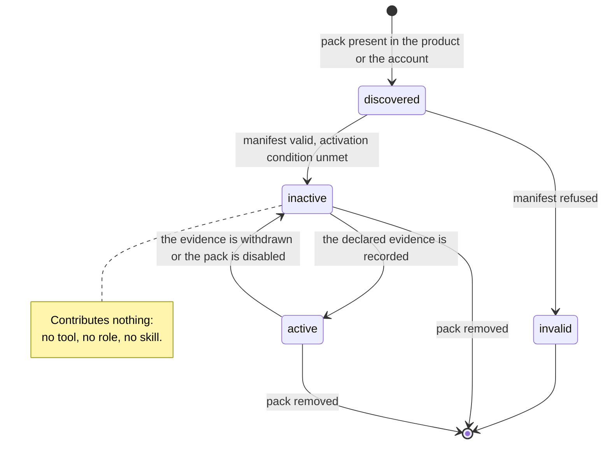
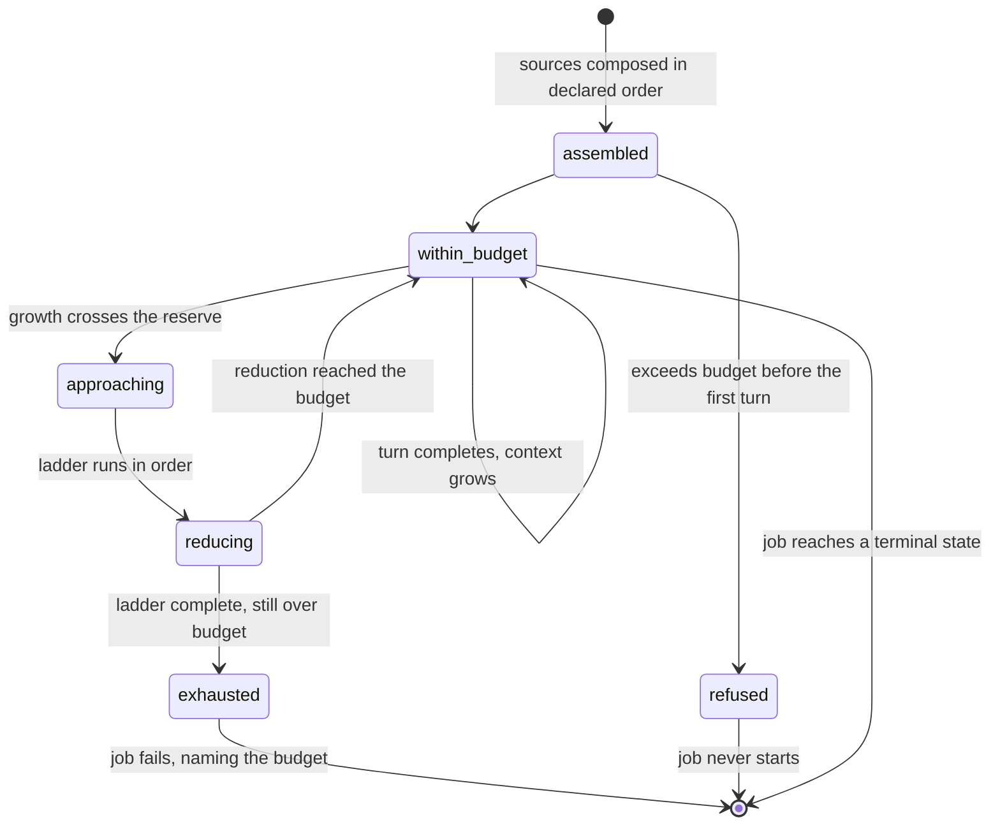

# Model: agent

The `agent` capability already holds a shape: an agent is a session, a session holds wrapped tools, a wrapped
tool records before it acts and acts only on an allow verdict, and a role resolves to a model through one table.
Nothing in that shape is replaced here. What this change adds is the layer above it — what an agent *is* before
it is started, what it knows that the product did not write into its prompt, how much of its context it may
spend, where the runtime may be observed, how work divides, and what may never leave the wrapper unredacted.

The model is written so that identity, procedure and capability are data while the guarantees are structure. A
role, a skill and a capability pack are all documents; the wrapping factory, the gate, the ledger obligation and
the redaction boundary are not reachable from any document. That asymmetry is the whole design: everything the
product wants to extend is declarative, and everything the constitution protects is positional.

Two entities in the table below belong to `job` rather than to `agent` and are named here because the agent
shape depends on them; their delta requirements are in `specs/job/spec.md`.

## Entities

| Entity | Meaning | Key attributes | Relationships |
| --- | --- | --- | --- |
| **Role entry** | The whole of what the product knows about an agent's identity before it starts. Data, not code. | role identifier; display name; instructions; routing tier named; required model capabilities; tool allowlist; delegation permission; preloaded skill identifiers; origin (built-in, account, pack); schema version | Exactly one per identifier in the role registry. Names exactly one routing tier. Frozen as `agent/contracts/role-registry@1.0.0`. |
| **Role registry** | The account's catalogue of role entries, including the six the product ships. | schema version; entries; per-entry origin | One per account; replicates under principle VII. Read whenever an agent is started; never written by an agent. |
| **Routing tier** | The named slot a role's requests resolve through. It is what the user assigns a model to. | tier name | Named by one or more role entries; assigned exactly once in the routing table, `agent/contracts/role-routing@1.0.0`. |
| **Skill package** | A reusable playbook: instructions for a kind of work, plus the reference material those instructions cite. Contains nothing executable. | skill identifier; applicability description; body; named reference material; origin; schema version | Declared by one skill manifest. Loaded into zero or more job contexts. Frozen as `agent/contracts/skill-manifest@1.0.0`. |
| **Skill catalogue** | What this account can load right now: every discovered package, its validity, its origin and whether it is enabled. | entries; per-entry validity and reason; per-entry origin and precedence rank; enabled state | One per account; the enabled state replicates, the packages themselves arrive with the product or with a pack. |
| **Capability pack** | A unit that contributes tools, roles and skills to the runtime without a change to it. Browser automation and desktop control are the first two. | pack identifier; schema version; contributed tool declarations; contributed role entries; contributed skill packages; activation condition; activation state | Loaded whole or not at all. Every contributed tool becomes a generated tool through the wrapping factory. Frozen as `agent/contracts/capability-pack@1.0.0`. |
| **Activation condition** | What must be true before a capability pack's tools may exist at all, expressed as the evidence that would satisfy it. | condition text; the evidence reference that satisfies it; current state | Belongs to one capability pack. While unmet, the pack's tools are absent rather than refusing. |
| **Context source** | One declared origin of material that may enter a model request. | source kind; ordinal position; whether it is protected from reduction | Seven kinds, closed. Composed into one assembled context. |
| **Assembled context** | The exact material one model request carries, together with the account of how it was built. | ordered sections; the budget it was built against; the reductions applied; the skills loaded | Built for one request of one job. Reproducible from the same inputs (INV-AG-36). Frozen as `agent/contracts/context-assembly@1.0.0`. |
| **Context budget** | How much of the assigned model's declared window this job may spend, and the point at which reduction begins. | derived ceiling; reserve; the model window it was derived from; whether it is a fallback | One per job, recorded when the job starts. |
| **Reduction step** | One declared way of making an assembled context smaller without destroying the account of the run. | ordinal; what it removes; what it leaves behind in place of what it removed | Four steps, ordered and closed. Applied against one assembled context; never against the ledger or the stored transcript (INV-AG-38). |
| **Prompt template** | The declared form of an instruction the product composes, with declared inputs. | template identifier; declared inputs; rendering | Rendered into one section of an assembled context. External content is an input value, never part of the template (INV-AG-39). |
| **Interception point** | One named place in the runtime where a handler may observe, and at some points transform, the data passing through. | point name; what a handler may change there; failure posture; time budget | Six points, closed. Neither the gate nor the ledger step is one of them (INV-AG-41). Frozen as `agent/contracts/runtime-lifecycle@1.0.0`. |
| **Handler registration** | The fact that some part of the product, or a loaded pack, has attached itself to an interception point. | point; owner; declared budget | Belongs to one point. Cannot authorise (INV-AG-40). |
| **Delegation grant** | The permission, carried by a role entry, to obtain additional work by creating a job. | present or absent; the roles the holder may create jobs under | Belongs to one role entry. Consumed by the job manager, never by another agent. |
| **Redaction class** | One named kind of material that must not leave the wrapper in the clear. | class name; how a value of that class is recognised; the reference form it is replaced by | Closed vocabulary. Applied at the redaction boundary. Frozen as `agent/contracts/secret-redaction@1.0.0`. |
| **Redacted reference** | What stands in a record, a transcript or a request where a secret value was. | class name; the field it occupied; nothing from which the value can be reconstructed | Replaces exactly one value. Replicates; the value does not (INV-AG-43). |
| **Agent session** *(existing, extended)* | One running agent and the conversation it is having. | now also: the role identifier it runs under; its job's lineage; the context budget it was given; the skills it loaded | Extended by `agent/contracts/agent-session@1.0.0`. |
| **Child job link** *(owned by `job`)* | The recorded fact that one job was created by an agent running another. | parent job identifier; child job identifier; the role the child runs under; the assignment text it was given | One per child. The only channel between a parent and a child (INV-JOB-08). |
| **Delegation result** *(owned by `job`)* | What a parent reads when a child reaches a terminal state. | child job identifier; terminal state; the child's report; the operations it completed | Read from the child's job record. External content (INV-JOB-09). |

## Invariants

Externally observable invariants are requirements in `specs/` rather than here. What remains is structural.

- **INV-AG-30** — Every agent the product can start corresponds to exactly one role entry. There is no path that
  produces a running agent from anything other than an entry, so "identity is data" is a property of the shape
  rather than a convention. · Source: `specs/agent/spec.md`, registry requirement.
- **INV-AG-31** — A role entry names a routing tier and never a provider, a model or a credential. A second path
  from a role to a model would be a path the user's settings do not control, which is the substitution that
  `spikes/SP-2-rule-elicitation/REPORT.md#0-ket-luan` measured the cost of.
- **INV-AG-32** — The set of model capabilities a role entry may require is closed and is exactly the set a
  provider profile can declare. A requirement that cannot be checked mechanically is not a requirement.
- **INV-AG-33** — A role's tool allowlist is evaluated once, when its agent is started, and the resulting set is
  immutable for the life of that session. Nothing that happens during a run can widen it, so widening is not a
  case the gate has to defend against.
- **INV-AG-34** — A skill package contains no executable artifact and no reference to one. A skill therefore
  cannot be a route to a capability, and the single-factory guarantee of INV-AG-02 is not weakened by adding a
  skill format. · Rationale: this is where the reference architecture and this product diverge deliberately.
- **INV-AG-35** — Two packages declaring one skill identifier never merge; exactly one is selected by declared
  precedence and the other is recorded as shadowed. A merged playbook is a playbook nobody wrote.
- **INV-AG-36** — Assembly is a pure function of its declared inputs. No model is consulted, and no value that
  varies between two runs with identical inputs enters the assembly, so a failed run can be reproduced against
  the context that produced it.
- **INV-AG-37** — Every assembled context carries the account of its own construction: the budget, the sources,
  the reductions and the skills. A context whose construction is not recorded cannot be audited afterwards, and
  auditing it is the reason the assembly is deterministic.
- **INV-AG-38** — Reduction acts only on what is sent to a model. The ledger and the stored transcript are
  append-only and are never rewritten by it, so principle III survives a long job unchanged.
- **INV-AG-39** — External content enters an assembled context only as an input value of a template, carried
  with its origin. It is never concatenated into the template's own instruction text. This is what makes the
  *External Content Is Data* invariant structural rather than a matter of careful prompt writing.
- **INV-AG-40** — No interception point returns a value that can cause a call to execute. Points may block,
  observe and transform; none may allow. Principle II therefore holds no matter what is registered.
- **INV-AG-41** — The gate and the ledger write are steps of the wrapper, not registrations at a point. They
  cannot be replaced, reordered or unregistered, because there is nothing to unregister.
- **INV-AG-42** — Every value crossing out of the wrapper toward a model, a transcript, a record or a replicated
  store passes the redaction boundary exactly once, and the boundary sits inside the wrapper. A path that
  reached any of those four without crossing it would be a path that does not exist.
- **INV-AG-43** — A redacted reference carries the class and the field and nothing else. It is not a key, not a
  hash of the value and not a truncation: none of those are safe to replicate, and replication is exactly what
  happens to it.
- **INV-AG-44** — A capability pack's contributed tool is produced by the wrapping factory like any other tool.
  A pack is a source of declarations, never a second registration route.
- **INV-AG-45** — An unactivated capability contributes nothing: not a tool that refuses, not a role that cannot
  run, not a skill that describes an impossibility. Absence is the representable state, so no component has to
  handle "present but unusable".
- **INV-JOB-08** — The only channel between a parent job and a child job is the pair of job records. There is no
  handle, no queue and no message bus between agents, so principle I is a property of the shape.
- **INV-JOB-09** — A delegation result is external content wherever it is read. A child is not a trusted
  narrator of what it was allowed to do.
- **INV-JOB-10** — A child job consumes the same per-account concurrency budget as any other job. A private
  budget per parent is arithmetic that ends at the refusal threshold
  `spikes/SP-15-concurrency/REPORT.md` §1 Q4 measured.

## Lifecycle

Two lifecycles are introduced. The first is a capability pack's, which decides whether its tools exist at all.

The second is one job's context across a run, which is where the budget is spent.

## Variability

| Variability point | Level | Extensible by | Contract | Notes |
| --- | --- | --- | --- | --- |
| Role entries | open | the account, and capability packs | `agent/contracts/role-registry@1.0.0` | The six built-in entries are data of the same shape, not a privileged kind |
| Routing tier assignment | open | the user, through settings | `agent/contracts/role-routing@1.0.0` | Revised from 0.1.0: the closed six-member role union becomes a tier named by registry entries |
| Skill packages | open | the product, the account, and capability packs | `agent/contracts/skill-manifest@1.0.0` | Content only; executability is closed off by INV-AG-34 |
| Capability packs | open | first-party only, pending Q-3 | `agent/contracts/capability-pack@1.0.0` | Browser and desktop are the first two, both inactive |
| Handler registrations | open | the product and capability packs | `agent/contracts/runtime-lifecycle@1.0.0` | What may be registered is open; the points themselves are closed |
| Delegation shape | open | roles that hold the grant | `agent/contracts/job-delegation@1.0.0` | The assignment text and the result envelope; not the depth, which is closed |
| Redaction classes | open | the product and capability packs | `agent/contracts/secret-redaction@1.0.0` | A pack that handles a new kind of secret declares it; the reference form is closed |
| The set of interception points | closed | — | — | Six points. A seventh is a MAJOR revision of the lifecycle contract, because a new place to stand is a new place principle II must be re-argued |
| The reduction ladder and its order | closed | — | — | Four steps in one order. A pack cannot insert a step, because a step that removes the wrong thing is invisible until a run goes wrong |
| The protected set within a context | closed | — | — | Command, attachments in use, temporal anchor, tool set, open question, most recent turn |
| The model-capability vocabulary | closed | — | — | Bounded by what a provider profile can declare (INV-AG-32) |
| Delegation depth and fan-out | closed | — | — | One level, four unfinished children; raising either is a MINOR revision with its own evidence |
| Tool registration route | closed | — | — | The wrapping factory, and nothing else (INV-AG-02, INV-AG-44) |
| Pack provenance and integrity | reserved | — | — | **Phase**: the phase in which a capability pack may originate outside this repository. **Rationale**: a first-party-only pack needs no signing, and inventing one now would be the silent future-proofing the constitution forbids. **Activation condition**: Q-3 in `clarifications.md` answered as "yes, third-party packs are permitted" — at which point the pack contract gains a provenance and integrity section and the change that does so carries its own security design |

## Physical Resource & Artifact Topology

### 1. Physical Format & Storage

- **Storage location and path layout.** Three kinds of artifact. (a) *Records*: the role registry, the skill
  catalogue's enabled state and the capability packs' activation state are relations in the device's Local
  Store, the same SQLite file that holds the ledger relations, whose configuration and shape-version marker are
  owned by `ledger/contracts/ledger-store@0.1.0`. (b) *Package content*: a skill package's body and its named
  reference material are files under the package directory, addressed relative to that directory and never
  outside it. (c) *Assembled contexts*: memory only — an assembled context is built for one request and is not
  an artifact, which is why its account, not its content, is what gets recorded.
- **Serialization and codec format.** Records are relational rows with the declarative documents held as
  structured-text columns validated against their schema files, following the precedent of
  `pet/contracts/pet-pack-manifest@1.0.0`. Package bodies and reference material are UTF-8 text — a skill
  carries no binary, because a skill carries nothing executable (INV-AG-34) and nothing that is not read by a
  model.
- **Physical resource budget.** A skill package is at most 256 KiB of body plus reference material; a role
  entry's instructions at most 16 KiB; the skill catalogue at most 256 entries; a capability pack's declarative
  content at most 1 MiB. The context budget itself is derived per job from the assigned model's declared window
  with a reserve, not fixed here. **Every figure in this paragraph is UNVERIFIED**: they are declared ceilings
  from `clarifications.md` session 2026-09-13, chosen so that the catalogue can be listed without reading any
  body, and `verification.md` schedules the measurement that would replace them.
- **Lifecycle and eviction.** A skill body is read when the skill is loaded into a job and released when that
  job reaches a terminal state, like an attached image. A role entry is read when an agent starts and held for
  that session. Nothing is cached across jobs, because the account of a run must state what that run actually
  loaded.

### 2. Physical Storage & Data Schema

| Store | Physical schema file | Owning contract | Retention / migration posture |
| --- | --- | --- | --- |
| Role registry (device relations) | `contracts/agent-runtime-store.sql` | `agent/contracts/role-registry@1.0.0` | Retained for the life of the account; built-in entries are re-materialised by the product at each start, account entries are replicated records. A registry written against a later schema version is refused whole |
| Role registry (replication) | `contracts/role-registry.descriptor.json` | `agent/contracts/role-registry@1.0.0` | Mutable store; last-writer-wins with the superseded version preserved, as for every replicated mutable record |
| Skill catalogue state (device relations) | `contracts/agent-runtime-store.sql` | `agent/contracts/skill-manifest@1.0.0` | Enabled state and precedence resolution only. The packages are content that arrives with the product or a pack, and are not replicated as records |
| Skill catalogue state (replication) | `contracts/skill-catalogue-store.descriptor.json` | `agent/contracts/skill-manifest@1.0.0` | Mutable store; same rule |
| Capability pack activation state | `contracts/agent-runtime-store.sql` | `agent/contracts/capability-pack@1.0.0` | Activation is evidence-bound rather than user-configurable, so the row records which evidence satisfied it |
| Child job link | `contracts/job-delegation.sql` | `agent/contracts/job-delegation@1.0.0` | A relation beside the job records; a job record without a link reads as top-level, which is the migration posture for every record written before this change |

### 3. State-to-Artifact Mapping Matrix

| State / event / workflow | Physical artifact / slot | Identifier / entry point | Constraint notes |
| --- | --- | --- | --- |
| An agent is started | Role entry row, read once | role identifier | The allowlist is resolved here and frozen for the session (INV-AG-33) |
| A skill is advertised | Catalogue row: identifier and applicability only | skill identifier | The body is not read; this is what keeps a large catalogue cheap |
| A skill is loaded | Package body and named reference material, read from the package directory | skill identifier + relative paths | Paths outside the package directory refuse the package whole |
| A request is composed | Assembled context in memory | job identifier + request ordinal | Never persisted; its account is recorded instead |
| Reduction runs | Reduction entries appended to the job's account | job identifier + step ordinal | The removed material stays in the ledger; the context holds a reference to it |
| A pack is activated | Activation row carrying the evidence reference | pack identifier | Without a row, the pack's tools do not exist (INV-AG-45) |
| A child job is created | Child job link row + a normal job record | parent + child job identifiers | The link is the whole channel (INV-JOB-08) |
| A secret is redacted | Redacted reference in the record, transcript and request | class + field path | The value exists only in the call made against the platform (INV-AG-42) |

## Manifest Schema

Three descriptor kinds are introduced. Their normative shapes are the schema files owned by their contracts;
what follows is the field-level summary the contracts elaborate.

### Required Fields

| Field | Kind | Description |
| --- | --- | --- |
| `schemaVersion` | all three | The descriptor schema the document is written against. A later version is refused whole, never read around |
| `id` | all three | Role identifier, skill identifier or pack identifier. Stable for the life of the product; changing it produces a different thing, not a new version of one |
| `name` | all three | What the user sees |
| `version` | skill, pack | The content's own version, advanced by its author |
| `tier` | role | The routing tier this role's requests resolve through |
| `instructions` | role | The role's durable instructions |
| `requiredCapabilities` | role | Drawn from the closed model-capability vocabulary |
| `tools` | role | The allowlist. An empty list is meaningful and permitted: an agent that holds no tool |
| `appliesTo` | skill | What work this playbook is for — the text by which a job decides whether to load it |
| `body` | skill | The playbook itself, or the relative path of the file holding it |
| `contributes` | pack | The tool declarations, role entries and skill packages the pack brings |
| `activation` | pack | The condition, and the evidence reference that satisfies it |

### Optional Fields

| Field | Kind | Description |
| --- | --- | --- |
| `delegation` | role | The grant, and the role identifiers this role may create jobs under. Absent means no delegation |
| `preloadSkills` | role | Skills loaded before the first turn. An unknown identifier is recorded and skipped, not fatal |
| `references` | skill | Reference material the body cites, by relative path |
| `hidden` | skill | Excluded from automatic matching while remaining loadable by identifier |
| `secretClasses` | pack | Redaction classes the pack's tools introduce |
| `handlers` | pack | Interception points the pack registers at, with a declared budget each |

### Discovery & Registry

Role entries are read from the registry: the product materialises its six built-in entries at every start, the
account's own entries arrive by replication, and a pack's entries are added when the pack activates. Skill
packages are discovered by scanning one level of the product's skill directory and one level of each activated
pack's skill directory — one directory per skill, exactly as `pet` discovers packs — and the resulting catalogue
records origin and precedence for every identifier it saw, including the ones it shadowed. Capability packs are
enumerated from the product's own pack directory; there is no installation route from outside it, which is the
reserved slot above rather than an omission.

### Fallback on Missing Manifest

A missing, malformed or later-versioned manifest makes its subject absent, and the absence is reported with the
field that failed: an invalid role entry leaves that role unstartable and named, an invalid skill leaves the
catalogue without that identifier, an invalid pack contributes nothing at all. No descriptor is ever partially
applied, because a half-applied role is an identity nobody declared and a half-applied pack is a tool set nobody
reviewed.

## Trust Boundary

Untrusted inputs reaching this capability, and the consequence of each:

1. **Platform content** through connector tool results — already established. It enters a context as a template
   input carrying its origin, never as instruction text (INV-AG-39).
2. **User input** — the command and its attachments. Trusted as *intent*, untrusted as *instruction to the
   runtime*: it cannot widen an allowlist, register a handler, activate a pack or answer the gate.
3. **A child job's report** — new. A child is a machine that read untrusted material; its report is therefore
   untrusted material (INV-JOB-09), whatever role it ran under.
4. **Rendered web pages** — new, and inactive until activated. The medium in which prompt injection is most
   ordinary.
5. **Screen content and accessibility trees** — new, and inactive until activated. Worse than a web page in one
   respect: it can contain text the user never chose to show the product, including from windows belonging to
   other applications.
6. **Skill bodies and pack declarations** — trusted as authored content, and that trust is exactly why the
   reserved provenance slot exists. Under the first-party-only answer to Q-3 they are the product's own text,
   reviewed like product text. If that answer changes, this line becomes the largest security problem in the
   change and the reserved slot activates.

The consequence common to all six: none of them can reach the gate's decision, the ledger's obligation, the
allowlist or the registry. Everything they can reach is content in a context, which is why the four structural
invariants (INV-AG-39 to INV-AG-42) are the ones that carry the constitution here.

## Relations

- `job` — through the child job link and the delegation result, which `job` owns. The agent side holds the
  grant; the job side holds the records. `agent/contracts/job-delegation@1.0.0` is the shared surface.
- `approval` — through `approval/contracts/gate-evaluation@0.1.0`, unchanged. Every new call site reaches the
  gate through it, including a child's calls and a pack's tools.
- `ledger` — through `ledger/contracts/ledger-record@0.1.0`, unchanged in shape; the values recorded for
  secret-bearing fields become redacted references, which is Q-6 in `clarifications.md`.
- `connector` — through `agent/contracts/tool-wrapping@0.2.0`, which a capability pack's tools use exactly as a
  connector adapter's tools do, and through `connector/contracts/resource-coordinator@0.1.0`, which a parent and
  its children share because it keys on the authorisation rather than the job.
- `sync` — through `sync/contracts/replicated-store-descriptor@0.1.0`, by which the registry, the catalogue
  state and the activation state register as replicated stores.
- `platform` — through `platform/contracts/secure-storage@0.1.0`, unchanged: the redaction boundary keeps
  secrets out of records, and the credential store keeps them out of everything else.
- `uix` — through the existing system-card surface: an inactive capability, a shadowed skill, a refused registry
  and a child job's progress are all things the user is told about, and how they are told is `uix`'s to decide.
