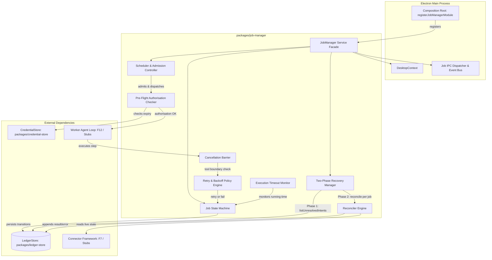

# Brainstorm Contract: F2 — Job Manager & Vòng Đời Job

- **Date**: 2026-09-15
- **Feature**: F2 (`feat/f02-job-manager`)
- **Package Ownership**: `packages/job-manager`
- **Dependencies**: F1 (`packages/ledger-store` merged / available in workspace)
- **Status**: ACCEPTED by User & Ratified for Planning

---

## 1. Executive Summary & Context

Trong kiến trúc Desktop Assistant, **Job Manager** (`packages/job-manager`) là thành phần trung tâm sở hữu toàn bộ vòng đời của một đơn vị công việc (Job) từ khi khởi tạo (`created`) cho đến khi kết thúc (`done`, `failed`, `cancelled`).

Theo **Hiến pháp Dự án (Constitution v2.1.0)**:
1. **Nguyên tắc I (Decentralized Agents)**: Pet-agent tạo job qua Job Manager và **không bao giờ** trực tiếp ra lệnh, điều phối hay chạy vòng lặp của worker-agents. Agents chỉ giao tiếp thông qua các bản ghi job do Job Manager nắm giữ; không có vòng lặp điều khiển tập trung.
2. **Nguyên tắc II (Hard Gate Outside The LLM Loop)**: Approval mode được lưu cố định tại thời điểm tạo job (`approval_mode`: `off` | `smart` | `on`), độc lập với model output.
3. **Nguyên tắc III (Ledger Before Act, Append-Only)**: Mọi chuyển trạng thái, retry, quyết định cancel và điểm dừng đều ghi vào Action Ledger và bảng lịch sử chuyển trạng thái.
4. **Nguyên tắc VII (Account-Owned Data, Local Store as Working Copy)**: Job chỉ thực thi trên thiết bị tạo ra nó (`created_on_device`), các thiết bị khác trong cùng tài khoản chỉ nhận đồng bộ trạng thái để hiển thị (AC-28).

Mô-đun này kết nối với Composition Root của Electron Main (`apps/desktop/main/index.ts`) qua **đúng một dòng đăng ký**:
```ts
await registerJobManagerModule(context);
```

Tài liệu này xác lập Bounded Brainstorm Contract, phân tích đánh giá các phương án kiến trúc (Option Exploration), làm rõ các tham số mở/chưa đo, và vạch lộ trình chuyển giao sang bước lập kế hoạch thực thi (`ak-plan`).

---

## 2. Bounded Brainstorm Contract

### 2.1. Outcome (Kết quả đầu ra)
Một package TypeScript hoàn chỉnh `packages/job-manager`, được kiểm thử toàn diện, tích hợp trực tiếp với `packages/ledger-store` và Electron Main process:
- **State Machine 11 trạng thái**: Quản lý chính xác 11 trạng thái chuẩn hóa: `created`, `queued`, `running`, `waiting_approval`, `waiting_input`, `suspended`, `recovering`, `waiting_user_confirmation`, `done`, `failed`, `cancelled`.
  - Mọi bước chuyển trạng thái đều được gán timestamp ISO và ghi nhận vào bảng `job_state_transition` và `job.state_changed_at`.
  - Trạng thái terminal (`done`, `failed`, `cancelled`) là tuyệt đối: sự kiện đến sau không bao giờ mở lại job mà chỉ được ghi nhận vào nhật ký.
  - Lưu trữ cố định `approval_mode` (`off` | `smart` | `on`), `created_on_device`, và `undo_of` (khi job là một thao tác hoàn tác).
- **Scheduler & Admission Control (Điều phối song song có kiểm soát)**:
  - Các job chạy song song độc lập, tuyệt đối không chia sẻ ngữ cảnh bộ nhớ (context isolation).
  - Quản lý hạn ngạch thực thi theo từng tài khoản connector (mặc định tối đa 4 jobs song song: 3 background slots + 1 reserved slot ưu tiên cho lệnh trực tiếp từ người dùng, theo SP-15).
  - Giải phóng slot tức thì khi job chuyển sang trạng thái chờ (`waiting_approval`, `waiting_input`, `waiting_user_confirmation`, `suspended`), và tái cấp phát slot khi job tiếp tục thực thi.
  - Hàng đợi độc lập theo từng tài khoản connector; hai tài khoản khác nhau không dùng chung hạn ngạch.
- **Cancel tại ranh giới Tool Call**:
  - Hỗ trợ cờ hủy (cancellation flag) kiểm tra tại ranh giới giữa các tool calls.
  - Lệnh gọi ghi (write call) đang bay trên mạng (in-flight) được để hoàn tất và ghi vào ledger, không hủy giữa chừng trên API bên thứ ba.
  - Ghi nhận điểm dừng chính xác vào ledger và chuyển trạng thái sang `cancelled`, đề nghị hoàn tác (undo) cho các tác vụ đã hoàn thành trước đó.
- **Báo cáo Thất bại & Đề nghị Hoàn tác (Failure & Undo Offer)**:
  - Job thất bại (`failed`) diễn giải nguyên nhân bằng ngôn ngữ tự nhiên mà người dùng có thể hiểu và hành động được.
  - Liệt kê danh sách các thao tác đã hoàn tất trích xuất từ Action Ledger.
  - Tự động đề nghị hoàn tác (undo) nếu có thao tác khả nghịch, hoặc nêu rõ không có thao tác nào để hoàn tác.
- **Chính sách Retry phân loại theo Mã Lỗi (Bounded Retry Policy)**:
  - Tối đa 3 lần thử lại với khoảng trễ tăng dần (exponential backoff).
  - Phân loại lỗi tạm thời (transient) hay vĩnh viễn (permanent) **chỉ dựa trên mã lỗi do Adapter hoặc Coordinator khai báo**, tuyệt đối không phân tích chuỗi văn bản thông báo của nền tảng.
  - Lỗi không có mã lỗi khai báo mặc định coi là vĩnh viễn (permanent) và kết thúc ngay lập tức.
  - Lỗi tài nguyên bị giữ (`RESOURCE_HELD`) được thử lại; nếu quá 3 lần thì thất bại và nêu rõ tên job đang giữ tài nguyên.
  - Mỗi lần retry đều được ghi nhận là một bản ghi trong Action Ledger.
- **Quản lý Giới hạn Thời gian (Timeout Engine)**:
  - Áp dụng thời hạn tối đa cho một job (mặc định 10 phút).
  - Loại trừ toàn bộ thời gian job nằm trong các trạng thái chờ (`waiting_approval`, `waiting_input`, `waiting_user_confirmation`, `suspended`).
- **Khôi phục Hai Pha sau Crash (Two-Phase Crash Recovery)**:
  - **Pha 1 (Local, trước cửa sổ đầu tiên, offline-first)**: Khởi động tại `app.whenReady()`, quét danh sách `unresolvedIntents` từ `LedgerStore`, đánh dấu các job liên quan là `recovering` (hoặc không cho phép tự ý resume) mà không đòi hỏi kết nối mạng.
  - **Pha 2 (Reconciliation khi có mạng)**: Đối soát từng job dựa trên khai báo `tool-reconciliation` được sao chép trong intent:
    - Nếu trạng thái bên ngoài khớp với `snapshot_before`: Thao tác chưa diễn ra -> ghi bản ghi lỗi gián đoạn vào ledger, job chuyển sang `failed`.
    - Nếu trạng thái bên ngoài khớp với `intended`: Thao tác đã diễn ra -> ghi bù bản ghi kết quả với cờ `establishedBy: "reconciled"`, job hoàn thành an toàn (`done`) hoặc tiếp tục.
    - Nếu không đọc lại được (`not_readable`, `state_matches_neither`, `target_gone`, `read_refused`) hoặc khai báo là `none`: Chuyển job sang `waiting_user_confirmation`.
    - Nếu mất mạng: Giữ nguyên trạng thái `recovering`, các tính năng khác của ứng dụng vẫn sử dụng bình thường.
- **Pre-flight Authorisation Check**:
  - Trước khi gọi tool call đầu tiên, kiểm tra tình trạng ủy quyền của tất cả connector mà job có thể dùng.
  - Tự động renew token nếu thời hạn còn lại dưới ngưỡng an toàn (margin mặc định 5 phút).
  - Nếu token hết hạn và không thể tự gia hạn (cần người dùng đăng nhập lại): Không cho phép start job, thông báo cho người dùng biết cần kết nối lại connector.
- **Resume Không Lặp Bước từ Suspended / Waiting**:
  - Hỗ trợ chuyển sang `suspended` sau 30 phút chờ người dùng trả lời (`waiting_input`) để giải phóng tài nguyên bộ nhớ.
  - Khi người dùng phản hồi, job quay lại `running` và tiếp tục thực hiện từ checkpoint/transcript, tuyệt đối không lặp lại bất kỳ tool call hay bước suy luận nào đã hoàn thành trước đó.
- **Event Bus & IPC Service cho Giao diện**:
  - Cung cấp event emitter định kiểu mạnh cho Electron Main process để phát các thay đổi trạng thái của job (Job Created, State Changed, Progress, Completed, Failed, Cancelled) xuống Pet Window và App Window theo hợp đồng IPC.

---

### 2.2. Constraints (Ràng buộc bắt buộc)
1. **Hiến pháp I (Decentralized Agents)**: Job Manager chỉ quản lý bản ghi job và scheduler; không được phép trở thành một "master orchestrator" trực tiếp nhúng logic nghiệp vụ của từng agent.
2. **Hiến pháp II & III (Fail-Closed, Ledger Before Act)**: Mọi thao tác thay đổi trạng thái và quyết định retry/cancel phải được ghi nhận bền vững trong SQLite WAL trước khi kích hoạt hành động kế tiếp.
3. **Hiến pháp VII & req-022 (Job Device Pinned)**: Job chỉ được thực thi trên chính thiết bị tạo ra nó (`created_on_device === currentDeviceId`). Các thiết bị khác chỉ đồng bộ dữ liệu để xem tiến độ.
4. **Không chặn khởi động UI (Platform Requirement)**: Pha 1 của Recovery bắt buộc phải chạy hoàn toàn trên local SQLite, không gọi bất kỳ network request nào để cửa sổ Pet Window hiển thị không bị trễ.
5. **Giới hạn Thư viện & Biên dịch Native**: Sử dụng `better-sqlite3@13.0.3` có sẵn prebuilt; toàn bộ mã nguồn viết bằng TypeScript Strict Mode, chạy trên Node.js 24.x.
6. **Điểm nối duy nhất (One-line Extension Seam)**: Tích hợp vào Electron main thông qua đúng một hàm đăng ký `registerJobManagerModule(context)` trong `apps/desktop/main/index.ts`.

---

### 2.3. Non-Goals (Ngoài phạm vi F2)
- **Agent Loop Execution & LLM Streaming (F12)**: Vòng lặp suy luận cụ thể của worker agent và kết nối LLM provider (BytePlus/OpenAI) thuộc về `feat/f12-worker-agent-loop`.
- **Approval Gate Logic (F4)**: Đánh giá quy tắc phê duyệt, biên dịch Rule IR và hiển thị Card Approval thuộc về `feat/f04-approval-gate`.
- **Tool Wrapping & Interception (F5)**: Lớp bọc interceptor gắn kết gate và ledger xung quanh từng tool call thuộc về `feat/f05-agent-harness`.
- **Object Locking & Fair Rate Queue (F8)**: Cơ chế khóa đối tượng (`resource-coordinator`) và hàng đợi chia sẻ Token Bucket cấp độ tool thuộc về `feat/f08-resource-coordinator`.
- **Undo Inversion Plan & Conflict Probing (F16)**: Việc phân tích diff, kiểm tra xung đột trực tiếp trên platform và dựng preview hoàn tác thuộc về `feat/f16-undo-pipeline`.
- **Giao diện Người dùng (F21)**: Render danh sách job trên React App Window hoặc bong bóng thoại truyện tranh của Pet Window thuộc về `feat/f21-app-window` / `feat/f19-speech-bubble-cards`.
- **Đồng bộ Tài khoản qua Backend (F22)**: Giao thức mã hóa replication giữa client và backend thuộc về `feat/f22-account-sync`.

---

### 2.4. Acceptance Criteria (Tiêu chí Nghiệm thu)
1. **Phủ 100% Kịch bản của `capabilities/job/spec.md`**: Toàn bộ 10 requirement với các scenarios tương ứng có kiểm thử tự động với tên test ánh xạ chính xác vào scenario.
2. **Kiểm thử Crash Injection 5 Điểm Tích hợp với F1**: Tái hiện kịch bản tiêm crash (`kill -9`) tại 5 điểm vòng đời tool call (SP-12 Q4):
   - Point 1: Trước quyết định approval -> khôi phục `waiting_approval`.
   - Point 2: Sau approval, trước khi ghi `intent` -> khôi phục `waiting_approval`.
   - Point 3: Sau khi `intent` commit, trước khi gọi API ngoài -> Pha 1 đánh dấu `recovering`; Pha 2 đối soát thấy trạng thái nguyên vẹn -> chuyển `failed` an toàn.
   - Point 4: Sau khi API ngoài thành công, trước khi ghi `result` -> Pha 1 đánh dấu `recovering`; Pha 2 đối soát thấy kết quả đã tồn tại -> ghi bù `result` ("reconciled"), chuyển `done`.
   - Point 5: Sau khi `result` commit, trước khi cập nhật job status -> Pha 1 phát hiện `result` đã có -> hoàn tất chuyển trạng thái `done`.
   - *Kết quả*: Tuyệt đối không có job nào bị biến mất (NFR-RL-01).
3. **Kiểm thử Admission Control & Hạn ngạch Song song**:
   - Chạy 4 jobs cùng 1 connector account -> job thứ 5 vào hàng đợi `queued`.
   - Lệnh người dùng (interactive command) vào ngay slot dự trữ (reserved slot) thứ 4 mà không phải chờ sau background jobs.
   - Các connector account khác nhau sở hữu pool admission độc lập, không chia sẻ hạn mức.
   - Job chuyển sang `waiting_approval` hoặc `waiting_input` lập tức giải phóng slot cho job đang `queued` được chạy.
4. **Kiểm thử Cancel tại Ranh giới Tool Call**:
   - Phát lệnh cancel khi một tool call ghi đang thực thi: tool call in-flight hoàn tất và ghi vào ledger; không có tool call mới nào được gọi tiếp theo; ledger ghi nhận điểm dừng và job chuyển sang `cancelled`.
5. **Kiểm thử Retry Phân loại theo Mã Lỗi**:
   - Chỉ retry khi adapter trả về mã lỗi transient (e.g. `RATE_LIMITED`, `NETWORK_TIMEOUT`) hoặc coordinator trả về `RESOURCE_HELD`.
   - Lỗi không có mã hoặc mã permanent (e.g. `PERMISSION_DENIED`, `WITHDRAWN_AUTHORISATION`) không bao giờ được retry.
   - Thử lại `RESOURCE_HELD` tối đa 3 lần với backoff; nếu tiếp tục bị giữ thì chuyển `failed` kèm thông báo tên job đang giữ tài nguyên.
6. **Kiểm thử Timeout Job**:
   - Job chạy liên tục quá 10 phút active running time thì tự động chuyển sang `failed`.
   - Thời gian chờ người dùng trong `waiting_approval` (ví dụ 40 phút) không bị tính vào thời hạn 10 phút.
7. **Kiểm thử Resume Không Lặp Bước**:
   - Job sau khi tạm dừng do timeout câu hỏi (`waiting_input` -> `suspended` sau 30 phút) hoặc do tắt ứng dụng, khi người dùng gửi câu trả lời sẽ tiếp tục chạy từ bước tiếp theo, số lần thực thi của các bước trước đó bằng đúng 1.

---

## 3. Option Exploration & Architectural Decisions

### Fork 1: Cơ chế Quản lý Hàng đợi & Cấp phát Slot (Admission Scheduler)

| Tiêu chí | Phương án A: In-Memory Token Bucket + Account Slot Counters [KHUYẾN NGHỊ] | Phương án B: SQLite Table Polling (`job.status = 'queued'`) | Phương án C: Hàng đợi Đa tiến trình phân tán (Redis/BullMQ) |
|---|---|---|---|
| **Mô tả** | Scheduler dạng in-memory singleton trong Main Process, theo dõi active jobs per `connectorAccountId`. Job mới lưu vào SQLite với trạng thái `queued`, sau đó Scheduler cấp phát slot và dispatch. | Không giữ bộ đếm in-memory; dùng vòng lặp interval (ví dụ mỗi 500ms) query SQLite để lấy các job `queued` theo thứ tự ưu tiên. | Dựng một queue broker độc lập chạy ngoài tiến trình. |
| **Độ trễ Dispatch** | Tức thì (< 1ms). Slot vừa giải phóng là job queued kế tiếp được dispatch ngay lập tức. | Trễ từ 250ms - 500ms do chu kỳ polling, gây lãng phí thời gian người dùng. | Thêm độ trễ IPC/TCP không cần thiết. |
| **Độ phức tạp & Tài nguyên** | Nhẹ, tối ưu, phù hợp hoàn hảo với kiến trúc single-process Electron Main. | Gây I/O disk liên tục trên SQLite WAL, xung đột với các tác vụ ghi của Ledger. | Vi phạm nguyên tắc KISS/YAGNI; cần tiến trình bên ngoài. |
| **Kịch bản Tồi tệ nhất (Worst-Case)** | Crash tiến trình làm mất queue in-memory -> Được khắc phục 100% vì trạng thái `queued` đã lưu bền vững trong SQLite; khi reboot, Scheduler nạp lại tất cả job `queued`. | Polling bỏ sót job hoặc nghẽn database khi có nhiều job ngắn chạy liên tục. | Broker sập độc lập, phát sinh bài toán đồng bộ distributed state. |
| **Giả định then chốt** | Toàn bộ việc thực thi job của thiết bị diễn ra trong Node.js Main process (đã được Hiến pháp VII và req-022 bảo chứng). | SQLite có thể chịu tải query liên tục mà không ảnh hưởng hiệu năng ghi WAL. | Hệ thống có nhiều worker processes khác nhau cần phân tải. |
| **Đánh giá** | **CHỌN (RECOMMENDED)** | **LOẠI** | **LOẠI (Vi phạm YAGNI)** |

---

### Fork 2: Thiết kế Kiến trúc Khôi phục Hai Pha (Two-Phase Recovery Architecture)

| Tiêu chí | Phương án A: Phân tách Nghiêm ngặt (Phase 1 Sync/Local Boot, Phase 2 Async Background Worker) [KHUYẾN NGHỊ] | Phương án B: Gộp chung vào Boot Sequence (Chờ mạng đối soát xong mới mở Pet Window) | Phương án C: Lazy Recovery (Chỉ đối soát khi người dùng nhấp vào Job) |
|---|---|---|---|
| **Mô tả** | Pha 1 chạy đồng bộ tại `registerJobManagerModule` trước khi tạo Pet Window: đọc `unresolvedIntents()`, set trạng thái `recovering`. Cửa sổ Pet hiển thị ngay. Pha 2 là worker lắng nghe sự kiện online/network để đối soát từng job. | Boot sequence gọi API đối soát với Notion/Google. Nếu không có mạng hoặc mạng chậm, hoãn hiển thị giao diện cho đến khi đối soát xong hoặc timeout. | Khởi động bỏ qua khôi phục. Chỉ khi người dùng mở App Window hoặc bấm vào job thì mới tiến hành đối soát. |
| **Tuân thủ Hiến pháp & Spec** | 100% tuân thủ `platform/spec.md` ("classified before the first window appears") và Hiến pháp VII (Offline resilience). | Vi phạm nghiêm trọng: ứng dụng bị đơ (hang) khi khởi động ở chế độ máy bay hoặc mất mạng; vi phạm NFR-PF-01 về thời gian khởi động. | Vi phạm: rủi ro lặp lại tool call nếu một tác vụ nền tự động tiếp tục mà chưa được phân loại; vi phạm NFR-RL-01. |
| **Kịch bản Tồi tệ nhất** | Pha 2 bị hoãn vô thời hạn nếu thiết bị offline kéo dài -> Hoàn toàn an toàn: job giữ nguyên trạng thái `recovering`, không bao giờ bị gọi trùng API bên thứ ba. | Ứng dụng không mở được cửa sổ, người dùng tưởng ứng dụng bị crash và force kill liên tục. | Dữ liệu trên Notion đã bị sửa nhưng ledger và giao diện không biết, tạo ra trạng thái phân kỳ (state divergence). |
| **Giả định then chốt** | Việc phân loại cục bộ từ SQLite diễn ra cực nhanh (< 5ms) trước khi mở cửa sổ. | Thiết bị luôn luôn có kết nối Internet ổn định khi mở ứng dụng (Giả định sai lầm). | Người dùng luôn chủ động kiểm tra các job cũ trước khi làm việc mới. |
| **Đánh giá** | **CHỌN (RECOMMENDED)** | **LOẠI** | **LOẠI** |

---

### Fork 3: Cơ chế Hủy Job (Cancellation Barrier)

| Tiêu chí | Phương án A: Cờ Hủy Kiểm tra tại Ranh giới Tool Call (Cooperative Boundary Check) [KHUYẾN NGHỊ] | Phương án B: Ngắt Đột ngột qua `AbortController.abort()` trên HTTP Socket | Phương án C: Hủy Ngay và Rollback Ledger |
|---|---|---|---|
| **Mô tả** | Đặt `isCancelled = true`. Khi tool call đang chạy hoàn tất và ghi ledger xong, trước khi bước sang tool call kế tiếp, wrapper kiểm tra cờ và ném `JobCancelledError`. Job dừng an toàn. | Truyền `AbortSignal` vào Axios/Fetch. Khi cancel, socket HTTP bị ngắt ngay lập tức giữa chừng. | Cố gắng xóa các bản ghi vừa ghi trong ledger để đưa về trạng thái trước khi chạy. |
| **An toàn Dữ liệu Bên thứ ba** | Tuyệt đối an toàn: không bỏ lửng một write operation trên Notion. Bản ghi kết quả được commit đầy đủ, tạo tiền đề hoàn hảo cho Undo sau đó. | Nguy hiểm: Request đã đến server Notion nhưng client ngắt kết nối trước khi nhận response. Client không biết request thành công hay chưa, gây tình trạng mất kiểm soát (zombie write). | Vi phạm Hiến pháp III (Ledger Append-Only, cấm xóa sửa). |
| **Phản ứng với Người dùng** | Trễ tối đa bằng thời gian của 1 tool call in-flight (~300ms - 1s), sau đó xác nhận đã hủy an toàn và đưa ra danh sách undo. | Phản hồi ngay lập tức nhưng để lại hậu quả không thể khắc phục trên tài khoản của người dùng. | Hỏng tính toàn vẹn của Action Ledger. |
| **Đánh giá** | **CHỌN (RECOMMENDED)** | **LOẠI (Vi phạm FR-AG-06)** | **LOẠI (Vi phạm Hiến pháp III)** |

---

## 4. Technical Architecture for `packages/job-manager`



### 4.1. Vòng đời Trạng thái Job (State Lifecycle Machine)

```mermaid
stateDiagram-v2
    [*] --> created
    created --> queued: Submit to Scheduler
    queued --> running: Slot Admitted
    
    running --> waiting_approval: Tool Call Blocked for Approval
    waiting_approval --> running: User Approves
    waiting_approval --> cancelled: User Rejects / Cancels
    
    running --> waiting_input: Agent Calls ask_user
    waiting_input --> running: User Answers
    waiting_input --> suspended: 30-min Timeout Expired
    suspended --> running: User Answers Later
    
    running --> done: Completed Successfully
    running --> failed: Fatal Error / Retries Exhausted / Timeout
    running --> cancelled: Cancelled at Tool Boundary
    
    [*] --> recovering: App Startup (Phase 1 Unresolved Intent)
    recovering --> done: Phase 2: State Matches Intended
    recovering --> failed: Phase 2: State Matches Before
    recovering --> waiting_user_confirmation: Phase 2: Not Readable / Ambiguous
## 5. Ratified Architecture Decisions & Accepted Defaults

Toàn bộ 5 vấn đề cốt lõi đã được người dùng phê duyệt và chốt phương án chính thức vào ngày 2026-09-15:

1. **Concurrency Cap & Reserved Slot — Phương án A (Ratified)**:
   - Mặc định toàn cục: Tối đa 4 jobs song song trên một tài khoản connector (3 background slots + 1 reserved slot cho lệnh trực tiếp từ người dùng, theo SP-15 Q4).
   - Kế thừa từ Manifest: Nếu Connector Manifest khai báo `rate_policy.concurrency_cap` riêng (Principle VI), Job Manager áp dụng theo manifest.

2. **Pre-flight Token Refresh Margin & Fallback — Phương án A (Ratified)**:
   - Cơ chế phòng thủ 2 lớp (Two-tier):
     - *Pre-flight*: Trước khi start job, nếu token còn `< 5 phút` (`tokenRefreshMarginMs = 300_000`), chủ động gọi renew qua CredentialStore / Connector. Nếu token hết hạn không thể tự làm mới (cần user đăng nhập lại), chặn job ngay từ đầu, không cho chạy dở dang.
     - *Runtime fallback*: Nếu job kéo dài quá 5 phút và token hết hạn giữa chừng, tầng Adapter vẫn giữ quyền tự refresh khi gặp HTTP 401.

3. **Xử lý Không thể Đối soát sau Crash (`undetermined`) — Phương án A (Ratified)**:
   - Chuyển job sang `waiting_user_confirmation` khi khai báo là `method: "none"` (ví dụ gửi email, tin nhắn Slack theo RISK-045) hoặc khi đọc về không khớp cả `before` lẫn `intended`.
   - Giải phóng admission slot; hiển thị card hỏi xác nhận người dùng; tuyệt đối không tự ý chạy lại (retry) để tránh gửi trùng thao tác bên ngoài.

4. **Retry Delay & Backoff Engine — Phương án A (Ratified)**:
   - Tối đa 3 lần retry cho lỗi tạm thời (`RATE_LIMITED`, `NETWORK_TIMEOUT`, `RESOURCE_HELD`), mỗi lần ghi một bản ghi ledger.
   - Với `RATE_LIMITED`: Tôn trọng header `Retry-After` nếu có (tối đa 45s), nếu không lùi `1s -> 2s -> 4s`.
   - Với `RESOURCE_HELD`: Lùi `1s -> 2s -> 4s`; nếu quá 3 lần thì fail và nêu rõ tên job đang giữ tài nguyên.

5. **Event Bus cho Giao diện — Phương án A (Ratified)**:
   - Sử dụng In-Memory Typed EventEmitter trong `JobManager` kết nối với Electron IPC Broadcast (`job:changed`, `job:progress`), kết hợp với API truy vấn snapshot `getJob(id)` và `listActiveJobs()`.

---

## 6. Handoff to Implementation Planning (`ak-plan`)

Hợp đồng phân ranh giới và các quyết định kỹ thuật đã được phê chuẩn đầy đủ:
- **Outcome**: Package `@desktop-assistant/job-manager` (`packages/job-manager`) hoàn chỉnh quản lý vòng đời job, state machine 11 trạng thái, scheduler có reserved slot, cancellation barrier tại ranh giới tool call, failure reporting kèm undo offer, bounded retry theo error code, khôi phục 2 pha (Phase 1 local trước cửa sổ, Phase 2 reconcile per-job), pre-flight token check và IPC event bus.
- **Constraints**: Hiến pháp I, II, III, VII; offline-safe boot; pinned device execution; TypeScript strict mode; one-line registration seam tại `apps/desktop/main/index.ts`.
- **Non-Goals**: Không lấn sang F12 (worker loop), F4 (approval gate), F5 (tool wrapper), F8 (resource locking), F16 (undo pipeline), F21 (UI rendering), F22 (account sync protocol).
- **Acceptance Criteria**: 7 nhóm tiêu chí nghiệm thu tự động (100% scenario spec coverage, 5-point crash injection, admission & reserved slot, in-flight cancel barrier, error-code retry, 10-minute active execution timeout, zero-repetition resume).

**Chuyển giao**: Sẵn sàng chuyển sang kỹ năng `ak-plan` để tạo kế hoạch triển khai chi tiết tại `plans/260915-f02-job-manager/plan.md`.
