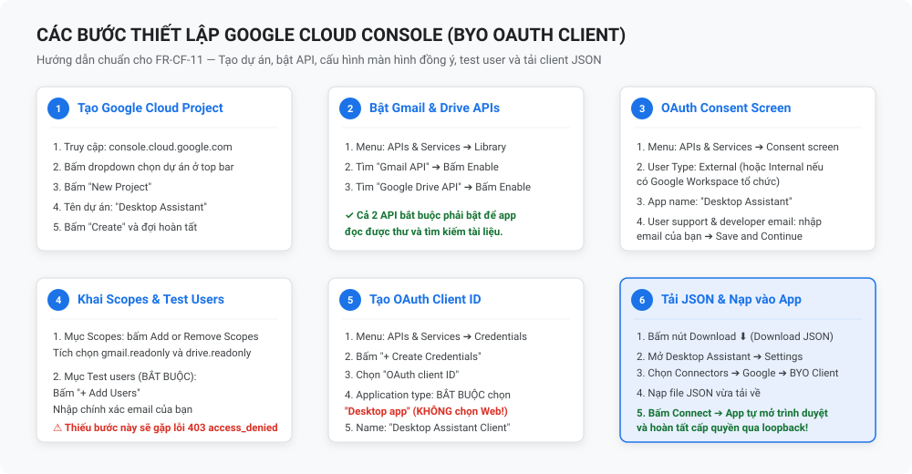
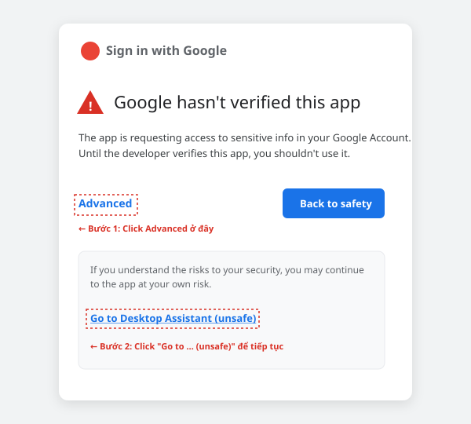
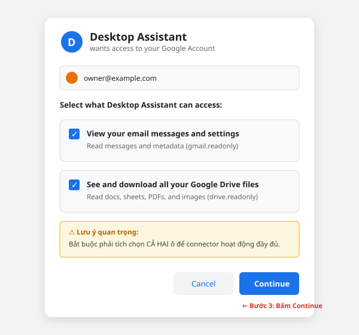

# HƯỚNG DẪN THIẾT LẬP BYO OAUTH CLIENT CHO GOOGLE (GMAIL & DRIVE)
> **Tài liệu nguồn cho In-App Setup Guide — Đáp ứng FR-CF-11, PRD §13.6, R-12**  
> *Phiên bản: 1.0 — 12/09/2026*  
> *Áp dụng cho: Desktop Assistant MVP (Kênh kết nối Google nâng cao / BYO)*

---

## 1. TỔNG QUAN & NGUYÊN TẮC HOẠT ĐỘNG

### 1.1. Tại sao Desktop Assistant sử dụng cơ chế BYO OAuth Client?
- Các tính năng đọc Gmail (`gmail.readonly`) và toàn bộ Google Drive (`drive.readonly`) thuộc nhóm **Restricted Scopes** của Google. Để mở ứng dụng đại trà bằng OAuth Client trung tâm, Google bắt buộc phải trải qua quy trình kiểm toán an ninh bên thứ ba (**CASA AL1/AL2**) với chi phí từ \$720 – \$4.500/năm và thời gian xét duyệt từ 2 – 5 tháng (PRD §13.7).
- Theo quyết định **OQ-15 và PRD §13.6**, track CASA được tạm hoãn để tối ưu ngân sách. Phương án **BYO OAuth Client (Bring Your Own)** được chọn làm kênh kết nối chính cho Google: **Mỗi người dùng tự tạo một dự án Google Cloud riêng và đóng vai trò vừa là nhà phát triển, vừa là người dùng duy nhất của ứng dụng.**
- Mô hình này được miễn hoàn toàn quy trình xét duyệt CASA mà vẫn đảm bảo 100% năng lực tự động đọc email và tìm kiếm tài liệu của Agent.

### 1.2. Nguyên tắc bảo mật Local-First
- File thông tin xác thực (`google-oauth-client.json`) và các mã truy cập (`access_token`, `refresh_token`) được lưu trữ **hoàn toàn cục bộ trên máy của bạn** (mã hoá an toàn qua OS Keychain / DPAPI theo chuẩn NFR-SEC-01).
- Desktop Assistant **không gửi client credentials hoặc nội dung email/tài liệu về bất kỳ máy chủ trung gian nào** (NFR-BE-05). Nội dung công việc chỉ được gửi trực tiếp tới Provider LLM mà bạn tự cấu hình (ADR-007).

---

## 2. LƯU Ý SỐNG CÒN TRƯỚC KHI BẮT ĐẦU

| Vấn đề | Chi tiết kỹ thuật & Hệ quả | Hướng xử lý |
| :--- | :--- | :--- |
| **Hạn Refresh Token 7 ngày** *(R-12)* | Đối với tài khoản cá nhân thông thường (`@gmail.com`), OAuth client bắt buộc ở trạng thái **External + Testing**. Google áp đặt chính sách bảo mật: **Refresh token sẽ hết hạn sau đúng 7 ngày**. | Sau mỗi 7 ngày, ứng dụng sẽ hiện thông báo cần kết nối lại. Bạn chỉ cần bấm nút **"Reconnect"** (1-click), duyệt lại quyền trên trình duyệt trong 10 giây để tiếp tục sử dụng. |
| **Lối thoát Google Workspace** | Nếu bạn có email tổ chức thuộc Google Workspace (ví dụ `@congty.com`, `@truonghoc.edu.vn`), bạn có thể chọn **User Type: Internal**. | Chế độ Internal **không bị giới hạn 7 ngày** (token vĩnh viễn) và **không xuất hiện màn hình cảnh báo Unverified app**. |
| **Bắt buộc thêm Test Users** | Nếu để trống mục Test users, khi đăng nhập Google sẽ chặn ngay lập tức với lỗi `Error 403: access_denied`. | Phải thêm chính địa chỉ email của bạn vào danh sách **Test users** ở Bước 4. |
| **Loại Client: Desktop App** | Google chỉ cho phép cổng loopback động trên Client loại **Desktop app** (RFC 8252). | Tuyệt đối **KHÔNG chọn "Web application"** khi tạo credentials. Phải chọn **"Desktop app"**. |

---

## 3. SƠ ĐỒ TOÀN CẢNH QUY TRÌNH THIẾT LẬP

---

## 4. PHẦN I: THIẾT LẬP TRÊN GOOGLE CLOUD CONSOLE (6 BƯỚC)

### Bước 1: Tạo Google Cloud Project mới
1. Truy cập vào **[Google Cloud Console](https://console.cloud.google.com/)** và đăng nhập bằng tài khoản Google của bạn.
2. Tại thanh điều hướng trên cùng, bấm vào menu chọn dự án (Project Dropdown) ➔ Bấm **New Project** (Dự án mới).
3. Đặt tên dự án: `Desktop Assistant` (hoặc tên tuỳ ý).
4. Phần **Location**: Giữ nguyên `No organization` (trừ khi bạn dùng Google Workspace).
5. Bấm **Create** và chờ vài giây để hệ thống khởi tạo dự án. Đảm bảo bạn đã chuyển sang dự án mới tạo trên thanh tiêu đề.

---

### Bước 2: Kích hoạt Gmail API và Google Drive API
Ứng dụng cần 2 thư viện API để Agent có thể đọc email và tài liệu:
1. Mở menu bên trái (biểu tượng ☰) ➔ Chọn **APIs & Services** ➔ **Library** (Thư viện).
2. Tại ô tìm kiếm, gõ `Gmail API` ➔ Chọn kết quả Gmail API ➔ Bấm **Enable** (Bật).
3. Quay lại Library, gõ tìm kiếm `Google Drive API` ➔ Chọn kết quả Google Drive API ➔ Bấm **Enable** (Bật).

---

### Bước 3: Cấu hình Màn hình đồng ý OAuth (OAuth Consent Screen)
1. Mở menu bên trái ➔ **APIs & Services** ➔ **OAuth consent screen**.
2. Chọn **User Type**:
   - Nếu bạn dùng tài khoản cá nhân (`@gmail.com`): Chọn **External** ➔ Bấm **Create**.
   - Nếu bạn dùng tài khoản Google Workspace: Chọn **Internal** ➔ Bấm **Create** *(bỏ qua cảnh báo unverified và miễn hạn 7 ngày)*.
3. Điền thông tin ứng dụng cơ bản (**App information**):
   - **App name**: `Desktop Assistant`
   - **User support email**: Chọn email của bạn trong danh sách xổ xuống.
   - **Developer contact information**: Nhập email của bạn.
   - Các trường khác (Logo, App domain): Có thể để trống.
4. Bấm **Save and Continue** (Lưu và tiếp tục).

---

### Bước 4: Khai báo Phạm vi quyền (Scopes) & Thêm Test Users
1. **Tại bước Scopes (Phạm vi):**
   - Bấm nút **Add or Remove Scopes**.
   - Trong bảng danh sách, tìm và tích chọn 2 phạm vi quyền sau:
     - `https://www.googleapis.com/auth/gmail.readonly` *(Xem thư và cài đặt email)*
     - `https://www.googleapis.com/auth/drive.readonly` *(Xem và tải xuống tệp Google Drive)*
   - Bấm **Update** ở cuối bảng.
   - Bấm **Save and Continue**.
2. **Tại bước Test users (Người dùng thử nghiệm — CỰC KỲ QUAN TRỌNG):**
   - Bấm nút **+ Add Users**.
   - Nhập chính xác địa chỉ email của bạn (email bạn sẽ dùng để đăng nhập Desktop Assistant).
   - Bấm **Add**. Email của bạn sẽ hiện trong danh sách.
   - Bấm **Save and Continue**.
3. Tại bước Summary (Tóm tắt): Kiểm tra lại thông tin và bấm **Back to Dashboard**.

---

### Bước 5: Tạo OAuth Client ID loại Desktop App
1. Mở menu bên trái ➔ **APIs & Services** ➔ **Credentials** (Thông tin xác thực).
2. Bấm nút **+ Create Credentials** ở thanh công cụ phía trên ➔ Chọn **OAuth client ID**.
3. Tại trường **Application type**, bấm menu xổ xuống và chọn: **Desktop app**  
   *(⚠️ Bắt buộc chọn Desktop app. KHÔNG chọn Web application vì Web app không cho phép cổng redirect loopback ngẫu nhiên).*
4. **Name**: Nhập `Desktop Assistant Desktop Client` (hoặc giữ mặc định).
5. Bấm **Create**.

---

### Bước 6: Tải file Credentials JSON
1. Một hộp thoại hiện ra thông báo "OAuth client created".
2. Bấm nút **Download JSON** (hoặc bấm vào biểu tượng tải xuống ⬇️ tại dòng client vừa tạo trong danh sách OAuth 2.0 Client IDs).
3. File tải về máy sẽ có tên tương tự: `client_secret_xxxxxxxxxxxx.apps.googleusercontent.com.json`.
4. Đổi tên file thành `google-oauth-client.json` (hoặc giữ nguyên tên) và lưu ở thư mục an toàn trên máy.

---

## 5. PHẦN II: NẠP VÀO DESKTOP ASSISTANT & DUYỆT QUYỀN TRÊN TRÌNH DUYỆT

### Bước 7: Nạp credentials vào Desktop Assistant
1. Khởi động ứng dụng Desktop Assistant.
2. Mở mục **Settings** ➔ **Connectors** ➔ Chọn **Google (Gmail & Drive)**.
3. Chọn phương thức kết nối: **"BYO OAuth Client (Tự cấp Client)"**.
4. Bấm **"Browse / Chọn file JSON"** và trỏ tới file JSON bạn vừa tải về ở Bước 6.
5. Bấm **Connect** (Kết nối).

---

### Bước 8: Thao tác vượt màn cảnh báo "Unverified app" trên trình duyệt
Ứng dụng sẽ tự động mở cổng lắng nghe cục bộ (`127.0.0.1:8765`) và kích hoạt trình duyệt mặc định của bạn tới màn hình ủy quyền Google. Bạn chỉ cần thực hiện đúng **4 thao tác click**:

#### Thao tác 1: Chọn tài khoản Google
- Chọn tài khoản Google bạn đã thêm vào danh sách **Test users** ở Bước 4.

#### Thao tác 2 & 3: Vượt qua màn cảnh báo "Google hasn't verified this app"
Google sẽ hiển thị màn hình cảnh báo ứng dụng chưa được xác minh do ứng dụng đang ở trạng thái Testing nội bộ:

- **Bước 2.1:** **KHÔNG BẤM** vào nút màu xanh *"Back to safety"*. Hãy bấm vào chữ **"Advanced"** (hoặc *"Nâng cao"*) ở góc dưới bên trái.
- **Bước 2.2:** Vùng thông tin mở rộng sẽ hiện ra. Hãy click vào dòng liên kết:  
  👉 **"Go to Desktop Assistant (unsafe)"** *(Đi tới Desktop Assistant (không an toàn))*.

#### Thao tác 4: Tích chọn quyền Gmail & Drive
Màn hình cấp quyền chi tiết sẽ hiện ra:

- Google áp dụng cơ chế ủy quyền chi tiết (*Granular Consent*). Bạn **BẮT BUỘC PHẢI TÍCH CHỌN CẢ HAI Ô**:
  - ☑️ **"View your email messages and settings"** *(Xem thư email của bạn)*
  - ☑️ **"See and download all your Google Drive files"** *(Xem và tải xuống tệp trên Drive)*
- Bấm nút **Continue** (Tiếp tục) ở góc dưới bên phải.

#### Hoàn tất:
- Trình duyệt sẽ tự động chuyển hướng về `http://localhost:8765/` và hiển thị thông báo:  
  `✓ Cấp quyền thành công! Bạn có thể đóng tab này và quay lại ứng dụng.`
- Desktop Assistant tự động bắt mã xác thực, tạo refresh token và chuyển sang trạng thái **Connected (Đã kết nối)**.

---

## 6. XỬ LÝ CÁC SỰ CỐ THƯỜNG GẶP (TROUBLESHOOTING)

### 1. Lỗi `Error 403: access_denied` / "Access blocked: Desktop Assistant has not completed the Google verification process"
- **Nguyên nhân:** Tài khoản bạn đang dùng để đăng nhập chưa được khai báo trong danh sách **Test users** trên Google Cloud Console.
- **Cách khắc phục:** Truy cập lại Google Cloud Console ➔ APIs & Services ➔ OAuth consent screen ➔ Tab **Test users** ➔ Bấm **Add Users** và nhập đúng email bạn muốn kết nối.

### 2. Lỗi `Error 400: redirect_uri_mismatch`
- **Nguyên nhân:** Bạn đã tạo nhầm loại OAuth Client ID là "Web application" thay vì "Desktop app". Client loại Web application bắt buộc phải khai báo chính xác từng cổng cố định, trong khi Desktop Assistant sử dụng cổng loopback động.
- **Cách khắc phục:** Truy cập Credentials ➔ Xóa client cũ ➔ Bấm **+ Create Credentials** ➔ **OAuth client ID** ➔ Bắt buộc chọn **Application type: Desktop app** ➔ Tải file JSON mới và nạp lại vào app.

### 3. Thông báo "Token hết hạn" sau 7 ngày
- **Nguyên nhân:** Đây là tính năng bảo mật mặc định của Google cho dự án ở chế độ External + Testing, không phải lỗi ứng dụng.
- **Cách khắc phục:** Trên cửa sổ Desktop Assistant, bấm nút **Reconnect** ➔ Trình duyệt bật lên ➔ Đăng nhập lại và bấm Continue. Quy trình chỉ mất khoảng 10 giây.
- **Lối thoát vĩnh viễn:** Nếu có tài khoản Google Workspace (Google Apps for Work/Edu), hãy đổi OAuth Consent Screen sang **Internal**. Token sẽ duy trì vĩnh viễn không bao giờ hết hạn sau 7 ngày.

### 4. Agent không đọc được file Google Docs/Sheets lớn hơn 10MB
- **Nguyên nhân:** Google Drive API áp đặt giới hạn cứng 10MB cho thao tác export tài liệu Docs/Sheets sang định dạng PDF/CSV.
- **Cách khắc phục:** Chia nhỏ tài liệu trên Google Docs hoặc tải file nhị phân trực tiếp nếu file ở dạng PDF gốc.
