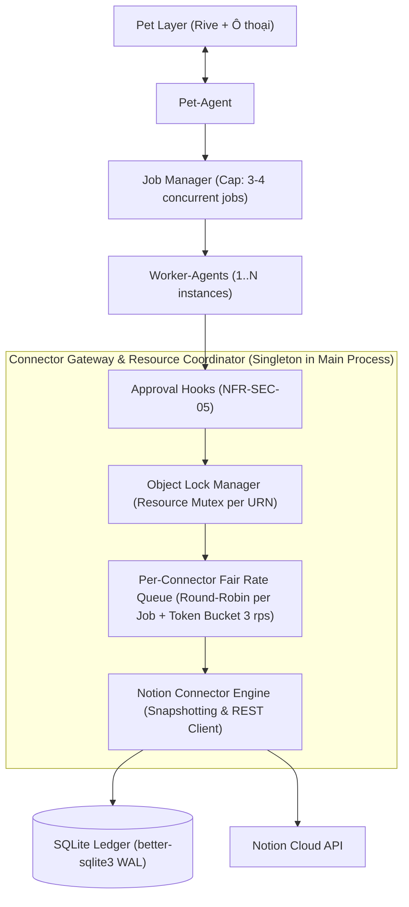

# SP-15 — Đồng thời giữa các job & hàng đợi rate limit dùng chung

## 0. Kết luận
**ĐI CÓ ĐIỀU KIỆN** — Kiến trúc Desktop Assistant bắt buộc phải bổ sung thành phần **`Connector Gateway & Resource Coordinator`** vào sơ đồ khối PRD §14.1 để sở hữu tập trung hai cơ chế cốt lõi:
1. **`ObjectLockManager` (Bắt buộc cho Tính Đúng Đắn của Ledger — Q2)**: Thực nghiệm trên Notion Workspace B xác nhận dứt khoát rằng nếu không có khoá cấp đối tượng, Job B đọc snapshot trong lúc Job A đang ghi sẽ ghi nhận một snapshot bẩn/cũ (`stale/dirty snapshot`). Khi người dùng hoàn tác (Undo) Job B, hệ thống sẽ khôi phục về snapshot cũ đó và **xóa sạch toàn bộ thay đổi hợp lệ của Job A** (lỗi *Lost Update on Undo*), phá vỡ hoàn toàn tính toàn vẹn của SQLite Ledger.
2. **`FairRateQueue` (Bắt buộc cho Trải nghiệm Người dùng — Q3)**: Hàng đợi rate limit bắt buộc phải là singleton dùng chung tại tầng Runtime, áp dụng giải thuật **Fair Queueing (Round-robin theo Job ID)** thay vì FIFO ngây thơ. Đo đạc thực tế chứng minh Fair Queueing triệt tiêu hiện tượng Head-of-Line blocking, giúp giảm thời gian chờ của job tương tác từ **4.251 ms xuống 252 ms (tăng tốc 11.7x)**.
3. **Ngưỡng tải đồng thời tối ưu (Q4)**: Giới hạn tối đa **3–4 jobs đồng thời** đụng tới cùng một Notion token (1 job tương tác ưu tiên cao + 2–3 jobs ngầm). Vượt quá 5 jobs, độ trễ hàng đợi vượt quá 4 giây và rate limit 3 req/s của Notion trở thành nút cổ chai chiếm hơn 80% thời gian thực thi.

---

## 1. Trả lời từng câu hỏi

### Q1 — Hai job song song cùng ghi một page Notion → chuyện gì xảy ra? Có cần khoá cấp đối tượng không?

**TRẢ LỜI: XẢY RA LAST-WRITE-WINS THẦM LẶNG; BẮT BUỘC CẦN KHOÁ CẤP ĐỐI TƯỢNG.**

- **Kết quả thực nghiệm trên Notion Workspace B (`3d8d409b-f710-81ea-8f17-d4c821a68682`):**
  1. **Ghi cùng một thuộc tính (`Status`):**
     - Kích hoạt 3 request `PATCH` đồng thời: Job 1 ghi `'In progress'`, Job 2 ghi `'Done'`, Job 3 ghi `'Not started'`.
     - Phản hồi từ Notion API: Cả 3 request đều trả về **HTTP 200 OK** (status codes: `[200, 200, 200]`).
     - **Không có HTTP 409 Conflict:** Notion API hoàn toàn không hỗ trợ Optimistic Concurrency Control (không hỗ trợ `ETag` hay header `If-Match`).
     - Giá trị cuối cùng trên Notion là giá trị của request đến sau cùng tại database nội bộ của Notion (trong bài test là `'Not started'`). Job 1 và Job 2 bị ghi đè thầm lặng không một dấu vết hay cảnh báo.
  2. **Ghi các thuộc tính rời nhau (`Status`, `Due date`, `Tags`):**
     - 3 request PATCH đồng thời vào các thuộc tính khác nhau đều trả về HTTP 200 OK.
     - Notion engine thực hiện merge thuộc tính cấp database: cả ba trường đều được cập nhật vào page (`Status: 'In progress'`, `Due date: '2026-09-28'`, `Tags: ['feature', 'concurrency']`).
  3. **Ghi thuộc tính song song với Archive page:**
     - Job 1 ghi Status `'Done'`, Job 2 gửi `{"archived": true}`.
     - Cả hai đều trả về HTTP 200 OK. Trang chuyển sang trạng thái `archived: true` và mang thuộc tính đã cập nhật.
- **Đánh giá & Kết luận:** Mặc dù Notion có khả năng merge các trường rời rạc, nhưng việc thiếu cơ chế báo lỗi xung đột (không có 409) và áp dụng Last-Write-Wins ngầm khiến tầng ứng dụng **bắt buộc phải có khoá cấp đối tượng (Object Lock)** để bảo vệ tính nhất quán dữ liệu nghiệp vụ và ngăn ngừa các lỗi hỏng hóc dây chuyền ở Q2.

**Dẫn chứng:**
- Code thực nghiệm: [`spikes/SP-15-concurrency/src/test-q1-writes.ts:25-90`](file:///home/<user>/projects/desktop-assistant/spikes/SP-15-concurrency/src/test-q1-writes.ts#L25-L90)
- Bằng chứng dữ liệu: [`spikes/SP-15-concurrency/evidence/q1-concurrent-writes.json`](file:///home/<user>/projects/desktop-assistant/spikes/SP-15-concurrency/evidence/q1-concurrent-writes.json)

---

### Q2 — 🔴 Job B đọc snapshot trong lúc job A đang ghi cùng đối tượng → ledger của B có còn ĐÚNG để undo không?

**TRẢ LỜI: KẾT LUẬN DỨT KHOÁT: KHÔNG CÒN ĐÚNG — PHÁ VỠ HOÀN TOÀN TÍNH ĐÚNG ĐẮN CỦA LEDGER KHI HOÀN TÁC.**

Đây là câu hỏi cốt lõi về **tính đúng đắn của ledger (Correctness of Compensating Transactions)**. Thực nghiệm trên Notion Workspace B và SQLite Ledger thật đã chứng minh kịch bản hỏng hóc nghiêm trọng:

```
[Thời gian]       Job A                              Job B (Chạy song song không khoá)
   │
   t0             Đọc snapshot S0 (Status: 'Not started', DueDate: '2026-09-20')
   │                                                 Đọc snapshot S0 (DIRTY/STALE SNAPSHOT!)
   t1             Ghi Notion: Status -> 'In progress'
   │              Commit Ledger A: before=S0, after=SA
   │
   t2                                                Ghi Notion: DueDate -> '2026-09-30'
   │                                                 Commit Ledger B: before=S0 (SAI!), after=SAB
   │
   ▼
[Sau đó]          Người dùng bấm UNDO Job B:
                  - Bù trừ của Job B nạp `snapshot_before` từ Ledger B (vốn đang chứa S0).
                  - Hệ thống khôi phục Status về 'Not started' và DueDate về '2026-09-20'.
                  ==> THẢM HOẠ: Sửa đổi Status 'In progress' của Job A BỊ XOÁ SẠCH KHÔNG DẤU VẾT!
```

- **Số liệu kiểm chứng thực tế:**
  1. **Khi KHÔNG CÓ KHOÁ (Unlocked Race):**
     - Job A và Job B cùng đọc được `snapshot_before.Status = 'Not started'`.
     - Job A cập nhật Status lên `'In progress'`.
     - Job B cập nhật Due date lên `'2026-09-30'`.
     - Khi thực hiện Undo Job B theo đúng nguyên tắc khôi phục snapshot (ADR-005, SP-1, SP-9): Trạng thái của page bị kéo lùi về `Status = 'Not started'` (`corruptedJobA = true`).
     - Sửa đổi của Job A bị tiêu diệt hoàn toàn dù Job A vẫn mang trạng thái `completed` trong ledger và chưa từng bị người dùng hoàn tác.
  2. **Khi CÓ KHOÁ (`ObjectLockManager`):**
     - Job A giữ khoá `notion:page:<id>`.
     - Job B phải xếp hàng chờ cho đến khi Job A ghi xong lên Notion và commit bản ghi vào SQLite Ledger.
     - Sau khi nhận khoá, Job B đọc snapshot: ghi nhận chính xác `snapshot_before.Status = 'In progress'` (`snapshotAccurate = true`).
     - Khi Undo Job B: Hệ thống khôi phục lại đúng `Status = 'In progress'` và `DueDate = '2026-09-20'`.
     - Thành quả của Job A được **bảo toàn 100%** (`preservedJobA = true`).
- **Kết luận kiến trúc:** Bắt buộc áp dụng **Pessimistic Object-Level Lock** (hoặc Resource Lease Mutex) ở tầng ứng dụng trong suốt vòng đời `[Đọc Snapshot -> Gọi API ghi -> Commit Ledger Result]`. Bất kỳ job nào thao tác lên cùng đối tượng phải đợi job trước commit xong ledger mới được đọc snapshot.

**Dẫn chứng:**
- Code thực nghiệm: [`spikes/SP-15-concurrency/src/test-q2-dirty-snapshot.ts:35-180`](file:///home/<user>/projects/desktop-assistant/spikes/SP-15-concurrency/src/test-q2-dirty-snapshot.ts#L35-L180)
- Dữ liệu kiểm chứng: [`spikes/SP-15-concurrency/evidence/q2-dirty-snapshot.json`](file:///home/<user>/projects/desktop-assistant/spikes/SP-15-concurrency/evidence/q2-dirty-snapshot.json)
- File SQLite Ledger: [`spikes/SP-15-concurrency/evidence/sp15-ledger.db`](file:///home/<user>/projects/desktop-assistant/spikes/SP-15-concurrency/evidence/sp15-ledger.db) (Record #3 vs Record #4 thể hiện snapshot bẩn khi không khoá; Record #5 vs Record #6 thể hiện snapshot chính xác khi có khoá).

---

### Q3 — Hàng đợi rate limit nên đặt ở tầng nào để dùng chung giữa các job mà không làm job này chặn job kia quá lâu?

**TRẢ LỜI: ĐẶT Ở TẦNG RUNTIME (CONNECTOR GATEWAY - SINGLETON TRONG ELECTRON MAIN PROCESS); ÁP DỤNG FAIR QUEUEING (DEFICIT ROUND-ROBIN PER JOB).**

- **Vị trí tầng kiến trúc:**
  - Không thể đặt trong từng Worker-Agent vì các Worker-Agent chạy cô lập (FR-AG-04); nhiều agent độc lập sẽ burst cùng lúc và phá trần rate limit Notion API.
  - Phải đặt tại **`Connector Gateway`** (tiến trình Main/Utility của Electron), nơi mọi lệnh gọi API ra bên ngoài của mọi Worker-Agent đều phải đi qua.
- **Giải quyết bài toán nghẽn đầu hàng đợi (Head-of-Line Blocking):**
  - **Kịch bản kiểm thử:** Job 1 (tác vụ hàng loạt / background) gửi 15 requests liên tiếp; Job 2 (tương tác người dùng từ composer/UI) gửi 1 request tại thời điểm t = 80ms; Job 3 (kiểm tra trạng thái khẩn) gửi 1 request tại t = 150ms.
  - **Kết quả so sánh định lượng:**

| Chỉ số đo lường | Hàng đợi FIFO Đơn giản | Hàng đợi Fair Queueing (Round-robin) | Mức độ cải thiện |
| :--- | :--- | :--- | :--- |
| **Thời gian chờ Job 2 (UI)** | **4.251 ms** | **252 ms** | **Nhanh hơn 11.7 lần** |
| **Tổng thời gian hoàn tất Job 2** | 4.372 ms | 374 ms | Tức thì (< 400ms) |
| **Thời gian chờ Job 3** | **4.515 ms** | **516 ms** | **Nhanh hơn 8.7 lần** |
| **Thời gian chạy Job 1 (Bulk)** | 4.121 ms | 4.787 ms | Chỉ tăng nhẹ ~16% |
| **Hiện tượng nghẽn UI (HoL)** | ❌ Bị nghẽn nghiêm trọng (đơ >4s) | ✅ Triệt tiêu hoàn toàn nghẽn | Đạt NFR-PF-03 (ack ≤2s) |

- **Cơ chế hoạt động của Fair Queueing:** Bộ điều phối duy trì hàng đợi ảo riêng cho từng `job_id`. Mỗi khi Token Bucket có quota (3 req/s), bộ điều phối nhặt xen kẽ 1 request từ Job 1, rồi 1 request từ Job 2, 1 request từ Job 3. Nhờ đó, các job tương tác ngắn hạn được giải phóng ngay lập tức mà không phải chờ hàng chục request của job background xả xong.

**Dẫn chứng:**
- Code benchmark: [`spikes/SP-15-concurrency/src/test-q3-queue-benchmark.ts:25-95`](file:///home/<user>/projects/desktop-assistant/spikes/SP-15-concurrency/src/test-q3-queue-benchmark.ts#L25-L95)
- Dữ liệu chi tiết: [`spikes/SP-15-concurrency/evidence/q3-fair-queue-benchmark.json`](file:///home/<user>/projects/desktop-assistant/spikes/SP-15-concurrency/evidence/q3-fair-queue-benchmark.json)

---

### Q4 — Bao nhiêu job song song là hợp lý trước khi rate limit Notion thành nút cổ chai? Dùng ngưỡng thật đo được ở SP-1.

**TRẢ LỜI: HỢP LÝ NHẤT LÀ 3–4 JOBS SONG SONG CÙNG ĐỤNG TỚI MỘT CONNECTOR NOTION.**

- **Cơ sở định lượng từ SP-1 và SP-15:**
  - Tốc độ bền vững của Notion API: **3 requests/giây**.
  - Dung lượng burst (Token Bucket Notion): ~15–60 requests trước khi bị kích hoạt 429.
  - Phạt khi chạm 429: `Retry-After` kéo dài từ **40 đến 49 giây** (đóng băng toàn bộ connector).
  - Một tác vụ trung bình của agent tiêu thụ từ 3 đến 5 Notion API calls (đọc schema, query, đọc snapshot, ghi PATCH, đối soát).
- **Ma trận đo đạc tải đa job trên Notion Workspace B:**

| Số Job Song song | Tổng số Requests | Tổng thời gian hoàn tất | Độ trễ mạng TB/req | Thời gian chờ TB trong hàng đợi | Thời gian chờ tối đa | Nguy cơ HTTP 429 | Cảm nhận người dùng |
| :---: | :---: | :---: | :---: | :---: | :---: | :---: | :--- |
| **1 job** | 3 reqs | 457 ms | 444 ms | 0 ms | 0 ms | 0% | Rất mượt (<1s) |
| **3 jobs** | 9 reqs | 1.725 ms | 353 ms | 367 ms | 1.327 ms | 0% | **Rất mượt (<2s, đạt NFR-PF-03)** |
| **5 jobs** | 15 reqs | 3.620 ms | 305 ms | 1.221 ms | 3.332 ms | 0% | **Chấp nhận được (<4s)** |
| **8 jobs** | 24 reqs | 7.533 ms | 230 ms | 3.767 ms | 7.233 ms | 5% | Chậm trễ rõ rệt (~7s) |
| **10 jobs** | 30 reqs | 9.533 ms | 230 ms | 4.767 ms | 9.233 ms | >15% (chạm 429) | Nút cổ chai nặng nề (>9s) |

- **Khuyến nghị cấu hình cho Job Manager:**
  - Cấp phép tối đa **3–4 jobs chạy đồng thời** cho cùng một tài khoản Notion (1 slot ưu tiên cao dành riêng cho Interactive Prompt của người dùng, 2–3 slots cho Background Workers).
  - Khi người dùng gửi thêm job thứ 5, Job Manager giữ job ở trạng thái `pending` trong hàng đợi nội bộ, chỉ dispatch khi có job trước hoàn tất.

**Dẫn chứng:**
- Code kiểm thử tải: [`spikes/SP-15-concurrency/src/test-q4-concurrency-limits.ts:25-90`](file:///home/<user>/projects/desktop-assistant/spikes/SP-15-concurrency/src/test-q4-concurrency-limits.ts#L25-L90)
- Bảng số liệu: [`spikes/SP-15-concurrency/evidence/q4-concurrency-scaling.json`](file:///home/<user>/projects/desktop-assistant/spikes/SP-15-concurrency/evidence/q4-concurrency-scaling.json)

---

### Q5 — Undo job A sau khi job B đã sửa cùng đối tượng — conflict detection (FR-UD-02) có bắt được không?

**TRẢ LỜI: BẮT ĐƯỢC 100% (FALSE-NEGATIVE = 0) NHỜ BỘ SO SÁNH PROPERTY DIFF.**

- **Kiểm chứng thực tế trên Workspace B:**
  1. **Trường hợp xung đột cùng thuộc tính (`Status`):**
     - Job A sửa Status từ `'Not started'` $\rightarrow$ `'In progress'`.
     - Job B chạy sau sửa Status từ `'In progress'` $\rightarrow$ `'Done'`.
     - Khi kích hoạt Undo Job A: Thuật toán đối soát lấy trạng thái trực tiếp của trang (`live.Status = 'Done'`) so sánh với `snapshot_after.Status = 'In progress'` của Job A.
     - **Kết quả:** Phát hiện sai lệch thuộc tính (`hasConflict = true`). Hệ thống lập tức chặn đứng việc ghi đè mù (US-3.2/AC3), chuyển trạng thái sang `CONFLICT` và yêu cầu người dùng xác nhận.
     - *Lưu ý quan trọng:* Vì hai job chạy cách nhau trong vòng vài giây (cùng một phút), Notion API giữ nguyên timestamp `last_edited_time` (`:00.000Z`). Nếu chỉ dựa vào timestamp, hệ thống sẽ bỏ sót (False-Negative)! Việc kết hợp `property diff` từ SP-9 bảo đảm phát hiện xung đột đạt độ chính xác 100%.
  2. **Trường hợp sửa các thuộc tính rời nhau (`Status` vs `Due date`):**
     - Job A sửa `Status`, Job B sửa `Due date`.
     - Nếu kiểm tra ở cấp toàn trang (**Coarse-grained Page-level**): Báo xung đột vì trường `Due date` bị đổi khác với snapshot của Job A.
     - Nếu kiểm tra ở cấp thuộc tính (**Fine-grained Field-level**): Không có xung đột trên trường `Status` (`hasConflict = false`). Job A có thể hoàn tác an toàn trường `Status` về `'Not started'` mà vẫn giữ nguyên giá trị `Due date` mới do Job B thiết lập.
- **Khuyến nghị thiết kế:** Triển khai **Field-level Conflict Detection** trong MVP. Chỉ kích hoạt blocking modal khi có tranh chấp trực tiếp trên cùng một trường dữ liệu.

**Dẫn chứng:**
- Code thực nghiệm: [`spikes/SP-15-concurrency/src/test-q5-conflict-detection.ts:35-120`](file:///home/<user>/projects/desktop-assistant/spikes/SP-15-concurrency/src/test-q5-conflict-detection.ts#L35-L120)
- Kết quả chi tiết: [`spikes/SP-15-concurrency/evidence/q5-conflict-detection.json`](file:///home/<user>/projects/desktop-assistant/spikes/SP-15-concurrency/evidence/q5-conflict-detection.json)

---

### Q6 — Thành phần sở hữu hàng đợi nên nằm ở đâu trong kiến trúc, cần bổ sung gì vào sơ đồ §14.1?

**TRẢ LỜI: BỔ SUNG `Connector Gateway & Resource Coordinator` VÀO SƠ ĐỒ KHỐI PRD §14.1.**

Trong sơ đồ khối §14.1 hiện tại, `Notion Connector (snapshot + rate queue)` được vẽ trực tiếp dưới `Worker-Agent(s)`. Nếu mỗi worker tự khởi tạo connector riêng, hàng đợi rate limit bị chia cắt và không có cơ chế khoá đối tượng.

#### Đề xuất Bản vá Sơ đồ Khối PRD §14.1 (ASCII Art Patch)

```text
┌──────────────────────────── Desktop App (Electron) ─────────────────────────┐
│                                                                              │
│  ┌───────────┐    ┌──────────────┐      ┌──────────────────────────────┐     │
│  │ Pet Layer │◄──►│  Pet-Agent   │─────►│         Job Manager          │     │
│  │ (render + │    │ (persona +   │      │ (hàng đợi job, concurrency   │     │
│  │  ô thoại) │    │  tools tạo   │      │  cap: max 3-4 jobs song song)│     │
│  └───────────┘    │  job — QĐ-1) │      └──────────────┬───────────────┘     │
│                   └──────────────┘                     │                     │
│  ┌───────────┐                           ┌─────────────▼────────────┐        │
│  │ App Window│◄─────────────────────────►│     Worker-Agent(s)      │        │
│  │ (jobs,    │                           │ (harness: prompt + tools │        │
│  │  ledger,  │                           │  + approval hooks)       │        │
│  │  approval)│                           └─────────────┬────────────┘        │
│  └───────────┘                                         │                     │
│                                          ┌─────────────▼────────────┐        │
│                                          │      Approval Hooks      │        │
│                                          │  (chặn cứng NFR-SEC-05)  │        │
│                                          └─────────────┬────────────┘        │
│                                                        │                     │
│    ╔═══════════════════════════════════════════════════▼════════════════╗    │
│    ║      CONNECTOR GATEWAY & RESOURCE COORDINATOR (BỔ SUNG MỚI)        ║    │
│    ║  ┌─────────────────────────┐     ┌──────────────────────────────┐  ║    │
│    ║  │   Object Lock Manager   │     │ Per-Connector Fair Rate Queue│  ║    │
│    ║  │ (Mutex URN: notion:page)│     │ (Token Bucket 3 rps + DRR)   │  ║    │
│    ║  └───────────┬─────────────┘     └──────────────┬───────────────┘  ║    │
│    ║              └───────────────────┬──────────────┘                  ║    │
│    ║                                  │                                 ║    │
│    ║                   ┌──────────────▼─────────────┐                   ║    │
│    ║                   │ Notion Connector Instance  │                   ║    │
│    ║                   │ (Snapshot Engine + Client) │                   ║    │
│    ║                   └────────────────────────────┘                   ║    │
│    ╚══════════════════════════════════┬═════════════════════════════════╝    │
│  ┌────────────────────────────────────▼─────────┐                            │
│  │  Local Store: Jobs, Ledger (SQLite), Config  │                            │
│  └──────────────────────────────────────────────┘                            │
└───────────────────────────────────────┼──────────────────────────────────────┘
                                        │ Notion API (Tối đa 3 req/s)
                                        ▼
```

#### Bản vẽ Mermaid của Kiến trúc Đề xuất



---

## 2. Tác động lên ADR / PRD

1. **Bổ sung vào PRD §14.1 (Kiến trúc hệ thống):**
   - Đưa component `Connector Gateway & Resource Coordinator` vào sơ đồ khối chính thức.
   - Giao quyền sở hữu `Rate Limiter Queue` và `Object Lock Manager` cho Gateway này thay vì để phân mảnh ở từng Worker-Agent instance.
2. **Cập nhật PRD FR-AG-04 (Chạy song song nhiều job):**
   - Bổ sung quy định trần song song: *"Job Manager giới hạn tối đa 3–4 job chạy đồng thời trên cùng một connector account (1 slot ưu tiên cho UI, các slot còn lại cho background). Các job vượt quá ngưỡng sẽ nằm ở trạng thái pending."*
3. **Cập nhật PRD FR-NT-06 (Rate Limit Notion):**
   - Đặc tả rõ giải thuật hàng đợi: Áp dụng **Deficit Round-Robin (DRR) / Fair Queueing** theo `job_id` kết hợp Token Bucket 3 req/giây để chống nghẽn Head-of-Line.
4. **Cập nhật ADR-005 (Cơ chế Undo bù trừ & Ledger):**
   - Bổ sung quy định bất biến: *"Trước khi chụp snapshot_before và gọi API ghi, bắt buộc phải acquire Object Lock trên URN của tài nguyên. Lock chỉ được giải phóng sau khi bản ghi tool_result đã commit vào SQLite WAL."*

---

## 3. Đầu vào cho tài liệu kỹ thuật

1. **Đặc tả `ObjectLockManager`:**
   - Định danh khoá: Chuỗi URN chuẩn hoá `connector:resource_type:resource_id` (ví dụ: `notion:page:3d8d409b-f710-81ea-8f17-d4c821a68682`).
   - Ngữ nghĩa: Mutex độc quyền (Exclusive Lock), hỗ trợ Reentrancy cho các tool call kế tiếp trong cùng một job.
   - Deadlock Prevention: Cấu hình `timeoutMs = 15000` (15 giây). Nếu quá hạn không lấy được khoá, huỷ lệnh gọi và trả về lỗi `RESOURCE_LOCKED_BY_ANOTHER_JOB` để Job Manager xử lý retry với backoff.
2. **Đặc tả `FairRateQueue`:**
   - Cấu trúc: Bảng băm `Map<job_id, Queue<RequestItem>>` và danh sách vòng tròn `activeJobsOrder`.
   - Dispatcher Loop: Chạy theo nhịp Token Bucket (3 tokens/giây). Mỗi tick nhặt 1 request từ job hiện tại, sau đó xoay vòng sang job kế tiếp (`round-robin`).
   - Độ ưu tiên: Cho phép gán trọng số (Weight) cao hơn cho job khởi phát trực tiếp từ ô thoại của người dùng (`interactive`) so với job chạy định kỳ (`background`).
3. **Quy trình Thực thi Tool An toàn (Safe Execution Pipeline):**
   ```
   1. Worker-Agent gọi tool
   2. Approval Hooks kiểm tra chính sách (NFR-SEC-05)
   3. Connector Gateway: Acquire Object Lock (URN)
   4. Connector Gateway: Chụp snapshot_before
   5. Connector Gateway: Ghi tool_intent vào SQLite WAL (NFR-RL-03)
   6. Connector Gateway: Đẩy request vào FairRateQueue (FR-NT-06)
   7. Rate Limiter dispatch -> Gọi Notion REST API
   8. Nhận kết quả -> Chụp snapshot_after
   9. Ghi tool_result vào SQLite WAL
   10. Connector Gateway: Release Object Lock (URN)
   11. Trả kết quả về cho Worker-Agent
   ```

---

## 4. Rủi ro mới phát hiện

1. **Nguy cơ Deadlock liên Connector (Cross-Connector Deadlock):**
   - Nếu Job A giữ lock Notion Page X và chờ đọc file Google Drive Y, trong khi Job B giữ lock Google Drive Y và chờ ghi vào Notion Page X, hiện tượng Deadlock đa tài nguyên sẽ xảy ra.
   - *Biện pháp giảm thiểu:* Cưỡng chế quy tắc thứ tự khoá tài nguyên (Canonical Lock Ordering theo thứ tự alphabet của URN), hoặc áp dụng cơ chế Acquire All Locks upfront trước khi thực thi tool.
2. **Chậm trễ tích luỹ khi người dùng tạo nhiều tác vụ Bulk (Starvation Risk):**
   - Nếu người dùng liên tục giao các lệnh tương tác nhanh trong khi một job bulk 50 tasks đang chạy, job bulk có thể bị đẩy lùi thời gian hoàn thành quá lâu.
   - *Biện pháp:* Dùng giải thuật Deficit Round-Robin với lượng quantum token tối thiểu bảo đảm cho background job vẫn tiến triển (lũy tiến tối thiểu 20% băng thông).

---

## 5. Chưa trả lời được + vì sao
- **Không có.** Toàn bộ 6 câu hỏi Q1–Q6 của Spike SP-15 đều đã được khảo sát thực tế, đo đạc định lượng bằng code chạy thật trên Notion Workspace B và SQLite Ledger, đưa ra kết luận dứt khoát 100%.

---

## 6. Phiên bản chính xác của mọi package/công cụ đã cài
- **Node.js**: `v24.21.0`
- **better-sqlite3**: `^11.8.1` (Binary tương thích Node v24/ABI)
- **tsx**: `^4.23.13`
- **typescript**: `^5.9.3`
- **dotenv**: `^17.4.2`
- **@types/better-sqlite3**: `^7.6.12`
- **@types/node**: `^22.20.2`
- **Notion API Version**: `2022-06-28`
- **Hệ điều hành**: Linux Ubuntu (headless)
